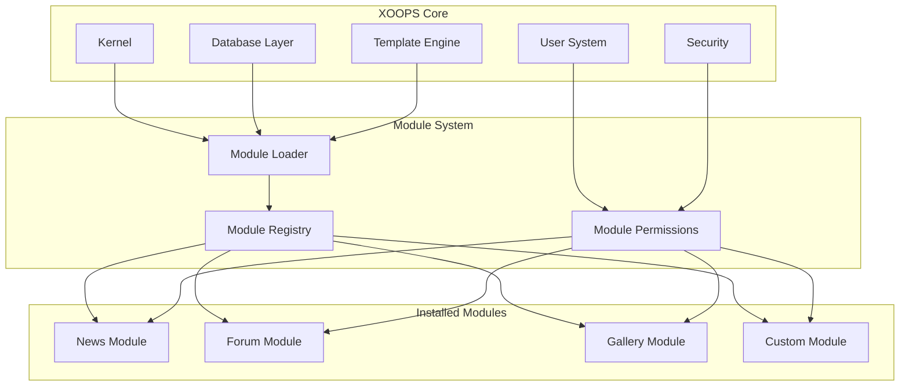
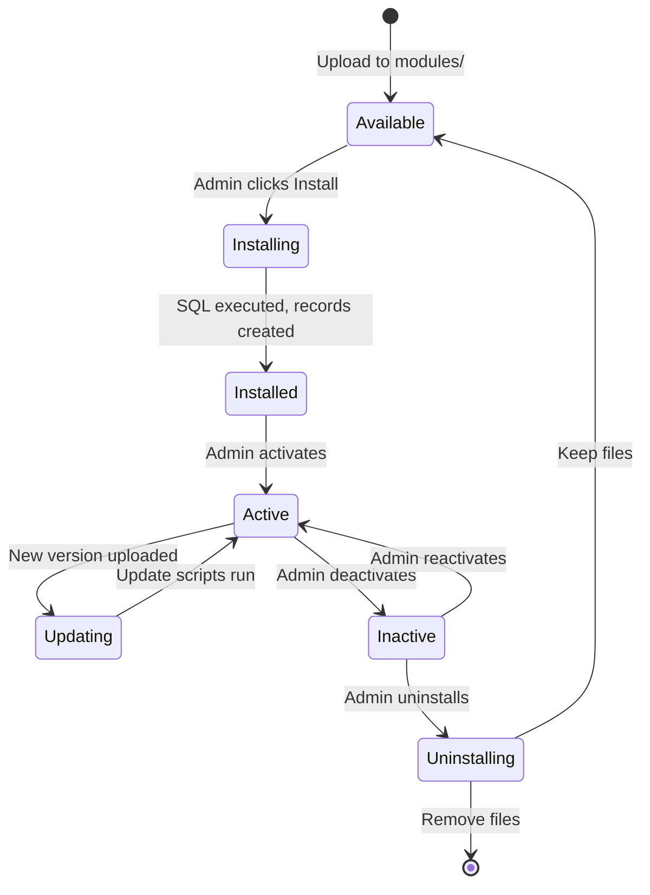

# ADR-001: Modularna arhitektura

> Zapis o arhitekturnih odločitvah za osrednjo filozofijo modularne zasnove XOOPS.

---

## Status

**Sprejeto** - temeljna odločitev od začetka XOOPS

---

## Kontekst

XOOPS (razširljiv objektno usmerjen portalski sistem) je potreboval arhitekturo, ki bi:

1. Dovolite razvijalcem tretjih oseb, da razširijo funkcionalnost
2. Skrbnikom spletnega mesta omogočite prilagajanje brez kodiranja
3. Podpora neodvisnemu razvoju in posodobitvam
4. Zagotovite izolacijo med različnimi funkcijami
5. Razširite se od preprostih blogov do kompleksnih portalov

Pokrajina zgodnjih 2000-ih CMS je ponudila monolitne sisteme, ki jih je bilo težko prilagoditi in razširiti.

---

## Odločitveni diagram

---

## Odločitev

Izvedli bomo **modularno arhitekturo**, kjer:

### 1. Jedro zagotavlja infrastrukturo
- Abstrakcija baze podatkov
- Preverjanje pristnosti in dovoljenja uporabnikov
- Upodabljanje predlog (Smarty)
- Varnostni pripomočki
- Ustvarjanje obrazcev
- Skupni pripomočki

### 2. Moduli so samostojni
Vsak modul:
- Ima lastno strukturo imenikov
- Vsebuje lastne razrede, predloge, SQL
- Določa lastno konfiguracijo
- Lahko installed/uninstalled samostojno
- Ima sledenje različicam

### 3. Standardna struktura modula
```
modules/modulename/
├── admin/                  # Admin interface
│   ├── index.php
│   └── menu.php
├── class/                  # PHP classes
├── include/                # Include files
├── language/               # Translations
├── sql/                    # Database schema
├── templates/              # Smarty templates
├── blocks/                 # Block definitions
├── xoops_version.php       # Module manifest
├── index.php               # Entry point
└── header.php              # Module bootstrap
```
### 4. Manifest modula (xoops_version.php)
```php
<?php
$modversion['name']        = 'Module Name';
$modversion['version']     = '1.0.0';
$modversion['description'] = 'Module description';
$modversion['dirname']     = basename(__DIR__);
$modversion['hasMain']     = 1;
$modversion['hasAdmin']    = 1;
$modversion['sqlfile']['mysql'] = 'sql/mysql.sql';
$modversion['tables']      = ['modulename_table1'];
$modversion['templates']   = [...];
$modversion['config']      = [...];
$modversion['blocks']      = [...];
```
### 5. Komunikacija modula
- Prek osnovnih API-jev (obdelovalci, dogodki)
- Odnosi med bazo podatkov
- Kavlji za prednapenjanje
- Skupne storitve

---

## Življenjski cikel modula

---

## Posledice

### Pozitivno

1. **Razširljivost**: Na tisoče modulov, ki jih je ustvarila skupnost
2. **Neodvisnost**: Module je mogoče razviti ločeno
3. **Prilagodljivost**: spletna mesta lahko mešajo in ujemajo funkcije
4. **Možnost vzdrževanja**: Posodobitve ne vplivajo na druge module
5. **Tržnica**: Pojavil se je ekosistem modulov
6. **Krivulja učenja**: Razvijalci se naučijo enega vzorca

### Negativno

1. **Režijski stroški**: Vsak modul ima zagonske stroške
2. **Podvajanje**: običajna koda se lahko ponovi
3. **Integracija**: Funkcije med moduli potrebujejo skrbno načrtovanje
4. **Različice**: potrebno je upravljanje združljivosti modulov
5. **Razlika v kakovosti**: Kakovost modulov tretjih oseb se razlikuje

### Nevtralno

1. **Baza podatkov**: Vsak modul upravlja svoje tabele
2. **Predloge**: Tema mora vsebovati različne module
3. **Posodobitve**: Jedro in moduli se posodabljajo neodvisno

---

## Upoštevane alternative

### 1. Monolitna arhitektura
**Zavrnjeno** – preveč togo, težko ga je prilagoditi

### 2. Arhitektura vtičnikov (v slogu WordPress)
**Delno sprejeto** – Bloki in prednalaganja zagotavljajo vtičnike podobne kljuke znotraj modulov

### 3. Komponentna arhitektura (slog Joomla)
**Zavrnjeno** – Bolj zapleteno, manj prijazno do razvijalcev

### 4. Mikrostoritve
**Ni primerno** – preveč zapleteno za obdobje skupnega gostovanja---

## Povezane odločitve

- ADR-002: Objektno usmerjen dostop do baze podatkov
- ADR-003: Smarty Template Engine
- ADR-005: Sistem dovoljenj

---

## Reference

- XOOPS Zgodovina projekta
- PHP Vzorci arhitekture aplikacij
- CMS Primerjalne študije (2001-2005)

---

#XOOPS #architecture #adr #modules #design-decision