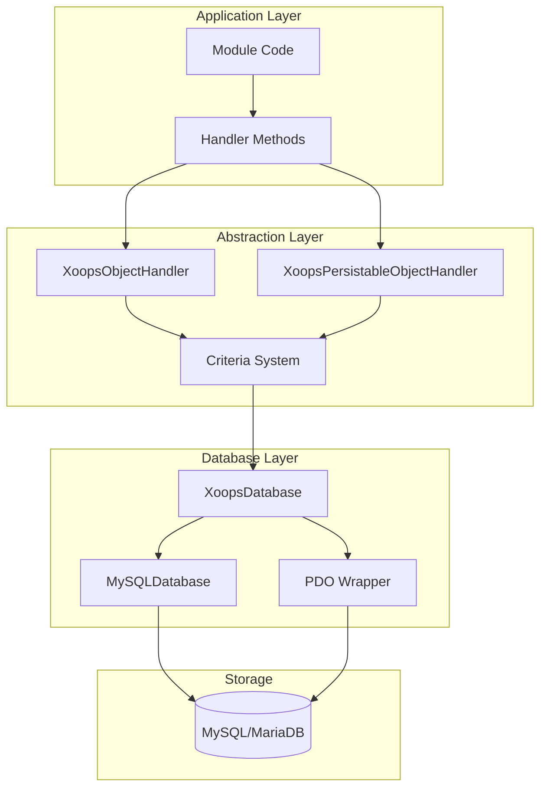
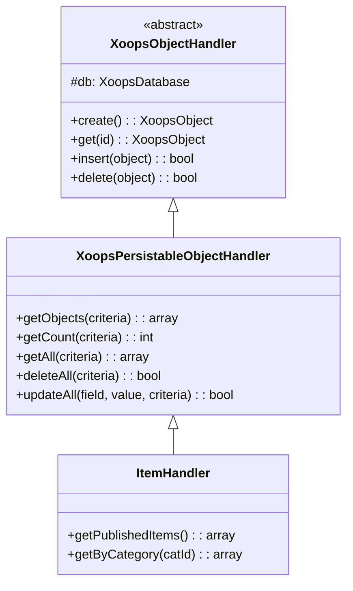
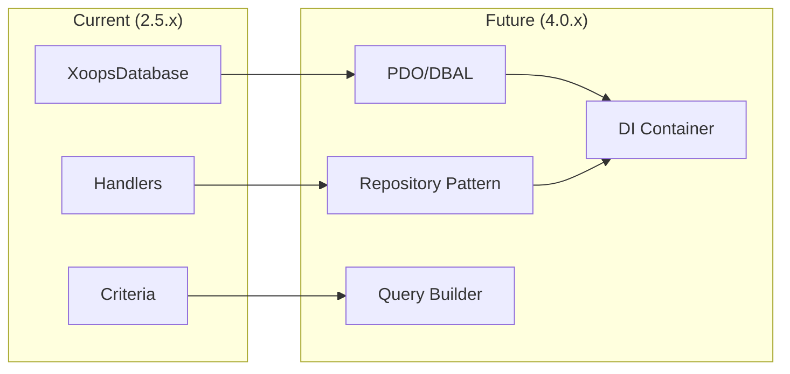

# ADR-002: Abstrakcija baze podatkov

> Zapis odločitve o arhitekturi za vzorec dostopa do objektno usmerjene baze podatkov XOOPS.

---

## Status

**Sprejeto** - osnovni vzorec od XOOPS 2.0

---

## Kontekst

XOOPS je potreboval strategijo interakcije z bazo podatkov, ki bi:

1. Abstrahirajte sintakso SQL, specifično za bazo podatkov
2. Zagotovite dosledne CRUD operacije v vseh modulih
3. Omogočite samodejno čiščenje podatkov in umik
4. Podprite prihodnje spremembe mehanizma baze podatkov
5. Poenostavite običajne operacije za razvijalce

Alternative so bile:
- Surovi SQL v celotni kodni bazi
- Celoten ORM (Doctrine, Eloquent)
- Lahka abstrakcija po meri

---

## Odločitveni diagram

---

## Odločitev

Implementirali bomo **vzorec upravljavca** z:

### 1. XoopsObject - Vsebnik podatkov

Vsaka podatkovna entiteta razširi XoopsObject:
```php
class Item extends XoopsObject
{
    public function __construct()
    {
        $this->initVar('id', XOBJ_DTYPE_INT, null, false);
        $this->initVar('title', XOBJ_DTYPE_TXTBOX, '', true, 255);
        $this->initVar('content', XOBJ_DTYPE_TXTAREA, '', false);
        $this->initVar('status', XOBJ_DTYPE_INT, 0, false);
    }
}
```
### 2. Vodja - vodja operacij

Vsak predmet ima ustrezen upravljalnik:
```php
class ItemHandler extends XoopsPersistableObjectHandler
{
    public function __construct($db)
    {
        parent::__construct($db, 'mymodule_items', Item::class, 'id', 'title');
    }

    // CRUD methods inherited:
    // - create(), get(), insert(), delete()
    // - getObjects(), getCount(), getAll()
}
```
### 3. Merila - Graditelj poizvedb

Pogoji objektno usmerjene poizvedbe:
```php
$criteria = new CriteriaCompo();
$criteria->add(new Criteria('status', 1));
$criteria->add(new Criteria('created', time() - 86400, '>='));
$criteria->setSort('created');
$criteria->setOrder('DESC');
$criteria->setLimit(10);

$items = $handler->getObjects($criteria);
```
---

## Konstante podatkovnega tipa
```php
// Variable types with automatic sanitization
XOBJ_DTYPE_INT       // Integer
XOBJ_DTYPE_TXTBOX    // Single-line text (escaped)
XOBJ_DTYPE_TXTAREA   // Multi-line text (escaped)
XOBJ_DTYPE_EMAIL     // Email validation
XOBJ_DTYPE_URL       // URL validation
XOBJ_DTYPE_ARRAY     // Serialized array
XOBJ_DTYPE_OTHER     // No processing
XOBJ_DTYPE_FLOAT     // Floating point
```
---

## Dedovanje upravljavca

---

## Posledice

### Pozitivno

1. **Doslednost**: Vsi moduli uporabljajo iste vzorce
2. **Varnost**: Samodejni umik preprečuje vbrizgavanje SQL
3. **Enostavnost**: običajne operacije zahtevajo minimalno kodo
4. **Možnost vzdrževanja**: Spremembe v sloju baze podatkov ne vplivajo na module
5. **Možnost testiranja**: Iz rokovalcev se je mogoče norčevati za testiranje

### Negativno

1. **Zmogljivost**: Dodatni stroški abstrakcije
2. **Zapletenost**: krivulja učenja za nove razvijalce
3. **Omejitve**: zapletene poizvedbe bodo morda potrebovale surovo SQL
4. **N+1 problem**: Ni vgrajenega vnetega nalaganja

### Omilitve

- **Zmogljivost**: Predpomnite pogosto dostopane predmete
- **Zapletene poizvedbe**: dovoli surovo SQL, kadar je to potrebno
- **N+1**: Uporabite getAll() z ustreznimi merili

---

## Razvoj na XOOPS 4.0

XOOPS 4.0 načrti:
- Doktrina DBAL za abstrakcijo baze podatkov
- Obravnavalniki, ki nadomeščajo vzorce repozitorija
- Graditelj poizvedb za kompleksne poizvedbe
- Popolna integracija vsebnika PSR-11

---

## Primeri kod

### Osnovno CRUD
```php
$helper = Helper::getInstance();
$handler = $helper->getHandler('Item');

// Create
$item = $handler->create();
$item->setVar('title', 'New Item');
$handler->insert($item);

// Read
$item = $handler->get($id);
$title = $item->getVar('title');

// Update
$item->setVar('title', 'Updated Title');
$handler->insert($item);

// Delete
$handler->delete($item);
```
### Zapletena poizvedba
```php
$criteria = new CriteriaCompo();
$criteria->add(new Criteria('status', 'published'));
$criteria->add(new Criteria('category_id', '(1,2,3)', 'IN'));
$criteria->add(new Criteria('created', strtotime('-30 days'), '>='));
$criteria->setSort('views');
$criteria->setOrder('DESC');
$criteria->setLimit(10);
$criteria->setStart(0);

$items = $handler->getObjects($criteria);
$total = $handler->getCount($criteria);
```
---

## Povezane odločitve

- ADR-001: Modularna arhitektura
- ADR-003: Smarty Template Engine

---

## Reference

- Martin Fowler - Vzorci arhitekture poslovnih aplikacij
- Koncepti oblikovanja, ki temeljijo na domeni
- Vzorci Active Record proti Data Mapper

---

#XOOPS #architecture #adr #database #handler #design-decision