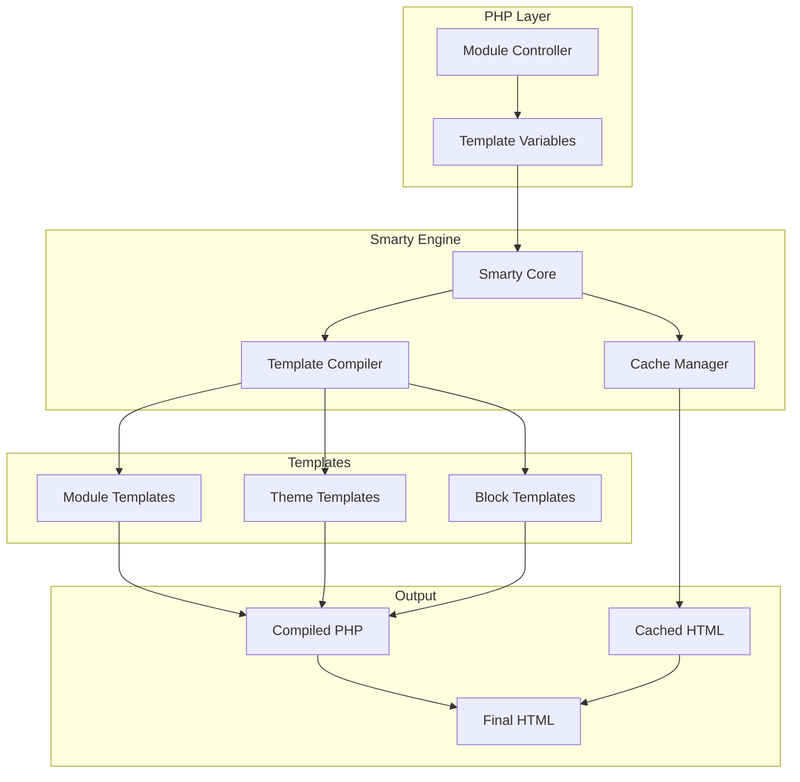
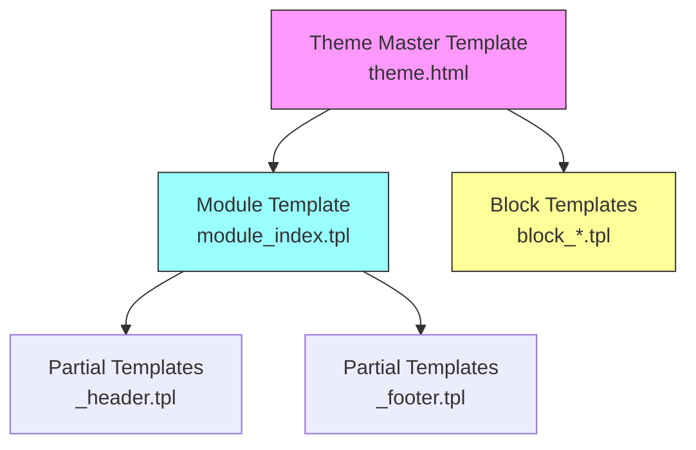
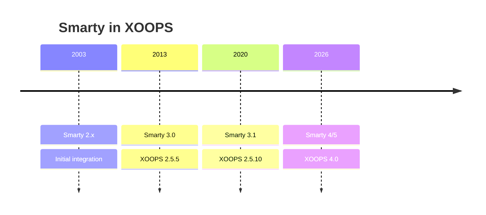

# ADR-003: Mehanizem predlog (Smarty)

> Architecture Decision Record za XOOPS, ki je sprejel mehanizem predlog Smarty.

---

## Status

**Sprejeto** - temeljna odločitev od XOOPS 2.0

**Razvija se** - prehod na Smarty 4/5 načrtovan za XOOPS 4.0

---

## Kontekst

XOOPS je potreboval rešitev za predloge, ki bi:

1. Ločite predstavitev od poslovne logike
2. Dovolite oblikovalcem tem, da delajo brez PHP znanja
3. Podpora za dedovanje predlog in vključuje
4. Zagotovite predpomnjenje za zmogljivost
5. Omogočite uporabniško prilagodljive predloge
6. Podpora internacionalizaciji

---

## Odločitveni diagram

---

## Odločitev

Kot mehanizem predloge bomo uporabili **Smarty**, ker:

### 1. Ločitev poslov
```php
// PHP (Controller) - Business logic
$items = $itemHandler->getPublishedItems();
$xoopsTpl->assign('items', $items);

// Smarty (View) - Presentation
// templates/items.tpl
```

```smarty
{* Smarty template - No PHP logic *}
<{foreach item=item from=$items}>
    <article>
        <h2><{$item.title}></h2>
        <p><{$item.summary}></p>
    </article>
<{/foreach}>
```
### 2. XOOPS Ločila

XOOPS uporablja `<{` in `}>` namesto standardnega `{` `}`:
```smarty
{* Standard Smarty *}
{$variable}

{* XOOPS Smarty - Avoids JavaScript conflicts *}
<{$variable}>
```
### 3. Hierarhija predloge

### 4. Template Storage

- **Baza podatkov**: prilagojene predloge, shranjene za možnost povrnitve
- **Datotečni sistem**: izvirne predloge v imenikih modulov
- **Predpomnilnik**: Prevedene predloge za zmogljivost

---

## Smarty konfiguracija
```php
// XOOPS Smarty initialization
$xoopsTpl = new XoopsTpl();

// Custom delimiters
$xoopsTpl->left_delim = '<{';
$xoopsTpl->right_delim = '}>';

// Caching
$xoopsTpl->caching = XOOPS_TEMPLATE_CACHE;
$xoopsTpl->cache_lifetime = 3600;

// Security
$xoopsTpl->security_policy = new Smarty_Security($xoopsTpl);
$xoopsTpl->security_policy->php_functions = [];
$xoopsTpl->security_policy->php_modifiers = ['escape', 'count'];
```
---

## Uporabljene funkcije predloge

### Spremenljivke
```smarty
{* Simple variable *}
<{$title}>

{* Object property *}
<{$item.title}>

{* With modifier *}
<{$content|truncate:200:'...'}>

{* Escaped output *}
<{$userInput|escape:'html'}>
```
### Nadzorne strukture
```smarty
{* Conditional *}
<{if $isAdmin}>
    <a href="admin.php">Admin</a>
<{elseif $isUser}>
    <a href="profile.php">Profile</a>
<{else}>
    <a href="login.php">Login</a>
<{/if}>

{* Loop *}
<{foreach item=item from=$items name=itemloop}>
    <{$smarty.foreach.itemloop.index}>: <{$item.title}>
<{/foreach}>
```
### Vključuje
```smarty
{* Include another template *}
<{include file="db:mymodule_header.tpl"}>

{* Include with variables *}
<{include file="db:mymodule_item.tpl" item=$currentItem}>

{* Include from theme *}
<{include file="file:$theme_path/partials/sidebar.tpl"}>
```
---

## Posledice

### Pozitivno

1. **Oblikovalcu prijazno**: sintaksa podobna HTML
2. **Caching**: Vgrajeno predpomnjenje predlog
3. **Varnost**: izolacija kode PHP
4. **Prilagodljivost**: Modifikatorji, funkcije, vtičniki
5. **Prilagajanje**: Uporabniki lahko spreminjajo predloge
6. **Skupnost**: Velik ekosistem Smarty

### Negativno

1. **Krivulja učenja**: sintaksa, specifična za Smarty
2. **Overhead**: Potreben je korak kompilacije
3. **Odpravljanje napak**: Napake predloge so lahko skrivnostne
4. **Težave z različico**: Prelomne spremembe med različicami

### Omilitve

- **Učenje**: obsežna dokumentacija
- **Zmogljivost**: Agresivno predpomnjenje
- **Odpravljanje napak**: Konzola za odpravljanje napak, brisanje sporočil o napakah
- **Različice**: Združljivostna plast v XOOPS

---

## Zgodovina različic

---

## Selitev: Smarty 3 na 4/5

### Prelomne spremembe
```smarty
{* Smarty 3 - Deprecated *}
<{php}>echo date('Y');<{/php}>

{* Smarty 4+ - Use modifiers or assign from PHP *}
<{$current_year}>

{* Smarty 3 - {section} deprecated *}
<{section name=i loop=$items}>
    <{$items[i].title}>
<{/section}>

{* Smarty 4+ - Use {foreach} *}
<{foreach $items as $item}>
    <{$item.title}>
<{/foreach}>
```
### Združljivostna plast

XOOPS zagotavlja združljivostno plast za gladke prehode:
```php
// XoopsTpl extends Smarty with compatibility methods
class XoopsTpl extends Smarty
{
    public function assign($tpl_var, $value = null)
    {
        // Handles both Smarty 3 and 4 syntax
        return parent::assign($tpl_var, $value);
    }
}
```
---

## Upoštevane alternative

### 1. Vejica
**Prednosti**: Sodoben ekosistem Symfony
**Slabosti**: Druga sintaksa, napor pri selitvi
**Odločitev**: možna prihodnja možnost za XOOPS 3.x

### 2. Rezilo (Laravel)
**Prednosti**: čista sintaksa, priljubljena
**Proti**: specifično za Laravel
**Odločitev**: Ni primeren za samostojno uporabo

### 3. Izvorne PHP Predloge
**Prednosti**: Brez krivulje učenja, hitro
**Slabosti**: Varnostna tveganja, brez ločevanja
**Odločitev**: Zavrnjeno zaradi vzdrževanja

---

## Povezane odločitve

- ADR-001: Modularna arhitektura
- ADR-002: Abstrakcija baze podatkov

---

## Reference

- Dokumentacija Smarty: https://www.Smarty.net/docs/en/
- XOOPS Sistemski vodnik po predlogah
- MVC Vzorec v spletnih aplikacijah

---

#XOOPS #architecture #adr #Smarty #templates #design-decision