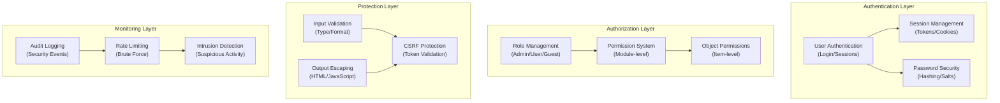

# ADR-004: Arhitektura varnostnega sistema

> Celovita varnostna arhitektura za XOOPS CMS zaščito pred sodobnimi grožnjami.

---

## Status

**Sprejeto** - Osnovna varnostna plast od XOOPS 2.5

---

## Kontekst

### Izjava o problemu

XOOPS potrebuje robusten varnostni sistem, ki:

1. **Ščiti pred pogostimi spletnimi ranljivostmi** (OWASP Top 10)
2. **Zagotavlja podroben nadzor dovoljenj** med moduli
3. **Omogoča varno avtentikacijo uporabnikov** s sodobnimi standardi
4. **Preprečuje kršitve podatkov** in nepooblaščen dostop
5. **Podpira večnivojski nadzor dostopa** (admin, moderator, uporabnik, gost)
6. **Brezhibno se integrira z vsemi moduli**

### Trenutne grožnje

Sodobni spletni napadi vključujejo:

- **SQL Injection** - Zlonamerna SQL v uporabniškem vnosu
- **XSS (Cross-Site Scripting)** - Vstavljen JavaScript na straneh
- **CSRF (Ponarejanje zahtev med spletnimi mesti)** - Nepooblaščene oddaje obrazcev
- **Authentication Bypass** - Slaba obravnava session/password
- **Authorization bypass** - Stopnjevanje privilegijev
- **Izpostavljenost podatkov** - Občutljivi podatki v URL-jih, dnevnikih ali predpomnilnikih

### XOOPS Varnostne zahteve

1. Preverjanje pristnosti uporabnikov in upravljanje sej
2. Nadzor dostopa na podlagi vlog (RBAC)
3. Sistem dovoljenj za module in objekte
4. Preverjanje vnosa in uhajanje izhoda
5. Zaščita pred običajnimi napadi
6. Revizijsko beleženje varnostnih dogodkov
7. Varno ravnanje z geslom
8. Zaščita žetona CSRF---

## Odločitev

### Osnovna varnostna arhitektura

---

## Varnostne komponente

### 1. Sistem za preverjanje pristnosti

**Postopek prijave uporabnika:**
```php
<?php
// 1. Validate credentials
$user = $userHandler->findByLogin($username);
if (!$user || !password_verify($password, $user->getVar('pass'))) {
    throw new AuthenticationException('Invalid credentials');
}

// 2. Check if account is active
if (!$user->getVar('uactive')) {
    throw new AuthenticationException('Account inactive');
}

// 3. Create secure session
session_regenerate_id(true);
$_SESSION['uid'] = $user->getVar('uid');
$_SESSION['token'] = bin2hex(random_bytes(32));
$_SESSION['created'] = time();

// 4. Log the login
$this->auditLog('USER_LOGIN', $user->getVar('uid'));
```
**Varnost z geslom:**
```php
<?php
// Use password_hash (not MD5 or SHA1)
$hashed = password_hash($password, PASSWORD_BCRYPT, [
    'cost' => 12, // High cost = slow brute force
]);

// Verify password
if (!password_verify($inputPassword, $hashed)) {
    throw new Exception('Invalid password');
}

// Rehash if algorithm or cost changed
if (password_needs_rehash($hashed, PASSWORD_BCRYPT, ['cost' => 12])) {
    $newHash = password_hash($password, PASSWORD_BCRYPT, ['cost' => 12]);
    $user->setVar('pass', $newHash);
    $userHandler->insert($user);
}
```
### 2. Upravljanje seje

**Upravljanje varne seje:**
```php
<?php
// Session configuration
ini_set('session.cookie_httponly', true);  // No JS access
ini_set('session.cookie_secure', true);     // HTTPS only
ini_set('session.cookie_samesite', 'Strict'); // CSRF protection
ini_set('session.gc_maxlifetime', 3600);   // 1 hour timeout
ini_set('session.sid_length', 64);         // 64-char session ID

// Validate session
function validateSession() {
    // Check timeout
    if (time() - $_SESSION['created'] > 3600) {
        session_destroy();
        throw new SessionExpiredException();
    }

    // Validate user agent (prevent session hijacking)
    if ($_SESSION['user_agent'] !== $_SERVER['HTTP_USER_AGENT']) {
        throw new SessionInvalidException();
    }

    // Validate IP (optional, can be too strict)
    if (!in_array($_SERVER['REMOTE_ADDR'], $_SESSION['ips'])) {
        $_SESSION['ips'][] = $_SERVER['REMOTE_ADDR'];
    }
}
```
### 3. Pooblastilo (RBAC)

**Nadzor dostopa na podlagi vlog:**
```php
<?php
class XoopsUser {
    public function hasPermission(string $permissionName): bool
    {
        // Get user groups
        $groups = $this->getGroups();

        // Check if any group has permission
        foreach ($groups as $groupId) {
            if ($this->checkGroupPermission($groupId, $permissionName)) {
                return true;
            }
        }

        return false;
    }

    /**
     * User groups and their permissions
     * Admin: Full access
     * Moderator: Content management
     * User: Create own content
     * Guest: Read-only access
     */
    private function checkGroupPermission(int $groupId, string $permission): bool
    {
        $permissions = [
            1 => ['admin_access'],                 // Admin group
            2 => ['moderate_content', 'edit_own'], // Moderator group
            3 => ['create_content', 'edit_own'],   // User group
            4 => [],                               // Guest group (no permissions)
        ];

        return in_array($permission, $permissions[$groupId] ?? []);
    }
}
```
### 4. Preverjanje vnosa

**Preprečite SQL napake vbrizgavanja in tipa:**
```php
<?php
// Always use prepared statements
$sql = 'SELECT * FROM users WHERE id = ?';
$result = $db->query($sql, [$userId]); // ✅ Safe

// Input validation
function validateUserInput(array $data): array
{
    return [
        'email' => filter_var($data['email'] ?? '', FILTER_VALIDATE_EMAIL),
        'age' => filter_var($data['age'] ?? 0, FILTER_VALIDATE_INT),
        'website' => filter_var($data['website'] ?? '', FILTER_VALIDATE_URL),
        'title' => substr(trim($data['title'] ?? ''), 0, 255),
    ];
}

// XOOPS Safe Input class
$safe = \Xmf\Request::getHtmlRequest('var_name', '');
$int = \Xmf\Request::getInt('page', 1);
```
### 5. Ubežanje izpisa

**Preprečite XSS napade:**
```php
<?php
// In PHP templates
echo htmlspecialchars($userInput, ENT_QUOTES, 'UTF-8');

// In Smarty templates (automatic escaping)
<{$user_input}>  {* Escaped by default *}
<{$html|escape:false}>  {* Only when needed *}

// JavaScript context
<script>
var message = "<{$userMessage|escape:'javascript'}>";
</script>

// URL context
<a href="<{$url|escape:'url'}>">Link</a>
```
### 6. CSRF Zaščita

**Preprečevanje ponarejanja zahtev med spletnimi mesti:**
```php
<?php
// Generate CSRF token
session_start();
if (empty($_SESSION['csrf_token'])) {
    $_SESSION['csrf_token'] = bin2hex(random_bytes(32));
}

// In forms
<form method="POST">
    <input type="hidden" name="csrf_token" value="<{$csrf_token}>">
    <button type="submit">Submit</button>
</form>

// Validate token
if ($_SERVER['REQUEST_METHOD'] === 'POST') {
    if (hash_equals($_SESSION['csrf_token'], $_POST['csrf_token'] ?? '')) {
        // Process form
    } else {
        throw new InvalidTokenException('CSRF token invalid');
    }
}
```
---

## Posledice

### Pozitivni učinki

1. **Celovita zaščita** - Zajema glavne razrede ranljivosti
2. **Večplastna varnost** - Večplastna obramba
3. **Prilagodljivo RBAC** - Natančen nadzor dovoljenj
4. **Revizijska sled** - Sledite varnostnim dogodkom
5. **Panožni standard** - Usklajen s priporočili OWASP
6. **Integracija modulov** - Preprosta uporaba varnostnih API-jev za module

### Negativni učinki

1. **Zapletenost** - Potrebnih je več kode in konfiguracije
2. **Zmogljivost** - Zgoščevanje in preverjanje dodajata dodatne stroške
3. **Uporabniška izkušnja** - Varnost je včasih neprijetna
4. **Vzdrževanje** - Zahteva stalne varnostne posodobitve
5. **Zahtevano usposabljanje** – razvijalci morajo upoštevati prakse

### Tveganja in ublažitve

| Tveganje | Resnost | Ublažitev |
|------|----------|-----------|
| Razvijalec ignorira varnost | Visok | Pregled kode, varnostno usposabljanje |
| Odkrite nove ranljivosti | Srednje | Redne varnostne revizije, posodobitve |
| Vpliv na uspešnost | Nizka | Optimizirajte vroče poti, predpomnjenje |
| Preveč zapletena dovoljenja | Srednje | Jasna dokumentacija, primeri |

---

## Najboljše varnostne prakse

### Za razvijalce modulov
```php
<?php
// ✅ DO: Use prepared statements
$result = $db->prepare('SELECT * FROM table WHERE id = ?')->execute([$id]);

// ❌ DON'T: Concatenate queries
$result = $db->query("SELECT * FROM table WHERE id = $id");

// ✅ DO: Escape output
echo htmlspecialchars($user_input, ENT_QUOTES, 'UTF-8');

// ❌ DON'T: Output raw user data
echo $user_input;

// ✅ DO: Check permissions
if (!$user->hasPermission('edit_content')) {
    throw new PermissionException();
}

// ❌ DON'T: Trust user roles directly
if ($_POST['is_admin']) {
    // Make user admin - SECURITY HOLE!
}

// ✅ DO: Validate input types
$page = (int)$_GET['page'];

// ❌ DON'T: Use untrusted values directly
$sql .= " LIMIT " . $_GET['limit'];
```
---

## Upoštevane alternative

### OAuth/OpenID Poveži

**Zakaj ni bil izbran na začetku:** Preveč zapleteno za okolje skupnega gostovanja, a dobro za prihodnjo integracijo z zunanjimi sistemi za preverjanje avtorizacije.

### Dvostopenjska avtentikacija (2FA)

**Stanje:** Sprejeto kot razširitev, ne kot osnovna zahteva, glejte ADR-006

### Sejni piškotki samo za HTTP

**Stanje:** Implementirano - preprečuje dostop JavaScripta do podatkov seje

---

## Povezane odločitve

- ADR-001: Modularna arhitektura - Moduli izvajajo varnost
- ADR-005: Sistem dovoljenj za module
- ADR-006: dvofaktorska avtentikacija (v prihodnosti)

---

## Reference

### Varnostni standardi

- [OWASP Top 10](https://owasp.org/www-project-top-ten/)
- [NIST Okvir kibernetske varnosti](https://www.nist.gov/cyberframework)
- [CWE Top 25](https://cwe.mitre.org/top25/)

### PHP Varnost

- [PHP Varnostni priročnik](https://www.php.net/manual/en/security.php)
- [password_hash() Dokumentacija](https://www.php.net/manual/en/function.password-hash.php)
- [Varnost seje](https://www.php.net/manual/en/session.security.php)

### Orodja

- [OWASP ZAP](https://www.zaproxy.org/) - Varnostno testiranje
- [Snyk](https://snyk.io/) - Iskanje ranljivosti
- [SonarQube](https://www.sonarqube.org/) - Kakovost kode---

## Kontrolni seznam za izvedbo

- [ ] Sistem za avtentikacijo uporabnikov
- [ ] Upravljanje seje
- [ ] Zgoščevanje gesel (bcrypt)
- [ ] Nadzor dostopa na podlagi vlog
- [ ] Dovoljenja modula
- [ ] Ogrodje za preverjanje vnosa
- [ ] Uhajanje izhoda (PHP + Smarty)
- [ ] CSRF zaščita žetonov
- [ ] Beleženje nadzora varnosti
- [ ] Omejitev hitrosti
- [ ] Varnostne glave

---

## Zgodovina različic

| Različica | Datum | Spremembe |
|---------|------|---------|
| 1.0.0 | 2024-01-28 | Začetni dokument |

---

#XOOPS #adr #security #architecture #authentication #authorization #rbac