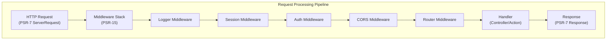

# ADR-005: PSR-15 Vzorec vmesne programske opreme za XOOPS 4.0

> Sprejmite PSR-15 HTTP strežniške obdelovalce zahtev (vmesna programska oprema) za izboljšan cevovod za obdelavo zahtev.

:::caution[XOOPS 4.0 Predlog — ni na voljo v 2.5.x]
Ta ADR opisuje **predlagano arhitekturo za XOOPS 4.0**. PSR-15 vmesna programska oprema **ni na voljo v XOOPS 2.5.x**. Trenutni moduli 2.5.x uporabljajo vzorec Page Controller z `mainfile.php` bootstrap. Glejte XOOPS Arhitektura za trenutni življenjski cikel zahteve.
:::

---

## Status

**Predlagano** - V ocenjevanju za izdajo XOOPS 4.0

---

## Kontekst

### Trenutni pristop

XOOPS 2.5 uporablja monoliten pristop obravnavanja zahtev:
```php
// Current: Sequential processing
require_once 'mainfile.php';
// → Kernel initialization
// → User authentication
// → Module loading
// → Page rendering

// All in one flow, mixed concerns
```
### Težave s trenutnim pristopom

1. **Mešani pomisleki** – avtentikacija, beleženje, usmerjanje so prepleteni
2. **Težko za testiranje** - Težko za enotno testiranje posameznih korakov obdelave zahtev
3. **Težko razširiti** - Moduli se lahko priklopijo samo prek preload/events
4. **Slabo ločevanje** – logika obdelave zahtev je razpršena po kodni bazi
5. **Ni mogoče sestaviti** – korakov obdelave ni mogoče zlahka verižiti ali preurediti

### Kaj je PSR-15 vmesna programska oprema?

PSR-15 definira standardni vmesnik za HTTP vmesno programsko opremo:
```php
<?php
interface RequestHandlerInterface {
    public function handle(ServerRequestInterface $request): ResponseInterface;
}

interface MiddlewareInterface {
    public function process(
        ServerRequestInterface $request,
        RequestHandlerInterface $handler
    ): ResponseInterface;
}
```
**Veriga vmesne programske opreme:**
```
Request
  ↓
[Logger] → logs request
  ↓
[Auth] → validates user session
  ↓
[CORS] → checks cross-origin
  ↓
[Router] → dispatches to handler
  ↓
[Handler] → generates response
  ↓
Response
```
---

## Odločitev

### Sprejmite sklad vmesne programske opreme PSR-15 za XOOPS 4.0

Izvedite cevovod za obdelavo zahtev, ki temelji na vmesni programski opremi, po standardu PSR-15.

### Pregled arhitekture

### Osrednje komponente vmesne programske opreme

#### 1. Vmesna programska oprema aplikacije (jedrna plast)
```php
<?php
declare(strict_types=1);

namespace XoopsCore;

use Psr\Http\Message\ResponseInterface;
use Psr\Http\Message\ServerRequestInterface;
use Psr\Http\Server\MiddlewareInterface;
use Psr\Http\Server\RequestHandlerInterface;

class SessionMiddleware implements MiddlewareInterface
{
    public function process(
        ServerRequestInterface $request,
        RequestHandlerInterface $handler
    ): ResponseInterface {
        // 1. Retrieve session (or start new)
        $sessionId = $request->getCookieParams()['PHPSESSID'] ?? null;
        $session = $this->sessionManager->load($sessionId);

        // 2. Attach session to request
        $request = $request->withAttribute('session', $session);

        // 3. Pass to next middleware
        $response = $handler->handle($request);

        // 4. Set session cookie if needed
        if ($session->isModified()) {
            $response = $response->withAddedHeader(
                'Set-Cookie',
                'PHPSESSID=' . $session->getId() . '; HttpOnly; SameSite=Strict'
            );
        }

        return $response;
    }
}
```
#### 2. Vmesna programska oprema za preverjanje pristnosti
```php
<?php
class AuthMiddleware implements MiddlewareInterface
{
    public function process(
        ServerRequestInterface $request,
        RequestHandlerInterface $handler
    ): ResponseInterface {
        // Get session from previous middleware
        $session = $request->getAttribute('session');

        // Authenticate user from session
        $user = $this->authenticate($session);

        // Attach user to request
        $request = $request->withAttribute('user', $user);

        return $handler->handle($request);
    }

    private function authenticate(?Session $session): User
    {
        if ($session && $session->has('uid')) {
            return $this->userRepository->findById($session->get('uid'));
        }

        return new AnonymousUser();
    }
}
```
#### 3. Vmesna programska oprema za avtorizacijo
```php
<?php
class AuthorizationMiddleware implements MiddlewareInterface
{
    public function __construct(private AuthorizationChecker $checker)
    {
    }

    public function process(
        ServerRequestInterface $request,
        RequestHandlerInterface $handler
    ): ResponseInterface {
        $user = $request->getAttribute('user');
        $route = $request->getAttribute('route');

        // Check if user has permission for this route
        if (!$this->checker->isGranted($user, $route)) {
            return new JsonResponse(
                ['error' => 'Unauthorized'],
                403
            );
        }

        return $handler->handle($request);
    }
}
```
#### 4. Vmesna programska oprema modula
```php
<?php
// Modules can provide their own middleware
class PublisherAccessMiddleware implements MiddlewareInterface
{
    public function process(
        ServerRequestInterface $request,
        RequestHandlerInterface $handler
    ): ResponseInterface {
        $user = $request->getAttribute('user');

        // Module-specific access control
        if (!$user->hasPermission('publisher_view')) {
            return new HtmlResponse('Access denied', 403);
        }

        return $handler->handle($request);
    }
}
```
### Primer implementacije
```php
<?php
// bootstrap.php - Application setup

use Psr\Http\Message\ServerRequestInterface;
use Psr\Http\Server\RequestHandlerInterface;
use Xoops\Core\Middleware\{
    LoggerMiddleware,
    SessionMiddleware,
    AuthMiddleware,
    CorsMiddleware,
    ErrorHandlingMiddleware
};

// Create middleware pipeline
$middlewareStack = [
    // 1. Error handling (outermost)
    new ErrorHandlingMiddleware(),

    // 2. Logging
    new LoggerMiddleware($logger),

    // 3. CORS handling
    new CorsMiddleware($corsConfig),

    // 4. Session management
    new SessionMiddleware($sessionManager),

    // 5. Authentication
    new AuthMiddleware($userRepository),

    // 6. Authorization
    new AuthorizationMiddleware($authChecker),

    // 7. Routing and dispatching
    new RoutingMiddleware($router),

    // 8. Module middleware (dynamic)
    ...$this->loadModuleMiddleware(),
];

// Process request through middleware stack
$request = ServerRequestFactory::fromGlobals();
$dispatcher = new MiddlewareDispatcher($middlewareStack);
$response = $dispatcher->dispatch($request);

// Send response
http_response_code($response->getStatusCode());
foreach ($response->getHeaders() as $name => $values) {
    foreach ($values as $value) {
        header("$name: $value", false);
    }
}
echo $response->getBody();
```
### Integracija modula

Moduli lahko zagotovijo vmesno programsko opremo:
```php
<?php
// Publisher module - xoops_version.php

$modversion['middleware'] = [
    'PublisherAccessMiddleware' => true,      // Auto-load
    'PublisherLogMiddleware' => true,
];

// Or custom:
$modversion['middleware_factory'] = function() {
    return [
        new PublisherCacheMiddleware(),
        new PublisherPermissionMiddleware(),
    ];
};
```
---

## Posledice

### Pozitivni učinki

1. **Ločitev skrbi** - Vsaka vmesna programska oprema ima eno odgovornost
2. **Preizkušljivost** - Preprosto enotno testiranje posameznih komponent vmesne programske opreme
3. **Zložljivost** - Vmesno programsko opremo je mogoče mešati in preurejati
4. **Skladno s standardi** - uporablja standarda PSR-15 in PSR-7
5. **Razširljivost** - Moduli lahko enostavno dodajo vmesno programsko opremo po meri
6. **Odpravljanje napak** - Počisti tok zahtev skozi cevovod
7. **Zmogljivost** – lahko optimizira specifične plasti vmesne programske opreme
8. **Interoperabilnost** - lahko uporablja vmesno programsko opremo PSR-15 tretjih oseb

### Negativni učinki

1. **Krivulja učenja** – razvijalci morajo razumeti PSR-15
2. **Performance Overhead** – več funkcijskih klicev v cevovodu
3. **Kompleksnost** – Več gibljivih delov kot monoliten pristop
4. **Prizadevanje za selitev** - zahteva preoblikovanje obstoječe kode
5. **Odvisnosti** - Zahteva knjižnico PSR-7 HTTP

### Tveganja in ublažitve

| Tveganje | Resnost | Ublažitev |
|------|----------|-----------|
| Kompleksne vmesne verige | Srednje | Jasna dokumentacija, primeri |
| Poslabšanje zmogljivosti | Srednje | Primerjalno merilo, optimizirajte vroče poti |
| Zloraba razvijalca | Srednje | Pregled kode, vodnik po najboljših praksah |
| Spremembe, ki prekinjajo migracijo | Visok | Obdobje amortizacije, pomočniki |
| Težave z naročanjem vmesne programske opreme | Srednje | Počisti graf odvisnosti |---

## Izvedbeni načrt

### 1. faza: Temelj (2. četrtletje 2026)

- [ ] Implementiraj PSR-7 HTTP ovoj sporočila
- [ ] Ustvarite MiddlewareDispatcher
- [ ] Izvedba jedrne vmesne programske opreme (seja, avtorizacija)
- [ ] Posodobite jedro za uporabo vmesne programske opreme

### Faza 2: Integracija (Q3 2026)

- [ ] Preselitev obstoječe funkcionalnosti na vmesno programsko opremo
- [ ] Dodajte podporo za vmesno programsko opremo modula
- [ ] Ustvarite pripomočke za testiranje vmesne programske opreme
- [ ] Napišite obsežno dokumentacijo

### Faza 3: Selitev (Q4 2026)

- [ ] Zagotavlja združljivostno plast za staro kodo
- [ ] Moduli pomoči se posodobijo na novo vmesno programsko opremo
- [ ] Optimizacija zmogljivosti
- [ ] Varnostna revizija

### Faza 4: Izdaja (Q1 2027)

- [ ] XOOPS Izdaja 4.0 z vmesno programsko opremo
- [ ] Opusti stari sistem preload/hook
- [ ] Povratne informacije in posodobitve skupnosti

---

## Merila uspeha

- [ ] Vse osnovne funkcije so se preselile v vmesno programsko opremo
- [ ] 90 %+ testna pokritost za vmesno programsko opremo
- [ ] Dokumentacija s primeri
- [ ] Zmogljivost znotraj 10 % prejšnje različice
- [ ] Moduli uspešno uporabljajo nov sistem vmesne programske opreme
- [ ] Stopnja posvojitve v skupnosti >80 %

---

## Najboljše prakse vmesne programske opreme

### Naredi

- Osredotočite se na vmesno programsko opremo (ena odgovornost)
- Uporabi nespremenljivost (ustvari nov request/response)
- Napake obravnavajte elegantno
- Odvisnosti dokumentov
- Dodajte tipske namige
- Napišite teste za vmesno programsko opremo
- Uporabite standardne vmesnike PSR-15### Ne

- Ne spreminjajte skupnih request/response objektov
- Ne dostopajte neposredno do globalov
- Ne ustvarjajte odvisnosti od vrstnega reda vmesne programske opreme
- Ne ujemite vseh izjem
- Ne mešajte poslovne logike z vmesno programsko opremo
- Naj vmesna programska oprema ne naredi preveč

---

## Primeri

### Vmesna programska oprema po meri
```php
<?php
// Example: Rate limiting middleware

use Psr\Http\Message\ResponseInterface;
use Psr\Http\Message\ServerRequestInterface;
use Psr\Http\Server\MiddlewareInterface;
use Psr\Http\Server\RequestHandlerInterface;

class RateLimitMiddleware implements MiddlewareInterface
{
    public function __construct(
        private RateLimiter $limiter,
        private int $limit = 100,
        private int $window = 3600
    ) {
    }

    public function process(
        ServerRequestInterface $request,
        RequestHandlerInterface $handler
    ): ResponseInterface {
        $user = $request->getAttribute('user');
        $identifier = $user->getId() ?? $request->getClientIp();

        // Check rate limit
        $remaining = $this->limiter->check($identifier, $this->limit, $this->window);

        if ($remaining < 0) {
            return new JsonResponse(
                ['error' => 'Rate limit exceeded'],
                429
            );
        }

        // Add rate limit headers
        $response = $handler->handle($request);
        return $response
            ->withAddedHeader('X-RateLimit-Limit', (string)$this->limit)
            ->withAddedHeader('X-RateLimit-Remaining', (string)$remaining);
    }
}
```
---

## Povezane odločitve

- ADR-001: Modularna arhitektura - temelj
- ADR-004: Varnostni sistem - uporablja vmesno programsko opremo za avt.
- ADR-006: dvofaktorska avtorizacija - lahko vmesna programska oprema

---

## Reference

### PSR Standardi

- [PSR-7: HTTP vmesnik sporočil](https://www.php-fig.org/psr/psr-7/)
- [PSR-15: HTTP Obdelovalci zahtev strežnika](https://www.php-fig.org/psr/psr-15/)

### Ogrodja vmesne programske opreme

- [Slim Framework](https://www.slimframework.com/) - Primeri vmesne programske opreme
- [Zend Expressive](https://docs.zendframework.com/zend-expressive/) - PSR-15 okvir
- [Guzzle](https://docs.guzzlephp.org/) - HTTP vmesna programska oprema odjemalca

### Orodja

- [RelayPHP](https://relayphp.com/) - Knjižnica vmesne programske opreme
- [PSR-15 Middleware](https://github.com/middlewares) - Zbirka vmesne opreme

---

## Zgodovina različic

| Različica | Datum | Spremembe |
|---------|------|---------|
| 1.0.0 | 2024-01-28 | Začetni predlog |

---

#XOOPS #adr #psr-15 #middleware #architecture #psr-7