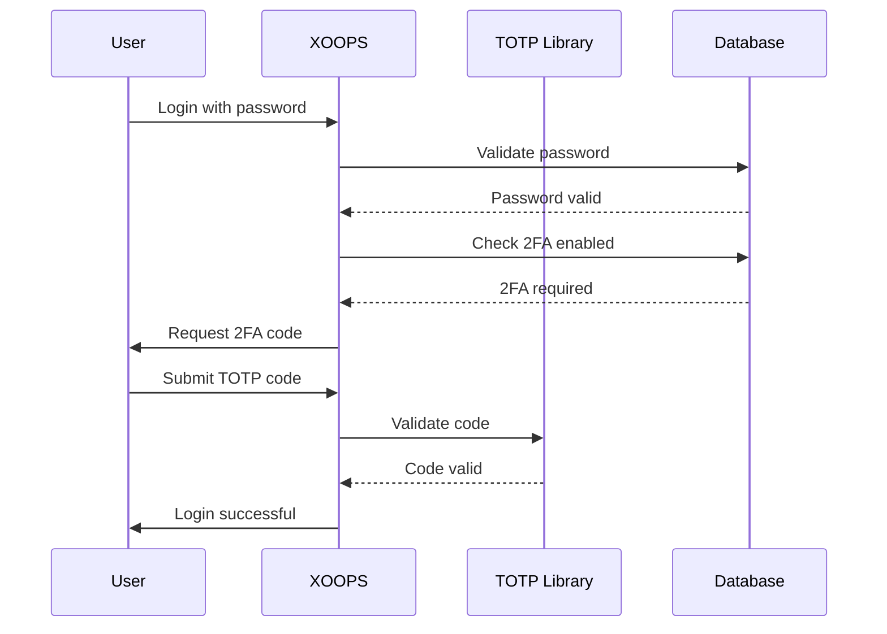

## Status

Predlagano

## Kontekst

XOOPS potrebuje izboljšano varnost za avtentikacijo uporabnika. Dvostopenjska avtentikacija (2FA) poleg gesel zagotavlja dodatno raven varnosti in ščiti račune, tudi če so gesla ogrožena.

Ključni premisleki:
- Povratna združljivost z obstoječo avtentikacijo
- Podpora za več metod 2FA
- Uporabniška izkušnja med nastavitvijo in prijavo
- Mehanizmi za obnovitev izgubljenih naprav
- Integracija z obstoječim sistemom dovoljenj

## Odločitev

Implementirali bomo TOTP (Time-based One-Time Password) kot primarno metodo 2FA s podporo za rezervne kode.

### Izvedbeni pristop

### Shema baze podatkov
```sql
CREATE TABLE `{PREFIX}_users_2fa` (
    `user_id` INT(11) NOT NULL,
    `secret` VARCHAR(32) NOT NULL,
    `enabled` TINYINT(1) DEFAULT 0,
    `backup_codes` TEXT,
    `last_used` INT(11),
    `created` INT(11) NOT NULL,
    PRIMARY KEY (`user_id`),
    FOREIGN KEY (`user_id`) REFERENCES `{PREFIX}_users`(`uid`)
);
```
### Storitveni vmesnik
```php
interface TwoFactorAuthInterface
{
    public function enable(int $userId): TwoFactorSetup;
    public function disable(int $userId): void;
    public function verify(int $userId, string $code): bool;
    public function generateBackupCodes(int $userId): array;
    public function isEnabled(int $userId): bool;
}
```
### Integracija vmesne programske opreme
```php
class TwoFactorMiddleware implements MiddlewareInterface
{
    public function process(
        ServerRequestInterface $request,
        RequestHandlerInterface $handler
    ): ResponseInterface {
        $session = $request->getAttribute('session');

        if ($session->has('pending_2fa_user_id')) {
            // User needs to complete 2FA
            if ($this->isVerificationRequest($request)) {
                return $handler->handle($request);
            }
            return new RedirectResponse('/2fa/verify');
        }

        return $handler->handle($request);
    }
}
```
## Posledice

### Pozitivno

- Bistveno izboljšana varnost računa
- Združljivost z industrijskim standardom TOTP (Google Authenticator, Authy itd.)
- Rezervne kode preprečujejo zaklepanje računa
- Izbirno za posameznega uporabnika - ne zahteva sprejetja
- PSR-15 vmesna programska oprema omogoča čisto integracijo

### Negativno

- Dodaten korak za prijavo vpliva na uporabniško izkušnjo
- Uporabniki morajo upravljati aplikacije za preverjanje pristnosti
- Za izgubljene naprave je potreben postopek obnovitve
- Dodatno shranjevanje baze podatkov in poizvedbe
- Zahteva odvisnost od kriptografske knjižnice

### Pot selitve

1. Dodajte tabelo zbirke podatkov za podatke 2FA
2. Izvedite storitev TOTP z odvisnostjo od knjižnice
3. Dodajte vmesno programsko opremo v verigo preverjanja pristnosti
4. Ustvarite uporabniški vmesnik za nastavitev in preverjanje
5. Skrbniška možnost za zahtevo 2FA za določene skupine

## Upoštevane alternative

### SMS na podlagi OTP

Zavrnjeno zaradi:
- SIM ranljivosti pri zamenjavi
- Stroški SMS prehoda
- Zapletenost preverjanja telefonske številke
- Pomisleki glede zasebnosti

### Varnostni ključi strojne opreme (WebAuthn)

Odloženo za prihodnost ADR:
- Kompleksnejša izvedba
- V preteklosti omejena podpora brskalnika
- Višji uporabniški stroški
- Lahko se doda poleg TOTP pozneje

### Na podlagi elektronske pošte OTP

Zavrnjeno zaradi:
- Ogrožanje e-poštnega računa premaga namen
- Zamude pri dostavi vplivajo na UX
- Težave s filtrom neželene pošte## Reference

- [RFC 6238 - TOTP](https://tools.ietf.org/html/rfc6238)
- [Oblika ključa Google Authenticator](https://github.com/google/google-authenticator/wiki/Key-Uri-Format)
- ../../02-Core-Concepts/Security/Security-Best-Practices - Varnostne smernice
- ../../02-Core-Concepts/Users-Permissions/Authentication - Dokumentacija sistema za avtorizacijo