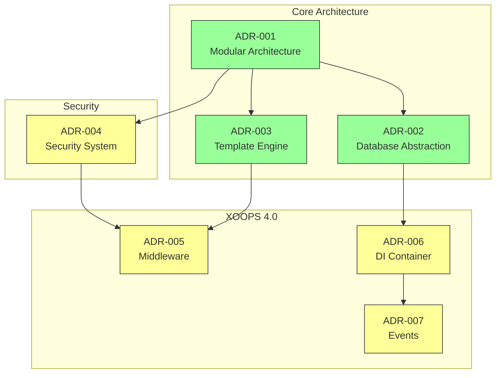
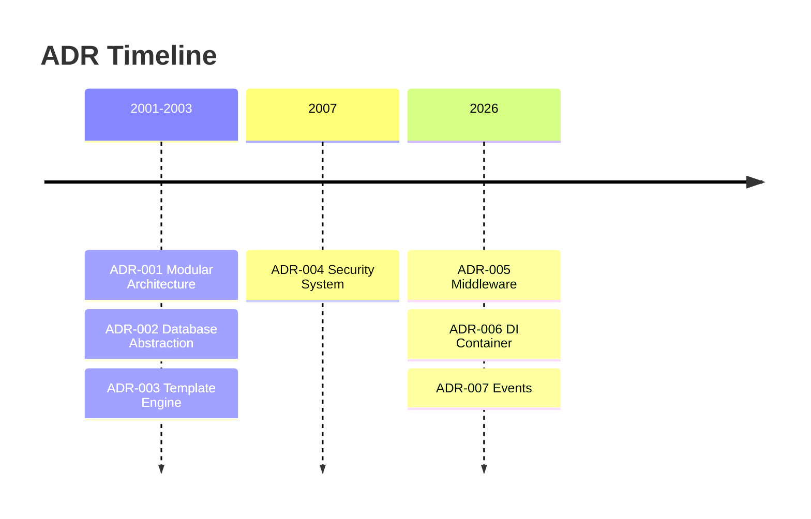

# 📋 Indeks zapisov arhitekturnih odločitev

> Celovit indeks arhitekturnih odločitev, ki so oblikovale XOOPS CMS.

---

## Kaj so neželeni učinki?

Zapisi o arhitekturnih odločitvah (ADR) dokumentirajo pomembne arhitekturne odločitve, sprejete med razvojem XOOPS. Zajamejo kontekst, odločitev in posledice vsake izbire ter zagotavljajo dragocen zgodovinski kontekst za vzdrževalce in sodelavce.

---

## ADR Legenda stanja

| Stanje | Pomen |
|--------|---------|
| **Predlagano** | V razpravi, še ni sprejet |
| **Sprejeto** | Sklep je bil sprejet |
| **Zastarelo** | Ni več priporočljivo |
| **Nadomeščeno** | Zamenjana z drugo ADR |

---

## Trenutni neželeni učinki

### Temeljne odločitve

| ADR | Naslov | Stanje | Vpliv |
|-----|-------|--------|--------|
| ADR-001 | Modularna arhitektura | Sprejeto | Jedro |
| ADR-002 | Objektno usmerjen dostop do baze podatkov | Sprejeto | Jedro |
| ADR-003 | Smarty Template Engine | Sprejeto | Jedro |

### Načrtovani neželeni učinki (XOOPS 4.0)

| ADR | Naslov | Stanje | Vpliv |
|-----|-------|--------|--------|
| ADR-004 | Oblikovanje varnostnega sistema | Predlagano | Varnost |
| ADR-005 | PSR-15 Vmesna programska oprema | Predlagano | Arhitektura |
| ADR-006 | Vsebnik za vstavljanje odvisnosti | Predlagano | Arhitektura |
| ADR-007 | Prenova sistema dogodkov | Predlagano | Arhitektura |---

## ADR Odnosi

---

## Časovnica

---

## Ustvarjanje novih neželenih učinkov

Pri predlaganju nove arhitekturne odločitve:

1. Kopirajte predlogo ADR
2. Izpolnite vse razdelke
3. Predložite kot zahtevo za vlečenje
4. Razpravljajte v GitHub Issues
5. Posodobite status po odločitvi

### ADR Struktura predloge
```markdown
# ADR-XXX: Title

## Status
Proposed | Accepted | Deprecated | Superseded

## Context
What is the issue motivating this decision?

## Decision
What is the change that we're proposing?

## Consequences
What becomes easier or harder as a result?

## Alternatives Considered
What other options were evaluated?
```
---

## 🔗 Povezana dokumentacija

- Temeljni koncepti
- Smernice za prispevanje
- XOOPS 4.0 Načrt

---

#XOOPS #adr #architecture #index #odločitve