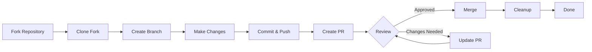

> Ta vodnik vas vodi skozi celoten postopek prispevanja k XOOPS, od začetne nastavitve do združene zahteve za vleko.

---

## Predpogoji

Preden začnete prispevati, se prepričajte, da imate:

- **Git** nameščen in konfiguriran
- **GitHub račun** (brezplačno)
- **PHP 7.4+** za XOOPS razvoj
- **Skladatelj** za upravljanje odvisnosti
- Osnovno poznavanje delovnih procesov Git
- Poznavanje kodeksa ravnanja

---

## 1. korak: Razcepite repozitorij

### Na spletnem vmesniku GitHub

1. Pomaknite se do repozitorija (npr. `XOOPS/XoopsCore27`)
2. Kliknite gumb **Fork** v zgornjem desnem kotu
3. Izberite, kje za fork (vaš osebni račun)
4. Počakajte, da se vilice dokončajo

### Zakaj Fork?

- Dobiš svojo kopijo, na kateri delaš
- Vzdrževalcem ni treba upravljati veliko vej
- Imate popoln nadzor nad vilicami
- Zahteve za vleko se nanašajo na vaš fork in repo navzgor

---

## 2. korak: lokalno klonirajte vilice
```bash
# Clone your fork (replace YOUR_USERNAME)
git clone https://github.com/YOUR_USERNAME/XoopsCore27.git
cd XoopsCore27

# Add upstream remote to track original repository
git remote add upstream https://github.com/XOOPS/XoopsCore27.git

# Verify remotes are set correctly
git remote -v
# origin    https://github.com/YOUR_USERNAME/XoopsCore27.git (fetch)
# origin    https://github.com/YOUR_USERNAME/XoopsCore27.git (push)
# upstream  https://github.com/XOOPS/XoopsCore27.git (fetch)
# upstream  https://github.com/XOOPS/XoopsCore27.git (nofetch)
```
---

## 3. korak: Nastavite razvojno okolje

### Namestitev odvisnosti
```bash
# Install Composer dependencies
composer install

# Install development dependencies
composer install --dev

# For module development
cd modules/mymodule
composer install
```
### Konfigurirajte Git
```bash
# Set your Git identity
git config user.name "Your Name"
git config user.email "your.email@example.com"

# Optional: Set global Git config
git config --global user.name "Your Name"
git config --global user.email "your.email@example.com"
```
### Zaženite teste
```bash
# Make sure tests pass in clean state
./vendor/bin/phpunit

# Run specific test suite
./vendor/bin/phpunit --testsuite unit
```
---

## 4. korak: Ustvarite vejo funkcij

### Konvencija o poimenovanju vej

Sledite temu vzorcu: `<type>/<description>`

**Vrste:**
- `feature/` - Nova funkcija
- `fix/` - Popravek napake
- `docs/` - Samo dokumentacija
- `refactor/` - Preoblikovanje kode
- `test/` - Testni dodatki
- `chore/` - Vzdrževanje, orodje

**Primeri:**
```bash
# Feature branch
git checkout -b feature/add-two-factor-auth

# Bug fix branch
git checkout -b fix/prevent-xss-in-forms

# Documentation branch
git checkout -b docs/update-api-guide

# Always branch from upstream/main (or develop)
git checkout -b feature/my-feature upstream/main
```
### Posodabljajte podružnico
```bash
# Before you start work, sync with upstream
git fetch upstream
git merge upstream/main

# Later, if upstream has changed
git fetch upstream
git rebase upstream/main
```
---

## 5. korak: Izvedite svoje spremembe

### Razvojne prakse

1. **Napišite kodo** v skladu s standardi PHP
2. **Pišite teste** za novo funkcionalnost
3. **Posodobite dokumentacijo**, če je potrebno
4. **Zaženite linterje** in oblikovalce kode

### Preverjanje kakovosti kode
```bash
# Run all tests
./vendor/bin/phpunit

# Run with coverage
./vendor/bin/phpunit --coverage-html coverage/

# Run PHP CS Fixer
./vendor/bin/php-cs-fixer fix --dry-run

# Run PHPStan static analysis
./vendor/bin/phpstan analyse class/ src/
```
### Izvedite dobre spremembe
```bash
# Check what you changed
git status
git diff

# Stage specific files
git add class/MyClass.php
git add tests/MyClassTest.php

# Or stage all changes
git add .

# Commit with descriptive message
git commit -m "feat(auth): add two-factor authentication support"
```
---

## 6. korak: Ohranite podružnico sinhronizirano

Med delom na vaši funkciji lahko glavna veja napreduje:
```bash
# Fetch latest changes from upstream
git fetch upstream

# Option A: Rebase (preferred for clean history)
git rebase upstream/main

# Option B: Merge (simpler but adds merge commits)
git merge upstream/main

# If conflicts occur, resolve them then:
git add .
git rebase --continue  # or git merge --continue
```
---

## 7. korak: potisnite na vilice
```bash
# Push your branch to your fork
git push origin feature/my-feature

# On subsequent pushes
git push

# If you rebased, you might need force push (use carefully!)
git push --force-with-lease origin feature/my-feature
```
---

## 8. korak: Ustvarite zahtevo za vlečenje

### Na spletnem vmesniku GitHub

1. Pojdite do svoje vilice na GitHubu
2. Videli boste obvestilo za ustvarjanje PR iz vaše podružnice
3. Kliknite **"Primerjaj in zahtevaj potegnite"**
4. Ali pa ročno kliknite **»Nova zahteva za vleko«** in izberite svojo podružnico

### PR naslov in opis

**Oblika naslova:**
```
<type>(<scope>): <subject>
```
Primeri:
```
feat(auth): add two-factor authentication
fix(forms): prevent XSS in text input
docs: update installation guide
refactor(core): improve performance
```
**Opisna predloga:**
```markdown
## Description
Brief explanation of what this PR does.

## Changes
- Changed X from A to B
- Added feature Y
- Fixed bug Z

## Type of Change
- [ ] New feature (adds new functionality)
- [ ] Bug fix (fixes an issue)
- [ ] Breaking change (API/behavior change)
- [ ] Documentation update

## Testing
- [ ] Added tests for new functionality
- [ ] All existing tests pass
- [ ] Manual testing performed

## Screenshots (if applicable)
Include before/after screenshots for UI changes.

## Related Issues
Closes #123
Related to #456

## Checklist
- [ ] Code follows style guidelines
- [ ] Self-reviewed own code
- [ ] Commented complex code
- [ ] Updated documentation
- [ ] No new warnings generated
- [ ] Tests pass locally
```
### Kontrolni seznam za pregled PR

Pred oddajo zagotovite:

- [ ] Koda je v skladu s standardi PHP
- [ ] Testi so vključeni in so uspešni
- [ ] Posodobljena dokumentacija (če je potrebno)
- [ ] Ni sporov pri spajanju
- [ ] Sporočila o potrditvi so jasna
- [ ] Navedena so povezana vprašanja
- [ ] PR opis je podroben
- [ ] Ni kode za odpravljanje napak ali dnevnikov konzole

---

## 9. korak: odgovorite na povratne informacije

### Med pregledom kode

1. **Pozorno preberite komentarje** – Razumite povratne informacije
2. **Postavite vprašanja** - Če ni jasno, prosite za pojasnilo
3. **Pogovarjajte se o alternativah** – Spoštljivo razpravljajte o pristopih
4. **Izvedite zahtevane spremembe** - Posodobite svojo vejo
5. **Prisilno potisnite posodobljene objave** - Če ponovno pišete zgodovino
```bash
# Make changes
git add .
git commit --amend  # Modify last commit
git push --force-with-lease origin feature/my-feature

# Or add new commits
git commit -m "Address feedback on PR review"
git push origin feature/my-feature
```
### Pričakujte ponovitev

- Večina PR zahteva več krogov pregleda
- Bodite potrpežljivi in konstruktivni
- Na povratne informacije glejte kot na priložnost za učenje
- Vzdrževalci lahko predlagajo refaktorje

---

## Korak 10: Združite in očistite

### Po odobritvi

Ko vzdrževalci odobrijo in združijo:

1. **Samodejno spajanje GitHub** ali spajanje klikov vzdrževalcev
2. **Vaša podružnica je izbrisana** (običajno samodejno)
3. **Spremembe so navzgor**

### Lokalno čiščenje
```bash
# Switch to main branch
git checkout main

# Update main with merged changes
git fetch upstream
git merge upstream/main

# Delete local feature branch
git branch -d feature/my-feature

# Delete from your fork (if not auto-deleted)
git push origin --delete feature/my-feature
```
---

## Diagram poteka dela

---

## Pogosti scenariji

### Sinhronizacija pred začetkom
```bash
# Always start fresh
git fetch upstream
git checkout -b feature/new-thing upstream/main
```
### Dodajanje več potrditev
```bash
# Just push again
git add .
git commit -m "feat: additional changes"
git push origin feature/new-thing
```
### Popravljanje napak
```bash
# Last commit has wrong message
git commit --amend -m "Correct message"
git push --force-with-lease

# Revert to previous state (careful!)
git reset --soft HEAD~1  # Keep changes
git reset --hard HEAD~1  # Discard changes
```
### Obravnava sporov spajanja
```bash
# Rebase and resolve conflicts
git fetch upstream
git rebase upstream/main

# Edit conflicted files to resolve
# Then continue
git add .
git rebase --continue
git push --force-with-lease
```
---

## Najboljše prakse

### Naredi

- Podružnice naj bodo osredotočene na posamezne zadeve
- Naredite majhne, logične obveznosti
- Napišite opisna sporočila o objavi
- Pogosto posodabljajte svojo vejo
- Test pred potiskanjem
- Spremembe dokumentov
- Bodite odzivni na povratne informacije

### Ne

- Delajte neposredno v podružnici main/master
- Zmešajte nepovezane spremembe v en PR
- Objavite ustvarjene datoteke ali node_modules
- Prisilni pritisk, potem ko je PR javen (uporabite --force-with-lease)
- Ignorirajte povratne informacije o pregledu kode
- Ustvarite velike PR-je (razbijte se na manjše)
- Posredovanje občutljivih podatkov (API ključev, gesel)

---

## Nasveti za uspeh

### Komunicirajte

- Postavite vprašanja v zadevah, preden začnete z delom
- Prosite za napotke pri kompleksnih spremembah
- Razpravljajte o pristopu v opisu PR
- Hitro se odzovite na povratne informacije

### Sledite standardom

- Pregled PHP standardov
- Preverite smernice za poročanje o težavah
- Preberite pregled prispevka
- Sledite smernicam zahtev za vlečenje

### Naučite se kodne baze

- Preberite obstoječe kodne vzorce
- Preučite podobne izvedbe
- Razumeti arhitekturo
- Preverite temeljne koncepte

---

## Povezana dokumentacija

- Kodeks ravnanja
- Smernice za zahtevo po vleku
- Poročanje o težavah
- PHP Standardi kodiranja
- Pregled prispevka

---

#XOOPS #git #github #contributing #workflow #pull-request