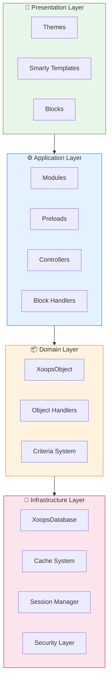
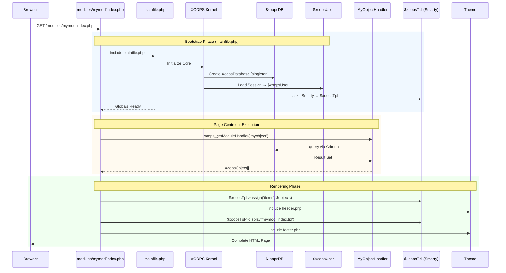

:::opomba[O tem dokumentu]
Ta stran opisuje **konceptualno arhitekturo** XOOPS, ki velja tako za trenutno (2.5.x) kot za prihodnjo (4.0.x) različico. Nekateri diagrami prikazujejo večplastno vizijo oblikovanja.

**Za podrobnosti glede različice:**
- **XOOPS 2.5.x Danes:** Uporablja `mainfile.php`, globalne vrednosti (`$xoopsDB`, `$xoopsUser`), prednalaganja in vzorec upravljalnika
- **XOOPS 4.0 Target:** PSR-15 vmesna programska oprema, vsebnik DI, usmerjevalnik - glejte [Načrt](../../07-XOOPS-4.0/XOOPS-4.0-Roadmap.md)
:::

Ta dokument nudi obsežen pregled sistemske arhitekture XOOPS in pojasnjuje, kako različne komponente delujejo skupaj, da ustvarijo prilagodljiv in razširljiv sistem za upravljanje vsebine.

## Pregled

XOOPS sledi modularni arhitekturi, ki skrbi ločuje na različne plasti. Sistem je zgrajen okoli več osnovnih načel:

- **Modularnost**: Funkcionalnost je organizirana v neodvisne module, ki jih je mogoče namestiti
- **Razširljivost**: Sistem je mogoče razširiti brez spreminjanja osnovne kode
- **Abstrakcija**: Baze podatkov in predstavitvene plasti so povzete iz poslovne logike
- **Varnost**: vgrajeni varnostni mehanizmi ščitijo pred pogostimi ranljivostmi

## Sistemske plasti

### 1. Predstavitvena plast

Predstavitveni sloj obravnava upodabljanje uporabniškega vmesnika z uporabo predloge Smarty.

**Ključne komponente:**
- **Teme**: Vizualni slog in postavitev
- **Pametne predloge**: dinamično upodabljanje vsebine
- **Bloki**: pripomočki za večkratno uporabo vsebine

### 2. Aplikacijska plast

Aplikacijska plast vsebuje poslovno logiko, krmilnike in funkcionalnost modula.

**Ključne komponente:**
- **Moduli**: Samostojni paketi funkcionalnosti
- **Obdelovalci**: Razredi za obdelavo podatkov
- **Prednalaganja**: poslušalci dogodkov in kavlji

### 3. Plast domene

Domenska plast vsebuje osnovne poslovne objekte in pravila.

**Ključne komponente:**
- **XoopsObject**: osnovni razred za vse objekte domene
- **Handlerji**: CRUD operacije za objekte domene

### 4. Infrastrukturna plast

Infrastrukturni sloj zagotavlja osnovne storitve, kot sta dostop do baze podatkov in predpomnjenje.

## Življenjski cikel zahteve

Razumevanje življenjskega cikla zahteve je ključnega pomena za učinkovit XOOPS razvoj.

### XOOPS 2.5.x Page Controller Flow

Trenutna XOOPS 2.5.x uporablja vzorec **Krmilnik strani**, kjer vsaka datoteka PHP obravnava svojo zahtevo. Globali (`$xoopsDB`, `$xoopsUser`, `$xoopsTpl` itd.) se inicializirajo med zagonom in so na voljo med izvajanjem.

### Ključni globali v 2.5.x

| Globalno | Vrsta | Inicializirano | Namen |
|--------|------|-------------|---------|
| `$xoopsDB` | `XoopsDatabase` | Bootstrap | Povezava z bazo podatkov (singleton) |
| `$xoopsUser` | `XoopsUser\|null` | Obremenitev seje | Trenutni prijavljeni uporabnik |
| `$xoopsTpl` | `XoopsTpl` | Zagon predloge | Motor za predloge Smarty |
| `$xoopsModule` | `XoopsModule` | Obremenitev modula | Trenutni kontekst modula |
| `$xoopsConfig` | `array` | Nalaganje konfiguracije | Sistemska konfiguracija |

:::opomba[XOOPS 4.0 Primerjava]
V XOOPS 4.0 je vzorec krmilnika strani nadomeščen s cevovodom **PSR-15 Middleware Pipeline** in dispečiranjem na podlagi usmerjevalnika. Globali so nadomeščeni z vbrizgavanjem odvisnosti. Glejte [pogodbo o hibridnem načinu](../../07-XOOPS-4.0/Specifications/Hybrid-Mode-Contract.md) za jamstva združljivosti med selitvijo.
:::

### 1. Faza zagona
```php
// mainfile.php is the entry point
include_once XOOPS_ROOT_PATH . '/mainfile.php';

// Core initialization
$xoops = Xoops::getInstance();
$xoops->boot();
```
**Koraki:**
1. Konfiguracija nalaganja (`mainfile.php`)
2. Inicializirajte samodejni nalagalnik
3. Nastavite obravnavo napak
4. Vzpostavite povezavo z bazo podatkov
5. Naloži uporabniško sejo
6. Inicializirajte mehanizem predlog Smarty

### 2. Faza usmerjanja
```php
// Request routing to appropriate module
$module = $GLOBALS['xoopsModule'];
$controller = $module->getController();
$controller->dispatch($request);
```
**Koraki:**
1. Razčlenite zahtevo URL
2. Identificirajte ciljni modul
3. Naložite konfiguracijo modula
4. Preverite dovoljenja
5. Usmerjanje do ustreznega skrbnika

### 3. Izvedbena faza
```php
// Controller execution
$data = $handler->getObjects($criteria);
$xoopsTpl->assign('items', $data);
```
**Koraki:**
1. Izvedite logiko krmilnika
2. Interakcija s podatkovno plastjo
3. Procesna poslovna pravila
4. Pripravite podatke o ogledu

### 4. Faza upodabljanja
```php
// Template rendering
include XOOPS_ROOT_PATH . '/header.php';
$xoopsTpl->display('db:module_template.tpl');
include XOOPS_ROOT_PATH . '/footer.php';
```
**Koraki:**
1. Uporabite postavitev teme
2. Predloga modula upodabljanja
3. Procesni bloki
4. Izhodni odziv

## Osnovne komponente

### XoopsObject

Osnovni razred za vse podatkovne objekte v XOOPS.
```php
<?php
class MyModuleItem extends XoopsObject
{
    public function __construct()
    {
        $this->initVar('id', XOBJ_DTYPE_INT, null, false);
        $this->initVar('title', XOBJ_DTYPE_TXTBOX, '', true, 255);
        $this->initVar('content', XOBJ_DTYPE_TXTAREA, '', false);
        $this->initVar('created', XOBJ_DTYPE_INT, time(), false);
    }
}
```
**Ključne metode:**
- `initVar()` - Določite lastnosti objekta
- `getVar()` - Pridobi vrednosti lastnosti
- `setVar()` - Nastavite vrednosti lastnosti
- `assignVars()` - Množična dodelitev iz polja

### XoopsPersistableObjectHandler

Upravlja operacije CRUD za primerke XoopsObject.
```php
<?php
class MyModuleItemHandler extends XoopsPersistableObjectHandler
{
    public function __construct(\XoopsDatabase $db)
    {
        parent::__construct($db, 'mymodule_items', 'MyModuleItem', 'id', 'title');
    }

    public function getActiveItems($limit = 10)
    {
        $criteria = new CriteriaCompo();
        $criteria->add(new Criteria('status', 1));
        $criteria->setSort('created');
        $criteria->setOrder('DESC');
        $criteria->setLimit($limit);

        return $this->getObjects($criteria);
    }
}
```
**Ključne metode:**
- `create()` - Ustvari nov primerek predmeta
- `get()` - Pridobi predmet po ID-ju
- `insert()` - Shrani objekt v bazo podatkov
- `delete()` - Odstrani objekt iz baze podatkov
- `getObjects()` - Pridobivanje več predmetov
- `getCount()` - Štetje ujemajočih se predmetov

### Struktura modula

Vsak modul XOOPS sledi standardni strukturi imenika:
```
modules/mymodule/
├── class/                  # PHP classes
│   ├── MyModuleItem.php
│   └── MyModuleItemHandler.php
├── include/                # Include files
│   ├── common.php
│   └── functions.php
├── templates/              # Smarty templates
│   ├── mymodule_index.tpl
│   └── mymodule_item.tpl
├── admin/                  # Admin area
│   ├── index.php
│   └── menu.php
├── language/               # Translations
│   └── english/
│       ├── main.php
│       └── modinfo.php
├── sql/                    # Database schema
│   └── mysql.sql
├── xoops_version.php       # Module info
├── index.php               # Module entry
└── header.php              # Module header
```
## Vsebnik za vstavljanje odvisnosti

Sodoben XOOPS razvoj lahko izkoristi vstavljanje odvisnosti za boljšo preizkušljivost.

### Izvedba osnovnega vsebnika
```php
<?php
class XoopsDependencyContainer
{
    private array $services = [];

    public function register(string $name, callable $factory): void
    {
        $this->services[$name] = $factory;
    }

    public function resolve(string $name): mixed
    {
        if (!isset($this->services[$name])) {
            throw new \InvalidArgumentException("Service not found: $name");
        }

        $factory = $this->services[$name];

        if (is_callable($factory)) {
            return $factory($this);
        }

        return $factory;
    }

    public function has(string $name): bool
    {
        return isset($this->services[$name]);
    }
}
```
### PSR-11 Združljiva posoda
```php
<?php
namespace Xmf\Di;

use Psr\Container\ContainerInterface;

class BasicContainer implements ContainerInterface
{
    protected array $definitions = [];

    public function set(string $id, mixed $value): void
    {
        $this->definitions[$id] = $value;
    }

    public function get(string $id): mixed
    {
        if (!$this->has($id)) {
            throw new \InvalidArgumentException("Service not found: $id");
        }

        $entry = $this->definitions[$id];

        if (is_callable($entry)) {
            return $entry($this);
        }

        return $entry;
    }

    public function has(string $id): bool
    {
        return isset($this->definitions[$id]);
    }
}
```
### Primer uporabe
```php
<?php
// Service registration
$container = new XoopsDependencyContainer();

$container->register('database', function () {
    return XoopsDatabaseFactory::getDatabaseConnection();
});

$container->register('userHandler', function ($c) {
    return new XoopsUserHandler($c->resolve('database'));
});

// Service resolution
$userHandler = $container->resolve('userHandler');
$user = $userHandler->get($userId);
```
## Razširitvene točke

XOOPS ponuja več mehanizmov razširitve:

### 1. Prednalaganja

Prednalaganja omogočajo, da se moduli povežejo z osrednjimi dogodki.
```php
<?php
// modules/mymodule/preloads/core.php
class MymoduleCorePreload extends XoopsPreloadItem
{
    public static function eventCoreHeaderEnd($args)
    {
        // Execute when header processing ends
    }

    public static function eventCoreFooterStart($args)
    {
        // Execute when footer processing starts
    }
}
```
### 2. Vtičniki

Vtičniki razširjajo specifično funkcionalnost znotraj modulov.
```php
<?php
// modules/mymodule/plugins/notify.php
class MymoduleNotifyPlugin
{
    public function onItemCreate($item)
    {
        // Send notification when item is created
    }
}
```
### 3. Filtri

Filtri spreminjajo podatke, ko gredo skozi sistem.
```php
<?php
// Content filter example
$myts = MyTextSanitizer::getInstance();
$content = $myts->displayTarea($rawContent, 1, 1, 1);
```
## Najboljše prakse

### Organizacija kode

1. **Uporabite imenske prostore** za novo kodo:   
```php
   namespace XoopsModules\MyModule;

   class Item extends \XoopsObject
   {
       // Implementation
   }
   
```
2. **Sledite PSR-4 samodejno nalaganje**:   
```json
   {
       "autoload": {
           "psr-4": {
               "XoopsModules\\MyModule\\": "class/"
           }
       }
   }
   
```
3. **Ločeni pomisleki**:
   - Domenska logika v `class/`
   - Predstavitev v `templates/`
   - Krmilniki v korenu modula

### Zmogljivost

1. **Uporabite predpomnjenje** za drage operacije
2. Viri **Lazy load**, kadar je to mogoče
3. **Zmanjšajte poizvedbe po bazi podatkov** z uporabo paketnih meril
4. **Optimizirajte predloge** z izogibanjem zapleteni logiki

### Varnost

1. **Potrdite vse vnose** z uporabo `XMF\Request`
2. **Ubežni izhod** v predlogah
3. **Uporabite pripravljene izjave** za poizvedbe po bazi podatkov
4. **Preverite dovoljenja** pred občutljivimi operacijami

## Povezana dokumentacija

- [Design-Patterns](Design-Patterns.md) - Oblikovalski vzorci, uporabljeni v XOOPS
- [Sloj baze podatkov](../Database/Database-Layer.md) - Podrobnosti abstrakcije baze podatkov
- [Smarty Basics](../Templates/Smarty-Basics.md) - Sistemska dokumentacija predloge
- [Najboljše varnostne prakse](../Security/Security-Best-Practices.md) - Varnostne smernice

---

#XOOPS #architecture #core #design #system-design