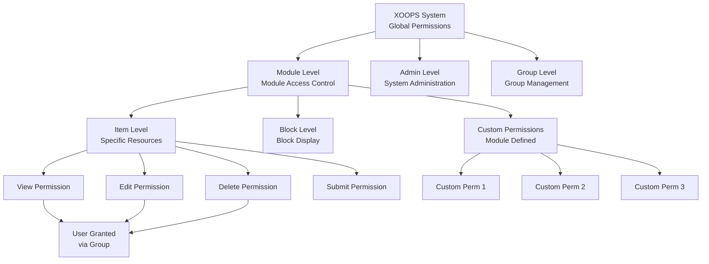
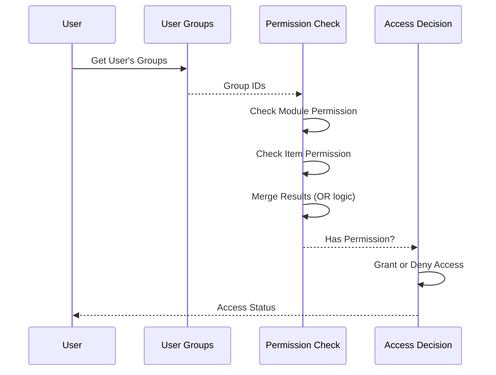

# Sistem dovoljenj v XOOPS

Sistem dovoljenj XOOPS je zdrobljen okvir za nadzor dostopa, ki upravlja, kdo lahko izvaja katera dejanja na katerih virih. Ta dokument zajema vrste dovoljenj, mehanizme preverjanja, hierarhijo in primere implementacije.

## Vrste dovoljenj

### Dovoljenja na ravni modula

Dovoljenja na ravni modula nadzorujejo dostop do celotnih modulov ali funkcij modula.

**Pogosta imena dovoljenj:**
- `module_view` - Ogled vsebine modula
- `module_read` - Preberite vire modula
- `module_submit` - Oddaj vsebino v modul
- `module_edit` - Urejanje vsebine modula
- `module_admin` - Skrbniški modul
```php
<?php
/**
 * Module permission example
 */

$permissionHandler = xoops_getHandler('groupperm');
$userGroups = $xoopsUser->getGroups();
$moduleId = 2; // Article module

// Check if user can view module
$canView = false;
foreach ($userGroups as $groupId) {
    if ($permissionHandler->checkRight('module_view', $groupId, $moduleId)) {
        $canView = true;
        break;
    }
}

if (!$canView) {
    redirect('index.php?error=no_access');
}
```
### Dovoljenja na ravni predmeta

Dovoljenja na ravni elementov nadzirajo dostop do določenih virov znotraj modula.

**Primeri:**
- ID članka: Ali lahko združim view/edit določen članek?
- ID kategorije: Ali lahko skupina dostopa do kategorije?
- ID strani: Ali lahko združim view/modify določeno stran?
```php
<?php
/**
 * Item permission example
 */

$permissionHandler = xoops_getHandler('groupperm');
$userGroups = $xoopsUser->getGroups();
$moduleId = 2;      // Article module
$articleId = 42;    // Specific article

// Check if user can edit specific article
$canEdit = false;
foreach ($userGroups as $groupId) {
    if ($permissionHandler->checkRight(
        'item_edit',
        $groupId,
        $moduleId,
        $articleId
    )) {
        $canEdit = true;
        break;
    }
}
```
### Blokiraj dovoljenja

Dovoljenja za bloke nadzirajo vidnost in interakcijo z bloki, prikazanimi na straneh.
```php
<?php
/**
 * Block permission example
 */

$permissionHandler = xoops_getHandler('groupperm');
$userGroups = $xoopsUser->getGroups();

// Check if user can view block
$blockId = 5;
$canViewBlock = false;

foreach ($userGroups as $groupId) {
    if ($permissionHandler->checkRight('block_view', $groupId, 1, $blockId)) {
        $canViewBlock = true;
        break;
    }
}
```
### Skupinska dovoljenja

Dovoljenja za nadzor upravljanja in administracije skupine.
```php
<?php
/**
 * Group management permission example
 */

$permissionHandler = xoops_getHandler('groupperm');
$userGroups = $xoopsUser->getGroups();

// Check if user can manage groups
$canManageGroups = false;
foreach ($userGroups as $groupId) {
    if ($permissionHandler->checkRight('group_admin', $groupId, 1)) {
        $canManageGroups = true;
        break;
    }
}
```
## Hierarhija dovoljenj

### Diagram strukture dovoljenj

### Veriga dedovanja dovoljenj

## Preverjanje dovoljenj

### XoopsGroupPermHandler

Razred `XoopsGroupPermHandler` ponuja metode za preverjanje in upravljanje dovoljenj.
```php
<?php
/**
 * XoopsGroupPermHandler methods
 */

class XoopsGroupPermHandler
{
    /**
     * Check if group has permission
     *
     * @param string $gperm_name Permission name
     * @param int $gperm_group_id Group ID
     * @param int $gperm_modid Module ID
     * @param int $gperm_itemid Item ID (optional)
     * @return bool Permission status
     */
    public function checkRight(
        $gperm_name,
        $gperm_group_id,
        $gperm_modid,
        $gperm_itemid = 0
    ) { }

    /**
     * Add permission to group
     *
     * @param string $gperm_name Permission name
     * @param int $gperm_group_id Group ID
     * @param int $gperm_modid Module ID
     * @param int $gperm_itemid Item ID (optional)
     * @return bool Success status
     */
    public function addRight(
        $gperm_name,
        $gperm_group_id,
        $gperm_modid,
        $gperm_itemid = 0
    ) { }

    /**
     * Remove permission from group
     *
     * @param string $gperm_name Permission name
     * @param int $gperm_group_id Group ID
     * @param int $gperm_modid Module ID
     * @param int $gperm_itemid Item ID (optional)
     * @return bool Success status
     */
    public function deleteRight(
        $gperm_name,
        $gperm_group_id,
        $gperm_modid,
        $gperm_itemid = 0
    ) { }

    /**
     * Get all permissions for group in module
     *
     * @param int $groupId Group ID
     * @param int $modId Module ID
     * @return array Permission list
     */
    public function getGroupPermissions($groupId, $modId) { }

    /**
     * Get permitted item IDs for group
     *
     * @param string $permName Permission name
     * @param int $groupId Group ID
     * @param int $modId Module ID
     * @return array Item IDs
     */
    public function getPermittedItemIds(
        $permName,
        $groupId,
        $modId
    ) { }
}
```
## Implementacija preverjanja dovoljenj

### Preverjanje dovoljenj za enega uporabnika
```php
<?php
/**
 * Permission checking utility
 */
class PermissionChecker
{
    private $permissionHandler;
    private $user;

    public function __construct(XoopsUser $user = null)
    {
        $this->permissionHandler = xoops_getHandler('groupperm');
        $this->user = $user ?? $GLOBALS['xoopsUser'] ?? null;
    }

    /**
     * Check if user has permission
     *
     * @param string $permissionName Permission name
     * @param int $moduleId Module ID
     * @param int $itemId Item ID (optional)
     * @return bool Permission status
     */
    public function hasPermission(
        string $permissionName,
        int $moduleId,
        int $itemId = 0
    ): bool
    {
        if (!$this->user instanceof XoopsUser) {
            return false;
        }

        $userGroups = $this->user->getGroups();

        foreach ($userGroups as $groupId) {
            if ($this->permissionHandler->checkRight(
                $permissionName,
                $groupId,
                $moduleId,
                $itemId
            )) {
                return true;
            }
        }

        return false;
    }

    /**
     * Require permission or deny access
     *
     * @param string $permissionName Permission name
     * @param int $moduleId Module ID
     * @param int $itemId Item ID (optional)
     * @throws Exception If permission denied
     */
    public function requirePermission(
        string $permissionName,
        int $moduleId,
        int $itemId = 0
    ): void
    {
        if (!$this->hasPermission($permissionName, $moduleId, $itemId)) {
            throw new Exception('Permission denied');
        }
    }

    /**
     * Get permitted item IDs
     *
     * @param string $permissionName Permission name
     * @param int $moduleId Module ID
     * @return array Item IDs user can access
     */
    public function getPermittedItems(
        string $permissionName,
        int $moduleId
    ): array
    {
        if (!$this->user instanceof XoopsUser) {
            return [];
        }

        $permitted = [];
        $userGroups = $this->user->getGroups();

        foreach ($userGroups as $groupId) {
            $items = $this->permissionHandler->getPermittedItemIds(
                $permissionName,
                $groupId,
                $moduleId
            );
            $permitted = array_merge($permitted, $items);
        }

        return array_unique($permitted);
    }

    /**
     * Check multiple permissions (AND logic)
     *
     * @param array $permissions Permission names
     * @param int $moduleId Module ID
     * @param int $itemId Item ID (optional)
     * @return bool All permissions granted
     */
    public function hasAllPermissions(
        array $permissions,
        int $moduleId,
        int $itemId = 0
    ): bool
    {
        foreach ($permissions as $perm) {
            if (!$this->hasPermission($perm, $moduleId, $itemId)) {
                return false;
            }
        }
        return true;
    }

    /**
     * Check multiple permissions (OR logic)
     *
     * @param array $permissions Permission names
     * @param int $moduleId Module ID
     * @param int $itemId Item ID (optional)
     * @return bool Any permission granted
     */
    public function hasAnyPermission(
        array $permissions,
        int $moduleId,
        int $itemId = 0
    ): bool
    {
        foreach ($permissions as $perm) {
            if ($this->hasPermission($perm, $moduleId, $itemId)) {
                return true;
            }
        }
        return false;
    }
}
```
### Vmesna programska oprema za dovoljenja
```php
<?php
/**
 * Permission middleware for request filtering
 */
class PermissionMiddleware
{
    private $permissionChecker;

    public function __construct(PermissionChecker $checker)
    {
        $this->permissionChecker = $checker;
    }

    /**
     * Enforce permission on request
     *
     * @param string $permissionName Permission to check
     * @param int $moduleId Module ID
     * @param int $itemId Item ID (optional)
     * @return void Halts execution on permission denied
     */
    public function enforce(
        string $permissionName,
        int $moduleId,
        int $itemId = 0
    ): void
    {
        try {
            $this->permissionChecker->requirePermission(
                $permissionName,
                $moduleId,
                $itemId
            );
        } catch (Exception $e) {
            // Log permission denial
            error_log(sprintf(
                'Permission denied: %s (User: %s, Module: %d, Item: %d)',
                $permissionName,
                $GLOBALS['xoopsUser']?->getVar('uname') ?? 'anonymous',
                $moduleId,
                $itemId
            ));

            // Send error response
            header('HTTP/1.1 403 Forbidden');
            die('Access denied');
        }
    }

    /**
     * Filter array of items by permission
     *
     * @param array $items Items to filter
     * @param string $permissionName Permission name
     * @param int $moduleId Module ID
     * @param callable $idExtractor Callback to extract ID from item
     * @return array Filtered items
     */
    public function filterByPermission(
        array $items,
        string $permissionName,
        int $moduleId,
        callable $idExtractor
    ): array
    {
        return array_filter($items, function($item) use (
            $permissionName,
            $moduleId,
            $idExtractor
        ) {
            $itemId = $idExtractor($item);
            return $this->permissionChecker->hasPermission(
                $permissionName,
                $moduleId,
                $itemId
            );
        });
    }
}
```
## Primeri praktične izvedbe

### Nadzor dostopa do modula
```php
<?php
/**
 * Module access control example
 */

// Get current module
$moduleId = $GLOBALS['xoopsModule']->getVar('mid');
$moduleDir = $GLOBALS['xoopsModule']->getVar('dirname');

// Create permission checker
$checker = new PermissionChecker();

// Check module view permission
if (!$checker->hasPermission('module_view', $moduleId)) {
    redirect('index.php?error=access_denied');
}

// Get items user can access
$permittedItems = $checker->getPermittedItems('item_view', $moduleId);

// Build query to only show permitted items
$sql = 'SELECT * FROM articles WHERE id IN (' . implode(',', $permittedItems) . ')';
```
### Primer upravljanja vsebine
```php
<?php
/**
 * Article management with permissions
 */

class ArticleManager
{
    private $permissionChecker;
    private $moduleId = 2;

    public function __construct(PermissionChecker $checker)
    {
        $this->permissionChecker = $checker;
    }

    /**
     * Get articles user can view
     *
     * @return array Article list
     */
    public function getViewableArticles(): array
    {
        $this->permissionChecker->requirePermission(
            'module_view',
            $this->moduleId
        );

        $permittedIds = $this->permissionChecker->getPermittedItems(
            'article_view',
            $this->moduleId
        );

        if (empty($permittedIds)) {
            return [];
        }

        $db = XoopsDatabaseFactory::getDatabaseConnection();
        $result = $db->query(
            'SELECT * FROM articles WHERE id IN (' .
            implode(',', $permittedIds) .
            ') AND published = 1'
        );

        $articles = [];
        while ($row = $db->fetchArray($result)) {
            $articles[] = $row;
        }

        return $articles;
    }

    /**
     * Create article with permission check
     *
     * @param array $data Article data
     * @return int Article ID
     */
    public function createArticle(array $data): int
    {
        $this->permissionChecker->requirePermission(
            'article_create',
            $this->moduleId
        );

        $db = XoopsDatabaseFactory::getDatabaseConnection();
        $db->query(
            'INSERT INTO articles (title, content, author_id, created) VALUES (?, ?, ?, ?)',
            array($data['title'], $data['content'], $_SESSION['xoopsUserId'], time())
        );

        return $db->getInsertId();
    }

    /**
     * Update article with permission check
     *
     * @param int $articleId Article ID
     * @param array $data Update data
     * @return bool Success
     */
    public function updateArticle(int $articleId, array $data): bool
    {
        $this->permissionChecker->requirePermission(
            'article_edit',
            $this->moduleId,
            $articleId
        );

        $db = XoopsDatabaseFactory::getDatabaseConnection();
        return (bool)$db->query(
            'UPDATE articles SET title = ?, content = ? WHERE id = ?',
            array($data['title'], $data['content'], $articleId)
        );
    }

    /**
     * Delete article with permission check
     *
     * @param int $articleId Article ID
     * @return bool Success
     */
    public function deleteArticle(int $articleId): bool
    {
        $this->permissionChecker->requirePermission(
            'article_delete',
            $this->moduleId,
            $articleId
        );

        $db = XoopsDatabaseFactory::getDatabaseConnection();
        return (bool)$db->query(
            'DELETE FROM articles WHERE id = ?',
            array($articleId)
        );
    }
}
```
### Preverjanje dovoljenj skrbniške plošče
```php
<?php
/**
 * Admin panel access control
 */

// Verify user is webmaster
if (!in_array(1, $xoopsUser->getGroups())) {
    redirect('index.php');
    exit;
}

$checker = new PermissionChecker();
$moduleId = $GLOBALS['xoopsModule']->getVar('mid');

// Check admin permission
$checker->requirePermission('module_admin', $moduleId);

// Load admin content
?>
<h1>Admin Panel</h1>
<p>Welcome, Administrator</p>
```
## Predpomnjenje dovoljenj

### Optimizirano preverjanje dovoljenj
```php
<?php
/**
 * Cached permission checker for performance
 */
class CachedPermissionChecker extends PermissionChecker
{
    private $cache = [];
    private $cachePrefix = 'xoops_perm_';

    /**
     * Check permission with caching
     *
     * @param string $permissionName Permission name
     * @param int $moduleId Module ID
     * @param int $itemId Item ID (optional)
     * @return bool Permission status
     */
    public function hasPermission(
        string $permissionName,
        int $moduleId,
        int $itemId = 0
    ): bool
    {
        $cacheKey = $this->getCacheKey(
            $permissionName,
            $moduleId,
            $itemId
        );

        // Check memory cache
        if (isset($this->cache[$cacheKey])) {
            return $this->cache[$cacheKey];
        }

        // Check APCu cache
        $cacheKeyFull = $this->cachePrefix . $cacheKey;
        $cached = apcu_fetch($cacheKeyFull);
        if ($cached !== false) {
            $this->cache[$cacheKey] = $cached;
            return $cached;
        }

        // Check actual permission
        $result = parent::hasPermission($permissionName, $moduleId, $itemId);

        // Cache result (1 hour TTL)
        $this->cache[$cacheKey] = $result;
        apcu_store($cacheKeyFull, $result, 3600);

        return $result;
    }

    /**
     * Generate cache key
     *
     * @param string $permissionName Permission name
     * @param int $moduleId Module ID
     * @param int $itemId Item ID
     * @return string Cache key
     */
    private function getCacheKey(
        string $permissionName,
        int $moduleId,
        int $itemId
    ): string
    {
        $uid = $this->user?->getVar('uid') ?? 0;
        return md5("{$uid}_{$permissionName}_{$moduleId}_{$itemId}");
    }

    /**
     * Clear permission cache for user
     *
     * @param int $uid User ID
     */
    public static function clearUserCache(int $uid): void
    {
        // This would need to be more sophisticated in production
        apcu_clear_cache();
    }
}
```
## Najboljše varnostne prakse

### Pravila za dodelitev dovoljenj

1. **Načelo najmanjših privilegijev**: Dodelite samo potrebna dovoljenja
2. **Dostop na podlagi vlog**: Uporabite skupine za dovoljenja na podlagi vlog
3. **Redne revizije**: Periodično pregledujte dovoljenja
4. **Ločitev dolžnosti**: Ločite skrbniška in uporabniška dovoljenja
5. **Explicit Deny**: Privzeta zavrnitev, izrecno dovoljeni pristop

### Preverjanje dovoljenj
```php
<?php
/**
 * Permission validation best practices
 */

// Always check permission before action
$moduleId = 2;
$articleId = 42;

try {
    $checker = new PermissionChecker();

    // Explicit permission check
    if (!$checker->hasPermission('article_edit', $moduleId, $articleId)) {
        throw new Exception('Insufficient permissions');
    }

    // Perform action only after permission verified
    updateArticle($articleId);

} catch (Exception $e) {
    // Log security event
    error_log('Permission denied: ' . $e->getMessage());
    // Show user-friendly error
    die('You do not have permission to perform this action');
}
```
## Sorodne povezave

- Upravljanje uporabnikov.md
- Skupina System.md
- Preverjanje pristnosti.md
- ../../Security/Security-Guidelines.md

## Oznake

#dovoljenja #nadzor dostopa #varnost #avtorizacija #acl #preverjanje dovoljenj