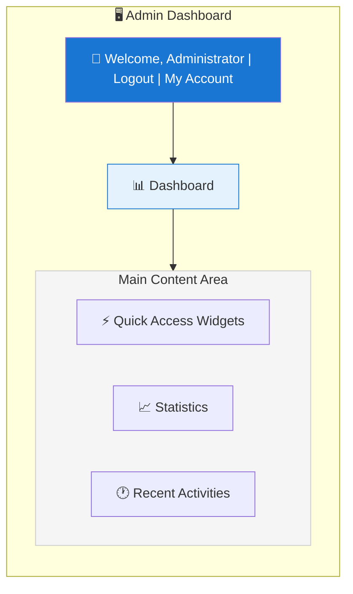
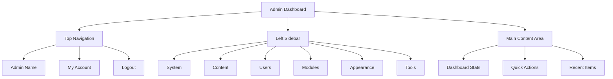

# XOOPS Pregled skrbniške plošče

Popoln vodnik za navigacijo in uporabo skrbniške nadzorne plošče XOOPS.

## Dostop do skrbniške plošče

### Admin prijava

Odprite brskalnik in se pomaknite do:
```
http://your-domain.com/xoops/admin/
```
Ali če je XOOPS v korenu:
```
http://your-domain.com/admin/
```
Vnesite skrbniške poverilnice:
```
Username: [Your admin username]
Password: [Your admin password]
```
### Po prijavi

Videli boste glavno skrbniško nadzorno ploščo:

## Postavitev skrbniške plošče

## Komponente nadzorne plošče

### Zgornja vrstica

Zgornja vrstica vsebuje bistvene kontrole:

| Element | Namen |
|---|---|
| **Administratorski logotip** | Kliknite za vrnitev na nadzorno ploščo |
| **Pozdravno sporočilo** | Prikazuje ime prijavljenega skrbnika |
| **Moj račun** | Uredi skrbniški profil in geslo |
| **Pomoč** | Dostop do dokumentacije |
| **Odjava** | Odjava iz skrbniške plošče |

### Leva navigacijska stranska vrstica

Glavni meni, organiziran po funkcijah:
```
├── System
│   ├── Dashboard
│   ├── Preferences
│   ├── Admin Users
│   ├── Groups
│   ├── Permissions
│   ├── Modules
│   └── Tools
├── Content
│   ├── Pages
│   ├── Categories
│   ├── Comments
│   └── Media Manager
├── Users
│   ├── Users
│   ├── User Requests
│   ├── Online Users
│   └── User Groups
├── Modules
│   ├── Modules
│   ├── Module Settings
│   └── Module Updates
├── Appearance
│   ├── Themes
│   ├── Templates
│   ├── Blocks
│   └── Images
└── Tools
    ├── Maintenance
    ├── Email
    ├── Statistics
    ├── Logs
    └── Backups
```
### Glavno vsebinsko področje

Prikaže informacije in kontrole za izbrani razdelek:

- Obrazci za konfiguracijo
- Podatkovne tabele s seznami
- Grafi in statistika
- Gumbi za hitro ukrepanje
- Besedilo pomoči in opisi orodij

### Pripomočki nadzorne plošče

Hiter dostop do ključnih informacij:

- **Informacije o sistemu:** različica PHP, različica MySQL, različica XOOPS
- **Hitra statistika:** Število uporabnikov, skupno število objav, nameščeni moduli
- **Nedavna dejavnost:** Zadnje prijave, spremembe vsebine, napake
- **Status strežnika:** CPU, pomnilnik, uporaba diska
- **Obvestila:** Sistemska opozorila, čakajoče posodobitve

## Osnovne skrbniške funkcije

### Upravljanje sistema

**Lokacija:** Sistem > [Različne možnosti]

#### Nastavitve

Konfigurirajte osnovne sistemske nastavitve:
```
System > Preferences > [Settings Category]
```
kategorije:
- Splošne nastavitve (ime mesta, časovni pas)
- Uporabniške nastavitve (registracija, profili)
- Nastavitve e-pošte (SMTP konfiguracija)
- Nastavitve predpomnilnika (možnosti predpomnilnika)
- URL Nastavitve (prijazni URL-ji)
- Meta oznake (SEO nastavitve)

Glejte Osnovna konfiguracija in sistemske nastavitve.

#### Skrbniški uporabniki

Upravljanje skrbniških računov:
```
System > Admin Users
```
Funkcije:
- Dodajte nove skrbnike
- Urejanje skrbniških profilov
- Spremenite skrbniška gesla
- Izbrišite skrbniške račune
- Nastavite skrbniška dovoljenja

### Upravljanje vsebine

**Lokacija:** Vsebina > [Različne možnosti]

#### Pages/Articles

Upravljanje vsebine spletnega mesta:
```
Content > Pages (or your module)
```
Funkcije:
- Ustvarite nove strani
- Uredite obstoječo vsebino
- Brisanje strani
- Publish/unpublish
- Nastavite kategorije
- Upravljajte revizije

#### Kategorije

Organizirajte vsebino:
```
Content > Categories
```
Funkcije:
- Ustvarite hierarhijo kategorij
- Uredi kategorije
- Brisanje kategorij
- Dodelite stranem

#### Komentarji

Zmerni komentarji uporabnikov:
```
Content > Comments
```
Funkcije:
- Poglej vse komentarje
- Odobri komentarje
- Uredite komentarje
- Izbriši vsiljeno pošto
- Blokiraj komentatorje

### Upravljanje uporabnikov

**Lokacija:** Uporabniki > [Različne možnosti]

#### Uporabniki

Upravljanje uporabniških računov:
```
Users > Users
```
Funkcije:
- Ogled vseh uporabnikov
- Ustvarite nove uporabnike
- Urejanje uporabniških profilov
- Brisanje računov
- Ponastavite gesla
- Spremenite status uporabnika
- Dodelite skupinam

#### Spletni uporabniki

Spremljajte aktivne uporabnike:
```
Users > Online Users
```
Oddaje:
- Trenutno spletni uporabniki
- Čas zadnje dejavnosti
- naslov IP
- Lokacija uporabnika (če je konfigurirana)

#### Uporabniške skupine

Upravljanje uporabniških vlog in dovoljenj:
```
Users > Groups
```
Funkcije:
- Ustvarite skupine po meri
- Nastavite dovoljenja skupine
- Dodelite uporabnike v skupine
- Izbriši skupine

### Upravljanje modulov

**Lokacija:** Moduli > [Različne možnosti]

#### Moduli

Namestite in konfigurirajte module:
```
Modules > Modules
```
Funkcije:
- Oglejte si nameščene module
- Enable/disable modulov
- Posodobite module
- Konfigurirajte nastavitve modula
- Namestite nove module
- Oglejte si podrobnosti modula

#### Preverite posodobitve
```
Modules > Modules > Check for Updates
```
Zasloni:
- Razpoložljive posodobitve modulov
- Dnevnik sprememb
- Možnosti prenosa in namestitve

### Upravljanje videza

**Lokacija:** Videz > [Različne možnosti]

#### Teme

Upravljanje tem spletnega mesta:
```
Appearance > Themes
```
Funkcije:
- Oglejte si nameščene teme
- Nastavite privzeto temo
- Naložite nove teme
- Brisanje tem
- Predogled teme
- Konfiguracija teme

#### Bloki

Upravljanje vsebinskih blokov:
```
Appearance > Blocks
```
Funkcije:
- Ustvarite bloke po meri
- Uredite vsebino bloka
- Razporedi bloke na strani
- Nastavite vidnost bloka
- Izbriši bloke
- Konfigurirajte predpomnjenje blokov

#### Predloge

Upravljanje predlog (napredno):
```
Appearance > Templates
```
Za napredne uporabnike in razvijalce.

### Sistemska orodja

**Lokacija:** Sistem > Orodja

#### Način vzdrževanja

Preprečite dostop uporabnika med vzdrževanjem:
```
System > Maintenance Mode
```
Konfiguriraj:
- Enable/disable vzdrževanje
- Sporočilo o vzdrževanju po meri
- Dovoljeni naslovi IP (za testiranje)

#### Upravljanje baze podatkov
```
System > Database
```
Funkcije:
- Preverite doslednost baze podatkov
- Zagon posodobitev baze podatkov
- Popravilo miz
- Optimizirajte bazo podatkov
- Izvoz strukture baze podatkov

#### Dnevniki dejavnosti
```
System > Logs
```
Monitor:
- Aktivnost uporabnika
- Upravni ukrepi
- Sistemski dogodki
- Dnevniki napak

## Hitra dejanja

Pogoste naloge, dostopne z nadzorne plošče:
```
Quick Links:
├── Create New Page
├── Add New User
├── Create Content Block
├── Upload Image
├── Send Mass Email
├── Update All Modules
└── Clear Cache
```
## Bližnjice na tipkovnici skrbniške plošče

Hitra navigacija:

| Bližnjica | Akcija |
|---|---|
| `Ctrl+H` | Pojdi na pomoč |
| `Ctrl+D` | Pojdi na nadzorno ploščo |
| `Ctrl+Q` | Hitro iskanje |
| `Ctrl+L` | Odjava |

## Upravljanje uporabniškega računa

### Moj račun

Dostopite do svojega skrbniškega profila:

1. Kliknite »Moj račun« zgoraj desno
2. Uredite informacije o profilu:
   - E-poštni naslov
   - Pravo ime
   - Informacije o uporabniku
   - Avatar

### Spremeni geslo

Spremenite skrbniško geslo:

1. Pojdite na **Moj račun**
2. Kliknite »Spremeni geslo«
3. Vnesite trenutno geslo
4. Vnesite novo geslo (dvakrat)
5. Kliknite »Shrani«

**Varnostni nasveti:**
- Uporabite močna gesla (16+ znakov)
- Vključite velike in male črke, številke, simbole
- Spremenite geslo vsakih 90 dni
- Nikoli ne delite skrbniških poverilnic

### Odjava

Odjavite se iz skrbniške plošče:

1. Kliknite "Odjava" zgoraj desno
2. Preusmerjeni boste na stran za prijavo

## Statistika skrbniške plošče

### Statistika nadzorne plošče

Hiter pregled meritev spletnega mesta:

| metrika | Vrednost |
|--------|-------|
| Uporabniki na spletu | 12 |
| Skupno število uporabnikov | 256 |
| Skupno število objav | 1.234 |
| Skupno število komentarjev | 5,678 |
| Skupaj modulov | 8 |

### Stanje sistema

Informacije o strežniku in zmogljivosti:

| Komponenta | Version/Value |
|-----------|--------------|
| XOOPS Različica | 2.5.11 |
| PHP Različica | 8.2.x |
| Različica MySQL | 8.0.x |
| Obremenitev strežnika | 0,45, 0,42 |
| Čas delovanja | 45 dni |### Nedavna dejavnost

Časovnica nedavnih dogodkov:
```
12:45 - Admin login
12:30 - New user registered
12:15 - Page published
12:00 - Comment posted
11:45 - Module updated
```
## Sistem obveščanja

### Skrbniška opozorila

Prejemanje obvestil za:

- Registracije novih uporabnikov
- Komentarji, ki čakajo na moderiranje
- Neuspeli poskusi prijave
- Sistemske napake
- Na voljo so posodobitve modulov
- Težave z bazo podatkov
- Opozorila o prostoru na disku

Konfigurirajte opozorila:

**Sistem > Nastavitve > Nastavitve e-pošte**
```
Notify Admin on Registration: Yes
Notify Admin on Comments: Yes
Notify Admin on Errors: Yes
Alert Email: admin@your-domain.com
```
## Pogosta skrbniška opravila

### Ustvari novo stran

1. Pojdite na **Vsebina > Strani** (ali ustrezen modul)
2. Kliknite »Dodaj novo stran«
3. Izpolnite:
   - Naslov
   - Vsebina
   - Opis
   - Kategorija
   - Metapodatki
4. Kliknite »Objavi«

### Upravljanje uporabnikov

1. Pojdite na **Uporabniki > Uporabniki**
2. Oglejte si seznam uporabnikov z:
   - Uporabniško ime
   - E-pošta
   - Datum registracije
   - Zadnja prijava
   - Stanje

3. Kliknite uporabniško ime za:
   - Uredi profil
   - Spremenite geslo
   - Urejanje skupin
   - Block/unblock uporabnik

### Konfigurirajte modul

1. Pojdite na **Moduli > Moduli**
2. Poiščite modul na seznamu
3. Kliknite ime modula
4. Kliknite »Nastavitve« ali »Nastavitve«
5. Konfigurirajte možnosti modula
6. Shranite spremembe

### Ustvari nov blok

1. Pojdite na **Videz > Bloki**
2. Kliknite »Dodaj nov blok«
3. Vnesite:
   - Naslov bloka
   - Blokiraj vsebino (HTML dovoljeno)
   - Položaj na strani
   - Vidnost (vse strani ali določene)
   - Modul (če obstaja)
4. Kliknite »Pošlji«

## Pomoč za skrbniško ploščo

### Vgrajena dokumentacija

Dostop do pomoči iz skrbniške plošče:

1. Kliknite gumb "Pomoč" v zgornji vrstici
2. Kontekstno občutljiva pomoč za trenutno stran
3. Povezave do dokumentacije
4. Pogosta vprašanja

### Zunanji viri

- XOOPS Uradna stran: https://XOOPS.org/
- Forum skupnosti: https://XOOPS.org/modules/newbb/
- Repozitorij modulov: https://XOOPS.org/modules/repository/
- Bugs/Issues: https://github.com/XOOPS/XoopsCore/issues## Prilagajanje skrbniške plošče

### Administratorska tema

Izberite temo skrbniškega vmesnika:

**Sistem > Nastavitve > Splošne nastavitve**
```
Admin Theme: [Select theme]
```
Razpoložljive teme:
- Privzeto (svetlo)
- Temni način
- Teme po meri

### Prilagajanje nadzorne plošče

Izberite, kateri pripomočki se prikažejo:

**Nadzorna plošča > Prilagodi**

izberite:
- Informacije o sistemu
- Statistika
- Nedavna dejavnost
- Hitre povezave
- Pripomočki po meri

## Dovoljenja skrbniške plošče

Različne skrbniške ravni imajo različna dovoljenja:

| Vloga | Zmogljivosti |
|---|---|
| **Spletni skrbnik** | Popoln dostop do vseh skrbniških funkcij |
| **Admin** | Omejene skrbniške funkcije |
| **Moderator** | Samo moderiranje vsebine |
| **Urednik** | Ustvarjanje in urejanje vsebin |

Upravljanje dovoljenj:

**Sistem > Dovoljenja**

## Najboljše varnostne prakse za skrbniško ploščo

1. **Močno geslo:** Uporabite 16+ znakovno geslo
2. **Redne spremembe:** Spremenite geslo vsakih 90 dni
3. **Nadzirajte dostop:** Redno preverjajte dnevnike "Admin Users".
4. **Omeji dostop:** Preimenuj skrbniško mapo za dodatno varnost
5. **Uporabi HTTPS:** Vedno dostopaj do skrbnika prek HTTPS
6. **Uvrstitev na seznam dovoljenih IP-jev:** Omejite skrbniški dostop na določene IP-je
7. **Navadna odjava:** Ko končate, se odjavite
8. **Varnost brskalnika:** Redno čistite predpomnilnik brskalnika

Glejte Varnostna konfiguracija.

## Skrbniška plošča za odpravljanje težav

### Ne morem dostopati do skrbniške plošče

**Rešitev:**
1. Preverite poverilnice za prijavo
2. Počistite predpomnilnik brskalnika in piškotke
3. Poskusite z drugim brskalnikom
4. Preverite, ali je pot skrbniške mape pravilna
5. Preverite dovoljenja za datoteke v skrbniški mapi
6. Preverite povezavo z bazo podatkov v mainfile.php### Prazna skrbniška stran

**Rešitev:**
```bash
# Check PHP errors
tail -f /var/log/apache2/error.log

# Enable debug mode temporarily
sed -i "s/define('XOOPS_DEBUG', 0)/define('XOOPS_DEBUG', 1)/" /var/www/html/xoops/mainfile.php

# Check file permissions
ls -la /var/www/html/xoops/admin/
```
### Počasna skrbniška plošča

**Rešitev:**
1. Počistite predpomnilnik: **Sistem > Orodja > Počisti predpomnilnik**
2. Optimizirajte zbirko podatkov: **Sistem > Zbirka podatkov > Optimiziraj**
3. Preverite vire strežnika: `htop`
4. Preglejte počasne poizvedbe v MySQL

### Modul se ne prikaže

**Rešitev:**
1. Preverite nameščen modul: **Moduli > Moduli**
2. Preverite, ali je modul omogočen
3. Preverite dodeljena dovoljenja
4. Preverite, ali obstajajo datoteke modulov
5. Preglejte dnevnike napak

## Naslednji koraki

Ko se seznanite z skrbniško ploščo:

1. Ustvarite svojo prvo stran
2. Nastavite skupine uporabnikov
3. Namestite dodatne module
4. Konfigurirajte osnovne nastavitve
5. Izvajajte varnost

---

**Oznake:** #admin-panel #dashboard #navigation #getting-started

**Povezani članki:**
- ../Configuration/Basic-Configuration
- ../Configuration/System-Settings
- Ustvarjanje-vaše-prve-strani
- Upravljanje uporabnikov
- Namestitev modulov