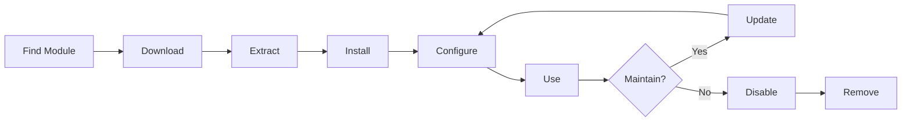

# Namestitev in upravljanje XOOPS modulov

Naučite se razširiti funkcionalnost XOOPS z namestitvijo in konfiguracijo modulov.

## Razumevanje modulov XOOPS

### Kaj so moduli?

Moduli so razširitve, ki dodajo funkcionalnost XOOPS:

| Vrsta | Namen | Primeri |
|---|---|---|
| **Vsebina** | Upravljanje posebnih vrst vsebine | Novice, Blog, Vstopnice |
| **Skupnost** | Interakcija z uporabnikom | Forum, komentarji, ocene |
| **E-trgovina** | Prodaja izdelkov | Trgovina, košarica, plačila |
| **Mediji** | Ročaj files/images | Galerija, prenosi, videi |
| **Pripomoček** | Orodja in pomočniki | E-pošta, varnostno kopiranje, analitika |

### Jedro v primerjavi z izbirnimi moduli

| Modul | Vrsta | Vključeno | Odstranljivo |
|---|---|---|---|
| **Sistem** | Jedro | Da | Ne |
| **Uporabnik** | Jedro | Da | Ne |
| **Profil** | Priporočeno | Da | Da |
| **PM (zasebno sporočilo)** | Priporočeno | Da | Da |
| **WF-kanal** | Neobvezno | Pogosto | Da |
| **Novice** | Neobvezno | Ne | Da |
| **Forum** | Neobvezno | Ne | Da |

## Življenjski cikel modula

## Iskanje modulov

### XOOPS Repozitorij modulov

Uradno skladišče modulov XOOPS:

**Obiščite:** https://XOOPS.org/modules/repository/
```
Directory > Modules > [Browse Categories]
```
Išči po kategoriji:
- Upravljanje vsebine
- Skupnost
- e-trgovina
- Multimedija
- Razvoj
- Administracija spletnega mesta

### Ocenjevanje modulov

Pred namestitvijo preverite:

| Merila | Kaj iskati |
|---|---|
| **Združljivost** | Deluje z vašo različico XOOPS |
| **Ocena** | Dobre ocene in ocene uporabnikov |
| **Posodobitve** | Nedavno vzdrževano |
| **Prenosi** | Priljubljen in pogosto uporabljen |
| **Zahteve** | Združljivo z vašim strežnikom |
| **Licenca** | GPL ali podobno odprtokodno |
| **Podpora** | Aktivni razvijalec in skupnost |

### Preberi informacije o modulu

Vsak seznam modulov prikazuje:
```
Module Name: [Name]
Version: [X.X.X]
Requires: XOOPS [Version]
Author: [Name]
Last Update: [Date]
Downloads: [Number]
Rating: [Stars]
Description: [Brief description]
Compatibility: PHP [Version], MySQL [Version]
```
## Namestitev modulov

### 1. način: Namestitev skrbniške plošče

**1. korak: dostop do razdelka modulov**

1. Prijavite se v skrbniško ploščo
2. Pomaknite se do **Moduli > Moduli**
3. Kliknite **"Namesti nov modul"** ali **"Prebrskaj module"**

**2. korak: Nalaganje modula**

Možnost A – neposredno nalaganje:
1. Kliknite **"Izberi datoteko"**
2. V računalniku izberite datoteko .zip modula
3. Kliknite **"Naloži"**

Možnost B - URL Nalaganje:
1. Prilepite modul URL
2. Kliknite **"Prenesi in namesti"**

**3. korak: Preglejte informacije o modulu**
```
Module Name: [Name shown]
Version: [Version]
Author: [Author info]
Description: [Full description]
Requirements: [PHP/MySQL versions]
```
Preglejte in kliknite **"Nadaljuj z namestitvijo"**

**Korak 4: Izberite vrsto namestitve**
```
☐ Fresh Install (New installation)
☐ Update (Upgrade existing)
☐ Delete Then Install (Replace existing)
```
Izberite ustrezno možnost.

**5. korak: Potrdite namestitev**

Pregled končne potrditve:
```
Module will be installed to: /modules/modulename/
Database: xoops_db
Proceed? [Yes] [No]
```
Za potrditev kliknite **"Da"**.

**6. korak: namestitev končana**
```
Installation successful!

Module: [Module Name]
Version: [Version]
Tables created: [Number]
Files installed: [Number]

[Go to Module Settings]  [Return to Modules]
```
### 2. način: Ročna namestitev (napredno)

Za ročno namestitev ali odpravljanje težav:

**1. korak: Prenesite modul**

1. Prenesite modul .zip iz repozitorija
2. Ekstrakt na `/var/www/html/XOOPS/modules/modulename/`
```bash
# Extract module
unzip module_name.zip
cp -r module_name /var/www/html/xoops/modules/

# Set permissions
chmod -R 755 /var/www/html/xoops/modules/module_name
```
**2. korak: Zaženite namestitveni skript**
```
Visit: http://your-domain.com/xoops/modules/module_name/admin/index.php?op=install
```
Ali prek skrbniške plošče (Sistem > Moduli > Posodobi DB).

**3. korak: Preverite namestitev**

1. Pojdite na **Moduli > Moduli** v skrbništvu
2. Na seznamu poiščite svoj modul
3. Preverite, ali je prikazano kot »Aktivno«

## Konfiguracija modula

### Nastavitve modula za dostop

1. Pojdite na **Moduli > Moduli**
2. Poiščite svoj modul
3. Kliknite ime modula
4. Kliknite **»Nastavitve«** ali **»Nastavitve«**

### Skupne nastavitve modula

Večina modulov ponuja:
```
Module Status: [Enabled/Disabled]
Display in Menu: [Yes/No]
Module Weight: [1-999] (display order)
Visible To Groups: [Checkboxes for user groups]
```
### Možnosti, specifične za modul

Vsak modul ima edinstvene nastavitve. Primeri:

**Modul z novicami:**
```
Items Per Page: 10
Show Author: Yes
Allow Comments: Yes
Moderation Required: Yes
```
**Modul foruma:**
```
Topics Per Page: 20
Posts Per Page: 15
Maximum Attachment Size: 5MB
Enable Signatures: Yes
```
**Galerijski modul:**
```
Images Per Page: 12
Thumbnail Size: 150x150
Maximum Upload: 10MB
Watermark: Yes/No
```
Preglejte dokumentacijo modula za določene možnosti.

### Shrani konfiguracijo

Po prilagoditvi nastavitev:

1. Kliknite **"Pošlji"** ali **"Shrani"**
2. Videli boste potrditev:   
```
   Settings saved successfully!
   
```
## Upravljanje blokov modulov

Številni moduli ustvarjajo "bloke" - pripomočkom podobna področja vsebine.

### Ogled blokov modulov

1. Pojdite na **Videz > Bloki**
2. Poiščite bloke iz vašega modula
3. Večina modulov prikazuje "[Ime modula] - [Opis bloka]"

### Konfigurirajte bloke

1. Kliknite ime bloka
2. Prilagodite:
   - Naslov bloka
   - Vidnost (vse strani ali določene)
   - Položaj na strani (levo, sredina, desno)
   - Skupine uporabnikov, ki lahko vidijo
3. Kliknite **»Pošlji«**

### Prikaži blok na domači strani

1. Pojdite na **Videz > Bloki**
2. Poiščite blok, ki ga želite
3. Kliknite **"Uredi"**
4. Nastavite:
   - **Vidno:** Izberite skupine
   - **Položaj:** Izberite stolpec (left/center/right)
   - **Strani:** Domača stran ali vse strani
5. Kliknite **"Pošlji"**

## Nameščanje posebnih primerov modulov

### Namestitev modula News

**Popoln za:** objave v spletnem dnevniku, objave

1. Prenesite modul Novice iz repozitorija
2. Naložite prek **Moduli > Moduli > Namestitev**
3. Konfigurirajte v **Moduli > Novice > Nastavitve**:
   - Zgodbe na stran: 10
   - Dovoli komentarje: Da
   - Odobri pred objavo: Da
4. Ustvarite bloke za najnovejše novice
5. Začnite objavljati zgodbe!

### Namestitev forumskega modula

**Popoln za:** razprave v skupnosti

1. Prenesite modul Forum
2. Namestite prek skrbniške plošče
3. Ustvarite kategorije forumov v modulu
4. Konfigurirajte nastavitve:
   - Topics/page: 20
   - Posts/page: 15
   - Omogoči moderiranje: Da
5. Dodelite dovoljenja uporabniškim skupinam
6. Ustvarite bloke za najnovejše teme### Namestitev galerijskega modula

**Popoln za:** Predstavitev slik

1. Prenesite modul Galerija
2. Namestite in konfigurirajte
3. Ustvarite foto albume
4. Naložite slike
5. Nastavite dovoljenja za viewing/uploading
6. Prikaz galerije na spletni strani

## Posodabljanje modulov

### Preverite posodobitve
```
Admin Panel > Modules > Modules > Check for Updates
```
To kaže:
- Razpoložljive posodobitve modulov
- Trenutna v primerjavi z novo različico
- Changelog/release opombe

### Posodobite modul

1. Pojdite na **Moduli > Moduli**
2. Kliknite modul z razpoložljivo posodobitvijo
3. Kliknite gumb **"Posodobi"**
4. Izberite **»Posodobi« med vrsto namestitve**
5. Sledite čarovniku za namestitev
6. Modul posodobljen!

### Pomembne opombe o posodobitvi

Pred posodobitvijo:

- [ ] Varnostna baza podatkov
- [ ] Varnostne kopije datotek modula
- [ ] Pregled dnevnika sprememb
- [ ] Najprej preizkusite na uprizoritvenem strežniku
- [ ] Upoštevajte vse spremembe po meri

Po posodobitvi:
- [ ] Preverite delovanje
- [ ] Preverite nastavitve modula
- [ ] Ocena za warnings/errors
- [ ] Počisti predpomnilnik

## Dovoljenja modula

### Dodelitev dostopa uporabniške skupine

Nadzirajte, katere skupine uporabnikov lahko dostopajo do modulov:

**Lokacija:** Sistem > Dovoljenja

Za vsak modul konfigurirajte:
```
Module: [Module Name]

Admin Access: [Select groups]
User Access: [Select groups]
Read Permission: [Groups allowed to view]
Write Permission: [Groups allowed to post]
Delete Permission: [Administrators only]
```
### Skupne ravni dovoljenj
```
Public Content (News, Pages):
├── Admin Access: Webmaster
├── User Access: All logged-in users
└── Read Permission: Everyone

Community Features (Forum, Comments):
├── Admin Access: Webmaster, Moderators
├── User Access: All logged-in users
└── Write Permission: All logged-in users

Admin Tools:
├── Admin Access: Webmaster only
└── User Access: Disabled
```
## Onemogočanje in odstranjevanje modulov

### Onemogoči modul (ohrani datoteke)

Obdrži modul, vendar ga skrij s strani:

1. Pojdite na **Moduli > Moduli**
2. Poiščite modul
3. Kliknite ime modula
4. Kliknite **»Onemogoči«** ali nastavite status na Neaktivno
5. Modul je skrit, vendar podatki ohranjeni

Kadar koli znova omogočite:
1. Kliknite modul
2. Kliknite **"Omogoči"**

### Popolnoma odstranite modul

Izbrišite modul in njegove podatke:

1. Pojdite na **Moduli > Moduli**
2. Poiščite modul
3. Kliknite **»Odstrani«** ali **»Izbriši«**
4. Potrdite: "Izbriši modul in vse podatke?"
5. Za potrditev kliknite **"Da"**

**Opozorilo:** Odstranitev izbriše vse podatke modula!

### Ponovna namestitev po odstranitvi

Če odstranite modul:
- Datoteke modula so izbrisane
- Tabele baze podatkov izbrisane
- Vsi podatki izgubljeni
- Za ponovno uporabo morate znova namestiti
- Lahko obnovi iz varnostne kopije

## Odpravljanje težav z namestitvijo modula

### Modul se po namestitvi ne prikaže

**Simptom:** Modul je naveden, vendar ni viden na mestu

**Rešitev:**
```
1. Check module is "Active" (Modules > Modules)
2. Enable module blocks (Appearance > Blocks)
3. Verify user permissions (System > Permissions)
4. Clear cache (System > Tools > Clear Cache)
5. Check .htaccess doesn't block module
```
### Napaka pri namestitvi: "Tabela že obstaja"

**Simptom:** Napaka med namestitvijo modula

**Rešitev:**
```
1. Module partially installed before
2. Try "Delete then Install" option
3. Or uninstall first, then install fresh
4. Check database for existing tables:
   mysql> SHOW TABLES LIKE 'xoops_module%';
```
### Manjkajoče odvisnosti modula

**Simptom:** Modul se ne namesti - zahteva drug modul

**Rešitev:**
```
1. Note required modules from error message
2. Install required modules first
3. Then install the module
4. Install in correct order
```
### Prazna stran pri dostopu do modula

**Simptom:** Modul se naloži, vendar ne prikaže ničesar

**Rešitev:**
```
1. Enable debug mode in mainfile.php:
   define('XOOPS_DEBUG', 1);

2. Check PHP error log:
   tail -f /var/log/php_errors.log

3. Verify file permissions:
   chmod -R 755 /var/www/html/xoops/modules/modulename

4. Check database connection in module config

5. Disable module and reinstall
```
### Spletno mesto za prekinitve modulov

**Simptom:** Namestitev modula prekine spletno mesto

**Rešitev:**
```
1. Disable the problematic module immediately:
   Admin > Modules > [Module] > Disable

2. Clear cache:
   rm -rf /var/www/html/xoops/cache/*
   rm -rf /var/www/html/xoops/templates_c/*

3. Restore from backup if needed

4. Check error logs for root cause

5. Contact module developer
```
## Varnostni vidiki modula

### Namestite samo iz zaupanja vrednih virov
```
✓ Official XOOPS Repository
✓ GitHub official XOOPS modules
✓ Trusted module developers
✗ Unknown websites
✗ Unverified sources
```
### Preverite dovoljenja modula

Po namestitvi:

1. Preglejte kodo modula za sumljivo dejavnost
2. Preverite tabele baze podatkov za anomalije
3. Spremljajte spremembe datotek
4. Module posodabljajte
5. Odstranite neuporabljene module

### Najboljša praksa za dovoljenja
```
Module directory: 755 (readable, not writable by web server)
Module files: 644 (readable only)
Module data: Protected by database
```
## Viri za razvoj modulov

### Naučite se razvoja modulov

- Uradna dokumentacija: https://XOOPS.org/
- Repozitorij GitHub: https://github.com/XOOPS/
- Forum skupnosti: https://XOOPS.org/modules/newbb/
- Priročnik za razvijalce: na voljo v mapi z dokumenti

## Najboljše prakse za module

1. **Namesti eno za drugo:** Spremljajte spore
2. **Preizkusite po namestitvi:** Preverite delovanje
3. **Dokumentirajte konfiguracijo po meri:** Zapomnite si svoje nastavitve
4. **Posodabljajte:** Takoj namestite posodobitve modulov
5. **Odstrani neuporabljeno:** Izbrišite module, ki niso potrebni
6. **Izdelajte varnostno kopijo pred:** Pred namestitvijo vedno naredite varnostno kopijo
7. **Preberite dokumentacijo:** Preverite navodila za modul
8. **Pridružite se skupnosti:** Po potrebi prosite za pomoč

## Kontrolni seznam za namestitev modula

Za vsako namestitev modula:

- [ ] Raziščite in preberite ocene
- [ ] Preverite združljivost različice XOOPS
- [ ] Varnostna kopija baze podatkov in datotek
- [ ] Prenesite najnovejšo različico
- [ ] Namestite prek skrbniške plošče
- [ ] Konfigurirajte nastavitve
- [ ] Create/position bloki
- [ ] Nastavite uporabniška dovoljenja
- [ ] Preizkusite funkcionalnost
- [ ] Konfiguracija dokumenta
- [ ] Razpored za posodobitve

## Naslednji koraki

Po namestitvi modulov:

1. Ustvarite vsebino za module
2. Nastavite skupine uporabnikov
3. Raziščite skrbniške funkcije
4. Optimizirajte delovanje
5. Po potrebi namestite dodatne module---

**Oznake:** #moduli #namestitev #upravljanje #razširitev

**Povezani članki:**
- Pregled skrbniške plošče
- Upravljanje uporabnikov
- Ustvarjanje-vaše-prve-strani
- ../Configuration/System-Settings