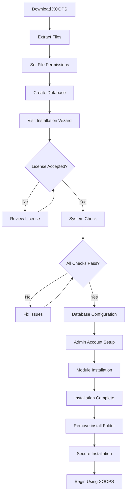

# Complete XOOPS Vodič za namestitev

Ta priročnik ponuja obsežen potek za namestitev XOOPS od začetka s čarovnikom za namestitev.

## Predpogoji

Pred začetkom namestitve se prepričajte, da imate:

- Dostop do vašega spletnega strežnika prek FTP ali SSH
- Skrbniški dostop do vašega strežnika baze podatkov
- Registrirano ime domene
– Zahteve strežnika so preverjene
- Na voljo so orodja za varnostno kopiranje

## Postopek namestitve

## Namestitev po korakih

### 1. korak: Prenesite XOOPS

Prenesite najnovejšo različico iz [https://XOOPS.org/](https://XOOPS.org/):
```bash
# Using wget
wget https://xoops.org/download/xoops-2.5.8.zip

# Using curl
curl -O https://xoops.org/download/xoops-2.5.8.zip
```
### 2. korak: Ekstrahirajte datoteke

Ekstrahirajte arhiv XOOPS v svoj spletni koren:
```bash
# Navigate to web root
cd /var/www/html

# Extract XOOPS
unzip xoops-2.5.8.zip

# Rename folder (optional, but recommended)
mv xoops-2.5.8 xoops
cd xoops
```
### 3. korak: Nastavite dovoljenja za datoteke

Nastavite ustrezna dovoljenja za XOOPS imenikov:
```bash
# Make directories writable (755 for dirs, 644 for files)
find . -type d -exec chmod 755 {} \;
find . -type f -exec chmod 644 {} \;

# Make specific directories writable by web server
chmod 777 uploads/
chmod 777 templates_c/
chmod 777 var/
chmod 777 cache/

# Secure mainfile.php after installation
chmod 644 mainfile.php
```
### 4. korak: Ustvarite bazo podatkov

Ustvarite novo bazo podatkov za XOOPS z uporabo MySQL:
```sql
-- Create database
CREATE DATABASE xoops_db CHARACTER SET utf8mb4 COLLATE utf8mb4_unicode_ci;

-- Create user
CREATE USER 'xoops_user'@'localhost' IDENTIFIED BY 'secure_password_here';

-- Grant privileges
GRANT ALL PRIVILEGES ON xoops_db.* TO 'xoops_user'@'localhost';
FLUSH PRIVILEGES;
```
Ali z uporabo phpMyAdmin:

1. Prijavite se v phpMyAdmin
2. Kliknite zavihek "Baze podatkov".
3. Vnesite ime baze podatkov: `xoops_db`
4. Izberite zbiranje "utf8mb4_unicode_ci".
5. Kliknite »Ustvari«
6. Ustvarite uporabnika z enakim imenom kot baza podatkov
7. Dodelite vse privilegije

### 5. korak: Zaženite čarovnika za namestitev

Odprite brskalnik in se pomaknite do:
```
http://your-domain.com/xoops/install/
```
#### Faza preverjanja sistema

Čarovnik preveri konfiguracijo vašega strežnika:

- PHP različica >= 5.6.0
- MySQL/MariaDB na voljo
- Zahtevane razširitve PHP (GD, PDO itd.)
- Dovoljenja imenika
- Povezljivost baze podatkov

**Če preverjanja ne uspejo:**

Za rešitve glejte razdelek #Common-Installation-Issues.

#### Konfiguracija baze podatkov

Vnesite poverilnice vaše zbirke podatkov:
```
Database Host: localhost
Database Name: xoops_db
Database User: xoops_user
Database Password: [your_secure_password]
Table Prefix: xoops_
```
**Pomembne opombe:**
- Če se vaš gostitelj baze podatkov razlikuje od lokalnega gostitelja (npr. oddaljeni strežnik), vnesite pravilno ime gostitelja
- Predpona tabele pomaga pri izvajanju več XOOPS primerkov v eni bazi podatkov
- Uporabite močno geslo z mešanimi velikimi in malimi črkami, številkami in simboli

#### Nastavitev skrbniškega računa

Ustvarite svoj skrbniški račun:
```
Admin Username: admin (or choose custom)
Admin Email: admin@your-domain.com
Admin Password: [strong_unique_password]
Confirm Password: [repeat_password]
```
**Najboljše prakse:**
- Uporabite edinstveno uporabniško ime, ne "admin"
- Uporabite geslo s 16+ znaki
- Shranite poverilnice v varnem upravitelju gesel
- Nikoli ne delite skrbniških poverilnic

#### Namestitev modula

Izberite privzete module za namestitev:

- **Sistemski modul** (zahtevan) - Osnovna funkcionalnost XOOPS
- **Uporabniški modul** (obvezno) - Upravljanje uporabnikov
- **Profilni modul** (priporočeno) - Uporabniški profili
- **Modul PM (zasebno sporočilo)** (priporočeno) - Interno sporočanje
- **WF-Channel Module** (izbirno) - Upravljanje vsebine

Izberite vse priporočene module za popolno namestitev.

### 6. korak: Dokončajte namestitev

Po vseh korakih boste videli potrditveni zaslon:
```
Installation Complete!

Your XOOPS installation is ready to use.
Admin Panel: http://your-domain.com/xoops/admin/
User Panel: http://your-domain.com/xoops/
```
### 7. korak: Zavarujte svojo namestitev

#### Odstrani namestitveno mapo
```bash
# Remove the install directory (CRITICAL for security)
rm -rf /var/www/html/xoops/install/

# Or rename it
mv /var/www/html/xoops/install/ /var/www/html/xoops/install.bak
```
**WARNING:** Nikoli ne pustite namestitvene mape dostopne v produkciji!

#### Varna glavna datoteka.php
```bash
# Make mainfile.php read-only
chmod 644 /var/www/html/xoops/mainfile.php

# Set ownership
chown www-data:www-data /var/www/html/xoops/mainfile.php
```
#### Nastavite ustrezna dovoljenja za datoteke
```bash
# Recommended production permissions
find . -type f -name "*.php" -exec chmod 644 {} \;
find . -type d -exec chmod 755 {} \;

# Writable directories for web server
chmod 777 uploads/ var/ cache/ templates_c/
```
#### Omogoči HTTPS/SSL

Konfigurirajte SSL v svojem spletnem strežniku (nginx ali Apache).

**Za Apache:**
```apache
<VirtualHost *:443>
    ServerName your-domain.com
    DocumentRoot /var/www/html/xoops

    SSLEngine on
    SSLCertificateFile /etc/ssl/certs/your-cert.crt
    SSLCertificateKeyFile /etc/ssl/private/your-key.key

    # Force HTTPS redirect
    <IfModule mod_rewrite.c>
        RewriteEngine On
        RewriteCond %{HTTPS} off
        RewriteRule ^(.*)$ https://%{HTTP_HOST}%{REQUEST_URI} [L,R=301]
    </IfModule>
</VirtualHost>
```
## Konfiguracija po namestitvi

### 1. Dostop do skrbniške plošče

Pomaknite se do:
```
http://your-domain.com/xoops/admin/
```
Prijavite se s skrbniškimi poverilnicami.

### 2. Konfigurirajte osnovne nastavitve

Konfigurirajte naslednje:

- Ime in opis mesta
- E-poštni naslov skrbnika
- Časovni pas in oblika datuma
- Optimizacija iskalnikov

### 3. Preskusna namestitev

- [ ] Obiščite domačo stran
- [ ] Preverite obremenitev modulov
- [ ] Preverite, ali registracija uporabnika deluje
- [ ] Preizkus funkcij skrbniške plošče
- [ ] Potrdi SSL/HTTPS deluje

### 4. Načrtujte varnostne kopije

Nastavite samodejno varnostno kopiranje:
```bash
# Create backup script (backup.sh)
#!/bin/bash
DATE=$(date +%Y%m%d_%H%M%S)
BACKUP_DIR="/backups/xoops"
XOOPS_DIR="/var/www/html/xoops"

# Backup database
mysqldump -u xoops_user -p[password] xoops_db > $BACKUP_DIR/db_$DATE.sql

# Backup files
tar -czf $BACKUP_DIR/files_$DATE.tar.gz $XOOPS_DIR

echo "Backup completed: $DATE"
```
Urnik s cronom:
```bash
# Daily backup at 2 AM
0 2 * * * /usr/local/bin/backup.sh
```
## Pogoste težave pri namestitvi

### Težava: Napake pri zavrnitvi dovoljenja

**Simptom:** »Dovoljenje zavrnjeno« pri nalaganju ali ustvarjanju datotek

**Rešitev:**
```bash
# Check web server user
ps aux | grep apache  # For Apache
ps aux | grep nginx   # For Nginx

# Fix permissions (replace www-data with your web server user)
chown -R www-data:www-data /var/www/html/xoops
chmod -R 755 /var/www/html/xoops
chmod 777 uploads/ var/ cache/ templates_c/
```
### Težava: Povezava z bazo podatkov ni uspela

**Simptom:** "Ni mogoče vzpostaviti povezave s strežnikom baze podatkov"

**Rešitev:**
1. Preverite poverilnice baze podatkov v čarovniku za namestitev
2. Preverite, ali se MySQL/MariaDB izvaja:   
```bash
   service mysql status  # or mariadb
   ```3. Preverite, ali zbirka podatkov obstaja:   
```sql
   SHOW DATABASES;
   ```4. Preizkusite povezavo iz ukazne vrstice:   
```bash
   mysql -h localhost -u xoops_user -p xoops_db
   
```
### Težava: Prazen bel zaslon

**Simptom:** Ob obisku XOOPS se prikaže prazna stran

**Rešitev:**
1. Preverite dnevnike napak PHP:   
```bash
   tail -f /var/log/apache2/error.log
   ```2. Omogočite način za odpravljanje napak v mainfile.php:   
```php
   define('XOOPS_DEBUG', 1);
   ```3. Preverite dovoljenja za datoteko mainfile.php and config files
4. Preverite, ali je nameščena razširitev PHP-MySQL

### Težava: ni mogoče pisati v imenik nalaganja

**Simptom:** Funkcija nalaganja ne uspe, "Ne morem pisati v nalaganja/"

**Rešitev:**
```bash
# Check current permissions
ls -la uploads/

# Fix permissions
chmod 777 uploads/
chown www-data:www-data uploads/

# For specific files
chmod 644 uploads/*
```
### Težava: PHP Manjkajoče razširitve

**Simptom:** Sistemsko preverjanje ne uspe zaradi manjkajočih razširitev (GD, MySQL itd.)

**Rešitev (Ubuntu/Debian):**
```bash
# Install PHP GD library
apt-get install php-gd

# Install PHP MySQL support
apt-get install php-mysql

# Restart web server
systemctl restart apache2  # or nginx
```
**Rešitev (CentOS/RHEL):**
```bash
# Install PHP GD library
yum install php-gd

# Install PHP MySQL support
yum install php-mysql

# Restart web server
systemctl restart httpd
```
### Težava: Počasen postopek namestitve

**Simptom:** Čarovnik za namestitev poteče ali deluje zelo počasi

**Rešitev:**
1. Povečajte PHP časovno omejitev v php.ini:   
```ini
   max_execution_time = 300  # 5 minutes
   ```2. Povečajte MySQL max_allowed_packet:   
```sql
   SET GLOBAL max_allowed_packet = 256M;
   ```3. Preverite vire strežnika:   
```bash
   free -h  # Check RAM
   df -h    # Check disk space
   
```
### Težava: skrbniška plošča ni dostopna

**Simptom:** Po namestitvi ni mogoče dostopati do skrbniške plošče

**Rešitev:**
1. Preverite, ali skrbniški uporabnik obstaja v bazi podatkov:   
```sql
   SELECT * FROM xoops_users WHERE uid = 1;
   ```2. Počistite predpomnilnik brskalnika in piškotke
3. Preverite, ali je v mapo sej mogoče zapisovati:   
```bash
   chmod 777 var/
   ```4. Preverite, ali pravila htaccess ne blokirajo skrbniškega dostopa

## Kontrolni seznam za preverjanje

Po namestitvi preverite:

- [x] XOOPS se domača stran pravilno naloži
- [x] Administratorska plošča je dostopna na /XOOPS/admin/
- [x] SSL/HTTPS deluje
- [x] Namestitvena mapa je odstranjena ali nedostopna
- [x] Dovoljenja za datoteke so varna (644 za datoteke, 755 za imenike)
- [x] Varnostne kopije baze podatkov so načrtovane
- [x] Moduli se nalagajo brez napak
- [x] Sistem registracije uporabnikov deluje
- [x] Funkcija nalaganja datotek deluje
- [x] E-poštna obvestila so pravilno poslana

## Naslednji koraki

Ko je namestitev končana:

1. Preberite vodič za osnovno konfiguracijo
2. Zavarujte svojo namestitev
3. Raziščite skrbniško ploščo
4. Namestite dodatne module
5. Nastavite uporabniške skupine in dovoljenja

---

**Oznake:** #namestitev #nastavitev #začetek #odpravljanje težav

**Povezani članki:**
- Strežniške zahteve
- Nadgradnja-XOOPS
- ../Configuration/Security-Configuration