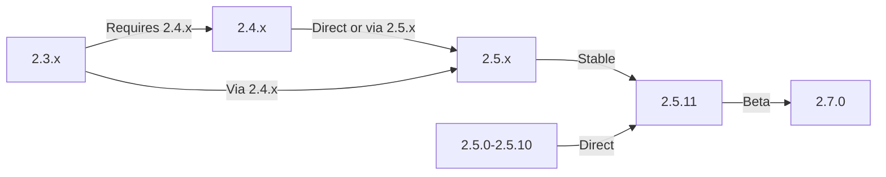

Ta priročnik pokriva nadgradnjo XOOPS s starejših različic na najnovejšo izdajo, hkrati pa ohranja vaše podatke in prilagoditve.

> **Informacije o različici**
> - **Stabilno:** XOOPS 2.5.11
> - **Beta:** XOOPS 2.7.0 (testiranje)
> - **Prihodnost:** XOOPS 4.0 (v razvoju - glejte Načrt)

## Kontrolni seznam pred nadgradnjo

Pred začetkom nadgradnje preverite:

- [ ] Dokumentirana trenutna različica XOOPS
- [ ] Identificirana ciljna različica XOOPS
- [ ] Varnostno kopiranje celotnega sistema je končano
- [ ] Preverjena varnostna kopija baze podatkov
- [ ] Seznam nameščenih modulov je zabeležen
- [ ] Dokumentirane spremembe po meri
- [ ] Testno okolje je na voljo
- [ ] Pot nadgradnje je potrjena (nekatere različice preskočijo vmesne izdaje)
- [ ] Viri strežnika preverjeni (dovolj prostora na disku, pomnilnik)
- [ ] Način vzdrževanja omogočen

## Vodnik po poti nadgradnje

Različne poti nadgradnje glede na trenutno različico:

**Pomembno:** Nikoli ne preskočite večjih različic. Če nadgrajujete z 2.3.x, najprej nadgradite na 2.4.x, nato na 2.5.x.

## 1. korak: dokončajte varnostno kopijo sistema

### Varnostna kopija baze podatkov

Uporabite mysqldump to backup the database:
```bash
# Full database backup
mysqldump -u xoops_user -p xoops_db > /backups/xoops_db_backup_$(date +%Y%m%d_%H%M%S).sql

# Compressed backup
mysqldump -u xoops_user -p xoops_db | gzip > /backups/xoops_db_backup_$(date +%Y%m%d_%H%M%S).sql.gz
```
Ali z uporabo phpMyAdmin:

1. Izberite svojo bazo podatkov XOOPS
2. Kliknite zavihek "Izvozi".
3. Izberite obliko "SQL".
4. Izberite "Shrani kot datoteko"
5. Kliknite »Pojdi«

Preverite varnostno kopijo datoteke:
```bash
# Check backup size
ls -lh /backups/xoops_db_backup*.sql

# Verify backup integrity (uncompressed)
head -20 /backups/xoops_db_backup_*.sql

# Verify compressed backup
zcat /backups/xoops_db_backup_*.sql.gz | head -20
```
### Varnostno kopiranje datotečnega sistema

Varnostno kopirajte vse XOOPS datotek:
```bash
# Compressed file backup
tar -czf /backups/xoops_files_$(date +%Y%m%d_%H%M%S).tar.gz /var/www/html/xoops

# Uncompressed (faster, requires more disk space)
tar -cf /backups/xoops_files_$(date +%Y%m%d_%H%M%S).tar /var/www/html/xoops

# Show backup progress
tar -czf /backups/xoops_files_$(date +%Y%m%d_%H%M%S).tar.gz --verbose /var/www/html/xoops | tail
```
Varno shranite varnostne kopije:
```bash
# Secure backup storage
chmod 600 /backups/xoops_*
ls -lah /backups/

# Optional: Copy to remote storage
scp /backups/xoops_* user@backup-server:/secure/backups/
```
### Preizkusite obnovitev varnostne kopije

**CRITICAL:** Vedno preverite delovanje varnostne kopije:
```bash
# Verify tar archive contents
tar -tzf /backups/xoops_files_*.tar.gz | head -20

# Extract to test location
mkdir /tmp/restore_test
cd /tmp/restore_test
tar -xzf /backups/xoops_files_*.tar.gz

# Verify key files exist
ls -la xoops/mainfile.php
ls -la xoops/install/
```
## 2. korak: Omogočite način vzdrževanja

Preprečite uporabnikom dostop do spletnega mesta med nadgradnjo:

### 1. možnost: XOOPS skrbniška plošča

1. Prijavite se v skrbniško ploščo
2. Pojdite na Sistem > Vzdrževanje
3. Omogočite "Način vzdrževanja spletnega mesta"
4. Nastavite sporočilo o vzdrževanju
5. Shrani

### 2. možnost: način ročnega vzdrževanja

Ustvarite vzdrževalno datoteko v spletnem korenu:
```html
<!-- /var/www/html/maintenance.html -->
<!DOCTYPE html>
<html>
<head>
    <title>Under Maintenance</title>
    <style>
        body { font-family: Arial; text-align: center; padding: 50px; }
        h1 { color: #333; }
        p { color: #666; margin: 20px 0; }
    </style>
</head>
<body>
    <h1>Site Under Maintenance</h1>
    <p>We're currently upgrading our site.</p>
    <p>Expected time: approximately 30 minutes.</p>
    <p>Thank you for your patience!</p>
</body>
</html>
```
Konfigurirajte Apache za prikaz vzdrževalne strani:
```apache
# In .htaccess or vhost config
ErrorDocument 503 /maintenance.html

# Redirect all traffic to maintenance page
<IfModule mod_rewrite.c>
    RewriteEngine On
    RewriteCond %{REMOTE_ADDR} !^192\.168\.1\.100$  # Your IP
    RewriteRule ^(.*)$ - [R=503,L]
</IfModule>
```
## 3. korak: Prenesite novo različico

Prenesite XOOPS z uradne strani:
```bash
# Download latest version
cd /tmp
wget https://xoops.org/download/xoops-2.5.8.zip

# Verify checksum (if provided)
sha256sum xoops-2.5.8.zip
# Compare with official SHA256 hash

# Extract to temporary location
unzip xoops-2.5.8.zip
cd xoops-2.5.8
```
## 4. korak: Priprava datoteke pred nadgradnjo

### Prepoznajte spremembe po meri

Preverite prilagojene osnovne datoteke:
```bash
# Look for modified files (files with newer mtime)
find /var/www/html/xoops -type f -newer /var/www/html/xoops/install.php

# Check for custom themes
ls /var/www/html/xoops/themes/
# Note any custom themes

# Check for custom modules
ls /var/www/html/xoops/modules/
# Note any custom modules created by you
```
### Trenutno stanje dokumenta

Ustvarite poročilo o nadgradnji:
```bash
cat > /tmp/upgrade_report.txt << EOF
=== XOOPS Upgrade Report ===
Date: $(date)
Current Version: 2.5.6
Target Version: 2.5.8

=== Installed Modules ===
$(ls /var/www/html/xoops/modules/)

=== Custom Modifications ===
[Document any custom theme or module modifications]

=== Themes ===
$(ls /var/www/html/xoops/themes/)

=== Plugin Status ===
[List any custom code modifications]

EOF
```
## 5. korak: Združite nove datoteke s trenutno namestitvijo

### Strategija: ohranite datoteke po meri

Zamenjajte osnovne datoteke XOOPS, vendar ohranite:
- `mainfile.php` (konfiguracija vaše zbirke podatkov)
- Teme po meri v `themes/`
- Moduli po meri v `modules/`
- Uporabniški prenosi v `uploads/`
- Podatki o mestu v `var/`

### Ročni postopek spajanja
```bash
# Set variables
XOOPS_OLD="/var/www/html/xoops"
XOOPS_NEW="/tmp/xoops-2.5.8"
BACKUP="/backups/pre-upgrade"

# Create pre-upgrade backup in place
mkdir -p $BACKUP
cp -r $XOOPS_OLD/* $BACKUP/

# Copy new files (but preserve sensitive files)
# Copy everything except protected directories
rsync -av --exclude='mainfile.php' \
    --exclude='modules/custom*' \
    --exclude='themes/custom*' \
    --exclude='uploads' \
    --exclude='var' \
    --exclude='cache' \
    --exclude='templates_c' \
    $XOOPS_NEW/ $XOOPS_OLD/

# Verify critical files preserved
ls -la $XOOPS_OLD/mainfile.php
```
### Uporaba nadgradnje.php (If Available)

Nekatere različice XOOPS vključujejo samodejni skript za nadgradnjo:
```bash
# Copy new files with installer
cp -r /tmp/xoops-2.5.8/* /var/www/html/xoops/

# Run upgrade wizard
# Visit: http://your-domain.com/xoops/upgrade/
```
### Dovoljenja za datoteke po spajanju

Obnovi ustrezna dovoljenja:
```bash
# Set ownership
chown -R www-data:www-data /var/www/html/xoops

# Set directory permissions
find /var/www/html/xoops -type d -exec chmod 755 {} \;

# Set file permissions
find /var/www/html/xoops -type f -exec chmod 644 {} \;

# Make writable directories
chmod 777 /var/www/html/xoops/cache
chmod 777 /var/www/html/xoops/templates_c
chmod 777 /var/www/html/xoops/uploads
chmod 777 /var/www/html/xoops/var

# Secure mainfile.php
chmod 644 /var/www/html/xoops/mainfile.php
```
## 6. korak: Selitev baze podatkov

### Preglejte spremembe zbirke podatkov

Preverite XOOPS opombe ob izdaji za spremembe strukture baze podatkov:
```bash
# Extract and review SQL migration files
find /tmp/xoops-2.5.8 -name "*.sql" -type f
# Document all .sql files found
```
### Zaženi posodobitve baze podatkov

### 1. možnost: samodejna posodobitev (če je na voljo)

Uporabite skrbniško ploščo:

1. Prijavite se v admin
2. Pojdite na **Sistem > Zbirka podatkov**
3. Kliknite »Preveri posodobitve«
4. Preglejte čakajoče spremembe
5. Kliknite "Uporabi posodobitve"

### Možnost 2: Ročne posodobitve baze podatkov

Izvedite selitev SQL datotek:
```bash
# Connect to database
mysql -u xoops_user -p xoops_db

# View pending changes (varies by version)
SELECT * FROM xoops_config WHERE conf_name LIKE '%version%';

# Run migration scripts manually if needed
SOURCE /tmp/xoops-2.5.8/migrate_2.5.6_to_2.5.8.sql;
```
### Preverjanje baze podatkov

Po posodobitvi preverite celovitost baze podatkov:
```sql
-- Check database consistency
REPAIR TABLE xoops_users;
OPTIMIZE TABLE xoops_users;

-- Verify key tables exist
SHOW TABLES LIKE 'xoops_%';

-- Check row counts (should increase or stay same)
SELECT COUNT(*) FROM xoops_users;
SELECT COUNT(*) FROM xoops_posts;
```
## 7. korak: Preverite nadgradnjo

### Preverjanje domače strani

Obiščite svojo domačo stran XOOPS:
```
http://your-domain.com/xoops/
```
Pričakovano: stran se naloži brez napak, pravilno se prikaže

### Preverjanje skrbniške plošče

Dostop do skrbnika:
```
http://your-domain.com/xoops/admin/
```
Preverite:
- [ ] Naloži se skrbniška plošča
- [ ] Navigacija deluje
- [ ] Nadzorna plošča se pravilno prikazuje
- [ ] V dnevnikih ni napak baze podatkov

### Preverjanje modula

Preverite nameščene module:

1. Pojdite na **Moduli > Moduli** v skrbništvu
2. Preverite, ali so vsi moduli še nameščeni
3. Preverite morebitna sporočila o napakah
4. Omogočite vse module, ki so bili onemogočeni

### Preverjanje dnevniške datoteke

Preglejte sistemske dnevnike glede napak:
```bash
# Check web server error log
tail -50 /var/log/apache2/error.log

# Check PHP error log
tail -50 /var/log/php_errors.log

# Check XOOPS system log (if available)
# In admin panel: System > Logs
```
### Preizkus osnovnih funkcij

- [ ] Uporabnik login/logout deluje
- [ ] Registracija uporabnika deluje
- [ ] Funkcije za nalaganje datotek
- [ ] Pošiljanje e-poštnih obvestil
- [ ] Funkcija iskanja deluje
- [ ] Skrbniške funkcije delujoče
- [ ] Funkcionalnost modula nedotaknjena

## 8. korak: Čiščenje po nadgradnji

### Odstranite začasne datoteke
```bash
# Remove extraction directory
rm -rf /tmp/xoops-2.5.8

# Clear template cache (safe to delete)
rm -rf /var/www/html/xoops/templates_c/*

# Clear site cache
rm -rf /var/www/html/xoops/cache/*
```
### Odstrani način vzdrževanja

Znova omogoči običajni dostop do spletnega mesta:
```apache
# Remove maintenance mode redirect from .htaccess
# Or delete maintenance.html file
rm /var/www/html/maintenance.html
```
### Posodobi dokumentacijo

Posodobite opombe o nadgradnji:
```bash
# Document successful upgrade
cat >> /tmp/upgrade_report.txt << EOF

=== Upgrade Results ===
Status: SUCCESS
Upgrade Date: $(date)
New Version: 2.5.8
Duration: [time in minutes]

Post-Upgrade Tests:
- [x] Homepage loads
- [x] Admin panel accessible
- [x] Modules functional
- [x] User registration works
- [x] Database optimized

EOF
```
## Odpravljanje težav pri nadgradnjah

### Težava: prazen bel zaslon po nadgradnji

**Simptom:** Domača stran ne prikazuje ničesar

**Rešitev:**
```bash
# Check PHP errors
tail -f /var/log/apache2/error.log

# Enable debug mode temporarily
echo "define('XOOPS_DEBUG', 1);" >> /var/www/html/xoops/mainfile.php

# Check file permissions
ls -la /var/www/html/xoops/mainfile.php

# Restore from backup if needed
cp /backups/xoops_files_*.tar.gz /tmp/
cd /tmp && tar -xzf xoops_files_*.tar.gz
```
### Težava: Napaka povezave z bazo podatkov

**Simptom:** sporočilo »Povezave z bazo podatkov ni mogoče vzpostaviti«.

**Rešitev:**
```bash
# Verify database credentials in mainfile.php
grep -i "database\|host\|user" /var/www/html/xoops/mainfile.php

# Test connection
mysql -h localhost -u xoops_user -p xoops_db -e "SELECT 1"

# Check MySQL status
systemctl status mysql

# Verify database still exists
mysql -u xoops_user -p -e "SHOW DATABASES" | grep xoops
```
### Težava: skrbniška plošča ni dostopna

**Simptom:** Ni mogoče dostopati do /XOOPS/admin/

**Rešitev:**
```bash
# Check .htaccess rules
cat /var/www/html/xoops/.htaccess

# Verify admin files exist
ls -la /var/www/html/xoops/admin/

# Check mod_rewrite enabled
apache2ctl -M | grep rewrite

# Restart web server
systemctl restart apache2
```
### Težava: Moduli se ne nalagajo

**Simptom:** Moduli kažejo napake ali so deaktivirani

**Rešitev:**
```bash
# Verify module files exist
ls /var/www/html/xoops/modules/

# Check module permissions
ls -la /var/www/html/xoops/modules/*/

# Check module configuration in database
mysql -u xoops_user -p xoops_db -e "SELECT * FROM xoops_modules WHERE module_status = 0"

# Reactivate modules in admin panel
# System > Modules > Click module > Update Status
```
### Težava: Napake pri zavrnitvi dovoljenja

**Simptom:** »Dovoljenje zavrnjeno« pri nalaganju ali shranjevanju

**Rešitev:**
```bash
# Check file ownership
ls -la /var/www/html/xoops/ | head -20

# Fix ownership
chown -R www-data:www-data /var/www/html/xoops

# Fix directory permissions
find /var/www/html/xoops -type d -exec chmod 755 {} \;

# Make cache/uploads writable
chmod 777 /var/www/html/xoops/cache
chmod 777 /var/www/html/xoops/templates_c
chmod 777 /var/www/html/xoops/uploads
chmod 777 /var/www/html/xoops/var
```
### Težava: počasno nalaganje strani

**Simptom:** Strani se po nadgradnji nalagajo zelo počasi

**Rešitev:**
```bash
# Clear all caches
rm -rf /var/www/html/xoops/cache/*
rm -rf /var/www/html/xoops/templates_c/*

# Optimize database
mysql -u xoops_user -p xoops_db << EOF
OPTIMIZE TABLE xoops_users;
OPTIMIZE TABLE xoops_posts;
OPTIMIZE TABLE xoops_config;
ANALYZE TABLE xoops_users;
EOF

# Check PHP error log for warnings
grep -i "deprecated\|warning" /var/log/php_errors.log | tail -20

# Increase PHP memory/execution time temporarily
# Edit php.ini:
memory_limit = 256M
max_execution_time = 300
```
## Postopek povrnitve

Če nadgradnja kritično ne uspe, obnovite iz varnostne kopije:

### Obnovi bazo podatkov
```bash
# Restore from backup
mysql -u xoops_user -p xoops_db < /backups/xoops_db_backup_YYYYMMDD_HHMMSS.sql

# Or from compressed backup
gunzip < /backups/xoops_db_backup_YYYYMMDD_HHMMSS.sql.gz | mysql -u xoops_user -p xoops_db

# Verify restoration
mysql -u xoops_user -p xoops_db -e "SELECT COUNT(*) FROM xoops_users"
```
### Obnovi datotečni sistem
```bash
# Stop web server
systemctl stop apache2

# Remove current installation
rm -rf /var/www/html/xoops/*

# Extract backup
cd /var/www/html
tar -xzf /backups/xoops_files_YYYYMMDD_HHMMSS.tar.gz

# Fix permissions
chown -R www-data:www-data xoops/
find xoops -type d -exec chmod 755 {} \;
find xoops -type f -exec chmod 644 {} \;
chmod 777 xoops/cache xoops/templates_c xoops/uploads xoops/var

# Start web server
systemctl start apache2

# Verify restoration
# Visit http://your-domain.com/xoops/
```
## Kontrolni seznam za preverjanje nadgradnje

Po končani nadgradnji preverite:

- [ ] XOOPS različica posodobljena (preverite admin > System info)
- [ ] Domača stran se naloži brez napak
- [ ] Vsi moduli delujoči
- [ ] Prijava uporabnika deluje
- [ ] Skrbniška plošča je dostopna
- [ ] Nalaganje datotek deluje
- [ ] E-poštna obvestila delujejo
- [ ] Preverjena celovitost baze podatkov
- [ ] Dovoljenja za datoteke pravilna
- [ ] Način vzdrževanja odstranjen
- [ ] Varnostne kopije so zavarovane in preizkušene
- [ ] Zmogljivost sprejemljiva
- [ ] SSL/HTTPS deluje
- [ ] V dnevnikih ni sporočil o napakah

## Naslednji koraki

Po uspešni nadgradnji:

1. Posodobite vse module po meri na najnovejše različice
2. Preglejte opombe ob izdaji za zastarele funkcije
3. Razmislite o optimizaciji delovanja
4. Posodobite varnostne nastavitve
5. Temeljito preizkusite vse funkcije
6. Datoteke varnostne kopije naj bodo varne

---

**Oznake:** #nadgradnja #vzdrževanje #varnostno kopiranje #migracija baze podatkov

**Povezani članki:**
- ../../06-Publisher-Module/User-Guide/Installation
- Strežniške zahteve
- ../Configuration/Basic-Configuration
- ../Configuration/Security-Configuration