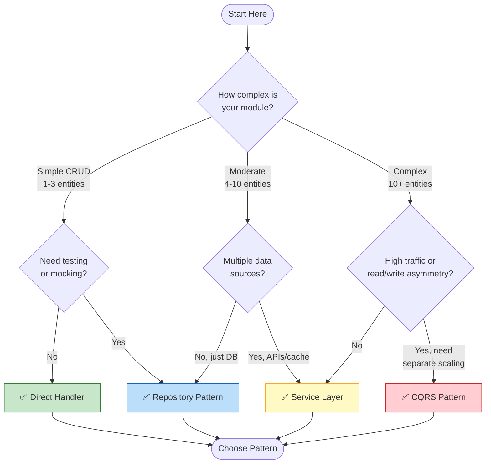
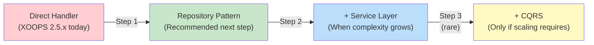

<span class="version-badge version-25x">2.5.x ✅</span> <span class="version-badge version-40x">4.0.x ✅</span>

> **Kateri vzorec naj uporabim?** To drevo odločitev vam pomaga pri izbiri med neposrednimi obdelovalci, vzorcem repozitorija, plastjo storitev in CQRS.

---

## Drevo hitrih odločitev

---

## Primerjava vzorcev

| Merila | Neposredni upravljavec | Repozitorij | Storitvena plast | CQRS |
|----------|--------------|------------|--------------|------|
| **Zapletenost** | ⭐ | ⭐⭐ | ⭐⭐⭐ | ⭐⭐⭐⭐⭐ |
| **Preizkušljivost** | ❌ Težko | ✅ Dobro | ✅ Odlično | ✅ Odlično |
| **Prilagodljivost** | ❌ Nizka | ✅ Srednje | ✅ Visoka | ✅ Zelo visoko |
| **XOOPS 2.5.x** | ✅ Domače | ✅ Deluje | ✅ Deluje | ⚠️ Kompleks |
| **XOOPS 4.0** | ⚠️ Zastarelo | ✅ Priporočeno | ✅ Priporočeno | ✅ Za obseg |
| **Velikost ekipe** | 1 razvijalec | 1-3 razvijalci | 2-5 razvijalcev | 5+ razvijalcev |
| **Vzdrževanje** | ❌ Višje | ✅ Zmerno | ✅ Spodnji | ⚠️ Zahteva strokovno znanje |

---

## Kdaj uporabiti posamezni vzorec

### ✅ Neposredni upravljavec (`XoopsPersistableObjectHandler`)

**Najboljše za:** Enostavne module, hitre prototipe, učenje XOOPS
```php
// Simple and direct - good for small modules
$handler = xoops_getModuleHandler('article', 'news');
$articles = $handler->getObjects(new Criteria('status', 1));
```
**Izberite to, ko:**
- Izdelava preprostega modula z 1-3 tabelami baze podatkov
- Izdelava hitrega prototipa
- Ste edini razvijalec in ne potrebujete testov
- Modul se ne bo bistveno povečal

**Omejitve:**
- Težko za testiranje enote (globalna odvisnost)
- Tesna povezava s plastjo baze podatkov XOOPS
- Poslovna logika ponavadi uhaja v krmilnike

---

### ✅ Vzorec skladišča

**Najboljše za:** večino modulov, ekipe, ki želijo možnost testiranja
```php
// Abstraction allows mocking for tests
interface ArticleRepositoryInterface {
    public function findPublished(): array;
    public function save(Article $article): void;
}

class XoopsArticleRepository implements ArticleRepositoryInterface {
    private $handler;

    public function __construct() {
        $this->handler = xoops_getModuleHandler('article', 'news');
    }

    public function findPublished(): array {
        return $this->handler->getObjects(new Criteria('status', 1));
    }
}
```
**Izberite to, ko:**
- Želite pisati teste enot
- Kasneje lahko spremenite vir podatkov (DB → API)
- Delo z 2+ razvijalci
- Gradnja modulov za distribucijo

**Pot nadgradnje:** To je priporočen vzorec za pripravo XOOPS 4.0.

---

### ✅ Plast storitve

**Najboljše za:** Module s kompleksno poslovno logiko
```php
// Service coordinates multiple repositories and contains business rules
class ArticlePublicationService {
    public function __construct(
        private ArticleRepositoryInterface $articles,
        private NotificationServiceInterface $notifications,
        private CacheInterface $cache
    ) {}

    public function publish(int $articleId): void {
        $article = $this->articles->find($articleId);
        $article->setStatus('published');
        $article->setPublishedAt(new DateTime());

        $this->articles->save($article);
        $this->notifications->notifySubscribers($article);
        $this->cache->invalidate("article:{$articleId}");
    }
}
```
**Izberite to, ko:**
- Operacije zajemajo več virov podatkov
- Poslovna pravila so zapletena
- Potrebujete upravljanje transakcij
- Več delov aplikacije dela isto

**Pot nadgradnje:** Združite z repozitorijem za robustno arhitekturo.

---

### ⚠️ CQRS (Ločevanje odgovornosti za ukaze)

**Najboljše za:** Module velikega obsega z asimetrijo read/write
```php
// Commands modify state
class PublishArticleCommand {
    public function __construct(
        public readonly int $articleId,
        public readonly int $publisherId
    ) {}
}

// Queries read state (can use denormalized read models)
class GetPublishedArticlesQuery {
    public function __construct(
        public readonly int $limit = 10
    ) {}
}
```
**Izberite to, ko:**
- Branje je veliko večje od pisanja (100:1 ali več)
- Za branje in pisanje potrebujete drugačno skaliranje
- Kompleksne zahteve reporting/analytics
- Nabava dogodkov bi koristila vaši domeni

**Opozorilo:** CQRS znatno zaplete. Večina modulov XOOPS tega ne potrebuje.

---

## Priporočena pot nadgradnje

### 1. korak: Zavijte obdelovalce v repozitorije (2-4 ure)

1. Ustvarite vmesnik za vaše potrebe po dostopu do podatkov
2. Implementirajte ga z obstoječim upravljalnikom
3. Vstavite repozitorij namesto neposrednega klica `xoops_getModuleHandler()`

### 2. korak: po potrebi dodajte sloj storitve (1-2 dni)

1. Ko se poslovna logika pojavi v krmilnikih, ekstrahirajte v storitev
2. Storitev uporablja repozitorije, ne neposredno upravljavcev
3. Krmilniki postanejo tanki (pot → storitev → odziv)

### 3. korak: upoštevajte CQRS samo če (redko)

1. Imate na milijone branj na dan
2. Modela branja in pisanja se bistveno razlikujeta
3. Potrebujete izvor dogodkov za revizijske sledi
4. Imate ekipo, ki ima izkušnje z CQRS

---

## Hitra referenčna kartica

| Vprašanje | Odgovor |
|----------|--------|
| **"Potrebujem samo save/load podatke"** | Neposredni upravljavec |
| **"Želim pisati teste"** | Vzorec skladišča |
| **"Imam zapletena poslovna pravila"** | Storitvena plast |
| **"Moram meriti branja ločeno"** | CQRS |
| **"Pripravljam se na XOOPS 4.0"** | Repozitorij + storitvena plast |

---

## Povezana dokumentacija

- [Vodnik po vzorcu repozitorija](Patterns/Repository-Pattern.md)
- [Vodnik po vzorcu storitvenega sloja](Patterns/Service-Layer-Pattern.md)
- [CQRS Vodnik po vzorcih](../07-XOOPS-4.0/Implementation-Guides/CQRS-Pattern-Guide.md) *(napredno)*
- [Pogodba hibridnega načina](../07-XOOPS-4.0/Specifications/Hybrid-Mode-Contract.md)---

#vzorci #dostop do podatkov #odločitveno drevo #najboljše prakse #XOOPS