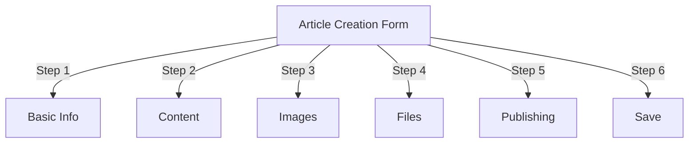
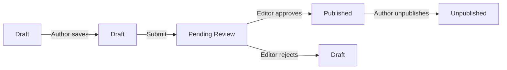
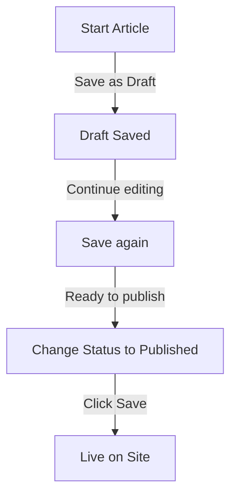

# Ustvarjanje člankov v Publisherju

> Vodnik po korakih za ustvarjanje, urejanje, oblikovanje in objavljanje člankov v modulu Publisher.

---

## Dostop do upravljanja člankov

### Krmarjenje po skrbniški plošči
```
Admin Panel
└── Modules
    └── Publisher
        └── Articles
            ├── Create New
            ├── Edit
            ├── Delete
            └── Publish
```
### Najhitrejša pot

1. Prijavite se kot **Administrator**
2. V skrbniški vrstici kliknite **Moduli**
3. Poiščite **Založnik**
4. Kliknite povezavo **Admin**
5. V levem meniju kliknite **Članki**
6. Kliknite gumb **Dodaj članek**

---

## Obrazec za ustvarjanje članka

### Osnovne informacije

Ko ustvarjate nov članek, izpolnite naslednje razdelke:

---

## 1. korak: Osnovne informacije

### Obvezna polja

#### Naslov članka
```
Field: Title
Type: Text input (required)
Max length: 255 characters
Example: "Top 5 Tips for Better Photography"
```
**Smernice:**
- Opisno in natančno
- Vključite ključne besede za SEO
- Izogibajte se ALL CAPS
- Naj bo manj kot 60 znakov za najboljši prikaz

#### Izberite kategorijo
```
Field: Category
Type: Dropdown (required)
Options: List of created categories
Example: Photography > Tutorials
```
**Namigi:**
- Na voljo so nadrejene in podkategorije
- Izberite najbolj ustrezno kategorijo
- Samo ena kategorija na članek
- Lahko se spremeni pozneje

#### Podnaslov članka (neobvezno)
```
Field: Subtitle
Type: Text input (optional)
Max length: 255 characters
Example: "Learn photography fundamentals in 5 easy steps"
```
**Uporabite za:**
- Naslov povzetka
- Dražljivo besedilo
- Razširjeni naslov

### Opis artikla

#### Kratek opis
```
Field: Short Description
Type: Textarea (optional)
Max length: 500 characters
```
**Namen:**
- Besedilo za predogled članka
- Prikaže se na seznamu kategorij
- Uporablja se v rezultatih iskanja
- Meta opis za SEO

**Primer:**
```
"Discover essential photography techniques that will transform your photos
from ordinary to extraordinary. This comprehensive guide covers composition,
lighting, and exposure settings."
```
#### Celotna vsebina
```
Field: Article Body
Type: WYSIWYG Editor (required)
Max length: Unlimited
Format: HTML
```
Glavno področje vsebine članka z urejanjem obogatenega besedila.

---

## 2. korak: Oblikovanje vsebine

### Uporaba urejevalnika WYSIWYG

#### Oblikovanje besedila
```
Bold:           Ctrl+B or click [B] button
Italic:         Ctrl+I or click [I] button
Underline:      Ctrl+U or click [U] button
Strikethrough:  Alt+Shift+D or click [S] button
Subscript:      Ctrl+, (comma)
Superscript:    Ctrl+. (period)
```
#### Struktura naslova

Ustvarite pravilno hierarhijo dokumentov:
```html
<h1>Article Title</h1>      <!-- Use once at top -->
<h2>Main Section</h2>        <!-- For major sections -->
<h3>Subsection</h3>          <!-- For subtopics -->
<h4>Sub-subsection</h4>      <!-- For details -->
```
**V urejevalniku:**
- Kliknite spustni meni **Oblika**
- Izberite raven naslova (H1-H6)
- Vnesite svoj naslov

#### Seznami

**Neurejen seznam (točke):**
```markdown
• Point one
• Point two
• Point three
```
Koraki v urejevalniku:
1. Kliknite gumb [≡] Bullet list
2. Vnesite vsako točko
3. Pritisnite Enter za naslednji element
4. Dvakrat pritisnite vračalko, da končate seznam

**Urejen seznam (oštevilčen):**
```markdown
1. First step
2. Second step
3. Third step
```
Koraki v urejevalniku:
1. Kliknite gumb [1.] Oštevilčen seznam
2. Vnesite vsak element
3. Pritisnite Enter za naslednje
4. Za konec dvakrat pritisnite vračalko

**Ugnezdeni seznami:**
```markdown
1. Main point
   a. Sub-point
   b. Sub-point
2. Next point
```
Koraki:
1. Ustvarite prvi seznam
2. Pritisnite Tab za zamik
3. Ustvarite ugnezdene elemente
4. Pritisnite Shift+Tab za zamik

#### Povezave

**Dodaj hiperpovezavo:**

1. Izberite besedilo za povezavo
2. Kliknite gumb **[🔗] Povezava**
3. Vnesite URL: `https://example.com`
4. Izbirno: dodajte title/target
5. Kliknite **Vstavi povezavo**

**Odstrani povezavo:**

1. Kliknite znotraj povezanega besedila
2. Kliknite gumb **[🔗] Odstrani povezavo**

#### Koda in citati

**Citat bloka:**
```
"This is an important quote from an expert"
- Attribution
```
Koraki:
1. Vnesite citirano besedilo
2. Kliknite gumb **[❝] Blockquote**
3. Besedilo je zamaknjeno in oblikovano

**Blok kode:**
```python
def hello_world():
    print("Hello, World!")
```
Koraki:
1. Kliknite **Oblika → Koda**
2. Prilepite kodo
3. Izberite jezik (neobvezno)
4. Zasloni kode z označeno sintakso

---

## 3. korak: Dodajanje slik

### Predstavljena slika (glavna slika)
```
Field: Featured Image / Main Image
Type: Image upload
Format: JPG, PNG, GIF, WebP
Max size: 5 MB
Recommended: 600x400 px
```
**Za nalaganje:**

1. Kliknite gumb **Naloži sliko**
2. Izberite sliko iz računalnika
3. Crop/resize po potrebi
4. Kliknite **Uporabi to sliko**

**Postavitev slike:**
- Prikaže se na vrhu članka
- Uporablja se v seznamih kategorij
- Prikazano v arhivu
- Uporablja se za skupno rabo v družabnih omrežjih

### Slike v vrstici

V besedilo članka vstavite slike:

1. Kazalec v urejevalniku postavite na mesto, kjer naj bo slika
2. V orodni vrstici kliknite gumb **[🖼️] Slika**
3. Izberite možnost nalaganja:
   - Naloži novo sliko
   - Izberite iz galerije
   - Vnesite sliko URL
4. Konfigurirajte:   
```
   Image Size:
   - Width: 300-600 px
   - Height: Auto (maintains ratio)
   - Alignment: Left/Center/Right
   ```5. Kliknite **Vstavi sliko**

**Oblij besedilo okoli slike:**

V urejevalniku po vstavljanju:
```html
<!-- Image floats left, text wraps around -->

```
### Galerija slik

Ustvarite galerijo z več slikami:

1. Kliknite gumb **Galerija** (če je na voljo)
2. Naložite več slik:
   - En klik: Dodaj eno
   - Povleci in spusti: dodajte več
3. Uredite vrstni red z vlečenjem
4. Nastavite napise za vsako sliko
5. Kliknite **Ustvari galerijo**

---

## 4. korak: Prilaganje datotek

### Dodajte datotečne priloge
```
Field: File Attachments
Type: File upload (multiple allowed)
Supported: PDF, DOC, XLS, ZIP, etc.
Max per file: 10 MB
Max per article: 5 files
```
**Priložiti:**

1. Kliknite gumb **Dodaj datoteko**
2. Izberite datoteko iz računalnika
3. Izbirno: dodajte opis datoteke
4. Kliknite **Priloži datoteko**
5. Ponovite za več datotek

**Primeri datotek:**
- PDF vodnikov
- Excelove preglednice
- Wordovi dokumenti
- ZIP arhiv
- Izvorna koda

### Upravljanje priloženih datotek

**Uredi datoteko:**

1. Kliknite ime datoteke
2. Uredi opis
3. Kliknite **Shrani**

**Izbriši datoteko:**

1. Poiščite datoteko na seznamu
2. Kliknite ikono **[×] Delete**
3. Potrdite izbris

---

## 5. korak: Objava in status

### Status članka
```
Field: Status
Type: Dropdown
Options:
  - Draft: Not published, only author sees
  - Pending: Waiting for approval
  - Published: Live on site
  - Archived: Old content
  - Unpublished: Was published, now hidden
```
**Potek dela stanja:**

### Možnosti objave

#### Objavi takoj
```
Status: Published
Start Date: Today (auto-filled)
End Date: (leave blank for no expiration)
```
#### Razpored za pozneje
```
Status: Scheduled
Start Date: Future date/time
Example: February 15, 2024 at 9:00 AM
```
Članek bo samodejno objavljen ob določenem času.

#### Nastavi potek
```
Enable Expiration: Yes
Expiration Date: Future date
Action: Archive/Hide/Delete
Example: April 1, 2024 (article auto-archives)
```
### Možnosti vidnosti
```yaml
Show Article:
  - Display on front page: Yes/No
  - Show in category: Yes/No
  - Include in search: Yes/No
  - Include in recent articles: Yes/No

Featured Article:
  - Mark as featured: Yes/No
  - Featured section position: (number)
```
---

## 6. korak: SEO & metapodatki

### SEO Nastavitve
```
Field: SEO Settings (Expand section)
```
#### Meta opis
```
Field: Meta Description
Type: Text (160 characters recommended)
Used by: Search engines, social media

Example:
"Learn photography fundamentals in 5 easy steps.
Discover composition, lighting, and exposure techniques."
```
#### Meta ključne besede
```
Field: Meta Keywords
Type: Comma-separated list
Max: 5-10 keywords

Example: Photography, Tutorial, Composition, Lighting, Exposure
```
#### URL Polž
```
Field: URL Slug (auto-generated from title)
Type: Text
Format: lowercase, hyphens, no spaces

Auto: "top-5-tips-for-better-photography"
Edit: Change before publishing
```
#### Open Graph Tags

Samodejno ustvarjeno iz informacij o članku:
- Naslov
- Opis
- Predstavljena slika
- Artikel URL
- Datum objave

Uporabljajo ga Facebook, LinkedIn, WhatsApp itd.

---

## 7. korak: komentarji in interakcija

### Nastavitve komentarjev
```yaml
Allow Comments:
  - Enable: Yes/No
  - Default: Inherit from preferences
  - Override: Specific to this article

Moderate Comments:
  - Require approval: Yes/No
  - Default: Inherit from preferences
```
### Nastavitve ocenjevanja
```yaml
Allow Ratings:
  - Enable: Yes/No
  - Scale: 5 stars (default)
  - Show average: Yes/No
  - Show count: Yes/No
```
---

## 8. korak: Napredne možnosti

### Avtor in avtor
```
Field: Author
Type: Dropdown
Default: Current user
Options: All users with author permission

Display:
  - Show author name: Yes/No
  - Show author bio: Yes/No
  - Show author avatar: Yes/No
```
### Uredi ključavnico
```
Field: Edit Lock
Purpose: Prevent accidental changes

Lock Article:
  - Locked: Yes/No
  - Lock reason: "Final version"
  - Unlock date: (optional)
```
### Zgodovina revizij

Samodejno shranjene različice članka:
```
View Revisions:
  - Click "Revision History"
  - Shows all saved versions
  - Compare versions
  - Restore previous version
```
---

## Shranjevanje in objava

### Shrani potek dela

### Shrani članek

**Samodejno shranjevanje:**
- Sproži se vsakih 60 sekund
- Samodejno shrani kot osnutek
- Prikaže "Nazadnje shranjeno: pred 2 minutama"

**Ročno shranjevanje:**
- Za nadaljevanje urejanja kliknite **Shrani in nadaljuj**
- Za ogled objavljene različice kliknite **Shrani in poglej**
- Kliknite **Shrani**, da shranite in zaprete

### Objavi članek

1. Nastavite **Stanje**: Objavljeno
2. Nastavite **Začetni datum**: Zdaj (ali datum v prihodnosti)
3. Kliknite **Shrani** ali **Objavi**
4. Prikaže se potrditveno sporočilo
5. Članek je objavljen (ali načrtovan)

---

## Urejanje obstoječih člankov

### Dostop do urejevalnika člankov

1. Pojdite na **Skrbnik → Založnik → Članki**
2. Poiščite članek na seznamu
3. Kliknite **Uredi** icon/button
4. Naredite spremembe
5. Kliknite **Shrani**

### Množično urejanje

Uredite več člankov hkrati:
```
1. Go to Articles list
2. Select articles (checkboxes)
3. Choose "Bulk Edit" from dropdown
4. Change selected field
5. Click "Update All"

Available for:
  - Status
  - Category
  - Featured (Yes/No)
  - Author
```
### Predogled članka

Pred objavo:

1. Kliknite gumb **Predogled**
2. Poglej, kot bodo videli bralci
3. Preverite oblikovanje
4. Preizkusite povezave
5. Vrnite se v urejevalnik za prilagoditev

---

## Upravljanje artiklov

### Prikaži vse članke

**Pogled seznama člankov:**
```
Admin → Publisher → Articles

Columns:
  - Title
  - Category
  - Author
  - Status
  - Created date
  - Modified date
  - Actions (Edit, Delete, Preview)

Sorting:
  - By title (A-Z)
  - By date (newest/oldest)
  - By status (Published/Draft)
  - By category
```
### Filtrirajte članke
```
Filter Options:
  - By category
  - By status
  - By author
  - By date range
  - Search by title

Example: Show all "Draft" articles by "John" in "News" category
```
### Izbriši članek

**Mehko brisanje (priporočeno):**

1. Spremenite **Stanje**: Neobjavljeno
2. Kliknite **Shrani**
3. Članek skrit, vendar ne izbrisan
4. Lahko se obnovi pozneje

**Težko brisanje:**

1. Izberite članek na seznamu
2. Kliknite gumb **Izbriši**
3. Potrdite izbris
4. Članek trajno odstranjen

---

## Najboljše prakse vsebine

### Pisanje kakovostnih člankov
```
Structure:
  ✓ Compelling title
  ✓ Clear subtitle/description
  ✓ Engaging opening paragraph
  ✓ Logical sections with headers
  ✓ Supporting visuals
  ✓ Conclusion/summary
  ✓ Call-to-action

Length:
  - Blog posts: 500-2000 words
  - News: 300-800 words
  - Guides: 2000-5000 words
  - Minimum: 300 words
```
### SEO Optimizacija
```
Title Optimization:
  ✓ Include primary keyword
  ✓ Keep under 60 characters
  ✓ Put keyword near beginning
  ✓ Be descriptive and specific

Content Optimization:
  ✓ Use headings (H1, H2, H3)
  ✓ Include keyword in heading
  ✓ Use bold for important terms
  ✓ Add descriptive links
  ✓ Include images with alt text

Meta Description:
  ✓ Include primary keyword
  ✓ 155-160 characters
  ✓ Action-oriented
  ✓ Unique per article
```
### Nasveti za oblikovanje
```
Readability:
  ✓ Short paragraphs (2-4 sentences)
  ✓ Bullet points for lists
  ✓ Subheadings every 300 words
  ✓ Generous whitespace
  ✓ Line breaks between sections

Visual Appeal:
  ✓ Featured image at top
  ✓ Inline images in content
  ✓ Alt text on all images
  ✓ Code blocks for technical
  ✓ Blockquotes for emphasis
```
---

## Bližnjice na tipkovnici

### Bližnjice urejevalnika
```
Bold:               Ctrl+B
Italic:             Ctrl+I
Underline:          Ctrl+U
Link:               Ctrl+K
Save Draft:         Ctrl+S
```
### Besedilne bližnjice
```
-- →  (dash to em dash)
... → … (three dots to ellipsis)
(c) → © (copyright)
(r) → ® (registered)
(tm) → ™ (trademark)
```
---

## Pogosta opravila

### Kopiraj članek

1. Odprite članek
2. Kliknite gumb **Podvoji** ali **Kloniraj**
3. Članek kopiran kot osnutek
4. Uredite naslov in vsebino
5. Objavi

### Članek razporeda

1. Ustvarite članek
2. Nastavite **Začetni datum**: Prihodnost date/time
3. Nastavite **Stanje**: Objavljeno
4. Kliknite **Shrani**
5. Članek se samodejno objavi

### Paketno objavljanje

1. Ustvarite članke kot osnutke
2. Nastavite datume objave
3. Članki se samodejno objavijo ob načrtovanih urah
4. Spremljajte iz pogleda "Načrtovano".

### Premikanje med kategorijami

1. Uredi članek
2. Spremenite spustni meni **Kategorija**
3. Kliknite **Shrani**
4. Članek se pojavi v novi kategoriji

---

## Odpravljanje težav

### Težava: Članka ni mogoče shraniti

**Rešitev:**
```
1. Check form for required fields
2. Verify category is selected
3. Check PHP memory limit
4. Try saving as draft first
5. Clear browser cache
```
### Težava: Slike se ne prikažejo

**Rešitev:**
```
1. Verify image upload succeeded
2. Check image file format (JPG, PNG)
3. Verify image path in database
4. Check upload directory permissions
5. Try re-uploading image
```
### Težava: orodna vrstica urejevalnika se ne prikaže

**Rešitev:**
```
1. Clear browser cache
2. Try different browser
3. Disable browser extensions
4. Check JavaScript console for errors
5. Verify editor plugin installed
```
### Težava: Članek ni objavljen

**Rešitev:**
```
1. Verify Status = "Published"
2. Check Start Date is today or earlier
3. Verify permissions allow publishing
4. Check category is published
5. Clear module cache
```
---

## Sorodni vodniki

- Vodnik za konfiguracijo
- Upravljanje kategorij
- Nastavitev dovoljenj
- Predloge po meri

---

## Naslednji koraki

- Ustvarite svoj prvi članek
- Nastavite kategorije
- Konfigurirajte dovoljenja
- Pregled prilagoditve predloge

---

#založnik #članki #vsebina #ustvarjanje #oblikovanje #urejanje #XOOPS