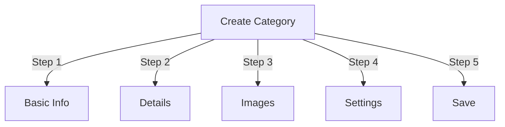

# Upravljanje kategorij v Publisherju

> Popoln vodnik za ustvarjanje, organiziranje hierarhij in upravljanje kategorij v modulu Publisher.

---

## Osnove kategorij

### Kaj so kategorije?

Kategorije organizirajo članke v logične skupine:
```
Example Structure:

  News (Main Category)
    ├── Technology
    ├── Sports
    └── Entertainment

  Tutorials (Main Category)
    ├── Photography
    │   ├── Basics
    │   └── Advanced
    └── Writing
        └── Blogging
```
### Prednosti dobre strukture kategorij
```
✓ Better user navigation
✓ Organized content
✓ Improved SEO
✓ Easier content management
✓ Better editorial workflow
```
---

## Dostop do upravljanja kategorij

### Krmarjenje po skrbniški plošči
```
Admin Panel
└── Modules
    └── Publisher
        └── Categories
            ├── Create New
            ├── Edit
            ├── Delete
            ├── Permissions
            └── Organize
```
### Hitri dostop

1. Prijavite se kot **Administrator**
2. Pojdite na **Admin → Modules**
3. Kliknite **Založnik → Skrbnik**
4. V levem meniju kliknite **Kategorije**

---

## Ustvarjanje kategorij

### Obrazec za ustvarjanje kategorije

### 1. korak: Osnovne informacije

#### Ime kategorije
```
Field: Category Name
Type: Text input (required)
Max length: 100 characters
Uniqueness: Should be unique
Example: "Photography"
```
**Smernice:**
- Opisno in edninsko ali množinsko dosledno
- Pravilno z veliko začetnico
- Izogibajte se posebnim znakom
- Bodite razumno kratki

#### Opis kategorije
```
Field: Description
Type: Textarea (optional)
Max length: 500 characters
Used in: Category listing pages, category blocks
```
**Namen:**
- Razloži vsebino kategorije
- Pojavi se nad članki kategorije
- Pomaga uporabnikom razumeti obseg
- Uporablja se za SEO meta opis

**Primer:**
```
"Photography tips, tutorials, and inspiration for
all skill levels. From composition basics to advanced
lighting techniques, master your craft."
```
### 2. korak: Nadrejena kategorija

#### Ustvari hierarhijo
```
Field: Parent Category
Type: Dropdown
Options: None (root), or existing categories
```
**Primeri hierarhije:**
```
Flat Structure:
  News
  Tutorials
  Reviews

Nested Structure:
  News
    Technology
    Business
    Sports
  Tutorials
    Photography
      Basics
      Advanced
    Writing
```
**Ustvari podkategorijo:**

1. Kliknite spustni meni **Nadrejena kategorija**
2. Izberite nadrejeno (npr. »Novice«)
3. Vnesite ime kategorije
4. Shrani
5. Nova kategorija se pojavi kot otrok

### 3. korak: Slika kategorije

#### Naloži sliko kategorije
```
Field: Category Image
Type: Image upload (optional)
Format: JPG, PNG, GIF, WebP
Max size: 5 MB
Recommended: 300x200 px (or your theme size)
```
**Za nalaganje:**

1. Kliknite gumb **Naloži sliko**
2. Izberite sliko iz računalnika
3. Crop/resize po potrebi
4. Kliknite **Uporabi to sliko**

**Kjer se uporablja:**
- Stran s seznamom kategorij
- Glava bloka kategorije
- Breadcrumb (nekatere teme)
- Deljenje v družabnih medijih

### 4. korak: Nastavitve kategorije

#### Nastavitve zaslona
```yaml
Status:
  - Enabled: Yes/No
  - Hidden: Yes/No (hidden from menus, still accessible)

Display Options:
  - Show description: Yes/No
  - Show image: Yes/No
  - Show article count: Yes/No
  - Show subcategories: Yes/No

Layout:
  - Items per page: 10-50
  - Display order: Date/Title/Author
  - Display direction: Ascending/Descending
```
#### Dovoljenja za kategorijo
```yaml
Who Can View:
  - Anonymous: Yes/No
  - Registered: Yes/No
  - Specific groups: Configure per group

Who Can Submit:
  - Registered: Yes/No
  - Specific groups: Configure per group
  - Author must have: "submit articles" permission
```
### 5. korak: SEO Nastavitve

#### Meta oznake
```
Field: Meta Description
Type: Text (160 characters)
Purpose: Search engine description

Field: Meta Keywords
Type: Comma-separated list
Example: photography, tutorials, tips, techniques
```
#### URL Konfiguracija
```
Field: URL Slug
Type: Text
Auto-generated from category name
Example: "photography" from "Photography"
Can be customized before saving
```
### Shrani kategorijo

1. Izpolnite vsa zahtevana polja:
   - Ime kategorije ✓
   - Opis (priporočeno)
2. Izbirno: Naložite sliko, nastavite SEO
3. Kliknite **Shrani kategorijo**
4. Prikaže se potrditveno sporočilo
5. Kategorija je zdaj na voljo

---

## Hierarhija kategorij

### Ustvari ugnezdeno strukturo
```
Step-by-step example: Create News → Technology subcategory

1. Go to Categories admin
2. Click "Add Category"
3. Name: "News"
4. Parent: (leave blank - this is root)
5. Save
6. Click "Add Category" again
7. Name: "Technology"
8. Parent: "News" (select from dropdown)
9. Save
```
### Oglejte si hierarhično drevo
```
Categories view shows tree structure:

📁 News
  📄 Technology
  📄 Sports
  📄 Entertainment
📁 Tutorials
  📄 Photography
    📄 Basics
    📄 Advanced
  📄 Writing
```
Kliknite puščice za razširitev na show/hide podkategorij.

### Reorganiziraj kategorije

#### Premakni kategorijo

1. Pojdite na seznam kategorij
2. Kliknite **Uredi** v kategoriji
3. Spremenite **Nadrejeno kategorijo**
4. Kliknite **Shrani**
5. Kategorija premaknjena na novo mesto

#### Preuredite kategorije

Če je na voljo, uporabite povleci in spusti:

1. Pojdite na seznam kategorij
2. Kliknite in povlecite kategorijo
3. Spustite se v nov položaj
4. Naročilo se samodejno shrani

#### Izbriši kategorijo

**1. možnost: Mehko brisanje (skrij)**

1. Uredi kategorijo
2. Nastavite **Stanje**: Onemogočeno
3. Kliknite **Shrani**
4. Kategorija skrita, vendar ne izbrisana

**2. možnost: trdo brisanje**

1. Pojdite na seznam kategorij
2. Kliknite **Izbriši** na kategoriji
3. Izberite dejanje za članke:   
```
   ☐ Move articles to parent category
   ☐ Move articles to root (News)
   ☐ Delete all articles in category
   ```4. Potrdite izbris

---

## Operacije kategorij

### Uredi kategorijo

1. Pojdite na **Admin → Publisher → Categories**
2. Kliknite **Uredi** v kategoriji
3. Spremenite polja:
   - Ime
   - Opis
   - Nadrejena kategorija
   - Slika
   - Nastavitve
4. Kliknite **Shrani**

### Uredi dovoljenja za kategorijo

1. Pojdite na Kategorije
2. Kliknite **Dovoljenja** v kategoriji (ali kliknite kategorijo in nato kliknite Dovoljenja)
3. Konfigurirajte skupine:
```
For each group:
  ☐ View articles in this category
  ☐ Submit articles to this category
  ☐ Edit own articles
  ☐ Edit all articles
  ☐ Approve/Moderate articles
  ☐ Manage category
```
4. Kliknite **Shrani dovoljenja**

### Nastavi sliko kategorije

**Naloži novo sliko:**

1. Uredi kategorijo
2. Kliknite **Spremeni sliko**
3. Naložite ali izberite sliko
4. Crop/resize
5. Kliknite **Uporabi sliko**
6. Kliknite **Shrani kategorijo**

**Odstrani sliko:**

1. Uredi kategorijo
2. Kliknite **Odstrani sliko** (če je na voljo)
3. Kliknite **Shrani kategorijo**

---

## Dovoljenja za kategorijo

### Matrica dovoljenj
```
                 Anonymous  Registered  Editor  Admin
View category        ✓         ✓         ✓       ✓
Submit article       ✗         ✓         ✓       ✓
Edit own article     ✗         ✓         ✓       ✓
Edit all articles    ✗         ✗         ✓       ✓
Moderate articles    ✗         ✗         ✓       ✓
Manage category      ✗         ✗         ✗       ✓
```
### Nastavite dovoljenja na ravni kategorije

#### Nadzor dostopa po kategorijah

1. Pojdite na seznam **Kategorije**
2. Izberite kategorijo
3. Kliknite **Dovoljenja**
4. Za vsako skupino izberite dovoljenja:
```
Example: News category
  Anonymous:   View only
  Registered:  Submit articles
  Editors:     Approve articles
  Admins:      Full control
```
5. Kliknite **Shrani**

#### Dovoljenja na ravni polja

Nadzorujte, katera polja obrazca lahko uporabniki see/edit:
```
Example: Limit field visibility for Registered users

Registered users can see/edit:
  ✓ Title
  ✓ Description
  ✓ Content
  ✗ Author (auto-set to current user)
  ✗ Scheduled date (only editors)
  ✗ Featured (only admins)
```
**Konfiguriraj v:**
- Dovoljenja za kategorijo
- Poiščite razdelek »Vidnost polja«.

---

## Najboljše prakse za kategorije

### Struktura kategorije
```
✓ Keep hierarchy 2-3 levels deep
✗ Don't create too many top-level categories
✗ Don't create categories with one article

✓ Use consistent naming (plural or singular)
✗ Don't use vague names ("Stuff", "Other")

✓ Create categories for articles that exist
✗ Don't create empty categories in advance
```
### Smernice za poimenovanje
```
Good names:
  "Photography"
  "Web Development"
  "Travel Tips"
  "Business News"

Avoid:
  "Articles" (too vague)
  "Content" (redundant)
  "News&Updates" (inconsistent)
  "PHOTOGRAPHY STUFF" (formatting)
```
### Organizacijski nasveti
```
By Topic:
  News
    Technology
    Sports
    Entertainment

By Type:
  Tutorials
    Video
    Text
    Interactive

By Audience:
  For Beginners
  For Experts
  Case Studies

Geographic:
  North America
    United States
    Canada
  Europe
```
---

## Bloki kategorij

### Blok kategorije založnika

Prikaz seznamov kategorij na vašem spletnem mestu:

1. Pojdite na **Admin → Blocks**
2. Poiščite **Založnik - Kategorije**
3. Kliknite **Uredi**
4. Konfigurirajte:
```
Block Title: "News Categories"
Show subcategories: Yes/No
Show article count: Yes/No
Height: (pixels or auto)
```
5. Kliknite **Shrani**

### Blok člankov kategorije

Prikaži najnovejše članke iz določene kategorije:

1. Pojdite na **Admin → Blocks**
2. Poiščite **Založnik - Članki kategorije**
3. Kliknite **Uredi**
4. Izberite:
```
Category: News (or specific category)
Number of articles: 5
Show images: Yes/No
Show description: Yes/No
```
5. Kliknite **Shrani**

---

## Analitika kategorij

### Ogled statistike kategorije

Od skrbnika kategorij:
```
Each category shows:
  - Total articles: 45
  - Published: 42
  - Draft: 2
  - Pending approval: 1
  - Total views: 5,234
  - Latest article: 2 hours ago
```
### Oglejte si promet kategorije

Če je analitika omogočena:

1. Kliknite ime kategorije
2. Kliknite zavihek **Statistika**
3. Pogled:
   - Ogledi strani
   - Poljudni članki
   - Prometni trendi
   - Uporabljeni iskalni izrazi

---

## Predloge kategorij

### Prilagodite prikaz kategorije

Če uporabljate predloge po meri, lahko vsaka kategorija preglasi:
```
publisher_category.tpl
  ├── Category header
  ├── Category description
  ├── Category image
  ├── Article listing
  └── Pagination
```
**Za prilagoditev:**

1. Kopirajte datoteko predloge
2. Spremenite HTML/CSS
3. Dodelite kategoriji v skrbniku
4. Kategorija uporablja predlogo po meri

---

## Pogosta opravila

### Ustvari hierarhijo novic
```
Admin → Publisher → Categories
1. Create "News" (parent)
2. Create "Technology" (parent: News)
3. Create "Sports" (parent: News)
4. Create "Entertainment" (parent: News)
```
### Premikanje člankov med kategorijami

1. Pojdite na **Articles** admin
2. Izberite članke (potrditvena polja)
3. V spustnem meniju za množična dejanja izberite **»Spremeni kategorijo«**
4. Izberite novo kategorijo
5. Kliknite **Posodobi vse**

### Skrij kategorijo brez brisanja

1. Uredi kategorijo
2. Nastavite **Status**: Disabled/Hidden
3. Shrani
4. Kategorija ni prikazana v menijih (še vedno dostopna prek URL)

### Ustvarite kategorijo za osnutke
```
Best Practice:

Create "In Review" category
  ├── Purpose: Articles awaiting approval
  ├── Permissions: Hidden from public
  ├── Only admins/editors can see
  ├── Move articles here until approved
  └── Move to "News" when published
```
---

## Import/Export Kategorije

### Izvozi kategorije

Če je na voljo:

1. Pojdite na **Categories** admin
2. Kliknite **Izvozi**
3. Izberite format: CSV/JSON/XML
4. Prenesite datoteko
5. Varnostna kopija shranjena

### Uvozi kategorije

Če je na voljo:

1. Pripravite datoteko s kategorijami
2. Pojdite na **Categories** admin
3. Kliknite **Uvozi**
4. Naloži datoteko
5. Izberite strategijo posodobitve:
   - Ustvari samo novo
   - Posodobi obstoječe
   - Zamenjaj vse
6. Kliknite **Uvozi**

---

## Kategorije odpravljanja težav

### Težava: Podkategorije se ne prikažejo

**Rešitev:**
```
1. Verify parent category status is "Enabled"
2. Check permissions allow viewing
3. Verify subcategories have status "Enabled"
4. Clear cache: Admin → Tools → Clear Cache
5. Check theme shows subcategories
```
### Težava: kategorije ni mogoče izbrisati

**Rešitev:**
```
1. Category must have no articles
2. Move or delete articles first:
   Admin → Articles
   Select articles in category
   Change category to another
3. Then delete empty category
4. Or choose "move articles" option when deleting
```
### Težava: Slika kategorije se ne prikaže

**Rešitev:**
```
1. Verify image uploaded successfully
2. Check image file format (JPG, PNG)
3. Verify upload directory permissions
4. Check theme displays category images
5. Try re-uploading image
6. Clear browser cache
```
### Težava: dovoljenja ne veljajo

**Rešitev:**
```
1. Check group permissions in Category
2. Check global Publisher permissions
3. Check user belongs to configured group
4. Clear session cache
5. Log out and log back in
6. Check permission modules installed
```
---

## Kategorija Kontrolni seznam najboljših praks

Pred uvedbo kategorij:

- [ ] Hierarhija je globoka 2-3 stopnje
- [ ] Vsaka kategorija ima 5+ člankov
- [ ] Imena kategorij so dosledna
- [ ] Dovoljenja so ustrezna
- [ ] Slike kategorij so optimizirane
- [ ] Opisi so popolni
- [ ] SEO metapodatki izpolnjeni
- [ ] URL-ji so prijazni
- [ ] Kategorije preizkušene na sprednji strani
- [ ] Dokumentacija posodobljena

---

## Sorodni vodniki

- Ustvarjanje članka
- Upravljanje dovoljenj
- Konfiguracija modula
- Navodila za namestitev

---

## Naslednji koraki

- Ustvarite članke v kategorijah
- Konfigurirajte dovoljenja
- Prilagodite s predlogami po meri

---

#založnik #kategorije #organizacija #hierarhija #upravljanje #XOOPS