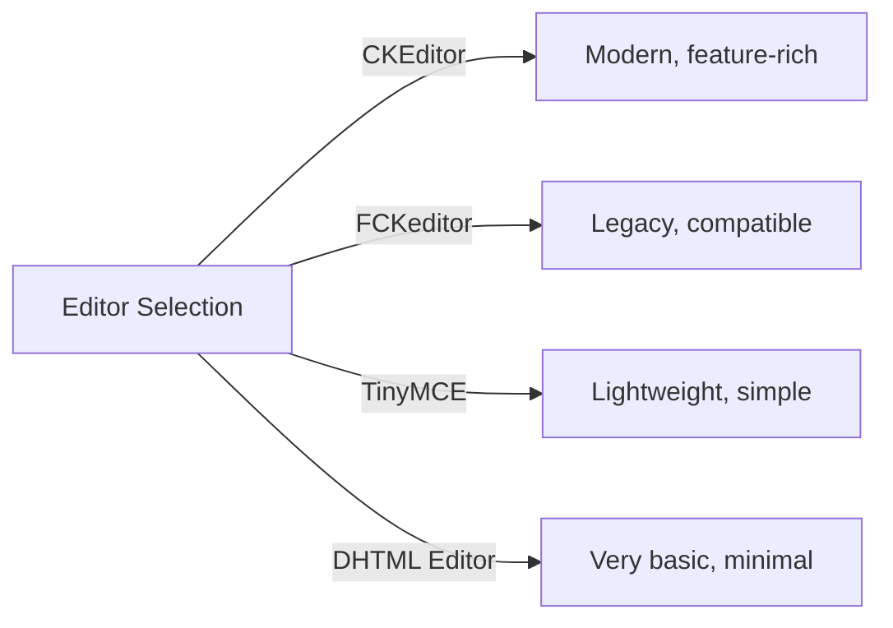
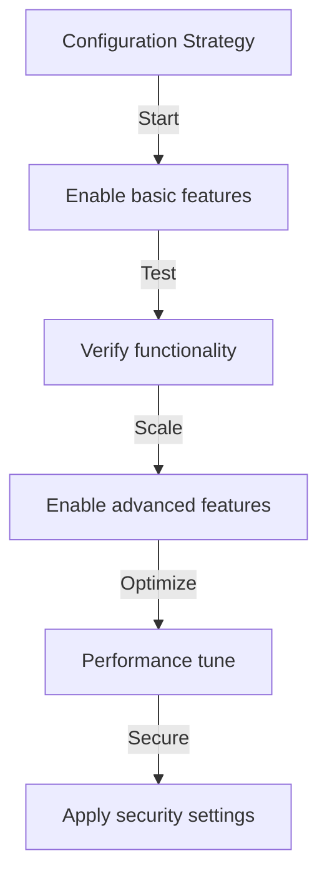

# Osnovna konfiguracija založnika

> Konfigurirajte nastavitve modula Publisher, preference in splošne možnosti za vašo namestitev XOOPS.

---

## Dostop do konfiguracije

### Krmarjenje po skrbniški plošči
```
XOOPS Admin Panel
└── Modules
    └── Publisher
        ├── Preferences
        ├── Settings
        └── Configuration
```
1. Prijavite se kot **Administrator**
2. Pojdite na **Admin Panel → Modules**
3. Poiščite modul **Publisher**
4. Kliknite povezavo **Preferences** ali **Admin**

---

## Splošne nastavitve

### Konfiguracija dostopa
```
Admin Panel → Modules → Publisher
```
Kliknite **ikono zobnika** ali **Nastavitve** za te možnosti:

#### Možnosti prikaza

| Nastavitev | Možnosti | Privzeto | Opis |
|---------|---------|---------|-------------|
| **Elementov na stran** | 5-50 | 10 | Artikli prikazani v seznamih |
| **Prikaži drobtino** | Yes/No | Da | Prikaz navigacijske poti |
| **Uporabi ostranjevanje** | Yes/No | Da | Paginiraj dolge sezname |
| **Pokaži datum** | Yes/No | Da | Prikaži datum artikla |
| **Prikaži kategorijo** | Yes/No | Da | Prikaži kategorijo člankov |
| **Pokaži avtorja** | Yes/No | Da | Prikaži avtorja članka |
| **Pokaži oglede** | Yes/No | Da | Prikaži število ogledov članka |

**Primer konfiguracije:**
```yaml
Items Per Page: 15
Show Breadcrumb: Yes
Use Paging: Yes
Show Date: Yes
Show Category: Yes
Show Author: Yes
Show Views: Yes
```
#### Možnosti avtorja

| Nastavitev | Privzeto | Opis |
|---------|---------|-------------|
| **Pokaži ime avtorja** | Da | Prikaži pravo ime ali uporabniško ime |
| **Uporabi uporabniško ime** | Ne | Pokaži uporabniško ime namesto imena |
| **Pokaži e-poštni naslov avtorja** | Ne | Prikaži kontaktni e-poštni naslov avtorja |
| **Pokaži avatar avtorja** | Da | Prikaži uporabniški avatar |

---

## Konfiguracija urejevalnika

### Izberite WYSIWYG Editor

Publisher podpira več urejevalnikov:

#### Razpoložljivi urejevalniki

### CKEditor (priporočeno)

**Najboljše za:** večino uporabnikov, sodobni brskalniki, polne funkcije

1. Pojdite na **Preferences**
2. Nastavite **Urejevalnik**: CKEditor
3. Konfigurirajte možnosti:
```
Editor: CKEditor 4.x
Toolbar: Full
Height: 400px
Width: 100%
Remove plugins: []
Add plugins: [mathjax, codesnippet]
```
### FCKeditor

**Najboljše za:** Združljivost, starejši sistemi
```
Editor: FCKeditor
Toolbar: Default
Custom config: (optional)
```
### TinyMCE

**Najboljše za:** Minimalni odtis, osnovno urejanje
```
Editor: TinyMCE
Plugins: [paste, table, link, image]
Toolbar: minimal
```
---

## Nastavitve datotek in nalaganja

### Konfigurirajte imenike za nalaganje
```
Admin → Publisher → Preferences → Upload Settings
```
#### Nastavitve vrste datoteke
```yaml
Allowed File Types:
  Images:
    - jpg
    - jpeg
    - gif
    - png
    - webp
  Documents:
    - pdf
    - doc
    - docx
    - xls
    - xlsx
    - ppt
    - pptx
  Archives:
    - zip
    - rar
    - 7z
  Media:
    - mp3
    - mp4
    - webm
    - mov
```
#### Omejitve velikosti datoteke

| Vrsta datoteke | Največja velikost | Opombe |
|-----------|----------|-------|
| **Slike** | 5 MB | Na slikovno datoteko |
| **Dokumenti** | 10 MB | PDF, Office datoteke |
| **Mediji** | 50 MB | Video/audio datoteke |
| **Vse datoteke** | 100 MB | Skupaj na nalaganje |

**Konfiguracija:**
```
Max Image Upload Size: 5 MB
Max Document Upload Size: 10 MB
Max Media Upload Size: 50 MB
Total Upload Size: 100 MB
Max Files per Article: 5
```
### Spreminjanje velikosti slike

Založnik samodejno spremeni velikost slik zaradi skladnosti:
```yaml
Thumbnail Size:
  Width: 150
  Height: 150
  Mode: Crop/Resize

Category Image Size:
  Width: 300
  Height: 200
  Mode: Resize

Article Featured Image:
  Width: 600
  Height: 400
  Mode: Resize
```
---

## Nastavitve komentarja in interakcije

### Konfiguracija komentarjev
```
Preferences → Comments Section
```
#### Možnosti komentarjev
```yaml
Allow Comments:
  - Enabled: Yes/No
  - Default: Yes
  - Per-article override: Yes

Comment Moderation:
  - Moderate comments: Yes/No
  - Moderate guest comments only: Yes/No
  - Spam filter: Enabled
  - Max comments per day: (unlimited)

Comment Display:
  - Display format: Threaded/Flat
  - Comments per page: 10
  - Date format: Full date/Time ago
  - Show comment count: Yes/No
```
### Konfiguracija ocen
```yaml
Allow Ratings:
  - Enabled: Yes/No
  - Default: Yes
  - Per-article override: Yes

Rating Options:
  - Rating scale: 5 stars (default)
  - Allow user to rate own: No
  - Show average rating: Yes
  - Show rating count: Yes
```
---

## SEO & URL Nastavitve

### Optimizacija iskalnikov
```
Preferences → SEO Settings
```
#### URL Konfiguracija
```yaml
SEO URLs:
  - Enabled: No (set to Yes for SEO URLs)
  - URL rewriting: None/Apache mod_rewrite/IIS rewrite

URL Format:
  - Category: /category/news
  - Article: /article/welcome-to-site
  - Archive: /archive/2024/01

Meta Description:
  - Auto-generate: Yes
  - Max length: 160 characters

Meta Keywords:
  - Auto-generate: Yes
  - From: Article tags, title
```
### Omogoči URL-je SEO (napredno)

**Predpogoji:**
- Apache z omogočenim `mod_rewrite`
- `.htaccess` podpora omogočena

**Koraki konfiguracije:**

1. Pojdite na **Nastavitve → SEO Nastavitve**
2. Nastavite **SEO URL-je**: Da
3. Nastavite **URL Prepisovanje**: Apache mod_rewrite
4. Preverite, ali datoteka `.htaccess` obstaja v mapi Publisher

**Konfiguracija .htaccess:**
```apache
<IfModule mod_rewrite.c>
    RewriteEngine On
    RewriteBase /modules/publisher/

    # Category rewrites
    RewriteRule ^category/([0-9]+)-(.*)\.html$ index.php?op=showcategory&categoryid=$1 [L,QSA]

    # Article rewrites
    RewriteRule ^article/([0-9]+)-(.*)\.html$ index.php?op=showitem&itemid=$1 [L,QSA]

    # Archive rewrites
    RewriteRule ^archive/([0-9]+)/([0-9]+)/$ index.php?op=archive&year=$1&month=$2 [L,QSA]
</IfModule>
```
---

## Predpomnilnik in zmogljivost

### Konfiguracija predpomnjenja
```
Preferences → Cache Settings
```

```yaml
Enable Caching:
  - Enabled: Yes
  - Cache type: File (or Memcache)

Cache Lifetime:
  - Category lists: 3600 seconds (1 hour)
  - Article lists: 1800 seconds (30 minutes)
  - Single article: 7200 seconds (2 hours)
  - Recent articles block: 900 seconds (15 minutes)

Cache Clear:
  - Manual clear: Available in admin
  - Auto-clear on article save: Yes
  - Clear on category change: Yes
```
### Počisti predpomnilnik

**Ročno brisanje predpomnilnika:**

1. Pojdite na **Admin → Publisher → Tools**
2. Kliknite **Počisti predpomnilnik**
3. Izberite vrste predpomnilnika, ki jih želite počistiti:
   - [ ] Predpomnilnik kategorij
   - [ ] Predpomnilnik člankov
   - [ ] Blokiraj predpomnilnik
   - [ ] Ves predpomnilnik
4. Kliknite **Počisti izbrano**

**Ukazna vrstica:**
```bash
# Clear all Publisher cache
php /path/to/xoops/admin/cache_manage.php publisher

# Or directly delete cache files
rm -rf /path/to/xoops/var/cache/publisher/*
```
---

## Obveščanje in potek dela

### E-poštna obvestila
```
Preferences → Notifications
```

```yaml
Notify Admin on New Article:
  - Enabled: Yes
  - Recipient: Admin email
  - Include summary: Yes

Notify Moderators:
  - Enabled: Yes
  - On new submission: Yes
  - On pending articles: Yes

Notify Author:
  - On approval: Yes
  - On rejection: Yes
  - On comment: No (optional)
```
### Potek dela oddaje
```yaml
Require Approval:
  - Enabled: Yes
  - Editor approval: Yes
  - Admin approval: No

Draft Save:
  - Auto-save interval: 60 seconds
  - Save local versions: Yes
  - Revision history: Last 5 versions
```
---

## Nastavitve vsebine

### Privzete nastavitve objave
```
Preferences → Content Settings
```

```yaml
Default Article Status:
  - Draft/Published: Draft
  - Featured by default: No
  - Auto-publish time: None

Default Visibility:
  - Public/Private: Public
  - Show on front page: Yes
  - Show in categories: Yes

Scheduled Publishing:
  - Enabled: Yes
  - Allow per-article: Yes

Content Expiration:
  - Enabled: No
  - Auto-archive old: No
  - Archive after days: (unlimited)
```
### WYSIWYG Možnosti vsebine
```yaml
Allow HTML:
  - In articles: Yes
  - In comments: No

Allow Embedded Media:
  - Videos (iframe): Yes
  - Images: Yes
  - Plugins: No

Content Filtering:
  - Strip tags: No
  - XSS filter: Yes (recommended)
```
---

## Nastavitve iskalnika

### Konfigurirajte integracijo iskanja
```
Preferences → Search Settings
```

```yaml
Enable Article Indexing:
  - Include in site search: Yes
  - Index type: Full text/Title only

Search Options:
  - Search in titles: Yes
  - Search in content: Yes
  - Search in comments: Yes

Meta Tags:
  - Auto generate: Yes
  - OG tags (social): Yes
  - Twitter cards: Yes
```
---

## Napredne nastavitve

### Način odpravljanja napak (samo za razvoj)
```
Preferences → Advanced
```

```yaml
Debug Mode:
  - Enabled: No (only for development!)

Development Features:
  - Show SQL queries: No
  - Log errors: Yes
  - Error email: admin@example.com
```
### Optimizacija baze podatkov
```
Admin → Tools → Optimize Database
```

```bash
# Manual optimization
mysql> OPTIMIZE TABLE publisher_items;
mysql> OPTIMIZE TABLE publisher_categories;
mysql> OPTIMIZE TABLE publisher_comments;
```
---

## Prilagoditev modula

### Predloge tem
```
Preferences → Display → Templates
```
Izberite nabor predlog:
- Privzeto
- Klasično
- Moderno
- Temno
- Po meri

Vsaka predloga nadzoruje:
- Postavitev članka
- Seznam kategorij
- Arhivski prikaz
- Prikaz komentarjev

---

## Nasveti za konfiguracijo

### Najboljše prakse

1. **Začnite preprosto** – najprej omogočite osnovne funkcije
2. **Preizkusite vsako spremembo** – Preverite, preden nadaljujete
3. **Omogoči predpomnjenje** - Izboljša zmogljivost
4. **Najprej varnostno kopiraj** - Izvozi nastavitve pred večjimi spremembami
5. **Nadzorni dnevniki** - Redno preverjajte dnevnike napak

### Optimizacija zmogljivosti
```yaml
For Better Performance:
  - Enable caching: Yes
  - Cache lifetime: 3600 seconds
  - Limit items per page: 10-15
  - Compress images: Yes
  - Minify CSS/JS: Yes (if available)
```
### Okrepitev varnosti
```yaml
For Better Security:
  - Moderate comments: Yes
  - Disable HTML in comments: Yes
  - XSS filtering: Yes
  - File type whitelist: Strict
  - Max upload size: Reasonable limit
```
---

## Export/Import Nastavitve

### Konfiguracija varnostne kopije
```
Admin → Tools → Export Settings
```
**Za varnostno kopiranje trenutne konfiguracije:**

1. Kliknite **Izvozi konfiguracijo**
2. Shranite preneseno datoteko `.cfg`
3. Shranjujte na varnem mestu

**Za obnovitev:**

1. Kliknite **Uvozi konfiguracijo**
2. Izberite datoteko `.cfg`
3. Kliknite **Obnovi**

---

## Sorodni vodniki za konfiguracijo

- Upravljanje kategorij
- Ustvarjanje članka
- Konfiguracija dovoljenj
- Navodila za namestitev

---

## Konfiguracija za odpravljanje težav

### Nastavitve se ne shranijo

**Rešitev:**
1. Preverite dovoljenja imenika na `/var/config/`
2. Preverite dostop za pisanje PHP
3. Preverite dnevnik napak PHP za težave
4. Počistite predpomnilnik brskalnika in poskusite znova

### Urejevalnik se ne prikaže

**Rešitev:**
1. Preverite, ali je vtičnik urejevalnika nameščen
2. Preverite konfiguracijo urejevalnika XOOPS
3. Poskusite z drugo možnostjo urejevalnika
4. Preverite, ali so v konzoli brskalnika napake JavaScript

### Težave z zmogljivostjo

**Rešitev:**
1. Omogoči predpomnjenje
2. Zmanjšajte število elementov na stran
3. Stisnite slike
4. Preverite optimizacijo baze podatkov
5. Preglejte dnevnik počasnih poizvedb

---

## Naslednji koraki

- Konfigurirajte dovoljenja skupine
- Ustvarite svoj prvi članek
- Nastavite kategorije
- Preglejte predloge po meri

---

#publisher #configuration #preferences #settings #XOOPS