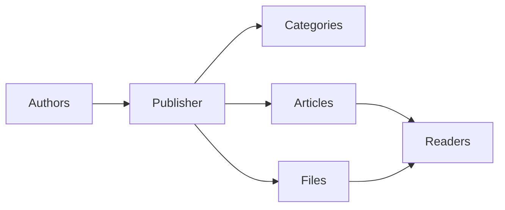
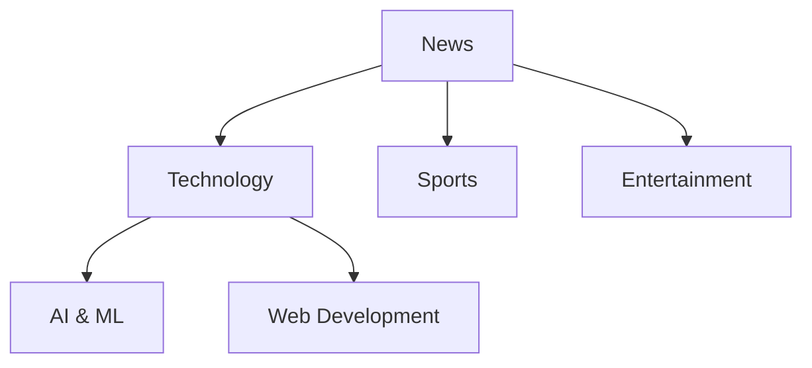
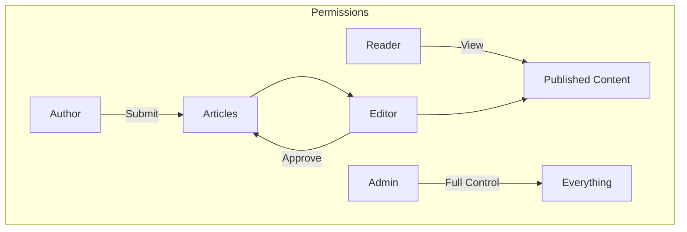
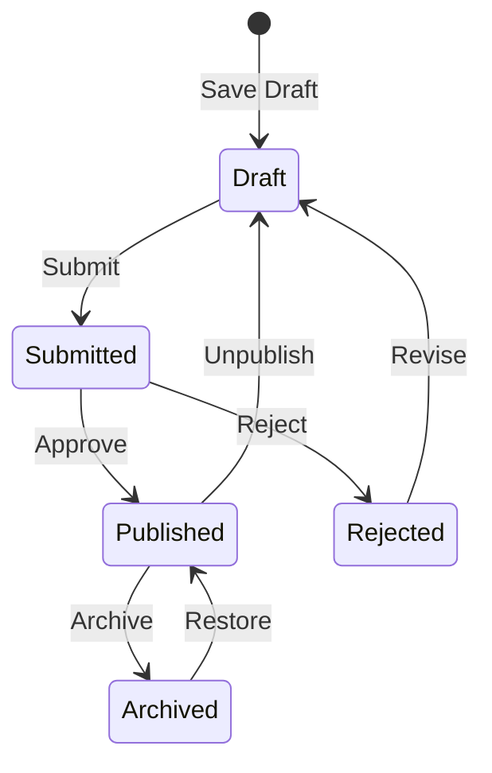

# Uvod v Publisher

> Navodila po korakih za nastavitev in uporabo modula Publisher news/blog.

---

## Kaj je Publisher?

Publisher je vrhunski modul za upravljanje vsebine za XOOPS, zasnovan za:

- **Spletna mesta z novicami** - Objavljajte članke s kategorijami
- **Blogi** - Osebno ali večavtorsko pisanje blogov``
- **Dokumentacija** - Urejene baze znanja
- **Vsebinski portali** - Mešana medijska vsebina

---

## Hitra nastavitev

### 1. korak: Namestite Publisher

1. Prenesite iz [GitHub](https://github.com/XoopsModules25x/publisher)
2. Naložite na `modules/publisher/`
3. Pojdite na Admin → Modules → Install

### 2. korak: Ustvarite kategorije

1. Skrbnik → Založnik → Kategorije
2. Kliknite »Dodaj kategorijo«
3. Izpolnite:
   - **Ime**: Ime kategorije
   - **Opis**: kaj vsebuje ta kategorija
   - **Slika**: izbirna slika kategorije
4. Nastavite dovoljenja (kdo lahko submit/view)
5. Shrani

### 3. korak: Konfigurirajte nastavitve

1. Skrbnik → Založnik → Nastavitve
2. Ključne nastavitve za konfiguracijo:

| Nastavitev | Priporočeno | Opis |
|---------|-------------|-------------|
| Postavke na stran | 10-20 | Članki na indeksu |
| Urednik | TinyMCE/CKEditor | Urejevalnik obogatenega besedila |
| Dovoli ocene | Da | Povratne informacije bralcev |
| Dovoli komentarje | Da | Razprave |
| Samodejno odobri | Ne | Uredniški nadzor |

### 4. korak: Ustvarite svoj prvi članek

1. Glavni meni → Založnik → Oddaj članek
2. Izpolnite obrazec:
   - **Naslov**: naslov članka
   - **Kategorija**: Kam sodi
   - **Povzetek**: Kratek opis
   - **Telo**: Celotna vsebina članka
3. Dodajte neobvezne elemente:
   - Predstavljena slika
   - Datotečne priloge
   - SEO nastavitve
4. Predajte v pregled ali objavo

---

## Uporabniške vloge

### Bralec
- Ogled objavljenih člankov
- Ocenite in komentirajte
- Iskanje vsebine

### Avtor
- Predložite nove članke
- Urejanje lastnih člankov
- Priložite datoteke

### Urednik
- Approve/reject prijav
- Uredite kateri koli članek
- Upravljanje kategorij

### Administrator
- Popoln nadzor modula
- Konfigurirajte nastavitve
- Upravljanje dovoljenj

---

## Pisanje člankov

### Urednik člankov
```
┌─────────────────────────────────────────────────────┐
│ Title: [Your Article Title                        ] │
├─────────────────────────────────────────────────────┤
│ Category: [Select Category          ▼]              │
├─────────────────────────────────────────────────────┤
│ Summary:                                            │
│ ┌─────────────────────────────────────────────────┐ │
│ │ Brief description shown in listings...          │ │
│ └─────────────────────────────────────────────────┘ │
├─────────────────────────────────────────────────────┤
│ Body:                                               │
│ ┌─────────────────────────────────────────────────┐ │
│ │ [B] [I] [U] [Link] [Image] [Code]               │ │
│ ├─────────────────────────────────────────────────┤ │
│ │                                                  │ │
│ │ Full article content goes here...               │ │
│ │                                                  │ │
│ └─────────────────────────────────────────────────┘ │
├─────────────────────────────────────────────────────┤
│ [Submit] [Preview] [Save Draft]                     │
└─────────────────────────────────────────────────────┘
```
### Najboljše prakse

1. **Privlačni naslovi** – jasni, privlačni naslovi
2. **Dobri povzetki** – Privabite bralce, da kliknejo
3. **Strukturirana vsebina** – uporabite naslove, sezname, slike
4. **Pravilna kategorizacija** – Pomagajte bralcem najti vsebino
5. **SEO optimizacija** - Ključne besede v naslovu in vsebini

---

## Upravljanje vsebine

### Tok statusa članka

### Opisi stanja

| Stanje | Opis |
|--------|-------------|
| Osnutek | Delo v teku |
| Oddano | Čakanje na pregled |
| Objavljeno | V živo na mestu |
| Poteklo | Pretekli datum poteka |
| Zavrnjeno | Potrebuje revizijo |
| Arhivirano | Odstranjeno iz seznamov |

---

## Navigacija

### Dostop do Publisherja

- **Glavni meni** → Založnik
- **Direktno URL**: `yoursite.com/modules/publisher/`

### Ključne strani

| Stran | URL | Namen |
|------|-----|---------|
| Kazalo | `/modules/publisher/` | Seznami člankov |
| Kategorija | `/modules/publisher/category.php?id=X` | Članki kategorije |
| člen | `/modules/publisher/item.php?itemid=X` | En članek |
| Pošlji | `/modules/publisher/submit.php` | Nov članek |
| Iskanje | `/modules/publisher/search.php` | Poišči članke |

---

## Bloki

Publisher ponuja več blokov za vaše spletno mesto:

### Nedavni članki
Prikaže zadnje objavljene članke

### Meni kategorije
Navigacija po kategorijah

### Priljubljeni članki
Najbolj gledana vsebina

### Naključni članek
Predstavite naključno vsebino

### V središču pozornosti
Predstavljeni članki

---

## Povezana dokumentacija

- Ustvarjanje in urejanje člankov
- Upravljanje kategorij
- Razširitev založnika

---

#XOOPS #publisher #user-guide #getting-started #cms