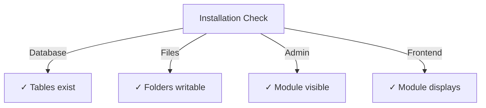

# Publisher Vodnik za namestitev

> Popolna navodila za namestitev in konfiguracijo modula Publisher za XOOPS CMS.

---

## Sistemske zahteve

### Minimalne zahteve

| Zahteva | Različica | Opombe |
|-------------|---------|-------|
| XOOPS | 2.5.10+ | Osnovna platforma CMS |
| PHP | 7,1+ | PHP 8.x priporočeno |
| MySQL | 5,7+ | Strežnik baze podatkov |
| Spletni strežnik | Apache/Nginx | S podporo za ponovno pisanje |

### PHP Razširitve
```
- PDO (PHP Data Objects)
- pdo_mysql or mysqli
- mb_string (multibyte strings)
- curl (for external content)
- json
- gd (image processing)
```
### Prostor na disku

- **Datoteke modula**: ~5 MB
- **Imenik predpomnilnika**: priporočeno 50+ MB
- **Imenik za nalaganje**: Po potrebi za vsebino

---

## Kontrolni seznam pred namestitvijo

Preden namestite Publisher, preverite:

- [ ] XOOPS jedro je nameščeno in deluje
- [ ] Skrbniški račun ima dovoljenja za upravljanje modulov
- [ ] Ustvarjena varnostna kopija baze podatkov
- [ ] Dovoljenja za datoteke omogočajo dostop za pisanje v imenik `/modules/`
- [ ] PHP omejitev pomnilnika je najmanj 128 MB
- [ ] Omejitve velikosti datoteke za nalaganje so ustrezne (najmanj 10 MB)

---

## Koraki namestitve

### 1. korak: Prenesite Publisher

#### Možnost A: iz GitHub (priporočeno)
```bash
# Navigate to modules directory
cd /path/to/xoops/htdocs/modules/

# Clone the repository
git clone https://github.com/XoopsModules25x/publisher.git

# Verify download
ls -la publisher/
```
#### Možnost B: Ročni prenos

1. Obiščite [Izdaje založnika GitHub](https://github.com/XoopsModules25x/publisher/releases)
2. Prenesite najnovejšo datoteko `.zip`
3. Ekstrakt v `modules/publisher/`

### 2. korak: Nastavite dovoljenja za datoteke
```bash
# Set proper ownership
chown -R www-data:www-data /path/to/xoops/htdocs/modules/publisher

# Set directory permissions (755)
find publisher -type d -exec chmod 755 {} \;

# Set file permissions (644)
find publisher -type f -exec chmod 644 {} \;

# Make scripts executable
chmod 755 publisher/admin/index.php
chmod 755 publisher/index.php
```
### 3. korak: Namestite prek XOOPS Admin

1. Prijavite se v **XOOPS skrbniško ploščo** kot skrbnik
2. Pomaknite se do **Sistem → Moduli**
3. Kliknite **Namesti modul**
4. Na seznamu poiščite **Založnik**
5. Kliknite gumb **Namesti**
6. Počakajte, da se namestitev zaključi (prikaže ustvarjene tabele zbirke podatkov)
```
Installation Progress:
✓ Tables created
✓ Configuration initialized
✓ Permissions set
✓ Cache cleared
Installation Complete!
```
---

## Začetna nastavitev

### 1. korak: Dostopite do Publisher Admin

1. Pojdite na **Admin Panel → Modules**
2. Poiščite modul **Publisher**
3. Kliknite povezavo **Admin**
4. Zdaj ste v administraciji založnika

### 2. korak: Konfigurirajte nastavitve modula

1. V levem meniju kliknite **Nastavitve**
2. Konfigurirajte osnovne nastavitve:
```
General Settings:
- Editor: Select your WYSIWYG editor
- Items per page: 10
- Show breadcrumb: Yes
- Allow comments: Yes
- Allow ratings: Yes

SEO Settings:
- SEO URLs: No (enable later if needed)
- URL rewriting: None

Upload Settings:
- Max upload size: 5 MB
- Allowed file types: jpg, png, gif, pdf, doc, docx
```
3. Kliknite **Shrani nastavitve**

### 3. korak: Ustvarite prvo kategorijo

1. V levem meniju kliknite **Kategorije**
2. Kliknite **Dodaj kategorijo**
3. Izpolnite obrazec:
```
Category Name: News
Description: Latest news and updates
Image: (optional) Upload category image
Parent Category: (leave blank for top-level)
Status: Enabled
```
4. Kliknite **Shrani kategorijo**

### 4. korak: Preverite namestitev

Preverite te indikatorje:

#### Preverjanje baze podatkov
```bash
mysql -u xoops_user -p xoops_database
mysql> SHOW TABLES LIKE 'publisher%';

# Should show tables:
# - publisher_categories
# - publisher_items
# - publisher_comments
# - publisher_files
```
#### Sprednje preverjanje

1. Obiščite svojo domačo stran XOOPS
2. Poiščite blok **Publisher** ali **News**
3. Moral bi prikazati nedavne članke

---

## Konfiguracija po namestitvi

### Izbira urednika

Publisher podpira več urejevalnikov WYSIWYG:

| Urednik | Prednosti | Slabosti |
|--------|------|------|
| FCKeditor | Bogat s funkcijami | Starejši, večji |
| CKEditor | Sodoben standard | Kompleksnost konfiguracije |
| TinyMCE | Lahka | Omejene funkcije |
| DHTML Urednik | Osnovno | Zelo osnovno |

**Za zamenjavo urednika:**

1. Pojdite na **Preferences**
2. Pomaknite se do nastavitve **Urejevalnik**
3. Izberite v spustnem meniju
4. Shranite in preizkusite

### Nastavitev imenika za nalaganje
```bash
# Create upload directories
mkdir -p /path/to/xoops/uploads/publisher/
mkdir -p /path/to/xoops/uploads/publisher/categories/
mkdir -p /path/to/xoops/uploads/publisher/images/
mkdir -p /path/to/xoops/uploads/publisher/files/

# Set permissions
chmod 755 /path/to/xoops/uploads/publisher/
chmod 755 /path/to/xoops/uploads/publisher/*
```
### Konfigurirajte velikosti slik

V nastavitvah nastavite velikosti sličic:
```
Category image size: 300 x 200 px
Article image size: 600 x 400 px
Thumbnail size: 150 x 100 px
```
---

## Koraki po namestitvi

### 1. Nastavite dovoljenja skupine

1. Pojdite na **Dovoljenja** v skrbniškem meniju
2. Konfigurirajte dostop za skupine:
   - Anonimno: samo ogled
   - Registrirani uporabniki: Pošljite članke
   - Uredništvo: Approve/edit člankov
   - Skrbniki: Popoln dostop

### 2. Konfigurirajte vidnost modula

1. Pojdite na **Bloki** v XOOPS admin
2. Poiščite bloke založnika:
   - Založnik - Najnovejši članki
   - Založnik - Kategorije
   - Založba - Arhiv
3. Konfigurirajte vidnost blokov na stran

### 3. Uvoz preskusne vsebine (izbirno)

Za testiranje uvozite vzorčne članke:

1. Pojdite na **Publisher Admin → Import**
2. Izberite **Vzorčna vsebina**
3. Kliknite **Uvozi**

### 4. Omogoči URL-je SEO (izbirno)

Za iskalniku prijazne URL-je:

1. Pojdite na **Preferences**
2. Nastavite **SEO URL-je**: Da
3. Omogočite prepisovanje **.htaccess**
4. Preverite, ali datoteka `.htaccess` obstaja v mapi Publisher
```apache
# .htaccess example
<IfModule mod_rewrite.c>
    RewriteEngine On
    RewriteBase /modules/publisher/
    RewriteRule ^category/([0-9]+)-(.*)\.html$ index.php?op=showcategory&categoryid=$1 [L]
    RewriteRule ^article/([0-9]+)-(.*)\.html$ index.php?op=showitem&itemid=$1 [L]
</IfModule>
```
---

## Odpravljanje težav pri namestitvi

### Težava: Modul se ne prikaže v skrbniku

**Rešitev:**
```bash
# Check file permissions
ls -la /path/to/xoops/modules/publisher/

# Check xoops_version.php exists
ls /path/to/xoops/modules/publisher/xoops_version.php

# Verify PHP syntax
php -l /path/to/xoops/modules/publisher/xoops_version.php
```
### Težava: tabele baze podatkov niso ustvarjene

**Rešitev:**
1. Preverite, ali ima uporabnik MySQL privilegij CREATE TABLE
2. Preverite dnevnik napak baze podatkov:   
```bash
   mysql> SHOW WARNINGS;
   ```3. Ročno uvozite SQL:   
```bash
   mysql -u user -p database < modules/publisher/sql/mysql.sql
   
```
### Težava: nalaganje datoteke ne uspe

**Rešitev:**
```bash
# Check directory exists and is writable
stat /path/to/xoops/uploads/publisher/

# Fix permissions
chmod 777 /path/to/xoops/uploads/publisher/

# Verify PHP settings
php -i | grep upload_max_filesize
```
### Težava: Napake "Stran ni najdena".

**Rešitev:**
1. Preverite, ali je prisotna datoteka `.htaccess`
2. Preverite, ali je Apache `mod_rewrite` omogočen:   
```bash
   a2enmod rewrite
   systemctl restart apache2
   ```3. Preverite `AllowOverride All` v konfiguraciji Apache

---

## Nadgradnja s prejšnjih različic

### Od Publisher 1.x do 2.x

1. **Trenutna varnostna kopija namestitve:**   
```bash
   cp -r modules/publisher/ modules/publisher-backup/
   mysqldump -u user -p database > publisher-backup.sql
   
```
2. **Prenesite Publisher 2.x**

3. **Prepiši datoteke:**   
```bash
   rm -rf modules/publisher/
   unzip publisher-2.0.zip -d modules/
   
```
4. **Zaženi posodobitev:**
   - Pojdite na **Admin → Publisher → Update**
   - Kliknite **Posodobi zbirko podatkov**
   - Počakajte na zaključek

5. **Preveri:**
   - Preverite, ali so vsi artikli pravilno prikazani
   - Preverite, ali so dovoljenja nedotaknjena
   - Preskusno nalaganje datotek

---

## Varnostni vidiki

### Dovoljenja za datoteke
```
- Core files: 644 (readable by web server)
- Directories: 755 (browseable by web server)
- Upload directories: 755 or 777
- Config files: 600 (not readable by web)
```
### Onemogoči neposredni dostop do občutljivih datotek

Ustvarite `.htaccess` v imenikih za nalaganje:
```apache
<FilesMatch "\.(php|phtml|php3|php4|php5|phtml)$">
    Deny from all
</FilesMatch>
```
### Varnost baze podatkov
```bash
# Use strong password
ALTER USER 'publisher_user'@'localhost' IDENTIFIED BY 'strong_password_here';

# Grant minimal permissions
GRANT SELECT, INSERT, UPDATE, DELETE ON publisher_db.* TO 'publisher_user'@'localhost';
FLUSH PRIVILEGES;
```
---

## Kontrolni seznam za preverjanje

Po namestitvi preverite:

- [ ] Modul se prikaže na seznamu skrbniških modulov
- [ ] Lahko dostopa do skrbniškega razdelka založnika
- [ ] Lahko ustvari kategorije
- [ ] Lahko ustvarja članke
- [ ] Prikaz člankov na sprednji strani
- [ ] Nalaganje datotek deluje
- [ ] Slike so prikazane pravilno
- [ ] Dovoljenja so pravilno uporabljena
- [ ] Ustvarjene tabele baze podatkov
- [ ] Imenik predpomnilnika je zapisljiv

---

## Naslednji koraki

Po uspešni namestitvi:

1. Preberite Priročnik za osnovno konfiguracijo
2. Ustvarite svoj prvi članek
3. Nastavite dovoljenja skupine
4. Preglejte upravljanje kategorij

---

## Podpora in viri

- **Težave GitHub**: [Težave založnika](https://github.com/XoopsModules25x/publisher/issues)
- **XOOPS Forum**: [Podpora skupnosti](https://www.XOOPS.org/modules/newbb/)
- **GitHub Wiki**: [Pomoč pri namestitvi](https://github.com/XoopsModules25x/publisher/wiki)

---

#publisher #installation #setup #XOOPS #module #configuration