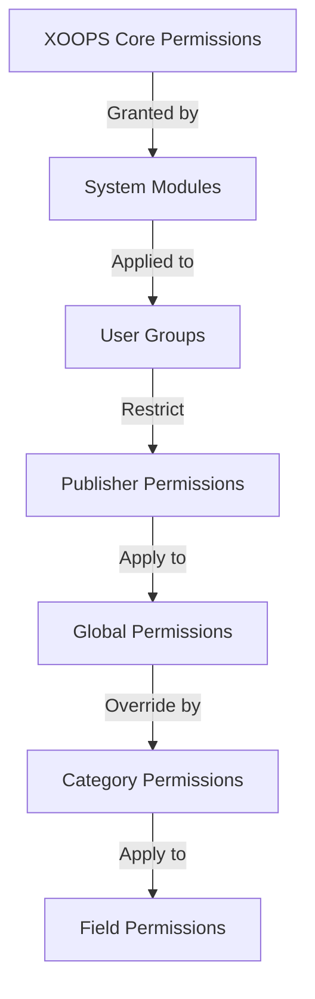

# Nastavitev dovoljenj izdajatelja

> Popoln vodnik za konfiguriranje skupinskih dovoljenj, nadzor dostopa in upravljanje uporabniškega dostopa v Publisherju.

---

## Osnove dovoljenj

### Kaj so dovoljenja?

Dovoljenja nadzirajo, kaj lahko različne skupine uporabnikov počnejo v Publisherju:
```
Who can:
  - View articles
  - Submit articles
  - Edit articles
  - Approve articles
  - Manage categories
  - Configure settings
```
### Ravni dovoljenj
```
Anonymous
  └── View published articles only

Registered Users
  ├── View articles
  ├── Submit articles (pending approval)
  └── Edit own articles

Editors/Moderators
  ├── All registered permissions
  ├── Approve articles
  ├── Edit all articles
  └── Manage some categories

Administrators
  └── Full access to everything
```
---

## Upravljanje dovoljenj za dostop

### Pomaknite se do Dovoljenja
```
Admin Panel
└── Modules
    └── Publisher
        ├── Permissions
        ├── Category Permissions
        └── Group Management
```
### Hitri dostop

1. Prijavite se kot **Administrator**
2. Pojdite na **Admin → Modules**
3. Kliknite **Založnik → Skrbnik**
4. V levem meniju kliknite **Dovoljenja**

---

## Globalna dovoljenja

### Dovoljenja na ravni modula

Nadzor dostopa do modula Publisher in funkcij:
```
Permissions configuration view:
┌─────────────────────────────────────┐
│ Permission             │ Anon │ Reg │ Editor │ Admin │
├────────────────────────┼──────┼─────┼────────┼───────┤
│ View articles          │  ✓   │  ✓  │   ✓    │  ✓   │
│ Submit articles        │  ✗   │  ✓  │   ✓    │  ✓   │
│ Edit own articles      │  ✗   │  ✓  │   ✓    │  ✓   │
│ Edit all articles      │  ✗   │  ✗  │   ✓    │  ✓   │
│ Approve articles       │  ✗   │  ✗  │   ✓    │  ✓   │
│ Manage categories      │  ✗   │  ✗  │   ✗    │  ✓   │
│ Access admin panel     │  ✗   │  ✗  │   ✓    │  ✓   │
└─────────────────────────────────────┘
```
### Opisi dovoljenj

| Dovoljenje | Uporabniki | Učinek |
|------------|-------|--------|
| **Ogled člankov** | Vse skupine | Ogleda si lahko objavljene članke na sprednji strani |
| **Pošlji članke** | Registriran+ | Lahko ustvarja nove članke (čaka na odobritev) |
| **Urejanje lastnih člankov** | Registriran+ | Lahko edit/delete lastnih izdelkov |
| **Uredi vse članke** | Uredniki+ | Lahko ureja članke katerega koli uporabnika |
| **Izbriši lastne članke** | Registriran+ | Lahko izbrišejo lastne neobjavljene članke |
| **Izbriši vse članke** | Uredniki+ | Lahko izbriše kateri koli članek |
| **Odobri članke** | Uredniki+ | Lahko objavi članke v teku |
| **Upravljanje kategorij** | Administratorji | Ustvarjanje, urejanje, brisanje kategorij |
| **Skrbniški dostop** | Uredniki+ | Dostop do skrbniškega vmesnika |

---

## Konfigurirajte globalna dovoljenja

### 1. korak: Nastavitve dovoljenj za dostop

1. Pojdite na **Admin → Modules**
2. Poiščite **Založnik**
3. Kliknite **Dovoljenja** (ali povezavo Skrbnik in nato Dovoljenja)
4. Vidite matriko dovoljenj

### 2. korak: Nastavite dovoljenja skupine

Za vsako skupino konfigurirajte, kaj lahko naredi:

#### Anonimni uporabniki
```yaml
Anonymous Group Permissions:
  View articles: ✓ YES
  Submit articles: ✗ NO
  Edit articles: ✗ NO
  Delete articles: ✗ NO
  Approve articles: ✗ NO
  Manage categories: ✗ NO
  Admin access: ✗ NO

Result: Anonymous users can only view published content
```
#### Registrirani uporabniki
```yaml
Registered Group Permissions:
  View articles: ✓ YES
  Submit articles: ✓ YES (with approval required)
  Edit own articles: ✓ YES
  Edit all articles: ✗ NO
  Delete own articles: ✓ YES (drafts only)
  Delete all articles: ✗ NO
  Approve articles: ✗ NO
  Manage categories: ✗ NO
  Admin access: ✗ NO

Result: Registered users can contribute content after approval
```
#### Skupina urednikov
```yaml
Editors Group Permissions:
  View articles: ✓ YES
  Submit articles: ✓ YES
  Edit own articles: ✓ YES
  Edit all articles: ✓ YES
  Delete own articles: ✓ YES
  Delete all articles: ✓ YES
  Approve articles: ✓ YES
  Manage categories: ✓ LIMITED
  Admin access: ✓ YES
  Configure settings: ✗ NO

Result: Editors manage content but not settings
```
#### Administratorji
```yaml
Admins Group Permissions:
  ✓ FULL ACCESS to all features

  - All editor permissions
  - Manage all categories
  - Configure all settings
  - Manage permissions
  - Install/uninstall
```
### 3. korak: Shranite dovoljenja

1. Konfigurirajte dovoljenja vsake skupine
2. Potrdite polja za dovoljena dejanja
3. Počistite polja za zavrnjena dejanja
4. Kliknite **Shrani dovoljenja**
5. Prikaže se potrditveno sporočilo

---

## Dovoljenja na ravni kategorije

### Nastavite dostop do kategorije

Nadzirajte, kdo lahko view/submit v določene kategorije:
```
Admin → Publisher → Categories
→ Select category → Permissions
```
### Matrika dovoljenj za kategorije
```
                 Anonymous  Registered  Editor  Admin
View category        ✓         ✓         ✓       ✓
Submit to category   ✗         ✓         ✓       ✓
Edit own in category ✗         ✓         ✓       ✓
Edit all in category ✗         ✗         ✓       ✓
Approve in category  ✗         ✗         ✓       ✓
Manage category      ✗         ✗         ✗       ✓
```
### Konfigurirajte dovoljenja za kategorijo

1. Pojdite na **Categories** admin
2. Poiščite kategorijo
3. Kliknite gumb **Dovoljenja**
4. Za vsako skupino izberite:
   - [ ] Poglej to kategorijo
   - [ ] Predložite članke
   - [ ] Urejanje lastnih člankov
   - [ ] Uredi vse članke
   - [ ] Odobritev člankov
   - [ ] Upravljanje kategorije
5. Kliknite **Shrani**

### Primeri dovoljenj za kategorije

#### Kategorija javnih novic
```
Anonymous: View only
Registered: View + Submit (pending approval)
Editors: Approve + Edit
Admins: Full control
```
#### Kategorija notranjih posodobitev
```
Anonymous: No access
Registered: View only
Editors: Submit + Approve
Admins: Full control
```
#### Kategorija bloga za goste
```
Anonymous: View only
Registered: Submit (pending approval)
Editors: Approve
Admins: Full control
```
---

## Dovoljenja na ravni polja

### Nadzor vidnosti polja obrazca

Omejite, katera polja obrazca lahko uporabniki see/edit:
```
Admin → Publisher → Permissions → Fields
```
### Možnosti polja
```yaml
Visible Fields for Registered Users:
  ✓ Title
  ✓ Description
  ✓ Content (body)
  ✓ Featured image
  ✓ Category
  ✓ Tags
  ✗ Author (auto-set)
  ✗ Publication date (editors only)
  ✗ Scheduled date (editors only)
  ✗ Featured flag (editors only)
  ✗ Permissions (admins only)
```
### Primeri

#### Omejena oddaja za registrirane

Registrirani uporabniki vidijo manj možnosti:
```
Available fields:
  - Title ✓
  - Description ✓
  - Content ✓
  - Featured image ✓
  - Category ✓

Hidden fields:
  - Author (auto-current user)
  - Publication date (editors decide)
  - Scheduled date (admins only)
  - Featured status (editors choose)
```
#### Celoten obrazec za urednike

Uredniki vidijo vse možnosti:
```
Available fields:
  - All basic fields
  - All metadata
  - Author selection ✓
  - Publication date/time ✓
  - Scheduled date ✓
  - Featured status ✓
  - Expiration date ✓
  - Permissions ✓
```
---

## Konfiguracija uporabniške skupine

### Ustvari skupino po meri

1. Pojdite na **Admin → Users → Groups**
2. Kliknite **Ustvari skupino**
3. Vnesite podrobnosti skupine:
```
Group Name: "Community Bloggers"
Group Description: "Users who contribute blog content"
Type: Regular group
```
4. Kliknite **Shrani skupino**
5. Vrnite se na dovoljenja izdajatelja
6. Nastavite dovoljenja za novo skupino

### Skupinski primeri
```
Suggested Groups for Publisher:

Group: Contributors
  - Regular members who submit articles
  - Can edit own articles
  - Cannot approve articles

Group: Reviewers
  - Can see submitted articles
  - Can approve/reject articles
  - Cannot delete others' articles

Group: Editors
  - Can edit any article
  - Can approve articles
  - Can moderate comments
  - Can manage some categories

Group: Publishers
  - Can edit any article
  - Can publish directly (no approval)
  - Can manage all categories
  - Can configure settings
```
---

## Hierarhije dovoljenj

### Tok dovoljenj

### Dedovanje dovoljenj
```
Base: Global module permissions
  ↓
Category: Overrides for specific categories
  ↓
Field: Further restricts available fields
  ↓
User: Has permission if ALL levels allow
```
**Primer:**
```
User wants to edit article:
1. User group must have "edit articles" permission (global)
2. Category must allow editing (category level)
3. Field restrictions must allow (if applicable)
4. User must be author OR editor (for own vs all)

If ANY level denies → Permission denied
```
---

## Dovoljenja poteka dela odobritve

### Konfigurirajte odobritev predložitve

Nadzor, ali je za članke potrebna odobritev:
```
Admin → Publisher → Preferences → Workflow
```
#### Možnosti odobritve
```yaml
Submission Workflow:
  Require Approval: Yes

  For Registered Users:
    - New articles: Draft (pending approval)
    - Editors must approve
    - User can edit while pending
    - After approval: User can still edit

  For Editors:
    - New articles: Publish directly (optional)
    - Skip approval queue
    - Or always require approval
```
#### Konfiguriraj na skupino

1. Pojdite na Nastavitve
2. Poiščite "Potek dela oddaje"
3. Za vsako skupino nastavite:
```
Group: Registered Users
  Require approval: ✓ YES
  Default status: Draft
  Can modify while pending: ✓ YES

Group: Editors
  Require approval: ✗ NO
  Default status: Published
  Can modify published: ✓ YES
```
4. Kliknite **Shrani**

---

## Zmerni članki

### Odobri čakajoče članke

Za uporabnike z dovoljenjem za odobritev člankov:

1. Pojdite na **Skrbnik → Založnik → Članki**
2. Filtrirajte po **Stanje**: v teku
3. Kliknite članek za pregled
4. Preverite kakovost vsebine
5. Nastavite **Stanje**: Objavljeno
6. Izbirno: dodajte opombe urednika
7. Kliknite **Shrani**

### Zavrni članke

Če izdelek ne ustreza standardom:

1. Odprite članek
2. Nastavite **Status**: Osnutek
3. Dodajte razlog za zavrnitev (v komentarju ali e-pošti)
4. Kliknite **Shrani**
5. Pošljite avtorju sporočilo z obrazložitvijo zavrnitve

### Zmerni komentarji

Če moderirate komentarje:

1. Pojdite na **Admin → Publisher → Comments**
2. Filtrirajte po **Stanje**: v teku
3. Pregled komentarja
4. Možnosti:
   - Odobri: Kliknite **Odobri**
   - Zavrnitev: kliknite **Izbriši**
   - Uredi: kliknite **Uredi**, popravi, shrani
5. Kliknite **Shrani**

---

## Upravljanje uporabniškega dostopa

### Ogled uporabniških skupin

Oglejte si, kateri uporabniki pripadajo skupinam:
```
Admin → Users → User Groups

For each user:
  - Primary group (one)
  - Secondary groups (multiple)

Permissions apply from all groups (union)
```
### Dodaj uporabnika v skupino

1. Pojdite na **Admin → Users**
2. Poiščite uporabnika
3. Kliknite **Uredi**
4. Pod **Skupine** označite skupine, ki jih želite dodati
5. Kliknite **Shrani**

### Spremenite uporabniška dovoljenja

Za posamezne uporabnike (če je podprto):

1. Pojdite na Skrbnik uporabnikov
2. Poiščite uporabnika
3. Kliknite **Uredi**
4. Poiščite preglasitev posameznih dovoljenj
5. Po potrebi konfigurirajte
6. Kliknite **Shrani**

---

## Pogosti scenariji dovoljenj

### 1. scenarij: Odprite blog

Dovoli vsakomur, da pošlje:
```
Anonymous: View
Registered: Submit, edit own, delete own
Editors: Approve, edit all, delete all
Admins: Full control

Result: Open community blog
```
### Scenarij 2: Moderirano spletno mesto z novicami

Strog postopek odobritve:
```
Anonymous: View only
Registered: Cannot submit
Editors: Submit, approve others
Admins: Full control

Result: Only approved professionals publish
```
### Scenarij 3: Blog zaposlenih

Zaposleni lahko prispevajo:
```
Create group: "Staff"
Anonymous: View
Registered: View only (non-staff)
Staff: Submit, edit own, publish directly
Admins: Full control

Result: Staff-authored blog
```
### Scenarij 4: več kategorij z različnimi uredniki

Različni urejevalniki za različne kategorije:
```
News category:
  Editors group A: Full control

Reviews category:
  Editors group B: Full control

Tutorials category:
  Editors group C: Full control

Result: Decentralized editorial control
```
---

## Testiranje dovoljenj

### Preverite, ali dovoljenja delujejo

1. Ustvarite testnega uporabnika v vsaki skupini
2. Prijavite se kot vsak testni uporabnik
3. Poskusite:
   - Oglejte si članke
   - Predložite članek (ustvarite osnutek, če je dovoljeno)
   - Uredi članek (lastni in tuji)
   - Izbriši članek
   - Dostop do skrbniške plošče
   - Dostop do kategorij

4. Preverite, ali se rezultati ujemajo s pričakovanimi dovoljenji

### Pogosti preskusni primeri
```
Test Case 1: Anonymous user
  [ ] Can view published articles: ✓
  [ ] Cannot submit articles: ✓
  [ ] Cannot access admin: ✓

Test Case 2: Registered user
  [ ] Can submit articles: ✓
  [ ] Articles go to Draft: ✓
  [ ] Can edit own article: ✓
  [ ] Cannot edit others: ✓
  [ ] Cannot access admin: ✓

Test Case 3: Editor
  [ ] Can approve articles: ✓
  [ ] Can edit any article: ✓
  [ ] Can access admin: ✓
  [ ] Cannot delete all: ✓ (or ✓ if allowed)

Test Case 4: Admin
  [ ] Can do everything: ✓
```
---

## Dovoljenja za odpravljanje težav

### Težava: Uporabnik ne more predložiti člankov

**Preveri:**
```
1. User group has "submit articles" permission
   Admin → Publisher → Permissions

2. User belongs to allowed group
   Admin → Users → Edit user → Groups

3. Category allows submission from user's group
   Admin → Publisher → Categories → Permissions

4. User is registered (not anonymous)
```
**Rešitev:**
```bash
1. Verify registered user group has submission permission
2. Add user to appropriate group
3. Check category permissions
4. Clear user session cache
```
### Težava: urednik ne more odobriti člankov

**Preveri:**
```
1. Editor group has "approve articles" permission
2. Articles exist with "Pending" status
3. Editor is in correct group
4. Category allows approval from editor's group
```
**Rešitev:**
```bash
1. Go to Permissions, check "approve articles" is checked for editor group
2. Create test article, set to Draft
3. Try to approve as editor
4. Check error messages in system log
```
### Težava: Lahko vidi članke, vendar ne more dostopati do kategorije

**Preveri:**
```
1. Category is not disabled/hidden
2. Category permissions allow viewing
3. User's group is permitted to view category
4. Category is published
```
**Rešitev:**
```bash
1. Go to Categories, check category status is "Enabled"
2. Check category permissions are set
3. Add user's group to category view permission
```
### Težava: dovoljenja so bila spremenjena, vendar ne veljajo

**Rešitev:**
```bash
1. Clear cache: Admin → Tools → Clear Cache
2. Clear session: Logout and login again
3. Check system log for errors
4. Verify permissions actually saved
5. Try different browser/incognito window
```
---

## Varnostno kopiranje in izvoz dovoljenj

### Dovoljenja za izvoz

Nekateri sistemi omogočajo izvoz:

1. Pojdite na **Admin → Publisher → Tools**
2. Kliknite **Dovoljenja za izvoz**
3. Shranite datoteko `.xml` ali `.json`
4. Shranite kot varnostno kopijo

### Dovoljenja za uvoz

Obnovi iz varnostne kopije:

1. Pojdite na **Admin → Publisher → Tools**
2. Kliknite **Dovoljenja za uvoz**
3. Izberite datoteko varnostne kopije
4. Preglejte spremembe
5. Kliknite **Uvozi**

---

## Najboljše prakse

### Kontrolni seznam za konfiguracijo dovoljenj

- [ ] Odločite se za skupine uporabnikov
- [ ] Skupinam dodelite jasna imena
- [ ] Nastavite osnovna dovoljenja za vsako skupino
- [ ] Preizkusite vsako raven dovoljenj
- [ ] Struktura dovoljenj dokumenta
- [ ] Ustvari potek dela za odobritev
- [ ] Urjenje urednikov o moderiranju
- [ ] Nadzor uporabe dovoljenj
- [ ] Četrtletno preglejte dovoljenja
- [ ] Nastavitve dovoljenj za varnostno kopiranje

### Najboljše varnostne prakse
```
✓ Principle of Least Privilege
  - Grant minimum necessary permissions

✓ Role-Based Access
  - Use groups for roles (editor, moderator, etc)

✓ Audit Permissions
  - Review who has what access

✓ Separate Duties
  - Submitter, approver, publisher are different

✓ Regular Review
  - Check permissions quarterly
  - Remove access when users leave
  - Update for new requirements
```
---

## Sorodni vodniki

- Ustvarjanje člankov
- Upravljanje kategorij
- Osnovna konfiguracija
- Namestitev

---

## Naslednji koraki

- Nastavite dovoljenja za vaš potek dela
- Ustvarite članke z ustreznimi dovoljenji
- Konfigurirajte kategorije z dovoljenji
- Usposabljajte uporabnike za ustvarjanje člankov

---

#publisher #permissions #groups #access-control #security #moderation #XOOPS