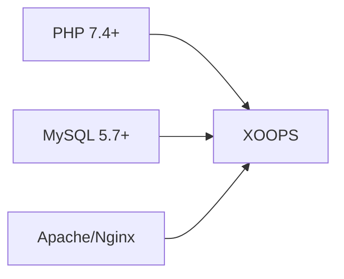
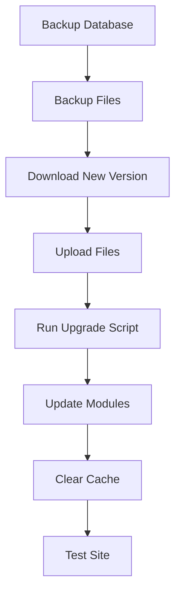

> Pogosta vprašanja in odgovori o namestitvi XOOPS.

---

## Prednamestitev

### V: Kakšne so minimalne zahteve za strežnik?

**A:** XOOPS 2.5.x zahteva:
- PHP 7.4 ali višje (PHP 8.x priporočeno)
- MySQL 5.7+ ali MariaDB 10.3+
- Apache z mod_rewrite ali Nginx
- Vsaj 64 MB PHP omejitev pomnilnika (priporočeno 128 MB+)

### V: Ali lahko namestim XOOPS na skupno gostovanje?

**O:** Da, XOOPS dobro deluje na večini deljenih gostovanj, ki izpolnjujejo zahteve. Preverite, ali vaš gostitelj zagotavlja:
- PHP z zahtevanimi razširitvami (mysqli, gd, curl, json, mbstring)
- Dostop do podatkovne baze MySQL
- Možnost nalaganja datotek
- Podpora za .htaccess (za Apache)

### V: Katere razširitve PHP so potrebne?

**A:** Zahtevane razširitve:
- `mysqli` - Povezljivost podatkovnih baz
- `gd` - Obdelava slik
- `json` - JSON rokovanje
- `mbstring` - Podpora za večbajtne nize

Priporočeno:
- `curl` - Zunanji API klici
- `zip` - Namestitev modula
- `intl` - Internacionalizacija

---

## Postopek namestitve

### V: Čarovnik za namestitev prikaže prazno stran

**O:** To je običajno napaka PHP. Poskusite:

1. Začasno omogočite prikaz napak:
```php
// Add to htdocs/install/index.php at the top
error_reporting(E_ALL);
ini_set('display_errors', 1);
```
2. Preverite PHP dnevnik napak
3. Preverite združljivost različice PHP
4. Prepričajte se, da so naložene vse zahtevane razširitve

### V: Dobim "Ne morem pisati v mainfile.php"

**A:** Pred namestitvijo nastavite dovoljenja za pisanje:
```bash
chmod 666 mainfile.php
# After installation, secure it:
chmod 444 mainfile.php
```
### V: Tabele baze podatkov se ne ustvarjajo

**A:** Preverite:

1. Uporabnik MySQL ima CREATE TABLE privilegije:
```sql
GRANT ALL PRIVILEGES ON xoopsdb.* TO 'xoopsuser'@'localhost';
FLUSH PRIVILEGES;
```
2. Baza podatkov obstaja:
```sql
CREATE DATABASE xoopsdb CHARACTER SET utf8mb4 COLLATE utf8mb4_unicode_ci;
```
3. Poverilnice v čarovniku se ujemajo z nastavitvami baze podatkov

### V: Namestitev je končana, vendar spletno mesto prikazuje napake

**A:** Pogosti popravki po namestitvi:

1. Odstranite ali preimenujte namestitveni imenik:
```bash
mv htdocs/install htdocs/install.bak
```
2. Nastavite ustrezna dovoljenja:
```bash
chmod -R 755 htdocs/
chmod -R 777 xoops_data/
chmod 444 mainfile.php
```
3. Počisti predpomnilnik:
```bash
rm -rf xoops_data/caches/smarty_cache/*
rm -rf xoops_data/caches/smarty_compile/*
```
---

## Konfiguracija

### V: Kje je konfiguracijska datoteka?

**A:** Glavna konfiguracija je v `mainfile.php` v korenu XOOPS. Ključne nastavitve:
```php
define('XOOPS_ROOT_PATH', '/path/to/htdocs');
define('XOOPS_VAR_PATH', '/path/to/xoops_data');
define('XOOPS_URL', 'https://yoursite.com');
define('XOOPS_DB_HOST', 'localhost');
define('XOOPS_DB_USER', 'username');
define('XOOPS_DB_PASS', 'password');
define('XOOPS_DB_NAME', 'database');
define('XOOPS_DB_PREFIX', 'xoops');
```
### V: Kako spremenim stran URL?

**A:** Uredi `mainfile.php`:
```php
define('XOOPS_URL', 'https://newdomain.com');
```
Nato počistite predpomnilnik in posodobite vse trdo kodirane URL-je v bazi podatkov.

### V: Kako premaknem XOOPS v drug imenik?

**A:**

1. Premaknite datoteke na novo lokacijo
2. Posodobite poti v `mainfile.php`:
```php
define('XOOPS_ROOT_PATH', '/new/path/to/htdocs');
define('XOOPS_VAR_PATH', '/new/path/to/xoops_data');
```3. Po potrebi posodobite bazo podatkov
4. Počistite vse predpomnilnike

---

## Nadgradnje

### V: Kako nadgradim XOOPS?

**A:**

1. **Varnostno kopirajte vse** (baza podatkov + datoteke)
2. Prenesite novo različico XOOPS
3. Naložite datoteke (ne prepišite `mainfile.php`)
4. Zaženite `htdocs/upgrade/`, če je na voljo
5. Posodobite module prek skrbniške plošče
6. Počistite vse predpomnilnike
7. Temeljito preizkusite

### V: Ali lahko pri nadgradnji preskočim različice?

**A:** Na splošno ne. Nadgradite zaporedno skozi glavne različice, da zagotovite pravilno izvajanje selitev baze podatkov. Preverite opombe ob izdaji za posebna navodila.

### V: Moji moduli so prenehali delovati po nadgradnji

**A:**

1. Preverite združljivost modula z novo različico XOOPS
2. Posodobite module na najnovejše različice
3. Ponovno ustvarite predloge: Skrbnik → Sistem → Vzdrževanje → Predloge
4. Počistite vse predpomnilnike
5. Preverite dnevnike napak PHP za določene napake

---

## Odpravljanje težav

### V: Pozabil sem skrbniško geslo

**A:** Ponastavi prek baze podatkov:
```sql
-- Generate new password hash
UPDATE xoops_users
SET pass = MD5('newpassword')
WHERE uname = 'admin';
```
Ali pa uporabite funkcijo ponastavitve gesla, če je e-pošta konfigurirana.

### V: Po namestitvi je spletno mesto zelo počasno

**A:**

1. Omogočite predpomnjenje v Skrbnik → Sistem → Nastavitve
2. Optimizirajte bazo podatkov:
```sql
OPTIMIZE TABLE xoops_session;
OPTIMIZE TABLE xoops_online;
```3. V načinu za odpravljanje napak preverite počasne poizvedbe
4. Omogočite PHP OpCache

### V: Slike/CSS se ne nalagajo

**A:**

1. Preverite dovoljenja za datoteke (644 za datoteke, 755 za imenike)
2. Preverite, ali je `XOOPS_URL` pravilno v `mainfile.php`
3. Preverite .htaccess za spore pri prepisovanju
4. Preglejte konzolo brskalnika za napake 404

---

## Povezana dokumentacija

- Navodila za namestitev
- Osnovna konfiguracija
- Beli zaslon smrti

---

#XOOPS #pogosta vprašanja #namestitev #odpravljanje težav