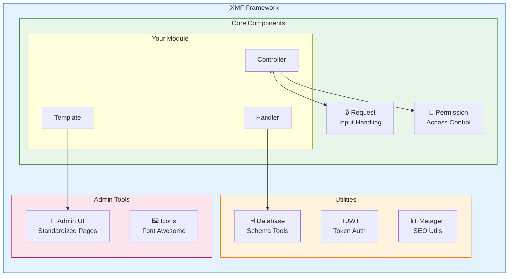
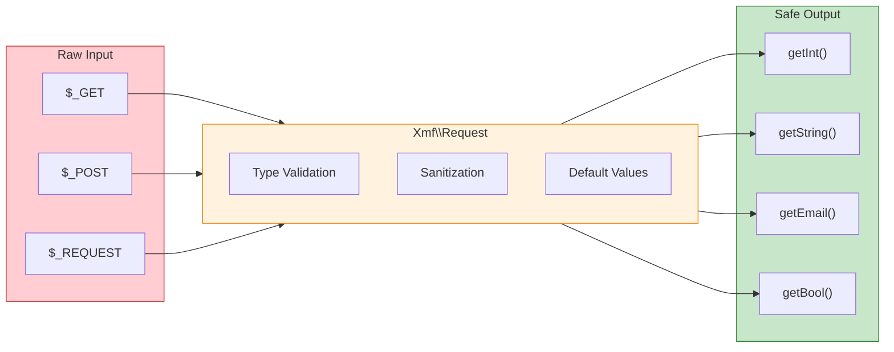

<span class="version-badge version-25x">2.5.x ✅</span> <span class="version-badge version-40x">4.0.x ✅</span>

:::tip[Most do modernega XOOPS]
XMF deluje v **tako XOOPS 2.5.x kot XOOPS 4.0.x**. To je priporočen način za posodobitev vaših modulov že danes, medtem ko se pripravljate na XOOPS 4.0. XMF zagotavlja PSR-4 samodejno nalaganje, imenske prostore in pomočnike, ki olajšajo prehod.
:::

**XOOPS Module Framework (XMF)** je močna knjižnica, zasnovana za poenostavitev in standardizacijo XOOPS razvoja modulov. XMF ponuja sodobne PHP prakse, vključno z imenskimi prostori, samodejnim nalaganjem in obsežnim naborom pomožnih razredov, ki zmanjšujejo standardno kodo in izboljšujejo vzdržljivost.

## Kaj je XMF?

XMF je zbirka razredov in pripomočkov, ki zagotavljajo:

- **Sodobna podpora za PHP** - Podpora za popoln imenski prostor s samodejnim nalaganjem PSR-4
- **Obravnava zahtev** - Varno preverjanje vnosa in sanacija
- **Module Helpers** - Poenostavljen dostop do konfiguracij modulov in predmetov
- **Sistem dovoljenj** - Upravljanje dovoljenj, ki je enostavno za uporabo
- **Pripomočki za baze podatkov** - Selitev shem in orodja za upravljanje tabel
- **JWT Podpora** - JSON Implementacija spletnega žetona za varno avtentikacijo
- **Generacija metapodatkov** - SEO in pripomočki za pridobivanje vsebine
- **Administratorski vmesnik** - Standardizirane strani za upravljanje modulov### XMF Pregled komponent

## Ključne lastnosti

### Imenski prostori in samodejno nalaganje

Vsi razredi XMF se nahajajo v imenskem prostoru `XMF`. Razredi se ob sklicevanju samodejno naložijo – priročnik ni potreben.
```php
use Xmf\Request;
use Xmf\Module\Helper;

// Classes load automatically when used
$input = Request::getString('input', '');
$helper = Helper::getHelper('mymodule');
```
### Varna obdelava zahtev

[Razred zahteve](../05-XMF-Framework/Basics/XMF-Request.md) omogoča tipsko varen dostop do podatkov zahteve HTTP z vgrajeno sanacijo:


```php
use Xmf\Request;

$id = Request::getInt('id', 0);
$name = Request::getString('name', '');
$email = Request::getEmail('email', '');
```
### Sistem za pomoč modulom

[Modul Helper] (../05-XMF-Framework/Basics/XMF-Module-Helper.md) omogoča priročen dostop do funkcij, povezanih z moduli:
```php
$helper = \Xmf\Module\Helper::getHelper('mymodule');

// Access module configuration
$configValue = $helper->getConfig('setting_name', 'default');

// Get module object
$module = $helper->getModule();

// Access handlers
$handler = $helper->getHandler('items');
```
### Upravljanje dovoljenj

[Permission-Helper](../05-XMF-Framework/Recipes/Permission-Helper.md) poenostavi XOOPS obravnavanje dovoljenj:
```php
$permHelper = new \Xmf\Module\Helper\Permission();

// Check user permission
if ($permHelper->checkPermission('view', $itemId)) {
    // User has permission
}
```
## Struktura dokumentacije

### Osnove

- [Začetek-s-XMF](../05-XMF-Framework/Basics/Getting-Started-with-XMF.md) - Namestitev in osnovna uporaba
- [XMF-Zahteva](../05-XMF-Framework/Basics/XMF-Request.md) - Obravnava zahtev in validacija vnosa
- [XMF-Module-Helper](../05-XMF-Framework/Basics/XMF-Module-Helper.md) - Uporaba pomožnega razreda modula

### Recepti

- [Permission-Helper](../05-XMF-Framework/Recipes/Permission-Helper.md) - Delo z dovoljenji
- [Module-Admin-Pages](../05-XMF-Framework/Recipes/Module-Admin-Pages.md) - Ustvarjanje standardiziranih skrbniških vmesnikov

### Referenca

- [JWT](../05-XMF-Framework/Reference/JWT.md) - JSON implementacija spletnega žetona
- [Baza podatkov](../05-XMF-Framework/Reference/Database.md) - Pripomočki za baze podatkov in upravljanje shem
- [Metagen](Reference/Metagen.md) - Metapodatki in SEO pripomočki

## Zahteve

- XOOPS 2.5.8 ali novejši
- PHP 7.2 ali novejši (PHP 8.x priporočeno)

## Namestitev

XMF je vključen v XOOPS 2.5.8 in novejše različice. Za prejšnje različice ali ročno namestitev:

1. Prenesite paket XMF iz repozitorija XOOPS
2. Ekstrakt v vaš imenik XOOPS `/class/XMF/`
3. Samodejni nalagalnik bo samodejno obravnaval nalaganje razreda

## Primer hitrega začetkaTukaj je popoln primer, ki prikazuje pogoste vzorce uporabe XMF:
```php
<?php
use Xmf\Request;
use Xmf\Module\Helper;
use Xmf\Module\Helper\Permission;

// Get module helper
$helper = Helper::getHelper('mymodule');

// Get configuration values
$itemsPerPage = $helper->getConfig('items_per_page', 10);

// Handle request input
$op = Request::getCmd('op', 'list');
$id = Request::getInt('id', 0);

// Check permissions
$permHelper = new Permission();
if (!$permHelper->checkPermission('view', $id)) {
    redirect_header('index.php', 3, 'Access denied');
}

// Process based on operation
switch ($op) {
    case 'view':
        $handler = $helper->getHandler('items');
        $item = $handler->get($id);
        // ... display item
        break;
    case 'list':
    default:
        // ... list items
        break;
}
```
## Viri

- [XMF GitHub repozitorij](https://github.com/XOOPS/XMF)
- [XOOPS Spletna stran projekta](https://XOOPS.org)

---

#XMF #XOOPS #framework #php #module-development