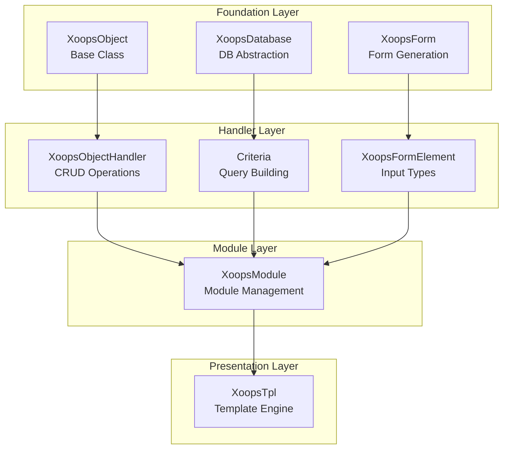
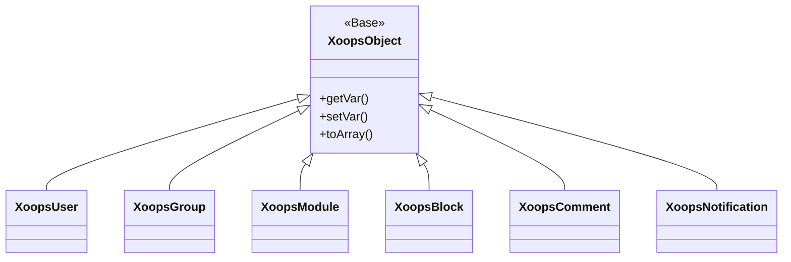
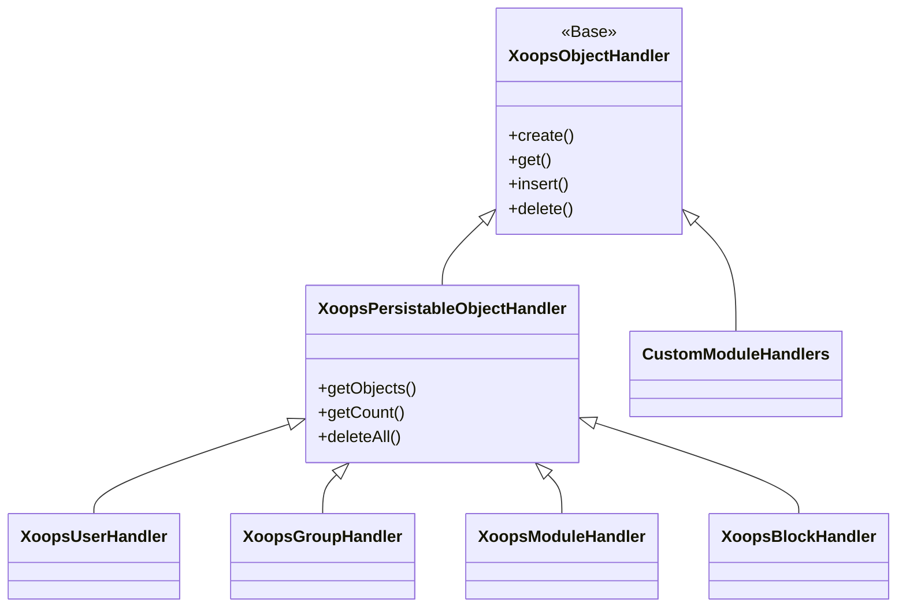
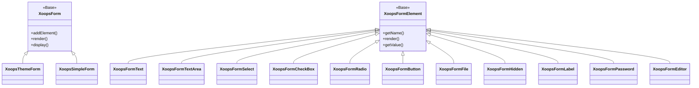

Kapsamlı XOOPS API Referans belgelerine hoş geldiniz. Bu bölüm, XOOPS İçerik Yönetim Sistemini oluşturan tüm temel sınıflar, yöntemler ve sistemler için ayrıntılı belgeler sağlar.

## Genel Bakış

XOOPS API, her biri CMS işlevselliğinin belirli bir yönünden sorumlu olan birkaç ana alt sistem halinde düzenlenmiştir. APIs'yi anlamak, XOOPS'ya yönelik modules, themes ve uzantılar geliştirmek için çok önemlidir.

## API Bölümler

### Temel Sınıflar

Diğer tüm XOOPS bileşenlerinin üzerine inşa edildiği temel sınıflar.

| Dokümantasyon | Açıklama |
|-------------|------------|
| XoopsObject | XOOPS'daki tüm veri nesneleri için temel sınıf |
| XoopsObjectHandler | CRUD işlemleri için işleyici modeli |

### database Katmanı

database soyutlama ve sorgu oluşturma yardımcı programları.

| Dokümantasyon | Açıklama |
|-------------|------------|
| XoopsDatabase | database soyutlama katmanı |
| Kriter Sistemi | Sorgu kriterleri ve koşulları |
| Sorgu Oluşturucu | Modern akıcı sorgu oluşturma |

### Form Sistemi

HTML form oluşturma ve doğrulama.

| Dokümantasyon | Açıklama |
|-------------|------------|
| XoopsForm | Form kapsayıcısı ve oluşturma |
| Form Öğeleri | Mevcut tüm form öğesi türleri |

### Core Sınıfları

Core sistem bileşenleri ve hizmetleri.

| Dokümantasyon | Açıklama |
|-------------|------------|
| Core Sınıfları | Sistem çekirdeği ve Core bileşenleri |

### module Sistemi

module yönetimi ve yaşam döngüsü.

| Dokümantasyon | Açıklama |
|-------------|------------|
| module Sistemi | module yükleme, kurulum ve yönetim |

### template Sistemi

Smarty template entegrasyonu.

| Dokümantasyon | Açıklama |
|-------------|------------|
| template Sistemi | Smarty entegrasyon ve template yönetimi |

### user Sistemi

user yönetimi ve kimlik doğrulama.

| Dokümantasyon | Açıklama |
|-------------|------------|
| user Sistemi | user hesapları, gruplar ve permissions |

## Mimariye Genel Bakış

## Sınıf Hiyerarşisi

### Nesne Modeli

### İşleyici Modeli

### Form Modeli

## Tasarım Desenleri

XOOPS API birçok iyi bilinen tasarım modelini uygular:

### Tekli Desen
database bağlantıları ve kapsayıcı bulut sunucuları gibi genel hizmetler için kullanılır.
```php
$db = XoopsDatabase::getInstance();
$container = XoopsContainer::getInstance();
```
### Fabrika Modeli
Nesne işleyicileri tutarlı bir şekilde etki alanı nesneleri oluşturur.
```php
$handler = xoops_getHandler('user');
$user = $handler->create();
```
### Kompozit Desen
Formlar birden çok form öğesi içerir; kriterler iç içe geçmiş kriterler içerebilir.
```php
$criteria = new CriteriaCompo();
$criteria->add(new Criteria('status', 1));
$criteria->add(new CriteriaCompo(...)); // Nested
```
### Gözlemci Deseni
Olay sistemi modules arasında gevşek bağlantıya izin verir.
```php
$dispatcher->addListener('module.news.article_published', $callback);
```
## Hızlı Başlangıç Örnekleri

### Nesne Oluşturma ve Kaydetme
```php
// Get the handler
$handler = xoops_getHandler('user');

// Create a new object
$user = $handler->create();
$user->setVar('uname', 'newuser');
$user->setVar('email', 'user@example.com');

// Save to database
$handler->insert($user);
```
### Kriterlerle Sorgulama
```php
// Build criteria
$criteria = new CriteriaCompo();
$criteria->add(new Criteria('level', 0, '>'));
$criteria->setSort('uname');
$criteria->setOrder('ASC');
$criteria->setLimit(10);

// Get objects
$handler = xoops_getHandler('user');
$users = $handler->getObjects($criteria);
```
### Form Oluşturma
```php
$form = new XoopsThemeForm('User Profile', 'userform', 'save.php', 'post', true);
$form->addElement(new XoopsFormText('Username', 'uname', 50, 255, $user->getVar('uname')));
$form->addElement(new XoopsFormTextArea('Bio', 'bio', $user->getVar('bio')));
$form->addElement(new XoopsFormButton('', 'submit', _SUBMIT, 'submit'));
echo $form->render();
```
## API Kurallar

### Adlandırma Kuralları

| Tür | Kongre | Örnek |
|------|-----------|-----------|
| Sınıflar | PascalCase | `XoopsUser`, `CriteriaCompo` |
| Yöntemler | deveCase | `getVar()`, `setVar()` |
| Özellikler | camelCase (korumalı) | `$_vars`, `$_handler` |
| Sabitler | UPPER_SNAKE_CASE | `XOBJ_DTYPE_INT` |
| database Tabloları | yılan_durumu | `users`, `groups_users_link` |

### Veri Türleri

XOOPS nesne değişkenleri için standart veri türlerini tanımlar:

| Sabit | Tür | Açıklama |
|----------|------|------------|
| `XOBJ_DTYPE_TXTBOX` | Dize | Metin girişi (sterilize edilmiş) |
| `XOBJ_DTYPE_TXTAREA` | Dize | Metin alanı içeriği |
| `XOBJ_DTYPE_INT` | Tamsayı | Sayısal değerler |
| `XOBJ_DTYPE_URL` | Dize | URL doğrulama |
| `XOBJ_DTYPE_EMAIL` | Dize | E-posta doğrulama |
| `XOBJ_DTYPE_ARRAY` | Dizi | Serileştirilmiş diziler |
| `XOBJ_DTYPE_OTHER` | Karışık | Özel işleme |
| `XOBJ_DTYPE_SOURCE` | Dize | Kaynak kodu (minimum temizlik) |
| `XOBJ_DTYPE_STIME` | Tamsayı | Kısa zaman damgası |
| `XOBJ_DTYPE_MTIME` | Tamsayı | Orta zaman damgası |
| `XOBJ_DTYPE_LTIME` | Tamsayı | Uzun zaman damgası |

## Kimlik Doğrulama Yöntemleri

API birden fazla kimlik doğrulama yöntemini destekler:

### API Anahtar Kimlik Doğrulaması
```
X-API-Key: your-api-key
```
### OAuth Taşıyıcı Jetonu
```
Authorization: Bearer your-oauth-token
```
### Oturum Tabanlı Kimlik Doğrulama
Oturum açtığınızda mevcut XOOPS oturumunu kullanır.

## REST API Uç noktalar

REST API etkinleştirildiğinde:

| Uç nokta | Yöntem | Açıklama |
|----------|-----------|------------|
| `/api.php/rest/users` | GET | Kullanıcıları listele |
| `/api.php/rest/users/{id}` | GET | Kullanıcıyı kimliğe göre al |
| `/api.php/rest/users` | POST | user oluştur |
| `/api.php/rest/users/{id}` | PUT | Kullanıcıyı güncelle |
| `/api.php/rest/users/{id}` | DELETE | Kullanıcıyı sil |
| `/api.php/rest/modules` | GET | Modülleri listele |

## İlgili Belgeler

- module Geliştirme Kılavuzu
- theme Geliştirme Kılavuzu
- Sistem Yapılandırması
- En İyi Güvenlik Uygulamaları

## Sürüm Geçmişi

| Sürüm | Değişiklikler |
|-----------|-----------|
| 2.5.11 | Güncel kararlı sürüm |
| 2.5.10 | GraphQL API desteği eklendi |
| 2.5.9 | Gelişmiş Kriter sistemi |
| 2.5.8 | PSR-4 otomatik yükleme desteği |

---

*Bu belgeler XOOPS Bilgi Tabanının bir parçasıdır. En son güncellemeler için [XOOPS GitHub deposunu](https://github.com/XOOPS) ziyaret edin.*