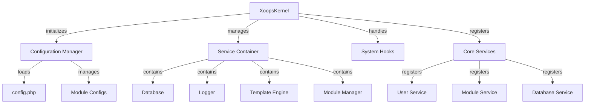

XOOPS Çekirdeği, sistemi önyüklemek, yapılandırmaları yönetmek, sistem olaylarını yönetmek ve temel yardımcı programları sağlamak için temel çerçeveyi sağlar. Bu sınıflar XOOPS uygulamasının omurgasını oluşturur.

## Sistem Mimarisi

## XoopsKernel Sınıfı

XOOPS sistemini başlatan ve yöneten ana Core sınıfı.

### Sınıfa Genel Bakış
```php
namespace Xoops;

class XoopsKernel
{
    private static ?XoopsKernel $instance = null;
    protected ServiceContainer $services;
    protected ConfigurationManager $config;
    protected array $modules = [];
    protected bool $isLoaded = false;
}
```
### Yapıcı
```php
private function __construct()
```
Özel kurucu singleton modelini zorlar.

### örnek al

Singleton Core örneğini alır.
```php
public static function getInstance(): XoopsKernel
```
**Döndürür:** `XoopsKernel` - Singleton Core örneği

**Örnek:**
```php
$kernel = XoopsKernel::getInstance();
```
### Önyükleme İşlemi

Core önyükleme işlemi şu adımları takip eder:

1. **Başlatma** - Hata işleyicilerini ayarlayın, sabitleri tanımlayın
2. **Yapılandırma** - Yapılandırma dosyalarını yükleyin
3. **Hizmet Kaydı** - Temel hizmetleri kaydedin
4. **module Algılama** - Etkin modülleri tarayın ve tanımlayın
5. **database Başlatma** - Veritabanına bağlanın
6. **Temizleme** - İstek işlemeye hazırlık
```php
public function boot(): void
```
**Örnek:**
```php
$kernel = XoopsKernel::getInstance();
$kernel->boot();
```
### Hizmet Kabı Yöntemleri

#### kayıt Hizmeti

Hizmet kapsayıcısına bir hizmeti kaydeder.
```php
public function registerService(
    string $name,
    callable|object $definition
): void
```
**Parametreler:**

| Parametre | Tür | Açıklama |
|-----------|------|------------|
| `$name` | dize | Hizmet tanımlayıcı |
| `$definition` | çağrılabilir\|nesne | Servis fabrikası veya örneği |

**Örnek:**
```php
$kernel->registerService('custom.handler', function($c) {
    return new CustomHandler();
});
```
#### Hizmet Al

Kayıtlı bir hizmeti alır.
```php
public function getService(string $name): mixed
```
**Parametreler:**

| Parametre | Tür | Açıklama |
|-----------|------|------------|
| `$name` | dize | Hizmet tanımlayıcı |

**Geri döndürür:** `mixed` - İstenen hizmet

**Örnek:**
```php
$database = $kernel->getService('database');
$logger = $kernel->getService('logger');
```
####Hizmet var

Bir hizmetin kayıtlı olup olmadığını kontrol eder.
```php
public function hasService(string $name): bool
```
**Örnek:**
```php
if ($kernel->hasService('cache')) {
    $cache = $kernel->getService('cache');
}
```
## Yapılandırma Yöneticisi

Uygulama yapılandırmasını ve module ayarlarını yönetir.

### Sınıfa Genel Bakış
```php
namespace Xoops\Core;

class ConfigurationManager
{
    protected array $config = [];
    protected array $defaults = [];
    protected string $configPath;
}
```
### Yöntemler

#### yük

Yapılandırmayı dosyadan veya diziden yükler.
```php
public function load(string|array $source): void
```
**Parametreler:**

| Parametre | Tür | Açıklama |
|-----------|------|------------|
| `$source` | dize\|dizi | Yapılandırma dosyası yolu veya dizisi |

**Örnek:**
```php
$config = $kernel->getService('config');
$config->load(XOOPS_ROOT_PATH . '/include/config.php');
$config->load(['sitename' => 'My Site', 'admin_email' => 'admin@example.com']);
```
#### al

Bir yapılandırma değeri alır.
```php
public function get(string $key, mixed $default = null): mixed
```
**Parametreler:**

| Parametre | Tür | Açıklama |
|-----------|------|------------|
| `$key` | dize | Yapılandırma anahtarı (nokta gösterimi) |
| `$default` | karışık | Bulunmazsa varsayılan değer |

**Döndürür:** `mixed` - Yapılandırma değeri

**Örnek:**
```php
$siteName = $config->get('sitename');
$adminEmail = $config->get('admin.email', 'admin@example.com');
```
#### ayarla

Bir konfigürasyon değeri ayarlar.
```php
public function set(string $key, mixed $value): void
```
**Parametreler:**

| Parametre | Tür | Açıklama |
|-----------|------|------------|
| `$key` | dize | Yapılandırma anahtarı |
| `$value` | karışık | Yapılandırma değeri |

**Örnek:**
```php
$config->set('sitename', 'New Site Name');
$config->set('features.cache_enabled', true);
```
#### getModuleConfig

Belirli bir module için yapılandırmayı alır.
```php
public function getModuleConfig(
    string $moduleName
): array
```
**Parametreler:**

| Parametre | Tür | Açıklama |
|-----------|------|------------|
| `$moduleName` | dize | module dizini adı |

**Döndürür:** `array` - module yapılandırma dizisi

**Örnek:**
```php
$publisherConfig = $config->getModuleConfig('publisher');
```
## Sistem Kancaları

Sistem kancaları, modüllerin ve eklentilerin uygulama yaşam döngüsünün belirli noktalarında kod yürütmesine olanak tanır.

### HookManager Sınıfı
```php
namespace Xoops\Core;

class HookManager
{
    protected array $hooks = [];
    protected array $listeners = [];
}
```
### Yöntemler

#### addHook

Bir kanca noktası kaydeder.
```php
public function addHook(string $name): void
```
**Parametreler:**

| Parametre | Tür | Açıklama |
|-----------|------|------------|
| `$name` | dize | Kanca tanımlayıcı |

**Örnek:**
```php
$hooks = $kernel->getService('hooks');
$hooks->addHook('system.startup');
$hooks->addHook('user.login');
$hooks->addHook('module.install');
```
#### dinle

Bir dinleyiciyi kancaya bağlar.
```php
public function listen(
    string $hookName,
    callable $callback,
    int $priority = 10
): void
```
**Parametreler:**

| Parametre | Tür | Açıklama |
|-----------|------|------------|
| `$hookName` | dize | Kanca tanımlayıcı |
| `$callback` | çağrılabilir | Yürütülecek işlev |
| `$priority` | int | Yürütme önceliği (önce yüksek çalıştırmalar) |

**Örnek:**
```php
$hooks->listen('user.login', function($user) {
    error_log('User ' . $user->uname . ' logged in');
}, 10);

$hooks->listen('module.install', function($module) {
    // Custom module installation logic
    echo "Installing " . $module->getName();
}, 5);
```
#### tetikleyici

Bir kanca için tüm dinleyicileri çalıştırır.
```php
public function trigger(
    string $hookName,
    mixed $arguments = null
): array
```
**Parametreler:**

| Parametre | Tür | Açıklama |
|-----------|------|------------|
| `$hookName` | dize | Kanca tanımlayıcı |
| `$arguments` | karışık | Dinleyicilere aktarılacak veriler |

**Geri döndürür:** `array` - Tüm dinleyicilerden gelen sonuçlar

**Örnek:**
```php
$results = $hooks->trigger('system.startup');
$results = $hooks->trigger('user.created', $newUser);
```
## Temel Hizmetlere Genel Bakış

Core, önyükleme sırasında birkaç temel hizmeti kaydeder:

| Hizmet | Sınıf | Amaç |
|-----------|----------|-----------|
| `database` | XoopsDatabase | database soyutlama katmanı |
| `config` | Yapılandırma Yöneticisi | Konfigürasyon yönetimi |
| `logger` | Kaydedici | Uygulama günlüğü |
| `template` | XoopsTpl | template motoru |
| `user` | user Yöneticisi | user yönetimi hizmeti |
| `module` | module Yöneticisi | module yönetimi |
| `cache` | cache Yöneticisi | Önbelleğe alma katmanı |
| `hooks` | Kanca Yöneticisi | Sistem olay kancaları |

## Tam Kullanım Örneği
```php
<?php
/**
 * Custom module boot process utilizing kernel
 */

// Get kernel instance
$kernel = XoopsKernel::getInstance();

// Boot the system
$kernel->boot();

// Get services
$config = $kernel->getService('config');
$database = $kernel->getService('database');
$logger = $kernel->getService('logger');
$hooks = $kernel->getService('hooks');

// Access configuration
$siteName = $config->get('sitename');
$adminEmail = $config->get('admin.email');

// Register module-specific hooks
$hooks->listen('user.login', function($user) {
    // Log user login
    $logger->info('User login: ' . $user->uname);

    // Track in database
    $database->query(
        'INSERT INTO ' . $database->prefix('event_log') .
        ' (type, user_id, message, timestamp) VALUES (?, ?, ?, ?)',
        ['login', $user->uid(), 'User login', time()]
    );
});

$hooks->listen('module.install', function($module) {
    $logger->info('Module installed: ' . $module->getName());
});

// Trigger hooks
$hooks->trigger('system.startup');

// Use database service
$result = $database->query(
    'SELECT * FROM ' . $database->prefix('users') .
    ' LIMIT 10'
);

while ($row = $database->fetchArray($result)) {
    echo "User: " . htmlspecialchars($row['uname']) . "\n";
}

// Register custom service
$kernel->registerService('custom.repository', function($c) {
    return new CustomRepository($c->getService('database'));
});

// Later access custom service
$repo = $kernel->getService('custom.repository');
```
## Temel Sabitler

Core, önyükleme sırasında birkaç önemli sabiti tanımlar:
```php
// System paths
define('XOOPS_ROOT_PATH', '/var/www/xoops');
define('XOOPS_HTDOCS_PATH', XOOPS_ROOT_PATH . '/htdocs');
define('XOOPS_MODULES_PATH', XOOPS_ROOT_PATH . '/htdocs/modules');
define('XOOPS_THEMES_PATH', XOOPS_ROOT_PATH . '/htdocs/themes');

// Web paths
define('XOOPS_URL', 'http://example.com');
define('XOOPS_HTDOCS_URL', XOOPS_URL . '/htdocs');

// Database
define('XOOPS_DB_PREFIX', 'xoops_');
```
## Hata İşleme

Core, önyükleme sırasında hata işleyicilerini ayarlar:
```php
// Set custom error handler
set_error_handler(function($errno, $errstr, $errfile, $errline) {
    $kernel->getService('logger')->error(
        "Error: $errstr in $errfile:$errline"
    );
});

// Set exception handler
set_exception_handler(function($exception) {
    $kernel->getService('logger')->critical(
        "Exception: " . $exception->getMessage()
    );
});
```
## En İyi Uygulamalar

1. **Tek Önyükleme** - Uygulama başlatılırken `boot()`'yi yalnızca bir kez arayın
2. **Hizmet Kapsayıcısını Kullanın** - Hizmetleri Core aracılığıyla kaydedin ve alın
3. **Kancaları Erken Ele Alın** - Kanca dinleyicilerini tetiklemeden önce kaydedin
4. **Önemli Olayları Günlüğe Kaydet** - Hata ayıklama için günlükçü hizmetini kullanın
5. **cache Yapılandırması** - Yapılandırmayı bir kez yükleyin ve yeniden kullanın
6. **Hata İşleme** - İstekleri işleme koymadan önce daima hata işleyicileri ayarlayın

## İlgili Belgeler

- ../Module/Module-System - module sistemi ve yaşam döngüsü
- ../Template/Template-System - template motoru entegrasyonu
- ../User/User-System - user kimlik doğrulaması ve yönetimi
- ../Database/XoopsDatabase - database katmanı

---

*Ayrıca bakınız: [XOOPS Core Kaynağı](https://github.com/XOOPS/XoopsCore27/tree/master/htdocs/class)*