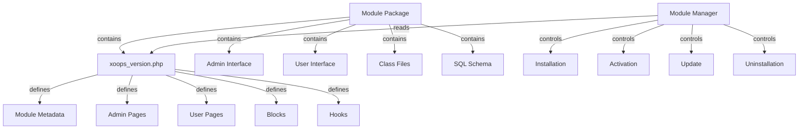

XOOPS module Sistemi, module işlevselliğini geliştirmek, kurmak, yönetmek ve genişletmek için eksiksiz bir çerçeve sağlar. modules, XOOPS'yi ek özellikler ve yeteneklerle genişleten bağımsız paketlerdir.

## module Mimarisi

## module Yapısı

Standart XOOPS module dizin yapısı:
```
mymodule/
├── xoops_version.php          # Module manifest and configuration
├── admin.php                  # Admin main page
├── index.php                  # User main page
├── admin/                     # Admin pages directory
│   ├── main.php
│   ├── manage.php
│   └── settings.php
├── class/                     # Module classes
│   ├── Handler/
│   │   ├── ItemHandler.php
│   │   └── CategoryHandler.php
│   └── Objects/
│       ├── Item.php
│       └── Category.php
├── sql/                       # Database schemas
│   ├── mysql.sql
│   └── postgres.sql
├── include/                   # Include files
│   ├── common.inc.php
│   └── functions.php
├── templates/                 # Module templates
│   ├── admin/
│   │   └── main.tpl
│   └── user/
│       ├── index.tpl
│       └── item.tpl
├── blocks/                    # Module blocks
│   └── blocks.php
├── tests/                     # Unit tests
├── language/                  # Language files
│   ├── english/
│   │   └── main.php
│   └── spanish/
│       └── main.php
└── docs/                      # Documentation
```
## XoopsModule Sınıfı

XoopsModule sınıfı, kurulu bir XOOPS modülünü temsil eder.

### Sınıfa Genel Bakış
```php
namespace Xoops\Core\Module;

class XoopsModule extends XoopsObject
{
    protected int $moduleid = 0;
    protected string $name = '';
    protected string $dirname = '';
    protected string $version = '';
    protected string $description = '';
    protected array $config = [];
    protected array $blocks = [];
    protected array $adminPages = [];
    protected array $userPages = [];
}
```
### Özellikler

| Emlak | Tür | Açıklama |
|----------|------|------------|
| `$moduleid` | int | Benzersiz module kimliği |
| `$name` | dize | module görünen adı |
| `$dirname` | dize | module dizini adı |
| `$version` | dize | Mevcut module sürümü |
| `$description` | dize | module açıklaması |
| `$config` | dizi | module konfigürasyonu |
| `$blocks` | dizi | module blokları |
| `$adminPages` | dizi | Yönetici paneli sayfaları |
| `$userPages` | dizi | Kullanıcıya yönelik sayfalar |

### Yapıcı
```php
public function __construct()
```
Yeni bir module örneği oluşturur ve değişkenleri başlatır.

### Temel Yöntemler

#### getName

Modülün görünen adını alır.
```php
public function getName(): string
```
**Döndürür:** `string` - module görünen adı

**Örnek:**
```php
$module = new XoopsModule();
$module->setVar('name', 'Publisher');
echo $module->getName(); // "Publisher"
```
#### getDirname

Modülün dizin adını alır.
```php
public function getDirname(): string
```
**Döndürür:** `string` - module dizini adı

**Örnek:**
```php
echo $module->getDirname(); // "publisher"
```
#### Sürümü Al

Geçerli module sürümünü alır.
```php
public function getVersion(): string
```
**Döndürür:** `string` - Sürüm dizesi

**Örnek:**
```php
echo $module->getVersion(); // "2.1.0"
```
#### getDescription

module açıklamasını alır.
```php
public function getDescription(): string
```
**Döndürür:** `string` - module açıklaması

**Örnek:**
```php
$desc = $module->getDescription();
```
#### getConfig

module yapılandırmasını alır.
```php
public function getConfig(string $key = null): mixed
```
**Parametreler:**

| Parametre | Tür | Açıklama |
|-----------|------|------------|
| `$key` | dize | Yapılandırma anahtarı (hepsi için boş) |

**Döndürür:** `mixed` - Yapılandırma değeri veya dizisi

**Örnek:**
```php
$config = $module->getConfig();
$itemsPerPage = $module->getConfig('items_per_page');
```
#### setConfig

module yapılandırmasını ayarlar.
```php
public function setConfig(string $key, mixed $value): void
```
**Parametreler:**

| Parametre | Tür | Açıklama |
|-----------|------|------------|
| `$key` | dize | Yapılandırma anahtarı |
| `$value` | karışık | Yapılandırma değeri |

**Örnek:**
```php
$module->setConfig('items_per_page', 20);
$module->setConfig('enable_cache', true);
```
#### GetPath

Modülün tam dosya sistemi yolunu alır.
```php
public function getPath(): string
```
**Döndürür:** `string` - Mutlak module dizin yolu

**Örnek:**
```php
$path = $module->getPath(); // "/var/www/xoops/modules/publisher"
$classPath = $module->getPath() . '/class';
```
#### getUrl

URL'yi modüle alır.
```php
public function getUrl(): string
```
**Geri döndürür:** `string` - module URL

**Örnek:**
```php
$url = $module->getUrl(); // "http://example.com/modules/publisher"
```
## module Kurulum Süreci

### xoops_module_install İşlev

`xoops_version.php`'de tanımlanan module kurulum işlevi:
```php
function xoops_module_install_modulename($module)
{
    // $module is an XoopsModule instance

    // Create database tables
    // Initialize default configuration
    // Create default folders
    // Set up file permissions

    return true; // Success
}
```
**Parametreler:**

| Parametre | Tür | Açıklama |
|-----------|------|------------|
| `$module` | XoopsModule | Kurulan module |

**Döndürür:** `bool` - Başarı durumunda doğru, başarısızlık durumunda yanlış

**Örnek:**
```php
function xoops_module_install_publisher($module)
{
    // Get module path
    $modulePath = $module->getPath();

    // Create uploads directory
    $uploadsPath = XOOPS_ROOT_PATH . '/uploads/publisher';
    if (!is_dir($uploadsPath)) {
        mkdir($uploadsPath, 0755, true);
    }

    // Get database connection
    global $xoopsDB;

    // Execute SQL installation script
    $sqlFile = $modulePath . '/sql/mysql.sql';
    if (file_exists($sqlFile)) {
        $sqlQueries = file_get_contents($sqlFile);
        // Execute queries (simplified)
        $xoopsDB->queryFromFile($sqlFile);
    }

    // Set default configuration
    $module->setConfig('items_per_page', 10);
    $module->setConfig('enable_comments', true);

    return true;
}
```
### xoops_module_uninstall İşlev

module kaldırma işlevi:
```php
function xoops_module_uninstall_modulename($module)
{
    // Drop database tables
    // Remove uploaded files
    // Clean up configuration

    return true;
}
```
**Örnek:**
```php
function xoops_module_uninstall_publisher($module)
{
    global $xoopsDB;

    // Drop tables
    $tables = ['publisher_items', 'publisher_categories', 'publisher_comments'];
    foreach ($tables as $table) {
        $xoopsDB->query('DROP TABLE IF EXISTS ' . $xoopsDB->prefix($table));
    }

    // Remove upload folder
    $uploadsPath = XOOPS_ROOT_PATH . '/uploads/publisher';
    if (is_dir($uploadsPath)) {
        // Recursive directory deletion
        $this->recursiveRemoveDir($uploadsPath);
    }

    return true;
}
```
## module Kancaları

module kancaları, modüllerin diğer modüllerle ve sistemle entegre olmasını sağlar.

### Kanca Bildirgesi

`xoops_version.php`'de:
```php
$modversion['hooks'] = [
    'system.page.footer' => [
        'function' => 'publisher_page_footer'
    ],
    'user.profile.view' => [
        'function' => 'publisher_user_articles'
    ],
];
```
### Kanca Uygulaması
```php
// In a module file (e.g., include/hooks.php)

function publisher_page_footer()
{
    // Return HTML for footer
    return '<div class="publisher-footer">Publisher Footer Content</div>';
}

function publisher_user_articles($user_id)
{
    global $xoopsDB;

    // Get user's articles
    $result = $xoopsDB->query(
        'SELECT * FROM ' . $xoopsDB->prefix('publisher_articles') .
        ' WHERE author_id = ? ORDER BY published DESC LIMIT 5',
        [$user_id]
    );

    $articles = [];
    while ($row = $xoopsDB->fetchAssoc($result)) {
        $articles[] = $row;
    }

    return $articles;
}
```
### Mevcut Sistem Kancaları

| Kanca | Parametreler | Açıklama |
|------|-----------|------------|
| `system.page.header` | Yok | Sayfa başlığı çıktısı |
| `system.page.footer` | Yok | Sayfa altbilgisi çıktısı |
| `user.login.success` | $user nesnesi | user oturum açtıktan sonra |
| `user.logout` | $user nesnesi | user oturumu kapattıktan sonra |
| `user.profile.view` | $user_id | user profili görüntüleniyor |
| `module.install` | $module nesnesi | module kurulumu |
| `module.uninstall` | $module nesnesi | module kaldırma |

## module Yöneticisi Hizmeti

ModuleManager hizmeti module işlemlerini yönetir.

### Yöntemler

#### getModule

Bir modülü ada göre alır.
```php
public function getModule(string $dirname): ?XoopsModule
```
**Parametreler:**

| Parametre | Tür | Açıklama |
|-----------|------|------------|
| `$dirname` | dize | module dizini adı |

**Döndürür:** `?XoopsModule` - module örneği veya boş

**Örnek:**
```php
$moduleManager = $kernel->getService('module');
$publisher = $moduleManager->getModule('publisher');
if ($publisher) {
    echo $publisher->getName();
}
```
#### getAllModules

Kurulu tüm modülleri alır.
```php
public function getAllModules(bool $activeOnly = true): array
```
**Parametreler:**

| Parametre | Tür | Açıklama |
|-----------|------|------------|
| `$activeOnly` | bool | Yalnızca etkin modülleri döndür |

**Döndürür:** `array` - XoopsModule nesnelerinin dizisi

**Örnek:**
```php
$activeModules = $moduleManager->getAllModules(true);
foreach ($activeModules as $module) {
    echo $module->getName() . " - " . $module->getVersion() . "\n";
}
```
#### isModuleActive

Bir modülün aktif olup olmadığını kontrol eder.
```php
public function isModuleActive(string $dirname): bool
```
**Örnek:**
```php
if ($moduleManager->isModuleActive('publisher')) {
    // Publisher module is active
}
```
#### activeModule

Bir modülü etkinleştirir.
```php
public function activateModule(string $dirname): bool
```
**Örnek:**
```php
if ($moduleManager->activateModule('publisher')) {
    echo "Publisher activated";
}
```
#### deactivateModule

Bir modülü devre dışı bırakır.
```php
public function deactivateModule(string $dirname): bool
```
**Örnek:**
```php
if ($moduleManager->deactivateModule('publisher')) {
    echo "Publisher deactivated";
}
```
## module Yapılandırması (xoops_version.php)

Tam module manifest örneği:
```php
<?php
/**
 * Module manifest for Publisher
 */

$modversion = [
    'name' => 'Publisher',
    'version' => '2.1.0',
    'description' => 'Professional content publishing module',
    'author' => 'XOOPS Community',
    'credits' => 'Based on original work by...',
    'license' => 'GPL v2',
    'official' => 1,
    'image' => 'images/logo.png',
    'dirname' => 'publisher',
    'onInstall' => 'xoops_module_install_publisher',
    'onUpdate' => 'xoops_module_update_publisher',
    'onUninstall' => 'xoops_module_uninstall_publisher',

    // Admin pages
    'hasAdmin' => 1,
    'adminindex' => 'admin/main.php',
    'adminmenu' => [
        [
            'title' => 'Dashboard',
            'link' => 'admin/main.php',
            'icon' => 'dashboard.png'
        ],
        [
            'title' => 'Manage Items',
            'link' => 'admin/items.php',
            'icon' => 'items.png'
        ],
        [
            'title' => 'Settings',
            'link' => 'admin/settings.php',
            'icon' => 'settings.png'
        ]
    ],

    // User pages
    'hasMain' => 1,
    'main_file' => 'index.php',

    // Blocks
    'blocks' => [
        [
            'file' => 'blocks/recent.php',
            'name' => 'Recent Articles',
            'description' => 'Display recent published articles',
            'show_func' => 'publisher_recent_show',
            'edit_func' => 'publisher_recent_edit',
            'options' => '5|0|0',
            'template' => 'publisher_block_recent.tpl'
        ],
        [
            'file' => 'blocks/featured.php',
            'name' => 'Featured Articles',
            'description' => 'Display featured articles',
            'show_func' => 'publisher_featured_show',
            'edit_func' => 'publisher_featured_edit'
        ]
    ],

    // Module hooks
    'hooks' => [
        'system.page.footer' => [
            'function' => 'publisher_page_footer'
        ],
        'user.profile.view' => [
            'function' => 'publisher_user_articles'
        ]
    ],

    // Configuration items
    'config' => [
        [
            'name' => 'items_per_page',
            'title' => '_MI_PUBLISHER_ITEMS_PER_PAGE',
            'description' => '_MI_PUBLISHER_ITEMS_PER_PAGE_DESC',
            'formtype' => 'text',
            'valuetype' => 'int',
            'default' => '10'
        ],
        [
            'name' => 'enable_comments',
            'title' => '_MI_PUBLISHER_ENABLE_COMMENTS',
            'description' => '_MI_PUBLISHER_ENABLE_COMMENTS_DESC',
            'formtype' => 'yesno',
            'valuetype' => 'int',
            'default' => '1'
        ]
    ]
];

function xoops_module_install_publisher($module)
{
    // Installation logic
    return true;
}

function xoops_module_update_publisher($module)
{
    // Update logic
    return true;
}

function xoops_module_uninstall_publisher($module)
{
    // Uninstallation logic
    return true;
}
```
## En İyi Uygulamalar

1. **Sınıflarınızın Ad Alanı** - Çakışmaları önlemek için modüle özgü ad alanlarını kullanın

2. **İşleyicileri Kullan** - database işlemleri için her zaman işleyici sınıflarını kullanın

3. **İçeriği Uluslararasılaştırın** - Kullanıcıya yönelik tüm dizeler için dil sabitlerini kullanın

4. **Kurulum Komut Dosyaları Oluşturun** - database tabloları için SQL şemaları sağlayın

5. **Belge Kancaları** - Modülünüzün hangi kancaları sağladığını açıkça belgeleyin

6. **Modülünüzün Sürümünü Oluşturun** - Sürüm numaralarını sürümlerle birlikte artırın

7. **Test Kurulumu** - install/uninstall işlemlerini kapsamlı bir şekilde test edin

8. **İzinleri Yönetme** - Eylemlere izin vermeden önce user izinlerini kontrol edin

## Tam module Örneği
```php
<?php
/**
 * Custom Article Module Main Page
 */

include __DIR__ . '/include/common.inc.php';

// Get module instance
$module = xoops_getModuleByDirname('mymodule');

// Check if module is active
if (!$module) {
    die('Module not found');
}

// Get module configuration
$itemsPerPage = $module->getConfig('items_per_page');

// Get item handler
$itemHandler = xoops_getModuleHandler('item', 'mymodule');

// Fetch items with pagination
$criteria = new CriteriaCompo();
$criteria->add(new Criteria('status', 1));
$items = $itemHandler->getObjects($criteria, $itemsPerPage);

// Prepare template
$xoopsTpl->assign('items', $items);
$xoopsTpl->assign('module_name', $module->getName());
$xoopsTpl->display($module->getPath() . '/templates/user/index.tpl');
```
## İlgili Belgeler

- ../Kernel/Kernel-Classes - Core başlatma ve temel hizmetler
- ../Template/Template-System - module şablonları ve theme entegrasyonu
- ../Database/QueryBuilder - database sorgusu oluşturma
- ../Core/XoopsObject - Temel nesne sınıfı

---

*Ayrıca bakınız: [XOOPS module Geliştirme Kılavuzu](https://github.com/XOOPS/XoopsCore27/wiki/Module-Development)*