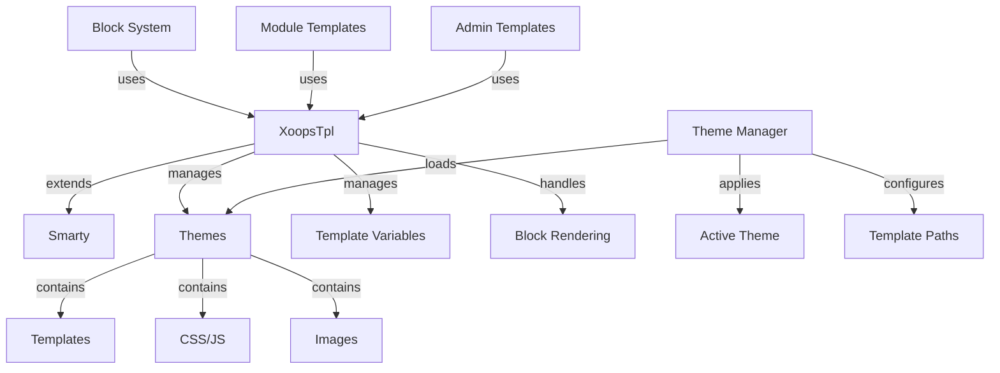

XOOPS template Sistemi, güçlü Smarty template motoru üzerine kurulmuştur ve sunum mantığını iş mantığından ayırmanın esnek ve genişletilebilir bir yolunu sağlar. Temaları, template oluşturmayı, değişken atamayı ve dinamik içerik oluşturmayı yönetir.

## template Mimarisi

## XoopsTpl Sınıfı

Smarty'yi genişleten ana template motor sınıfı.

### Sınıfa Genel Bakış
```php
namespace Xoops\Core;

class XoopsTpl extends Smarty
{
    protected array $vars = [];
    protected string $currentTheme = '';
    protected array $blocks = [];
    protected bool $isAdmin = false;
}
```
### Genişletiliyor Smarty
```php
use Xoops\Core\XoopsTpl;

class XoopsTpl extends Smarty
{
    private static ?XoopsTpl $instance = null;

    private function __construct()
    {
        parent::__construct();
        $this->configureDirectories();
        $this->registerPlugins();
    }

    public static function getInstance(): XoopsTpl
    {
        if (!isset(self::$instance)) {
            self::$instance = new self();
        }
        return self::$instance;
    }
}
```
### Temel Yöntemler

#### getInstance

Singleton template örneğini alır.
```php
public static function getInstance(): XoopsTpl
```
**Döndürür:** `XoopsTpl` - Singleton örneği

**Örnek:**
```php
$xoopsTpl = XoopsTpl::getInstance();
```
#### atama

Şablona bir değişken atar.
```php
public function assign(
    string|array $tplVar,
    mixed $value = null
): void
```
**Parametreler:**

| Parametre | Tür | Açıklama |
|-----------|------|------------|
| `$tplVar` | dize\|dizi | Değişken adı veya ilişkisel dizi |
| `$value` | karışık | Değişken değer |

**Örnek:**
```php
$xoopsTpl->assign('page_title', 'Welcome');
$xoopsTpl->assign('user_name', 'John Doe');

// Multiple assignments
$xoopsTpl->assign([
    'items' => $items,
    'total_count' => count($items),
    'show_pagination' => true
]);
```
#### AppendAssign

Değerleri template dizisi değişkenlerine ekler.
```php
public function appendAssign(
    string $tplVar,
    mixed $value
): void
```
**Parametreler:**

| Parametre | Tür | Açıklama |
|-----------|------|------------|
| `$tplVar` | dize | Değişken adı |
| `$value` | karışık | Eklenecek değer |

**Örnek:**
```php
$xoopsTpl->assign('breadcrumbs', ['Home']);
$xoopsTpl->appendAssign('breadcrumbs', 'Blog');
$xoopsTpl->appendAssign('breadcrumbs', 'Posts');
// breadcrumbs = ['Home', 'Blog', 'Posts']
```
#### getAssignedVars

Atanan tüm template değişkenlerini alır.
```php
public function getAssignedVars(): array
```
**Döndürür:** `array` - Atanan değişkenler

**Örnek:**
```php
$vars = $xoopsTpl->getAssignedVars();
foreach ($vars as $name => $value) {
    echo "$name = " . var_export($value, true) . "\n";
}
```
#### ekran

Bir template oluşturur ve tarayıcıya çıktı verir.
```php
public function display(
    string $resource,
    string|array $cache_id = null,
    string $compile_id = null,
    object $parent = null
): void
```
**Parametreler:**

| Parametre | Tür | Açıklama |
|-----------|------|------------|
| `$resource` | dize | template dosya yolu |
| `$cache_id` | dize\|dizi | cache tanımlayıcı |
| `$compile_id` | dize | Tanımlayıcıyı derleyin |
| `$parent` | nesne | Ana template nesnesi |

**Örnek:**
```php
$xoopsTpl->assign('page_title', 'Home');
$xoopsTpl->display('user:index.tpl');

// With absolute path
$xoopsTpl->display(XOOPS_ROOT_PATH . '/templates/user/index.tpl');
```
#### getir

Bir template oluşturur ve dize olarak geri döner.
```php
public function fetch(
    string $resource,
    string|array $cache_id = null,
    string $compile_id = null,
    object $parent = null
): string
```
**Getirir:** `string` - Oluşturulan template içeriği

**Örnek:**
```php
$xoopsTpl->assign('message', 'Hello World');
$html = $xoopsTpl->fetch('user:message.tpl');
echo $html;

// Use for email templates
$emailContent = $xoopsTpl->fetch('mail:notification.tpl');
mail($to, $subject, $emailContent);
```
#### LoadTheme

Belirli bir theme yükler.
```php
public function loadTheme(string $themeName): bool
```
**Parametreler:**

| Parametre | Tür | Açıklama |
|-----------|------|------------|
| `$themeName` | dize | theme dizini adı |

**Döndürür:** `bool` - Başarı durumunda doğru

**Örnek:**
```php
if ($xoopsTpl->loadTheme('bluemoon')) {
    echo "Theme loaded successfully";
}
```
#### getCurrentTheme

Şu anda aktif olan temanın adını alır.
```php
public function getCurrentTheme(): string
```
**Getirir:** `string` - theme adı

**Örnek:**
```php
$currentTheme = $xoopsTpl->getCurrentTheme();
echo "Active theme: $currentTheme";
```
#### setOutputFilter

template çıktısını işlemek için bir çıktı filtresi ekler.
```php
public function setOutputFilter(string $function): void
```
**Parametreler:**

| Parametre | Tür | Açıklama |
|-----------|------|------------|
| `$function` | dize | Filtre işlevi adı |

**Örnek:**
```php
// Remove whitespace from output
$xoopsTpl->setOutputFilter('trim');

// Custom filter
function my_output_filter($output) {
    // Minify HTML
    $output = preg_replace('/\s+/', ' ', $output);
    return trim($output);
}
$xoopsTpl->setOutputFilter('my_output_filter');
```
#### kayıt eklentisi

Özel bir Smarty eklentisini kaydeder.
```php
public function registerPlugin(
    string $type,
    string $name,
    callable $callback
): void
```
**Parametreler:**

| Parametre | Tür | Açıklama |
|-----------|------|------------|
| `$type` | dize | Eklenti türü (değiştirici, blok, işlev) |
| `$name` | dize | Eklenti adı |
| `$callback` | çağrılabilir | Geri arama işlevi |

**Örnek:**
```php
// Register custom modifier
$xoopsTpl->registerPlugin('modifier', 'markdown', function($text) {
    return markdown_parse($text);
});

// Use in template: {$content|markdown}

// Register custom block tag
$xoopsTpl->registerPlugin('block', 'permission', function($params, $content, $smarty, &$repeat) {
    if ($repeat) return;

    // Check permission
    if (has_permission($params['name'])) {
        return $content;
    }
    return '';
});

// Use in template: {permission name="admin"}...{/permission}
```
## theme Sistemi

### theme Yapısı

Standart XOOPS theme dizini yapısı:
```
bluemoon/
├── style.css              # Main stylesheet
├── admin.css              # Admin stylesheet
├── theme.html             # Main page template
├── admin.html             # Admin page template
├── blocks/                # Block templates
│   ├── block_left.tpl
│   └── block_right.tpl
├── modules/               # Module templates
│   ├── publisher/
│   │   ├── index.tpl
│   │   └── item.tpl
│   └── news/
│       └── index.tpl
├── images/                # Theme images
│   ├── logo.png
│   └── banner.png
├── js/                    # Theme JavaScript
│   └── script.js
└── readme.txt             # Theme documentation
```
### theme Yöneticisi Sınıfı
```php
namespace Xoops\Core\Theme;

class ThemeManager
{
    protected array $themes = [];
    protected string $activeTheme = '';
    protected string $themeDirectory = '';

    public function getActiveTheme(): string {}
    public function setActiveTheme(string $theme): bool {}
    public function getThemeList(): array {}
    public function themeExists(string $name): bool {}
}
```
## template Değişkenleri

### Standart Global Değişkenler

XOOPS birkaç global template değişkenini otomatik olarak atar:

| Değişken | Tür | Açıklama |
|----------|------|------------|
| `$xoops_url` | dize | XOOPS kurulum URL |
| `$xoops_user` | XoopsUser\|null | Geçerli user nesnesi |
| `$xoops_uname` | dize | Mevcut user adı |
| `$xoops_isadmin` | bool | user admin |
| `$xoops_banner` | dize | Banner HTML |
| `$xoops_notification` | dize | Bildirim işaretlemesi |
| `$xoops_version` | dize | XOOPS sürümü |

### Bloğa Özel Değişkenler

Blokları işlerken:

| Değişken | Tür | Açıklama |
|----------|------|------------|
| `$block` | dizi | Bilgileri engelle |
| `$block.title` | dize | Blok başlığı |
| `$block.content` | dize | İçeriği engelle |
| `$block.id` | int | Blok Kimliği |
| `$block.module` | dize | module adı |

### module Şablonu Değişkenleri

modules genellikle şunları atar:

| Değişken | Tür | Açıklama |
|----------|------|------------|
| `$module_name` | dize | module görünen adı |
| `$module_dir` | dize | module dizini |
| `$xoops_module_header` | dize | module CSS/JS |

## Smarty Yapılandırma

### Ortak Smarty Değiştiriciler

| Değiştirici | Açıklama | Örnek |
|----------|----------------|-----------|
| `capitalize` | İlk harfi büyük yap | `{$title\|capitalize}` |
| `count_characters` | Karakter sayısı | `{$text\|count_characters}` |
| `date_format` | Zaman damgasını biçimlendir | `{$timestamp\|date_format:'%Y-%m-%d'}` |
| `escape` | Özel karakterlerden kaçış | `{$html\|escape:'html'}` |
| `nl2br` | Yeni satırları `<br>`'ye dönüştür | `{$text\|nl2br}` |
| `strip_tags` | HTML etiketlerini kaldırın | `{$content\|strip_tags}` |
| `truncate` | Dize uzunluğunu sınırlayın | `{$text\|truncate:100}` |
| `upper` | Büyük harfe dönüştür | `{$name\|upper}` |
| `lower` | Küçük harfe dönüştür | `{$name\|lower}` |

### Kontrol Yapıları
```smarty
{* If statement *}
{if $user->isAdmin()}
    <p>Admin content</p>
{else}
    <p>User content</p>
{/if}

{* For loop *}
{foreach $items as $item}
    <div class="item">{$item.title}</div>
{/foreach}

{* For loop with counter *}
{foreach $items as $item name=item_loop}
    {$smarty.foreach.item_loop.iteration}: {$item.title}
{/foreach}

{* While loop *}
{while $condition}
    <!-- content -->
{/while}

{* Switch statement *}
{switch $status}
    {case 'draft'}<span class="draft">Draft</span>{break}
    {case 'published'}<span class="published">Published</span>{break}
    {default}<span class="unknown">Unknown</span>
{/switch}
```
## Tam template Örneği

### PHP Kodu
```php
<?php
/**
 * Module Article List Page
 */

include __DIR__ . '/include/common.inc.php';

$xoopsTpl = XoopsTpl::getInstance();

// Check if module is active
$module = xoops_getModuleByDirname('articles');
if (!$module) {
    redirect_header(XOOPS_URL, 3, 'Module not found');
}

// Get item handler
$itemHandler = xoops_getModuleHandler('item', 'articles');

// Get pagination parameters
$page = !empty($_GET['page']) ? (int)$_GET['page'] : 1;
$perPage = $module->getConfig('items_per_page') ?: 10;
$offset = ($page - 1) * $perPage;

// Build criteria
$criteria = new CriteriaCompo();
$criteria->add(new Criteria('status', 1));
$criteria->setSort('published', 'DESC');
$criteria->setLimit($perPage);
$criteria->setStart($offset);

// Fetch items
$items = $itemHandler->getObjects($criteria);
$total = $itemHandler->getCount(new Criteria('status', 1));

// Calculate pagination
$pages = ceil($total / $perPage);

// Assign template variables
$xoopsTpl->assign([
    'module_name' => $module->getName(),
    'items' => $items,
    'total_items' => $total,
    'current_page' => $page,
    'total_pages' => $pages,
    'items_per_page' => $perPage,
    'show_pagination' => $pages > 1
]);

// Add breadcrumbs
$xoopsTpl->assign('xoops_breadcrumbs', [
    ['url' => XOOPS_URL, 'title' => 'Home'],
    ['url' => $module->getUrl(), 'title' => $module->getName()],
    ['title' => 'Articles']
]);

// Display template
$xoopsTpl->display($module->getPath() . '/templates/user/list.tpl');
```
### template Dosyası (list.tpl)
```smarty
<div id="articles-list">
    <h1>{$module_name|escape}</h1>

    {if $items}
        <div class="articles-container">
            {foreach $items as $item}
                <article class="article-item">
                    <header>
                        <h2>
                            <a href="{$item.url|escape}">
                                {$item.title|escape}
                            </a>
                        </h2>
                        <div class="meta">
                            <span class="author">By {$item.author|escape}</span>
                            <span class="date">
                                {$item.published|date_format:'%B %d, %Y'}
                            </span>
                        </div>
                    </header>

                    <div class="content">
                        <p>{$item.summary|truncate:150}</p>
                    </div>

                    <footer>
                        <a href="{$item.url|escape}" class="read-more">
                            Read More »
                        </a>
                    </footer>
                </article>
            {/foreach}
        </div>

        {* Pagination *}
        {if $show_pagination}
            <nav class="pagination">
                {if $current_page > 1}
                    <a href="?page=1" class="first">« First</a>
                    <a href="?page={$current_page - 1}" class="prev">‹ Previous</a>
                {/if}

                {for $i=1 to $total_pages}
                    {if $i == $current_page}
                        <span class="current">{$i}</span>
                    {else}
                        <a href="?page={$i}">{$i}</a>
                    {/if}
                {/for}

                {if $current_page < $total_pages}
                    <a href="?page={$current_page + 1}" class="next">Next ›</a>
                    <a href="?page={$total_pages}" class="last">Last »</a>
                {/if}
            </nav>
        {/if}
    {else}
        <p class="no-items">No articles found.</p>
    {/if}
</div>
```
## Özel Smarty Fonksiyonlar

### Özel Blok İşlevi Oluşturma
```php
<?php
/**
 * Custom Smarty block function for permission checking
 */

function smarty_block_permission($params, $content, $smarty, &$repeat)
{
    if ($repeat) return;

    if (!isset($params['name'])) {
        return 'Permission name required';
    }

    $permName = $params['name'];
    $user = $GLOBALS['xoopsUser'];

    // Check if user has permission
    if ($user && $user->isAdmin()) {
        return $content;
    }

    if ($user && check_user_permission($user->uid(), $permName)) {
        return $content;
    }

    return '';
}
```
Kaydolun ve kullanın:
```php
$xoopsTpl->registerPlugin('block', 'permission', 'smarty_block_permission');
```
template:
```smarty
{permission name="edit_articles"}
    <button>Edit Article</button>
{/permission}
```
## En İyi Uygulamalar

1. **user İçeriğinden Kaçış** - user tarafından oluşturulan içerik için her zaman `|escape` kullanın
2. **template Yollarını Kullan** - Temaya göre referans şablonları
3. **Mantığı Sunumdan Ayırın** - Karmaşık mantığı PHP'de tutun
4. **cache Şablonları** - Üretimde şablonu önbelleğe almayı etkinleştirin
5. **Değiştiricileri Doğru Kullanın** - Bağlam için uygun filtreleri uygulayın
6. **Blokları Organize Edin** - Blok şablonlarını özel dizine yerleştirin
7. **Değişkenleri Belgele** - Tüm template değişkenlerini PHP'de belgeleyin

## İlgili Belgeler

- ../Module/Module-System - module sistemi ve hooks
- ../Kernel/Kernel-Classes - Core ve konfigürasyon
- ../Core/XoopsObject - Temel nesne sınıfı

---

*Ayrıca bakınız: [Smarty Belgeler](https://www.smarty.net/docs) | [XOOPS template API](https://github.com/XOOPS/XoopsCore27/tree/master/htdocs/class)*