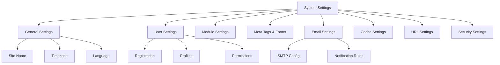

# XOOPS Sistem Ayarları

Bu kılavuz, kategoriye göre düzenlenmiş olarak XOOPS yönetici panelinde bulunan tüm sistem ayarlarını kapsar.

## Sistem Ayarları Mimarisi

## Sistem Ayarlarına Erişim

### Konum

**Yönetici Paneli > Sistem > Tercihler**

Veya doğrudan gezinin:
```
http://your-domain.com/xoops/admin/index.php?fct=preferences
```
### İzin Gereksinimleri

- Sistem ayarlarına yalnızca yöneticiler (web yöneticileri) erişebilir
- Değişiklikler sitenin tamamını etkiler
- Çoğu değişiklik anında yürürlüğe girer

## Genel Ayarlar

XOOPS kurulumunuz için temel yapılandırma.

### Temel Bilgiler
```
Site Name: [Your Site Name]
Default Description: [Brief description of your site]
Site Slogan: [Catchy slogan]
Admin Email: admin@your-domain.com
Webmaster Name: Administrator Name
Webmaster Email: admin@your-domain.com
```
### Görünüm Ayarları
```
Default Theme: [Select theme]
Default Language: English (or preferred language)
Items Per Page: 15 (typically 10-25)
Words in Snippet: 25 (for search results)
Theme Upload Permission: Disabled (security)
```
### Bölgesel Ayarlar
```
Default Timezone: [Your timezone]
Date Format: %Y-%m-%d (YYYY-MM-DD format)
Time Format: %H:%M:%S (HH:MM:SS format)
Daylight Saving Time: [Auto/Manual/None]
```
**Saat Dilimi Format Tablosu:**

| Bölge | Saat Dilimi | UTC Ofset |
|---|---|---|
| ABD Doğu | America/New_York | -5 / -4 |
| ABD Merkezi | America/Chicago | -6 / -5 |
| ABD Dağı | America/Denver | -7 / -6 |
| ABD Pasifik | America/Los_Angeles | -8 / -7 |
| UK/London | Europe/London | 0 / +1 |
| France/Germany | Europe/Paris | +1 / +2 |
| Japonya | Asia/Tokyo | +9 |
| Çin | Asia/Shanghai | +8 |
| Australia/Sydney | Australia/Sydney | +10 / +11 |

### Arama Yapılandırması
```
Enable Search: Yes
Search Admin Pages: Yes/No
Search Archives: Yes
Default Search Type: All / Pages only
Words Excluded from Search: [Comma-separated list]
```
**Yaygın olarak hariç tutulan kelimeler:** the, a, an, and, or, but, in, on, at, by, to, from

## user Ayarları

user hesabı davranışını ve kayıt sürecini kontrol edin.

### user Kaydı
```
Allow User Registration: Yes/No
Registration Type:
  ☐ Auto-activate (Instant access)
  ☐ Admin approval (Admin must approve)
  ☐ Email verification (User must verify email)

Notification to Users: Yes/No
User Email Verification: Required/Optional
```
### Yeni user Yapılandırması
```
Auto-login New Users: Yes/No
Assign Default User Group: Yes
Default User Group: [Select group]
Create User Avatar: Yes/No
Initial User Avatar: [Select default]
```
### user Profili Ayarları
```
Allow User Profiles: Yes
Show Member List: Yes
Show User Statistics: Yes
Show Last Online Time: Yes
Allow User Avatar: Yes
Avatar Max File Size: 100KB
Avatar Dimensions: 100x100 pixels
```
### user E-posta Ayarları
```
Allow Users to Hide Email: Yes
Show Email on Profile: Yes
Notification Email Interval: Immediately/Daily/Weekly/Never
```
### user Etkinliği Takibi
```
Track User Activity: Yes
Log User Logins: Yes
Log Failed Logins: Yes
Track IP Address: Yes
Clear Activity Logs Older Than: 90 days
```
### Hesap Sınırları
```
Allow Duplicate Email: No
Minimum Username Length: 3 characters
Maximum Username Length: 15 characters
Minimum Password Length: 6 characters
Require Special Characters: Yes
Require Numbers: Yes
Password Expiration: 90 days (or Never)
Accounts Inactive Days to Delete: 365 days
```
## module Ayarları

Bireysel module davranışını yapılandırın.

### Ortak module Seçenekleri

Kurulu her module için şunları ayarlayabilirsiniz:
```
Module Status: Active/Inactive
Display in Menu: Yes/No
Module Weight: [1-999] (higher = lower in display)
Homepage Default: This module shows when visiting /
Admin Access: [Allowed user groups]
User Access: [Allowed user groups]
```
### Sistem Modülü Ayarları
```
Show Homepage as: Portal / Module / Static Page
Default Homepage Module: [Select module]
Show Footer Menu: Yes
Footer Color: [Color selector]
Show System Stats: Yes
Show Memory Usage: Yes
```
### module Başına Yapılandırma

Her modülün modüle özel ayarları olabilir:

**Örnek - Sayfa Modülü:**
```
Enable Comments: Yes/No
Moderate Comments: Yes/No
Comments Per Page: 10
Enable Ratings: Yes
Allow Anonymous Ratings: Yes
```
**Örnek - user Modülü:**
```
Avatar Upload Folder: ./uploads/
Maximum Upload Size: 100KB
Allow File Upload: Yes
Allowed File Types: jpg, gif, png
```
Modüle özel ayarlara erişin:
- **Yönetici > modules > [module Adı] > Tercihler**

## Meta Etiketler & SEO Ayarlar

Arama motoru optimizasyonu için meta etiketleri yapılandırın.

### Küresel Meta Etiketleri
```
Meta Keywords: xoops, cms, content management system
Meta Description: A powerful content management system for building dynamic websites
Meta Author: Your Name
Meta Copyright: Copyright 2025, Your Company
Meta Robots: index, follow
Meta Revisit: 30 days
```
### Meta Etiketi En İyi Uygulamaları

| Etiket | Amaç | Tavsiye |
|---|---|---|
| Anahtar Kelimeler | Arama terimleri | 5-10 alakalı anahtar kelime, virgülle ayrılmış |
| Açıklama | Listede ara | 150-160 karakter |
| Yazar | Sayfa yaratıcısı | Adınız veya şirketiniz |
| Telif Hakkı | Yasal | Telif hakkı bildiriminiz |
| Robotlar | Tarayıcı talimatları | dizin, takip et (indekslemeye izin ver) |

### Alt Bilgi Ayarları
```
Show Footer: Yes
Footer Color: Dark/Light
Footer Background: [Color code]
Footer Text: [HTML allowed]
Additional Footer Links: [URL and text pairs]
```
**Örnek Alt Bilgi HTML:**
```html
<p>Copyright &copy; 2025 Your Company. All rights reserved.</p>
<p><a href="/privacy">Privacy Policy</a> | <a href="/terms">Terms of Use</a></p>
```
### Sosyal Meta Etiketleri (Açık Grafik)
```
Enable Open Graph: Yes
Facebook App ID: [App ID]
Twitter Card Type: summary / summary_large_image / player
Default Share Image: [Image URL]
```
## E-posta Ayarları

E-posta dağıtımını ve bildirim sistemini yapılandırın.

### E-posta Teslim Yöntemi
```
Use SMTP: Yes/No

If SMTP:
  SMTP Host: smtp.gmail.com
  SMTP Port: 587 (TLS) or 465 (SSL)
  SMTP Security: TLS / SSL / None
  SMTP Username: [email@example.com]
  SMTP Password: [password]
  SMTP Authentication: Yes/No
  SMTP Timeout: 10 seconds

If PHP mail():
  Sendmail Path: /usr/sbin/sendmail -t -i
```
### E-posta Yapılandırması
```
From Address: noreply@your-domain.com
From Name: Your Site Name
Reply-To Address: support@your-domain.com
BCC Admin Emails: Yes/No
```
### Bildirim Ayarları
```
Send Welcome Email: Yes/No
Welcome Email Subject: Welcome to [Site Name]
Welcome Email Body: [Custom message]

Send Password Reset Email: Yes/No
Include Random Password: Yes/No
Token Expiration: 24 hours
```
### Yönetici Bildirimleri
```
Notify Admin on Registration: Yes
Notify Admin on Comments: Yes
Notify Admin on Submissions: Yes
Notify Admin on Errors: Yes
```
### user Bildirimleri
```
Notify User on Registration: Yes
Notify User on Comments: Yes
Notify User on Private Messages: Yes
Allow Users to Disable Notifications: Yes
Default Notification Frequency: Immediately
```
### E-posta Şablonları

Yönetici panelinde bildirim e-postalarını özelleştirin:

**Yol:** Sistem > E-posta Şablonları

Mevcut templates:
- user Kaydı
- Şifre Sıfırlama
- Yorum Bildirimi
- Özel Mesaj
- Sistem Uyarıları
- Modüle özel e-postalar

## cache Ayarları

Önbelleğe alma yoluyla performansı optimize edin.

### cache Yapılandırması
```
Enable Caching: Yes/No
Cache Type:
  ☐ File Cache
  ☐ APCu (Alternative PHP Cache)
  ☐ Memcache (Distributed caching)
  ☐ Redis (Advanced caching)

Cache Lifetime: 3600 seconds (1 hour)
```
### Türe Göre cache Seçenekleri

**Dosya Önbelleği:**
```
Cache Directory: /var/www/html/xoops/cache/
Clear Interval: Daily
Maximum Cache Files: 1000
```
**APCu Önbelleği:**
```
Memory Allocation: 128MB
Fragmentation Level: Low
```
**Memcache/Redis:**
```
Server Host: localhost
Server Port: 11211 (Memcache) / 6379 (Redis)
Persistent Connection: Yes
```
### Neler Önbelleğe Alınır?
```
Cache Module Lists: Yes
Cache Configuration Data: Yes
Cache Template Data: Yes
Cache User Session Data: Yes
Cache Search Results: Yes
Cache Database Queries: Yes
Cache RSS Feeds: Yes
Cache Images: Yes
```
## URL Ayarlar

URL yeniden yazma ve biçimlendirmeyi yapılandırın.

### Dost canlısı URL Ayarlar
```
Enable Friendly URLs: Yes/No
Friendly URL Type:
  ☐ Path Info: /page/about
  ☐ Query String: /index.php?p=about

Trailing Slash: Include / Omit
URL Case: Lower case / Case sensitive
```
### URL Kuralları Yeniden Yaz
```
.htaccess Rules: [Display current]
Nginx Rules: [Display current if Nginx]
IIS Rules: [Display current if IIS]
```
## Güvenlik Ayarları

Güvenlikle ilgili yapılandırmayı kontrol edin.

### Şifre Güvenliği
```
Password Policy:
  ☐ Require uppercase letters
  ☐ Require lowercase letters
  ☐ Require numbers
  ☐ Require special characters

Minimum Password Length: 8 characters
Password Expiration: 90 days
Password History: Remember last 5 passwords
Force Password Change: On next login
```
### Giriş Güvenliği
```
Lock Account After Failed Attempts: 5 attempts
Lock Duration: 15 minutes
Log All Login Attempts: Yes
Log Failed Logins: Yes
Admin Login Alert: Send email on admin login
Two-Factor Authentication: Disabled/Enabled
```
### Dosya Yükleme Güvenliği
```
Allow File Uploads: Yes/No
Maximum File Size: 128MB
Allowed File Types: jpg, gif, png, pdf, zip, doc, docx
Scan Uploads for Malware: Yes (if available)
Quarantine Suspicious Files: Yes
```
### Oturum Güvenliği
```
Session Management: Database/Files
Session Timeout: 1800 seconds (30 min)
Session Cookie Lifetime: 0 (until browser closes)
Secure Cookie: Yes (HTTPS only)
HTTP Only Cookie: Yes (prevent JavaScript access)
```
### CORS Ayarlar
```
Allow Cross-Origin Requests: No
Allowed Origins: [List domains]
Allow Credentials: No
Allowed Methods: GET, POST
```
## Gelişmiş Ayarlar

İleri düzey users için ek yapılandırma seçenekleri.

### Hata Ayıklama Modu
```
Debug Mode: Disabled/Enabled
Log Level: Error / Warning / Info / Debug
Debug Log File: /var/log/xoops_debug.log
Display Errors: Disabled (production)
```
### Performans Ayarlama
```
Optimize Database Queries: Yes
Use Query Cache: Yes
Compress Output: Yes
Minify CSS/JavaScript: Yes
Lazy Load Images: Yes
```
### İçerik Ayarları
```
Allow HTML in Posts: Yes/No
Allowed HTML Tags: [Configure]
Strip Harmful Code: Yes
Allow Embed: Yes/No
Content Moderation: Automatic/Manual
Spam Detection: Yes
```
## Ayarlar Export/Import

### Yedekleme Ayarları

Geçerli ayarları dışa aktar:

**Yönetici Paneli > Sistem > Araçlar > Dışa Aktarma Ayarları**
```bash
# Settings exported as JSON file
# Download and store securely
```
### Ayarları Geri Yükle

Daha önce dışa aktarılan ayarları içe aktarın:

**Yönetici Paneli > Sistem > Araçlar > İçe Aktarma Ayarları**
```bash
# Upload JSON file
# Verify changes before confirming
```
## Yapılandırma Hiyerarşisi

XOOPS ayarlar hiyerarşisi (yukarıdan aşağıya - ilk maç kazanır):
```
1. mainfile.php (Constants)
2. Module-specific config
3. Admin System Settings
4. Theme configuration
5. User preferences (for user-specific settings)
```
## Ayarlar Yedekleme Komut Dosyası

Mevcut ayarların bir yedeğini oluşturun:
```php
<?php
// Backup script: /var/www/html/xoops/backup-settings.php
require_once __DIR__ . '/mainfile.php';

$config_handler = xoops_getHandler('config');
$configs = $config_handler->getConfigs();

$backup = [
    'exported_date' => date('Y-m-d H:i:s'),
    'xoops_version' => XOOPS_VERSION,
    'php_version' => PHP_VERSION,
    'settings' => []
];

foreach ($configs as $config) {
    $backup['settings'][$config->getVar('conf_name')] = [
        'value' => $config->getVar('conf_value'),
        'description' => $config->getVar('conf_desc'),
        'type' => $config->getVar('conf_type'),
    ];
}

// Save to JSON file
file_put_contents(
    '/backups/xoops_settings_' . date('YmdHis') . '.json',
    json_encode($backup, JSON_PRETTY_PRINT)
);

echo "Settings backed up successfully!";
?>
```
## Ortak Ayar Değişiklikleri

### Site Adını Değiştir

1. Yönetici > Sistem > Tercihler > Genel Ayarlar
2. "Site Adı"nı değiştirin
3. "Kaydet"e tıklayın

### Enable/Disable Kayıt

1. Yönetici > Sistem > Tercihler > user Ayarları
2. "user Kaydına İzin Ver" seçeneğini değiştirin
3. Kayıt türünü seçin
4. "Kaydet"e tıklayın

### Varsayılan Temayı Değiştir

1. Yönetici > Sistem > Tercihler > Genel Ayarlar
2. "Varsayılan theme"yı seçin
3. "Kaydet"e tıklayın
4. Değişikliklerin etkili olması için önbelleği temizleyin

### İletişim E-postasını Güncelleyin

1. Yönetici > Sistem > Tercihler > Genel Ayarlar
2. "Yönetici E-postası"nı değiştirin
3. "Web Yöneticisi E-postası"nı değiştirin
4. "Kaydet"e tıklayın

## Doğrulama Kontrol Listesi

Sistem ayarlarını yapılandırdıktan sonra şunları doğrulayın:

- [ ] Site adı doğru şekilde görüntüleniyor
- [ ] Saat dilimi doğru zamanı gösteriyor
- [ ] E-posta bildirimleri düzgün bir şekilde gönderiliyor
- [ ] user kaydı yapılandırıldığı gibi çalışır
- [ ] Ana sayfa seçilen varsayılanı görüntüler
- [ ] Arama işlevi çalışıyor
- [ ] cache sayfa yükleme süresini artırır
- [ ] Kolay URLs çalışması (etkinse)
- [ ] Meta etiketleri sayfa kaynağında görünür
- [ ] Yönetici bildirimleri alındı
- [ ] Güvenlik ayarları uygulandı

## Sorun Giderme Ayarları

### Ayarlar Kaydedilmiyor

**Çözüm:**
```bash
# Check file permissions on config directory
chmod 755 /var/www/html/xoops/var/

# Verify database writable
# Try saving again in admin panel
```
### Değişiklikler Etkili Olmuyor

**Çözüm:**
```bash
# Clear cache
rm -rf /var/www/html/xoops/cache/*
rm -rf /var/www/html/xoops/templates_c/*

# If still not working, restart web server
systemctl restart apache2
```
### E-posta Gönderilemiyor

**Çözüm:**
1. E-posta ayarlarında SMTP kimlik bilgilerini doğrulayın
2. "Test E-postası Gönder" düğmesiyle test edin
3. Hata günlüklerini kontrol edin
4. SMTP yerine PHP mail() kullanmayı deneyin

## Sonraki Adımlar

Sistem ayarları yapılandırmasından sonra:

1. Güvenlik ayarlarını yapılandırın
2. Performansı optimize edin
3. Yönetici paneli özelliklerini keşfedin
4. user yönetimini ayarlayın

---

**Etiketler:** #sistem ayarları #yapılandırma #tercihler #yönetici paneli

**İlgili Makaleler:**
- ../../06-Publisher-Module/User-Guide/Basic-Configuration
- Güvenlik Yapılandırması
- Performans-Optimizasyon
- ../First-Steps/Admin-Panel-Overview