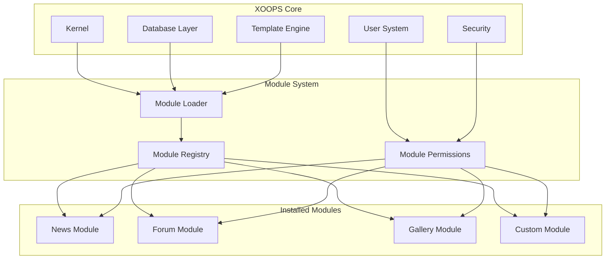
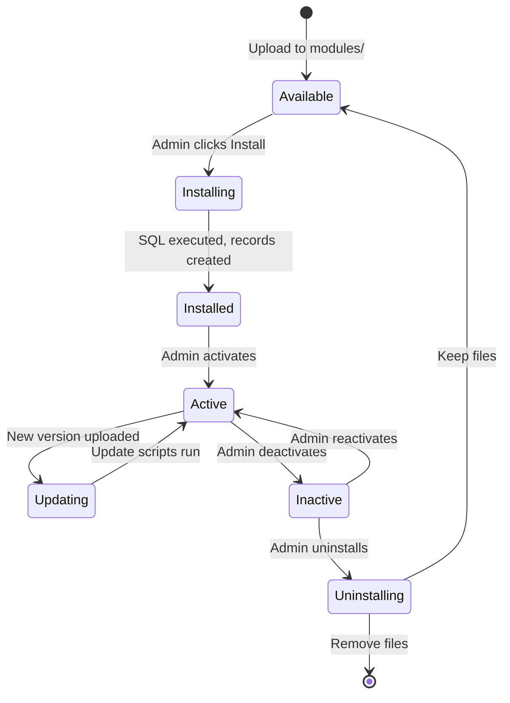

# ADR-001: Modüler Mimari

> XOOPS'nin temel modüler tasarım felsefesi için Mimari Karar Kaydı.

---

## Durum

**Kabul edildi** - XOOPS kuruluşundan bu yana temel karar

---

## Bağlam

XOOPS (Genişletilebilir Nesne Yönelimli Portal Sistemi) şunları yapabilecek bir mimariye ihtiyaç duyuyordu:

1. Üçüncü taraf geliştiricilerin işlevselliği genişletmesine izin verin
2. Site yöneticilerinin kodlamadan özelleştirme yapmasına olanak sağlayın
3. Bağımsız gelişimi ve güncellemeleri destekleyin
4. Farklı özellikler arasında izolasyon sağlayın
5. Basit bloglardan karmaşık portallara kadar ölçeklendirin

2000'li yılların başlarındaki CMS ortamı, özelleştirilmesi ve genişletilmesi zor olan yekpare sistemler sunuyordu.

---

## Karar Diyagramı

---

## Karar

**Modüler bir mimari** uygulayacağız:

### 1. Core Altyapı Sağlar
- database soyutlaması
- user kimlik doğrulaması ve izinleri
- template oluşturma (Smarty)
- Güvenlik hizmetleri
- Form oluşturma
- Ortak yardımcı programlar

### 2. modules Bağımsızdır
Her module:
- Kendi dizin yapısına sahiptir
- Kendi sınıflarını, şablonlarını içerir, SQL
- Kendi konfigürasyonunu tanımlar
- Bağımsız olarak installed/uninstalled olabilir
- Sürüm takibi var

### 3. Standart module Yapısı
```
modules/modulename/
├── admin/                  # Admin interface
│   ├── index.php
│   └── menu.php
├── class/                  # PHP classes
├── include/                # Include files
├── language/               # Translations
├── sql/                    # Database schema
├── templates/              # Smarty templates
├── blocks/                 # Block definitions
├── xoops_version.php       # Module manifest
├── index.php               # Entry point
└── header.php              # Module bootstrap
```
### 4. module Bildirimi (xoops_version.php)
```php
<?php
$modversion['name']        = 'Module Name';
$modversion['version']     = '1.0.0';
$modversion['description'] = 'Module description';
$modversion['dirname']     = basename(__DIR__);
$modversion['hasMain']     = 1;
$modversion['hasAdmin']    = 1;
$modversion['sqlfile']['mysql'] = 'sql/mysql.sql';
$modversion['tables']      = ['modulename_table1'];
$modversion['templates']   = [...];
$modversion['config']      = [...];
$modversion['blocks']      = [...];
```
### 5. module İletişimi
- Core APIs aracılığıyla (işleyiciler, events)
- database ilişkileri
- Ön yükleme kancaları
- Paylaşılan hizmetler

---

## module Yaşam Döngüsü

---

## Sonuçlar

### Olumlu

1. **Genişletilebilirlik**: Topluluk tarafından oluşturulan binlerce module
2. **Bağımsızlık**: modules ayrı ayrı geliştirilebilir
3. **Esneklik**: Siteler özellikleri karıştırıp eşleştirebilir
4. **Bakım Kolaylığı**: Güncellemeler diğer modülleri etkilemez
5. **Pazar Yeri**: module ekosistemi ortaya çıktı
6. **Öğrenme eğrisi**: Geliştiriciler tek bir modeli öğrenir

### Negatif

1. **Genel Gider**: Her modülün önyükleme maliyeti vardır
2. **Çoğaltma**: Ortak kod tekrarlanabilir
3. **Entegrasyon**: modules arası özellikler dikkatli tasarım gerektirir
4. **Sürüm oluşturma**: module uyumluluk yönetimi gereklidir
5. **Kalite farkı**: Üçüncü taraf module kalitesi değişiklik gösterir

### Nötr

1. **database**: Her module kendi tablolarını yönetir
2. **templates**: theme çeşitli modülleri barındırmalıdır
3. **Güncellemeler**: Core ve modules bağımsız olarak güncellenir

---

## Alternatifler Değerlendirildi

### 1. Monolitik Mimari
**Reddedildi** - Çok katı, özelleştirilmesi zor

### 2. Eklenti Mimarisi (WordPress tarzı)
**Kısmen benimsenmiştir** - Bloklar ve ön yüklemeler, modules içinde eklenti benzeri hooks sağlar

### 3. Bileşen Mimarisi (Joomla tarzı)
**Reddedildi** - Daha karmaşık, daha az geliştirici dostu

### 4. Mikro hizmetler
**Geçerli değil** - Paylaşımlı barındırma dönemi için fazla karmaşık

---

## İlgili Kararlar

- ADR-002: Nesneye Yönelik database Erişimi
- ADR-003: Smarty template Motoru
- ADR-005: İzin Sistemi

---

## Referanslar

- XOOPS Proje Geçmişi
- PHP Uygulama Mimarisi Desenleri
- CMS Karşılaştırma Çalışmaları (2001-2005)

---

#xoops #architecture #adr #modules #tasarım-karar