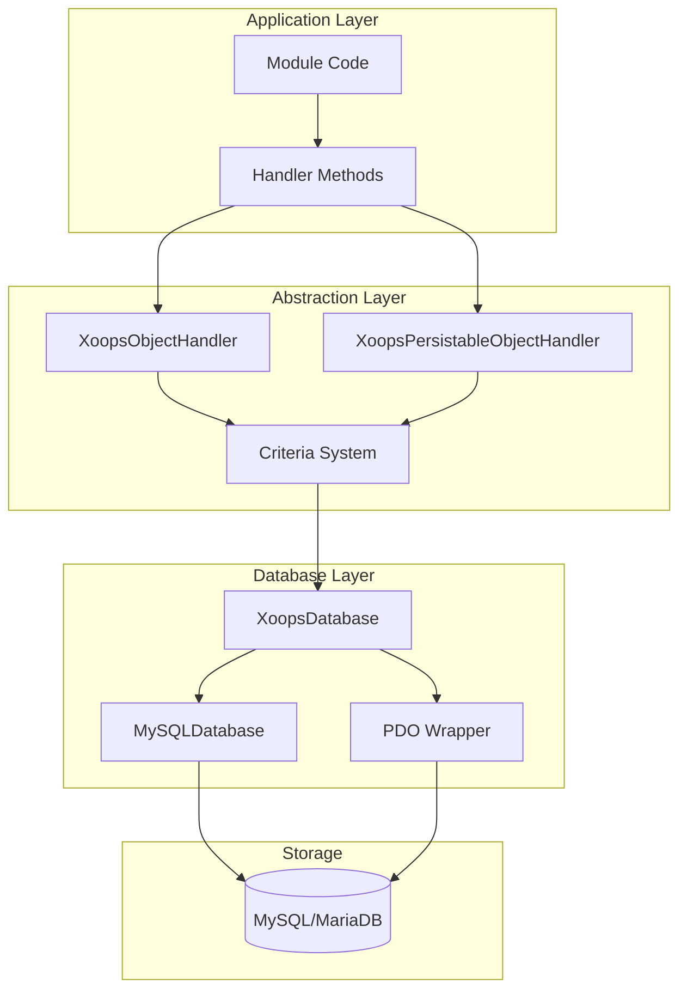
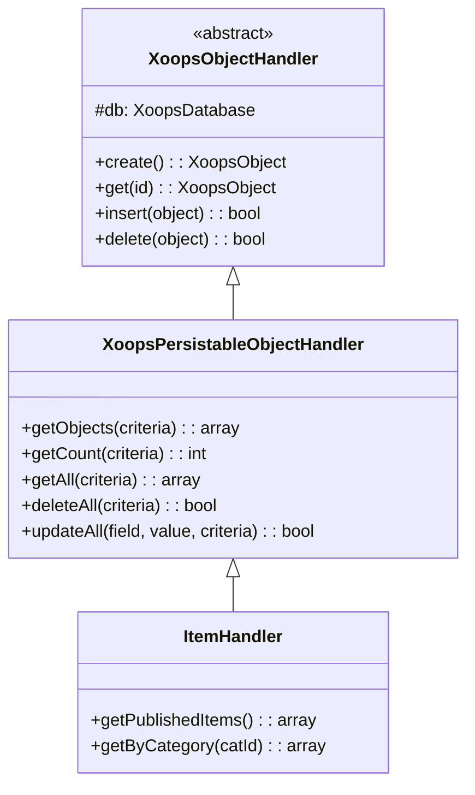
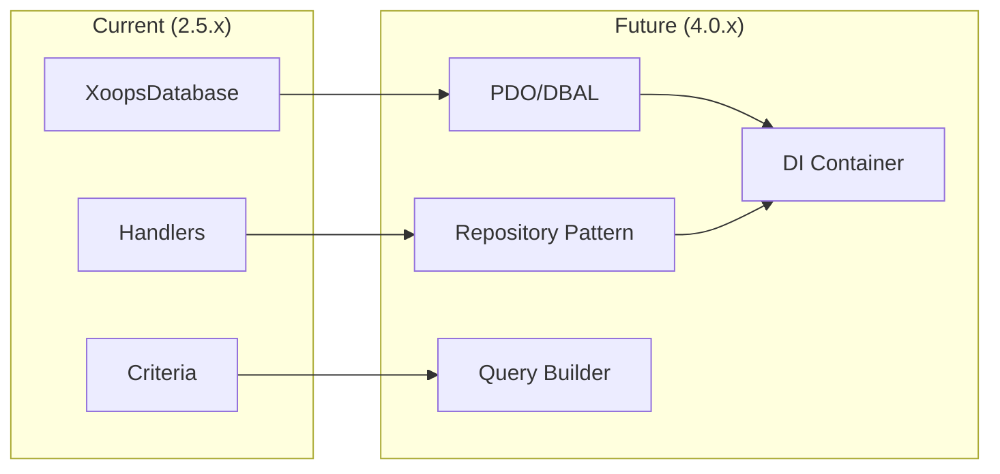

# ADR-002: database Soyutlaması

> XOOPS'nin nesne yönelimli database erişim modeli için Mimari Karar Kaydı.

---

## Durum

**Kabul edildi** - XOOPS 2.0'dan beri temel model

---

## Bağlam

XOOPS'nin aşağıdakileri sağlayacak bir database etkileşimi stratejisine ihtiyacı vardı:

1. Veritabanına özgü SQL sözdizimini soyutlayın
2. Tüm modüllerde tutarlı CRUD işlemleri sağlayın
3. Otomatik veri temizlemeyi ve kaçışı etkinleştirin
4. Gelecekteki database motoru değişikliklerini destekleyin
5. Geliştiriciler için ortak işlemleri basitleştirin

Alternatifler şunlardı:
- Kod tabanı boyunca ham SQL
- Tam ORM (Doktrin, Etkili)
- Özel hafif soyutlama

---

## Karar Diyagramı

---

## Karar

Aşağıdakilerle bir **İşleyici Modeli** uygulayacağız:

### 1. XoopsObject - Veri Kabı

Her veri varlığı XoopsObject'yi genişletir:
```php
class Item extends XoopsObject
{
    public function __construct()
    {
        $this->initVar('id', XOBJ_DTYPE_INT, null, false);
        $this->initVar('title', XOBJ_DTYPE_TXTBOX, '', true, 255);
        $this->initVar('content', XOBJ_DTYPE_TXTAREA, '', false);
        $this->initVar('status', XOBJ_DTYPE_INT, 0, false);
    }
}
```
### 2. Sorumlu - Operasyon Müdürü

Her nesnenin karşılık gelen bir işleyicisi vardır:
```php
class ItemHandler extends XoopsPersistableObjectHandler
{
    public function __construct($db)
    {
        parent::__construct($db, 'mymodule_items', Item::class, 'id', 'title');
    }

    // CRUD methods inherited:
    // - create(), get(), insert(), delete()
    // - getObjects(), getCount(), getAll()
}
```
### 3. Kriterler - Sorgu Oluşturucu

Nesneye yönelik sorgu koşulları:
```php
$criteria = new CriteriaCompo();
$criteria->add(new Criteria('status', 1));
$criteria->add(new Criteria('created', time() - 86400, '>='));
$criteria->setSort('created');
$criteria->setOrder('DESC');
$criteria->setLimit(10);

$items = $handler->getObjects($criteria);
```
---

## Veri Türü Sabitleri
```php
// Variable types with automatic sanitization
XOBJ_DTYPE_INT       // Integer
XOBJ_DTYPE_TXTBOX    // Single-line text (escaped)
XOBJ_DTYPE_TXTAREA   // Multi-line text (escaped)
XOBJ_DTYPE_EMAIL     // Email validation
XOBJ_DTYPE_URL       // URL validation
XOBJ_DTYPE_ARRAY     // Serialized array
XOBJ_DTYPE_OTHER     // No processing
XOBJ_DTYPE_FLOAT     // Floating point
```
---

## İşleyici Mirası

---

## Sonuçlar

### Olumlu

1. **Tutarlılık**: Tüm modules aynı kalıpları kullanır
2. **Güvenlik**: Otomatik kaçış, SQL enjeksiyonunu önler
3. **Basitlik**: Yaygın işlemler minimum düzeyde kod gerektirir
4. **Bakım Kolaylığı**: database katmanındaki değişiklikler modülleri etkilemez
5. **Test Edilebilirlik**: İşleyicilerle test için alay edilebilir

### Negatif

1. **Performans**: Ekstra soyutlama yükü
2. **Karmaşıklık**: Yeni geliştiriciler için öğrenme eğrisi
3. **Sınırlamalar**: Karmaşık sorgular ham SQL gerektirebilir
4. **N+1 Sorun**: Yerleşik istekli yükleme yok

### Azaltmalar

- **Performans**: Sık erişilen nesneleri önbelleğe alın
- **Karmaşık sorgular**: Gerektiğinde ham SQL'ye izin verin
- **N+1**: getAll()'yi uygun kriterlerle kullanın

---

## XOOPS 4.0'a geçiş

XOOPS 4.0 planları:
- database soyutlaması için Doktrin DBAL
- İşleyicilerin yerini alan depo modeli
- Karmaşık sorgular için sorgu oluşturucu
- Tam PSR-11 konteyner entegrasyonu

---

## Kod Örnekleri

### Temel CRUD
```php
$helper = Helper::getInstance();
$handler = $helper->getHandler('Item');

// Create
$item = $handler->create();
$item->setVar('title', 'New Item');
$handler->insert($item);

// Read
$item = $handler->get($id);
$title = $item->getVar('title');

// Update
$item->setVar('title', 'Updated Title');
$handler->insert($item);

// Delete
$handler->delete($item);
```
### Karmaşık Sorgu
```php
$criteria = new CriteriaCompo();
$criteria->add(new Criteria('status', 'published'));
$criteria->add(new Criteria('category_id', '(1,2,3)', 'IN'));
$criteria->add(new Criteria('created', strtotime('-30 days'), '>='));
$criteria->setSort('views');
$criteria->setOrder('DESC');
$criteria->setLimit(10);
$criteria->setStart(0);

$items = $handler->getObjects($criteria);
$total = $handler->getCount($criteria);
```
---

## İlgili Kararlar

- ADR-001: Modüler Mimari
- ADR-003: Smarty template Motoru

---

## Referanslar

- Martin Fowler - Kurumsal Uygulama Mimarisinin Kalıpları
- Etki Alanına Dayalı Tasarım konseptleri
- Aktif Kayıt ve Veri Eşleştirici kalıpları

---

#xoops #architecture #adr #database #handler #design-decision