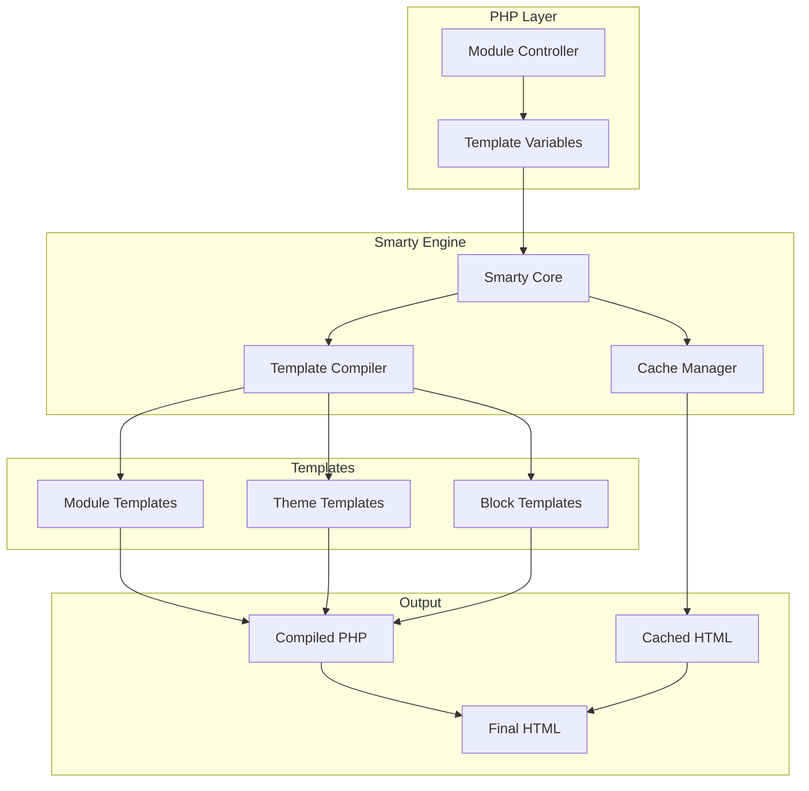
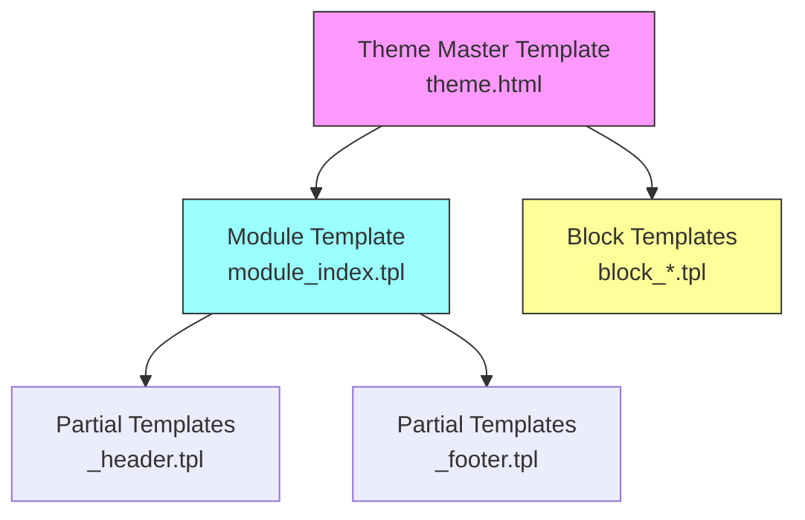
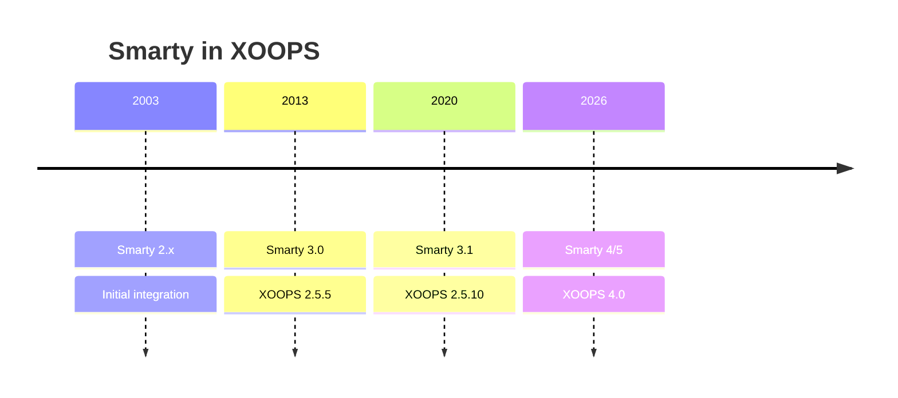

# ADR-003: template Motoru (Smarty)

> XOOPS'nin Smarty template motorunu benimsemesine ilişkin Mimari Karar Kaydı.

---

## Durum

**Kabul edildi** - XOOPS 2.0'dan bu yana temel karar

**Gelişiyor** - XOOPS 4.0 için Smarty 4/5'ye geçiş planlandı

---

## Bağlam

XOOPS'nın aşağıdakileri sağlayacak bir şablonlama çözümüne ihtiyacı vardı:

1. Sunumu iş mantığından ayırın
2. theme tasarımcılarının PHP bilgisi olmadan çalışmasına izin verin
3. template mirasını destekleyin ve şunları içerir
4. Performans için önbelleğe alma sağlayın
5. user tarafından özelleştirilebilir şablonları etkinleştirin
6. Uluslararasılaşmayı destekleyin

---

## Karar Diyagramı

---

## Karar

template motoru olarak **Smarty** kullanacağız çünkü:

### 1. Endişelerin Ayrılması
```php
// PHP (Controller) - Business logic
$items = $itemHandler->getPublishedItems();
$xoopsTpl->assign('items', $items);

// Smarty (View) - Presentation
// templates/items.tpl
```

```smarty
{* Smarty template - No PHP logic *}
<{foreach item=item from=$items}>
    <article>
        <h2><{$item.title}></h2>
        <p><{$item.summary}></p>
    </article>
<{/foreach}>
```
### 2. XOOPS Sınırlayıcılar

XOOPS, standart `{` `}` yerine `<{` ve `}>`'yi kullanır:
```smarty
{* Standard Smarty *}
{$variable}

{* XOOPS Smarty - Avoids JavaScript conflicts *}
<{$variable}>
```
### 3. template Hiyerarşisi

### 4. template Depolama

- **database**: Geri döndürme özelliği için saklanan özelleştirilmiş templates
- **Dosya Sistemi**: module dizinlerindeki orijinal templates
- **cache**: Performans için derlenmiş templates

---

## Smarty Yapılandırma
```php
// XOOPS Smarty initialization
$xoopsTpl = new XoopsTpl();

// Custom delimiters
$xoopsTpl->left_delim = '<{';
$xoopsTpl->right_delim = '}>';

// Caching
$xoopsTpl->caching = XOOPS_TEMPLATE_CACHE;
$xoopsTpl->cache_lifetime = 3600;

// Security
$xoopsTpl->security_policy = new Smarty_Security($xoopsTpl);
$xoopsTpl->security_policy->php_functions = [];
$xoopsTpl->security_policy->php_modifiers = ['escape', 'count'];
```
---

## Kullanılan template Özellikleri

### Değişkenler
```smarty
{* Simple variable *}
<{$title}>

{* Object property *}
<{$item.title}>

{* With modifier *}
<{$content|truncate:200:'...'}>

{* Escaped output *}
<{$userInput|escape:'html'}>
```
### Kontrol Yapıları
```smarty
{* Conditional *}
<{if $isAdmin}>
    <a href="admin.php">Admin</a>
<{elseif $isUser}>
    <a href="profile.php">Profile</a>
<{else}>
    <a href="login.php">Login</a>
<{/if}>

{* Loop *}
<{foreach item=item from=$items name=itemloop}>
    <{$smarty.foreach.itemloop.index}>: <{$item.title}>
<{/foreach}>
```
### İçerir
```smarty
{* Include another template *}
<{include file="db:mymodule_header.tpl"}>

{* Include with variables *}
<{include file="db:mymodule_item.tpl" item=$currentItem}>

{* Include from theme *}
<{include file="file:$theme_path/partials/sidebar.tpl"}>
```
---

## Sonuçlar

### Olumlu

1. **Tasarımcı dostu**: HTML benzeri sözdizimi
2. **Önbelleğe Alma**: Yerleşik template önbelleğe alma
3. **Güvenlik**: PHP kod izolasyonu
4. **Esneklik**: Değiştiriciler, işlevler, eklentiler
5. **Özelleştirme**: users şablonları değiştirebilir
6. **Topluluk**: Büyük Smarty ekosistemi

### Negatif

1. **Öğrenme eğrisi**: Smarty-specific sözdizimi
2. **Genel gider**: Derleme adımı gerekli
3. **Hata ayıklama**: template hataları gizemli olabilir
4. **Sürüm sorunları**: Sürümler arasında önemli değişiklikler

### Azaltmalar

- **Öğrenim**: Kapsamlı belgeler
- **Performans**: Agresif önbelleğe alma
- **Hata ayıklama**: Konsolda hata ayıklama, hata mesajlarını temizleme
- **Sürümler**: XOOPS'deki uyumluluk katmanı

---

## Sürüm Geçmişi

---

## Taşıma: Smarty 3'ten 4/5'ye

### Son Değişiklikler
```smarty
{* Smarty 3 - Deprecated *}
<{php}>echo date('Y');<{/php}>

{* Smarty 4+ - Use modifiers or assign from PHP *}
<{$current_year}>

{* Smarty 3 - {section} deprecated *}
<{section name=i loop=$items}>
    <{$items[i].title}>
<{/section}>

{* Smarty 4+ - Use {foreach} *}
<{foreach $items as $item}>
    <{$item.title}>
<{/foreach}>
```
### Uyumluluk Katmanı

XOOPS sorunsuz geçişler için bir uyumluluk katmanı sağlar:
```php
// XoopsTpl extends Smarty with compatibility methods
class XoopsTpl extends Smarty
{
    public function assign($tpl_var, $value = null)
    {
        // Handles both Smarty 3 and 4 syntax
        return parent::assign($tpl_var, $value);
    }
}
```
---

## Alternatifler Değerlendirildi

### 1. Dal
**Artıları**: Modern, Symfony ekosistemi
**Eksileri**: Farklı sözdizimi, geçiş çabası
**Karar**: XOOPS 3.x için gelecekteki olası seçenek

### 2. Bıçak (Laravel)
**Artıları**: Temiz söz dizimi, popüler
**Eksileri**: Laravel'e özgü
**Karar**: Tek başına kullanıma uygun değil

### 3. Yerel PHP templates
**Avantajları**: Öğrenme eğrisi yok, hızlı
**Eksileri**: Güvenlik riskleri, ayırma yok
**Karar**: Sürdürülebilirlik nedeniyle reddedildi

---

## İlgili Kararlar

- ADR-001: Modüler Mimari
- ADR-002: database Soyutlaması

---

## Referanslar

- Smarty Belgeler: https://www.smarty.net/docs/en/
- XOOPS template Sistem Rehberi
- MVC Web Uygulamalarında Desen

---

#xoops #architecture #adr #smarty #templates #design-decision