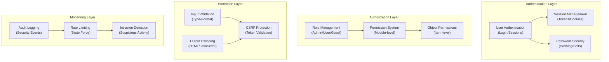

# ADR-004: Güvenlik Sistemi Mimarisi

> XOOPS CMS için modern tehditlere karşı koruma sağlayan kapsamlı güvenlik mimarisi.

---

## Durum

**Kabul edildi** - XOOPS 2.5'tan beri temel güvenlik katmanı

---

## Bağlam

### Sorun Bildirimi

XOOPS aşağıdaki özelliklere sahip sağlam bir güvenlik sistemine ihtiyaç duyar:

1. **Yaygın web güvenlik açıklarına karşı koruma sağlar** (OWASP İlk 10)
2. **modules arasında ayrıntılı izin kontrolü sağlar**
3. **Modern standartlarla güvenli user kimlik doğrulamasını etkinleştirir**
4. **Veri ihlallerini** ve yetkisiz erişimi önler
5. **Çok seviyeli erişim kontrolünü destekler** (yönetici, moderatör, user, misafir)
6. **Tüm modüllerle sorunsuz bir şekilde bütünleşir**

### Güncel Tehditler

Modern web saldırıları şunları içerir:

- **SQL Enjeksiyon** - user girişinde kötü amaçlı SQL
- **XSS (Siteler Arası Komut Dosyası Çalıştırma)** - Sayfalara JavaScript enjekte edildi
- **CSRF (Siteler Arası İstek Sahteciliği)** - Yetkisiz form gönderimleri
- **Kimlik doğrulama atlaması** - Zayıf session/password kullanımı
- **Yetkilendirmeyi atlama** - Ayrıcalık yükseltme
- **Veri açığa çıkması** - URLs, günlükler veya önbelleklerdeki hassas veriler

### XOOPS Güvenlik Gereksinimleri

1. user kimlik doğrulaması ve oturum yönetimi
2. Rol bazlı erişim kontrolü (RBAC)
3. modules ve nesneler için izin sistemi
4. Giriş doğrulama ve çıkıştan kaçış
5. Yaygın saldırılara karşı koruma
6. Güvenlik olaylarının günlük kaydının denetlenmesi
7. Güvenli şifre yönetimi
8. CSRF jeton koruması

---

## Karar

### Temel Güvenlik Mimarisi

---

## Güvenlik Bileşenleri

### 1. Kimlik Doğrulama Sistemi

**user Giriş Süreci:**
```php
<?php
// 1. Validate credentials
$user = $userHandler->findByLogin($username);
if (!$user || !password_verify($password, $user->getVar('pass'))) {
    throw new AuthenticationException('Invalid credentials');
}

// 2. Check if account is active
if (!$user->getVar('uactive')) {
    throw new AuthenticationException('Account inactive');
}

// 3. Create secure session
session_regenerate_id(true);
$_SESSION['uid'] = $user->getVar('uid');
$_SESSION['token'] = bin2hex(random_bytes(32));
$_SESSION['created'] = time();

// 4. Log the login
$this->auditLog('USER_LOGIN', $user->getVar('uid'));
```
**Şifre Güvenliği:**
```php
<?php
// Use password_hash (not MD5 or SHA1)
$hashed = password_hash($password, PASSWORD_BCRYPT, [
    'cost' => 12, // High cost = slow brute force
]);

// Verify password
if (!password_verify($inputPassword, $hashed)) {
    throw new Exception('Invalid password');
}

// Rehash if algorithm or cost changed
if (password_needs_rehash($hashed, PASSWORD_BCRYPT, ['cost' => 12])) {
    $newHash = password_hash($password, PASSWORD_BCRYPT, ['cost' => 12]);
    $user->setVar('pass', $newHash);
    $userHandler->insert($user);
}
```
### 2. Oturum Yönetimi

**Güvenli Oturum Yönetimi:**
```php
<?php
// Session configuration
ini_set('session.cookie_httponly', true);  // No JS access
ini_set('session.cookie_secure', true);     // HTTPS only
ini_set('session.cookie_samesite', 'Strict'); // CSRF protection
ini_set('session.gc_maxlifetime', 3600);   // 1 hour timeout
ini_set('session.sid_length', 64);         // 64-char session ID

// Validate session
function validateSession() {
    // Check timeout
    if (time() - $_SESSION['created'] > 3600) {
        session_destroy();
        throw new SessionExpiredException();
    }

    // Validate user agent (prevent session hijacking)
    if ($_SESSION['user_agent'] !== $_SERVER['HTTP_USER_AGENT']) {
        throw new SessionInvalidException();
    }

    // Validate IP (optional, can be too strict)
    if (!in_array($_SERVER['REMOTE_ADDR'], $_SESSION['ips'])) {
        $_SESSION['ips'][] = $_SERVER['REMOTE_ADDR'];
    }
}
```
### 3. Yetkilendirme (RBAC)

**Rol Tabanlı Erişim Kontrolü:**
```php
<?php
class XoopsUser {
    public function hasPermission(string $permissionName): bool
    {
        // Get user groups
        $groups = $this->getGroups();

        // Check if any group has permission
        foreach ($groups as $groupId) {
            if ($this->checkGroupPermission($groupId, $permissionName)) {
                return true;
            }
        }

        return false;
    }

    /**
     * User groups and their permissions
     * Admin: Full access
     * Moderator: Content management
     * User: Create own content
     * Guest: Read-only access
     */
    private function checkGroupPermission(int $groupId, string $permission): bool
    {
        $permissions = [
            1 => ['admin_access'],                 // Admin group
            2 => ['moderate_content', 'edit_own'], // Moderator group
            3 => ['create_content', 'edit_own'],   // User group
            4 => [],                               // Guest group (no permissions)
        ];

        return in_array($permission, $permissions[$groupId] ?? []);
    }
}
```
### 4. Giriş Doğrulaması

**SQL Enjeksiyon ve Tip Hatalarını Önleyin:**
```php
<?php
// Always use prepared statements
$sql = 'SELECT * FROM users WHERE id = ?';
$result = $db->query($sql, [$userId]); // ✅ Safe

// Input validation
function validateUserInput(array $data): array
{
    return [
        'email' => filter_var($data['email'] ?? '', FILTER_VALIDATE_EMAIL),
        'age' => filter_var($data['age'] ?? 0, FILTER_VALIDATE_INT),
        'website' => filter_var($data['website'] ?? '', FILTER_VALIDATE_URL),
        'title' => substr(trim($data['title'] ?? ''), 0, 255),
    ];
}

// XOOPS Safe Input class
$safe = \Xmf\Request::getHtmlRequest('var_name', '');
$int = \Xmf\Request::getInt('page', 1);
```
### 5. Çıkış Çıkışı

**XSS Saldırılarını önleyin:**
```php
<?php
// In PHP templates
echo htmlspecialchars($userInput, ENT_QUOTES, 'UTF-8');

// In Smarty templates (automatic escaping)
<{$user_input}>  {* Escaped by default *}
<{$html|escape:false}>  {* Only when needed *}

// JavaScript context
<script>
var message = "<{$userMessage|escape:'javascript'}>";
</script>

// URL context
<a href="<{$url|escape:'url'}>">Link</a>
```
### 6. CSRF Koruma

**Siteler Arası İstek Sahteciliğini Önleme:**
```php
<?php
// Generate CSRF token
session_start();
if (empty($_SESSION['csrf_token'])) {
    $_SESSION['csrf_token'] = bin2hex(random_bytes(32));
}

// In forms
<form method="POST">
    <input type="hidden" name="csrf_token" value="<{$csrf_token}>">
    <button type="submit">Submit</button>
</form>

// Validate token
if ($_SERVER['REQUEST_METHOD'] === 'POST') {
    if (hash_equals($_SESSION['csrf_token'], $_POST['csrf_token'] ?? '')) {
        // Process form
    } else {
        throw new InvalidTokenException('CSRF token invalid');
    }
}
```
---

## Sonuçlar

### Olumlu Etkiler

1. **Kapsamlı Koruma** - Başlıca güvenlik açığı sınıflarını kapsar
2. **Katmanlı Güvenlik** - Çoklu savunma katmanları
3. **Esnek RBAC** - Ayrıntılı izin kontrolü
4. **Denetim Yolu** - Güvenlik olaylarını izleyin
5. **Endüstri Standardı** - OWASP önerileriyle uyumludur
6. **module Entegrasyonu** - Modüllerin kullanımı kolay güvenlik APIs

### Olumsuz Etkiler

1. **Karmaşıklık** - Daha fazla kod ve yapılandırma gerekiyor
2. **Performans** - Hashing ve doğrulama ek yük getirir
3. **user Deneyimi** - Güvenlik bazen sakıncalıdır
4. **Bakım** - Devamlı güvenlik güncellemeleri gerektirir
5. **Eğitim Gereklidir** - Geliştiriciler uygulamaları takip etmelidir

### Riskler ve Azaltmalar

| Risk | Şiddet | Azaltma |
|------|----------|-----------|
| Geliştirici güvenliği göz ardı ediyor | Yüksek | Kod incelemesi, güvenlik eğitimi |
| Yeni güvenlik açıkları keşfedildi | Orta | Düzenli güvenlik denetimleri, güncellemeler |
| Performans etkisi | Düşük | Sıcak yolları optimize edin, önbelleğe alın |
| Aşırı karmaşık permissions | Orta | Açık belgeler, örnekler |

---

## En İyi Güvenlik Uygulamaları

### module Geliştiricileri İçin
```php
<?php
// ✅ DO: Use prepared statements
$result = $db->prepare('SELECT * FROM table WHERE id = ?')->execute([$id]);

// ❌ DON'T: Concatenate queries
$result = $db->query("SELECT * FROM table WHERE id = $id");

// ✅ DO: Escape output
echo htmlspecialchars($user_input, ENT_QUOTES, 'UTF-8');

// ❌ DON'T: Output raw user data
echo $user_input;

// ✅ DO: Check permissions
if (!$user->hasPermission('edit_content')) {
    throw new PermissionException();
}

// ❌ DON'T: Trust user roles directly
if ($_POST['is_admin']) {
    // Make user admin - SECURITY HOLE!
}

// ✅ DO: Validate input types
$page = (int)$_GET['page'];

// ❌ DON'T: Use untrusted values directly
$sql .= " LIMIT " . $_GET['limit'];
```
---

## Alternatifler Değerlendirildi

### OAuth/OpenID Bağlan

**Neden başlangıçta seçilmediniz:** Paylaşılan barındırma ortamı için fazla karmaşık, ancak gelecekte harici kimlik doğrulama sistemleriyle entegrasyon için iyi.

### İki Faktörlü Kimlik Doğrulama (2FA)

**Durum:** Temel gereksinim değil, uzatma olarak kabul edildi, bkz. ADR-006

### HTTP-yalnızca Oturum Çerezleri

**Durum:** Uygulandı - JavaScript'nin oturum verilerine erişimini engeller

---

## İlgili Kararlar

- ADR-001: Modüler Mimari - modules güvenliği uygular
- ADR-005: module İzin Sistemi
- ADR-006: İki Faktörlü Kimlik Doğrulama (gelecek)

---

## Referanslar

### Güvenlik Standartları

- [OWASP İlk 10](https://owasp.org/www-project-top-ten/)
- [NIST Siber Güvenlik Çerçevesi](https://www.nist.gov/cyberframework)
- [CWE İlk 25](https://cwe.mitre.org/top25/)

### PHP Güvenlik

- [PHP Güvenlik Kılavuzu](https://www.php.net/manual/en/security.php)
- [password_hash() Belgeler](https://www.php.net/manual/en/function.password-hash.php)
- [Oturum Güvenliği](https://www.php.net/manual/en/session.security.php)

### Araçlar

- [OWASP ZAP](https://www.zaproxy.org/) - Güvenlik testi
- [Snyk](https://snyk.io/) - Güvenlik açığı taraması
- [SonarQube](https://www.sonarqube.org/) - Kod kalitesi

---

## Uygulama Kontrol Listesi

- [ ] user kimlik doğrulama sistemi
- [ ] Oturum yönetimi
- [ ] Şifre karma (bcrypt)
- [ ] Rol tabanlı erişim kontrolü
- [ ] module izinleri
- [ ] Giriş doğrulama çerçevesi
- [ ] Çıkış çıkışı (PHP + Smarty)
- [ ] CSRF jeton koruması
- [ ] Güvenlik denetimi günlüğü
- [ ] Hız sınırlaması
- [ ] Güvenlik başlıkları

---

## Sürüm Geçmişi

| Sürüm | Tarih | Değişiklikler |
|-----------|------|-----------|
| 1.0.0 | 2024-01-28 | İlk belge |

---

#xoops #adr #güvenlik #mimari #kimlik doğrulama #yetkilendirme #rbac