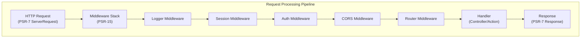

# ADR-005: PSR-15 XOOPS 4.0 için Ara Yazılım Kalıbı

> Gelişmiş istek işleme hattı için PSR-15 HTTP sunucu istek işleyicilerini (ara yazılım) benimseyin.

:::caution[XOOPS 4.0 Teklifi — 2.5.x'te Mevcut Değil]
Bu ADR, **XOOPS 4.0** için önerilen mimariyi açıklamaktadır. PSR-15 ara yazılımı **XOOPS 2.5.x'te mevcut değildir**. Mevcut 2.5.x modülleri, `mainfile.php` önyüklemeli Sayfa Denetleyicisi modelini kullanır. Geçerli istek yaşam döngüsü için XOOPS Mimarisine bakın.
:::

---

## Durum

**Önerilen** - XOOPS 4.0 sürümü için değerlendirme aşamasında

---

## Bağlam

### Güncel Yaklaşım

XOOPS 2.5, monolitik bir istek işleme yaklaşımı kullanır:
```php
// Current: Sequential processing
require_once 'mainfile.php';
// → Kernel initialization
// → User authentication
// → Module loading
// → Page rendering

// All in one flow, mixed concerns
```
### Mevcut Yaklaşımla İlgili Sorunlar

1. **Karışık Endişeler** - Kimlik doğrulama, günlük kaydı ve yönlendirme hepsi iç içe geçmiş
2. **Test Edilmesi Zor** - Bireysel istek işleme adımlarını birim test etmek zor
3. **Uzatılması Zor** - modules yalnızca preload/events aracılığıyla bağlanabilir
4. **Kötü Ayırma** - İstek işleme mantığı kod tabanına dağılmış durumda
5. **Biçimlendirilemez** - İşleme adımları kolaylıkla zincirlenemez veya yeniden sıralanamaz

### PSR-15 Ara Yazılımı nedir?

PSR-15, HTTP ara yazılımı için standart bir arayüz tanımlar:
```php
<?php
interface RequestHandlerInterface {
    public function handle(ServerRequestInterface $request): ResponseInterface;
}

interface MiddlewareInterface {
    public function process(
        ServerRequestInterface $request,
        RequestHandlerInterface $handler
    ): ResponseInterface;
}
```
**Ara katman yazılımı zinciri:**
```
Request
  ↓
[Logger] → logs request
  ↓
[Auth] → validates user session
  ↓
[CORS] → checks cross-origin
  ↓
[Router] → dispatches to handler
  ↓
[Handler] → generates response
  ↓
Response
```
---

## Karar

### XOOPS 4.0 için PSR-15 Ara Yazılım Yığınını benimseyin

PSR-15 standardına uygun olarak ara yazılım tabanlı bir istek işleme hattı uygulayın.

### Mimariye Genel Bakış

### Temel Ara Yazılım Bileşenleri

#### 1. Uygulama Ara Yazılımı (Core Katman)
```php
<?php
declare(strict_types=1);

namespace XoopsCore;

use Psr\Http\Message\ResponseInterface;
use Psr\Http\Message\ServerRequestInterface;
use Psr\Http\Server\MiddlewareInterface;
use Psr\Http\Server\RequestHandlerInterface;

class SessionMiddleware implements MiddlewareInterface
{
    public function process(
        ServerRequestInterface $request,
        RequestHandlerInterface $handler
    ): ResponseInterface {
        // 1. Retrieve session (or start new)
        $sessionId = $request->getCookieParams()['PHPSESSID'] ?? null;
        $session = $this->sessionManager->load($sessionId);

        // 2. Attach session to request
        $request = $request->withAttribute('session', $session);

        // 3. Pass to next middleware
        $response = $handler->handle($request);

        // 4. Set session cookie if needed
        if ($session->isModified()) {
            $response = $response->withAddedHeader(
                'Set-Cookie',
                'PHPSESSID=' . $session->getId() . '; HttpOnly; SameSite=Strict'
            );
        }

        return $response;
    }
}
```
#### 2. Kimlik Doğrulama Ara Yazılımı
```php
<?php
class AuthMiddleware implements MiddlewareInterface
{
    public function process(
        ServerRequestInterface $request,
        RequestHandlerInterface $handler
    ): ResponseInterface {
        // Get session from previous middleware
        $session = $request->getAttribute('session');

        // Authenticate user from session
        $user = $this->authenticate($session);

        // Attach user to request
        $request = $request->withAttribute('user', $user);

        return $handler->handle($request);
    }

    private function authenticate(?Session $session): User
    {
        if ($session && $session->has('uid')) {
            return $this->userRepository->findById($session->get('uid'));
        }

        return new AnonymousUser();
    }
}
```
#### 3. Yetkilendirme Ara Yazılımı
```php
<?php
class AuthorizationMiddleware implements MiddlewareInterface
{
    public function __construct(private AuthorizationChecker $checker)
    {
    }

    public function process(
        ServerRequestInterface $request,
        RequestHandlerInterface $handler
    ): ResponseInterface {
        $user = $request->getAttribute('user');
        $route = $request->getAttribute('route');

        // Check if user has permission for this route
        if (!$this->checker->isGranted($user, $route)) {
            return new JsonResponse(
                ['error' => 'Unauthorized'],
                403
            );
        }

        return $handler->handle($request);
    }
}
```
#### 4. module Ara Yazılımı
```php
<?php
// Modules can provide their own middleware
class PublisherAccessMiddleware implements MiddlewareInterface
{
    public function process(
        ServerRequestInterface $request,
        RequestHandlerInterface $handler
    ): ResponseInterface {
        $user = $request->getAttribute('user');

        // Module-specific access control
        if (!$user->hasPermission('publisher_view')) {
            return new HtmlResponse('Access denied', 403);
        }

        return $handler->handle($request);
    }
}
```
### Uygulama Örneği
```php
<?php
// bootstrap.php - Application setup

use Psr\Http\Message\ServerRequestInterface;
use Psr\Http\Server\RequestHandlerInterface;
use Xoops\Core\Middleware\{
    LoggerMiddleware,
    SessionMiddleware,
    AuthMiddleware,
    CorsMiddleware,
    ErrorHandlingMiddleware
};

// Create middleware pipeline
$middlewareStack = [
    // 1. Error handling (outermost)
    new ErrorHandlingMiddleware(),

    // 2. Logging
    new LoggerMiddleware($logger),

    // 3. CORS handling
    new CorsMiddleware($corsConfig),

    // 4. Session management
    new SessionMiddleware($sessionManager),

    // 5. Authentication
    new AuthMiddleware($userRepository),

    // 6. Authorization
    new AuthorizationMiddleware($authChecker),

    // 7. Routing and dispatching
    new RoutingMiddleware($router),

    // 8. Module middleware (dynamic)
    ...$this->loadModuleMiddleware(),
];

// Process request through middleware stack
$request = ServerRequestFactory::fromGlobals();
$dispatcher = new MiddlewareDispatcher($middlewareStack);
$response = $dispatcher->dispatch($request);

// Send response
http_response_code($response->getStatusCode());
foreach ($response->getHeaders() as $name => $values) {
    foreach ($values as $value) {
        header("$name: $value", false);
    }
}
echo $response->getBody();
```
### module Entegrasyonu

modules ara yazılım sağlayabilir:
```php
<?php
// Publisher module - xoops_version.php

$modversion['middleware'] = [
    'PublisherAccessMiddleware' => true,      // Auto-load
    'PublisherLogMiddleware' => true,
];

// Or custom:
$modversion['middleware_factory'] = function() {
    return [
        new PublisherCacheMiddleware(),
        new PublisherPermissionMiddleware(),
    ];
};
```
---

## Sonuçlar

### Olumlu Etkiler

1. **Endişelerin Ayrılması** - Her ara yazılım tek bir sorumluluğu üstlenir
2. **Test Edilebilirlik** - Bireysel ara yazılım bileşenlerinin birim testine tabi tutulması kolaydır
3. **Şekillendirilebilirlik** - Ara yazılımlar karıştırılabilir ve yeniden sıralanabilir
4. **Standartlarla Uyumlu** - PSR-15 ve PSR-7 standartlarını kullanır
5. **Genişletilebilirlik** - modules kolayca özel ara yazılım ekleyebilir
6. **Hata ayıklama** - Ardışık düzen boyunca istek akışını temizleyin
7. **Performans** - Belirli ara yazılım katmanlarını optimize edebilir
8. **Birlikte çalışabilirlik** - Üçüncü taraf PSR-15 ara yazılımını kullanabilir

### Olumsuz Etkiler

1. **Öğrenim Eğrisi** - Geliştiricilerin PSR-15'i anlaması gerekir
2. **Performans Ek Yükü** - İşlem hattında daha fazla işlev çağrısı
3. **Karmaşıklık** - Monolitik yaklaşıma göre daha fazla hareketli parça
4. **Geçiş Çabası** - Mevcut kodun yeniden düzenlenmesini gerektirir
5. **Bağımlılıklar** - PSR-7 HTTP kitaplığı gerektirir

### Riskler ve Azaltmalar

| Risk | Şiddet | Azaltma |
|------|----------|-----------|
| Karmaşık ara yazılım zincirleri | Orta | Açık belgeler, örnekler |
| Performans düşüşü | Orta | Sıcak yolları kıyaslayın, optimize edin |
| Geliştiricinin kötüye kullanımı | Orta | Kod incelemesi, en iyi uygulamalar kılavuzu |
| Geçişi bozan değişiklikler | Yüksek | Kullanımdan kaldırma süresi, yardımcılar |
| Ara yazılım sıralama sorunları | Orta | Bağımlılık grafiğini temizle |

---

## Uygulama Planı

### Aşama 1: Temel (Q2 2026)

- [ ] PSR-7 HTTP mesaj sarmalayıcıyı uygulayın
- [ ] MiddlewareDispatcher'ı oluştur
- [ ] Core ara katman yazılımını uygulayın (oturum, kimlik doğrulama)
- [ ] Ara yazılımı kullanmak için çekirdeği güncelleyin

### Aşama 2: Entegrasyon (Q3 2026)

- [ ] Mevcut işlevselliği ara yazılıma taşıyın
- [ ] module ara yazılım desteği ekleyin
- [ ] Ara katman yazılımı test yardımcı programları oluşturun
- [ ] Kapsamlı belgeler yazın

### 3. Aşama: Geçiş (2026 4. Çeyrek)

- [ ] Eski kod için uyumluluk katmanı sağlayın
- [ ] Yardım modüllerinin yeni ara yazılıma güncellenmesi
- [ ] Performans optimizasyonu
- [ ] Güvenlik denetimi

### Aşama 4: Sürüm (Q1 2027)

- [ ] XOOPS 4.0 ara katman yazılımı sürümü
- [ ] Eski preload/hook sistemini kullanımdan kaldırın
- [ ] Topluluk geri bildirimleri ve güncellemeler

---

## Başarı Kriterleri

- [ ] Tüm temel işlevler ara yazılıma taşındı
- [ ] Ara katman yazılımı için %90+ test kapsamı
- [ ] Örneklerle dolu belgeler
- [ ] Önceki sürüme göre %10'luk performans
- [ ] modules yeni ara yazılım sistemini başarıyla kullanıyor
- [ ] Topluluğun benimseme oranı >%80

---

## Ara Yazılım En İyi Uygulamaları

### Yap

- Ara katman yazılımını odaklı tutun (tek sorumluluk)
- Değişmezliği kullanın (yeni request/response) oluşturun)
- Hataları incelikle ele alın
- Belge bağımlılıkları
- Yazım ipuçları ekleyin
- Ara yazılım için testler yazın
- Standart PSR-15 arayüzlerini kullanın

### Yapma

- Paylaşılan request/response nesnelerini değiştirmeyin
- Globallere doğrudan erişmeyin
- Ara yazılım sırasına bağımlılıklar yaratmayın
- Tüm istisnaları yakalamayın
- İş mantığını ara yazılımla karıştırmayın
- Ara yazılımların çok fazla iş yapmasını sağlamayın

---

## Örnekler

### Özel Ara Yazılım
```php
<?php
// Example: Rate limiting middleware

use Psr\Http\Message\ResponseInterface;
use Psr\Http\Message\ServerRequestInterface;
use Psr\Http\Server\MiddlewareInterface;
use Psr\Http\Server\RequestHandlerInterface;

class RateLimitMiddleware implements MiddlewareInterface
{
    public function __construct(
        private RateLimiter $limiter,
        private int $limit = 100,
        private int $window = 3600
    ) {
    }

    public function process(
        ServerRequestInterface $request,
        RequestHandlerInterface $handler
    ): ResponseInterface {
        $user = $request->getAttribute('user');
        $identifier = $user->getId() ?? $request->getClientIp();

        // Check rate limit
        $remaining = $this->limiter->check($identifier, $this->limit, $this->window);

        if ($remaining < 0) {
            return new JsonResponse(
                ['error' => 'Rate limit exceeded'],
                429
            );
        }

        // Add rate limit headers
        $response = $handler->handle($request);
        return $response
            ->withAddedHeader('X-RateLimit-Limit', (string)$this->limit)
            ->withAddedHeader('X-RateLimit-Remaining', (string)$remaining);
    }
}
```
---

## İlgili Kararlar

- ADR-001: Modüler Mimari - Temel
- ADR-004: Güvenlik Sistemi - Kimlik doğrulama için ara yazılım kullanır
- ADR-006: İki Faktörlü Kimlik Doğrulama - Ara yazılım olabilir

---

## Referanslar

### PSR Standartlar

- [PSR-7: HTTP Mesaj Arayüzü](https://www.php-fig.org/psr/psr-7/)
- [PSR-15: HTTP Sunucu İstek İşleyicileri](https://www.php-fig.org/psr/psr-15/)

### Ara Yazılım Çerçeveleri

- [Slim Framework](https://www.slimframework.com/) - Ara yazılım örnekleri
- [Zend Expressive](https://docs.zendframework.com/zend-expressive/) - PSR-15 çerçevesi
- [Guzzle](https://docs.guzzlephp.org/) - HTTP istemci ara yazılımı

### Araçlar

- [RelayPHP](https://relayphp.com/) - Ara yazılım kitaplığı
- [PSR-15 Ara yazılım](https://github.com/middlewares) - Ara yazılım koleksiyonu

---

## Sürüm Geçmişi

| Sürüm | Tarih | Değişiklikler |
|-----------|------|-----------|
| 1.0.0 | 2024-01-28 | İlk teklif |

---

#xoops #adr #psr-15 #middleware #architecture #psr-7