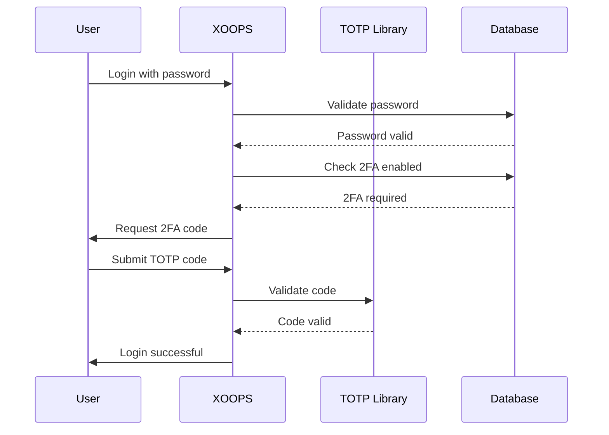

## Durum

Önerilen

## Bağlam

XOOPS user kimlik doğrulaması için gelişmiş güvenliğe ihtiyaç duyar. İki faktörlü kimlik doğrulama (2FA), parolaların ötesinde ek bir güvenlik katmanı sağlayarak, parolalar ele geçirilse bile hesapları korur.

Önemli hususlar:
- Mevcut kimlik doğrulamayla geriye dönük uyumluluk
- Birden fazla 2FA yöntemi desteği
- Kurulum ve giriş sırasında user deneyimi
- Kayıp cihazlar için kurtarma mekanizmaları
- Mevcut izin sistemiyle entegrasyon

## Karar

Yedek kod desteğiyle birincil 2FA yöntemi olarak TOTP (Zamana Dayalı Tek Kullanımlık Şifre) uygulayacağız.

### Uygulama Yaklaşımı

### database Şeması
```sql
CREATE TABLE `{PREFIX}_users_2fa` (
    `user_id` INT(11) NOT NULL,
    `secret` VARCHAR(32) NOT NULL,
    `enabled` TINYINT(1) DEFAULT 0,
    `backup_codes` TEXT,
    `last_used` INT(11),
    `created` INT(11) NOT NULL,
    PRIMARY KEY (`user_id`),
    FOREIGN KEY (`user_id`) REFERENCES `{PREFIX}_users`(`uid`)
);
```
### Servis Arayüzü
```php
interface TwoFactorAuthInterface
{
    public function enable(int $userId): TwoFactorSetup;
    public function disable(int $userId): void;
    public function verify(int $userId, string $code): bool;
    public function generateBackupCodes(int $userId): array;
    public function isEnabled(int $userId): bool;
}
```
### Ara Yazılım Entegrasyonu
```php
class TwoFactorMiddleware implements MiddlewareInterface
{
    public function process(
        ServerRequestInterface $request,
        RequestHandlerInterface $handler
    ): ResponseInterface {
        $session = $request->getAttribute('session');

        if ($session->has('pending_2fa_user_id')) {
            // User needs to complete 2FA
            if ($this->isVerificationRequest($request)) {
                return $handler->handle($request);
            }
            return new RedirectResponse('/2fa/verify');
        }

        return $handler->handle($request);
    }
}
```
## Sonuçlar

### Olumlu

- Önemli ölçüde geliştirilmiş hesap güvenliği
- Endüstri standardı TOTP uyumluluğu (Google Authenticator, Authy, vb.)
- Yedek kodlar hesabın kilitlenmesini önler
- user başına isteğe bağlı - benimsenmeyi zorlamaz
- PSR-15 ara katman yazılımı temiz entegrasyona olanak tanır

### Negatif

- Ek oturum açma adımı user deneyimini etkiler
- users kimlik doğrulama uygulamalarını yönetmelidir
- Kayıp cihazlar kurtarma işlemi gerektirir
- Ek database depolama alanı ve sorgular
- Kriptografik kütüphane bağımlılığı gerektirir

### Geçiş Yolu

1. 2FA verileri için database tablosu ekleyin
2. TOTP hizmetini kütüphane bağımlılığıyla uygulayın
3. Kimlik doğrulama zincirine ara yazılım ekleyin
4. Kurulum ve doğrulama user arayüzü oluşturun
5. Belirli gruplar için 2FA'yı zorunlu kılan yönetici seçeneği

## Alternatifler Değerlendirildi

### SMS tabanlı OTP

Şu nedenlerle reddedildi:
- SIM takas güvenlik açıkları
- SMS ağ geçidinin maliyeti
- Telefon numarası doğrulama karmaşıklığı
- Gizlilik endişeleri

### Donanım Güvenlik Anahtarları (WebAuthn)

Gelecek için ertelendi ADR:
- Daha karmaşık uygulama
- Tarihsel olarak sınırlı tarayıcı desteği
- Daha yüksek user maliyeti
- Daha sonra TOTP yanına eklenebilir

### E-posta tabanlı OTP

Şu nedenlerle reddedildi:
- E-posta hesabının ele geçirilmesi amacı bozar
- Teslimat gecikmeleri user deneyimini etkiler
- Spam filtresi sorunları

## Referanslar

- [RFC 6238 - TOTP](https://tools.ietf.org/html/rfc6238)
- [Google Şifrematik Anahtar Formatı](https://github.com/google/google-authenticator/wiki/Key-Uri-Format)
- ../../02-Core-Concepts/Security/Security-Best-Practices - Güvenlik yönergeleri
- ../../02-Core-Concepts/Users-Permissions/Authentication - Kimlik doğrulama sistemi belgeleri