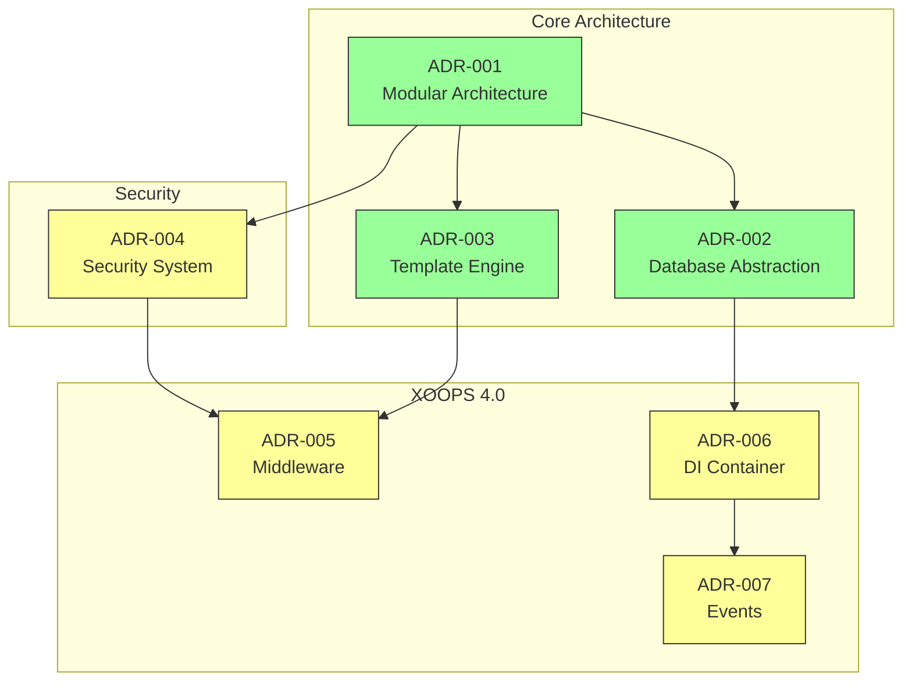
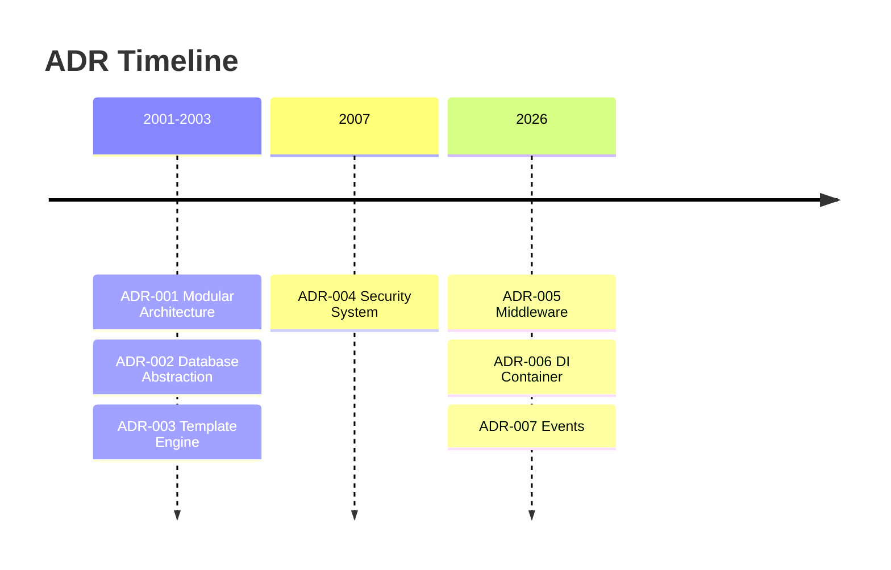

# 📋 Mimarlık Karar Kayıtları İndeksi

> XOOPS CMS'yi şekillendiren mimari kararların kapsamlı dizini.

---

## ADR'ler nedir?

Mimari Karar Kayıtları (ADR'ler), XOOPS'nin geliştirilmesi sırasında alınan önemli mimari kararları belgelemektedir. Her bir seçimin bağlamını, kararını ve sonuçlarını yakalayarak, koruyucular ve katkıda bulunanlar için değerli tarihsel bağlam sağlarlar.

---

## ADR Durum Açıklaması

| Durum | Anlamı |
|----------|------------|
| **Önerilen** | Tartışılıyor, henüz kabul edilmedi |
| **Kabul edildi** | Karar kabul edildi |
| **Kullanımdan kaldırıldı** | Artık tavsiye edilmiyor |
| **geçersiz kılınmıştır** | Başka bir ADR ile değiştirildi |

---

## Mevcut ADR'ler

### Temel Kararlar

| ADR | Başlık | Durum | Etki |
|-----|-------|-----------|--------|
| ADR-001 | Modüler Mimari | Kabul edildi | Core |
| ADR-002 | Nesneye Yönelik database Erişimi | Kabul edildi | Core |
| ADR-003 | Smarty template Motoru | Kabul edildi | Core |

### Planlanan ADR'ler (XOOPS 4.0)

| ADR | Başlık | Durum | Etki |
|-----|-------|-----------|--------|
| ADR-004 | Güvenlik Sistemi Tasarımı | Önerilen | Güvenlik |
| ADR-005 | PSR-15 Ara yazılım | Önerilen | Mimarlık |
| ADR-006 | Bağımlılık Enjeksiyon Kabı | Önerilen | Mimarlık |
| ADR-007 | Etkinlik Sisteminin Yeniden Tasarımı | Önerilen | Mimarlık |

---

## ADR İlişkiler

---

## Zaman Çizelgesi

---

## Yeni ADR'ler Oluşturma

Yeni bir mimari karar önerirken:

1. ADR Şablonunu kopyalayın
2. Tüm bölümleri doldurun
3. Çekme İsteği Olarak Gönderin
4. GitHub Sorunlarını Tartışın
5. Karardan sonra durumu güncelleyin

### ADR template Yapısı
```markdown
# ADR-XXX: Title

## Status
Proposed | Accepted | Deprecated | Superseded

## Context
What is the issue motivating this decision?

## Decision
What is the change that we're proposing?

## Consequences
What becomes easier or harder as a result?

## Alternatives Considered
What other options were evaluated?
```
---

## 🔗 İlgili Belgeler

- Temel Kavramlar
- Katkıda Bulunma Kuralları
- XOOPS 4.0 Yol Haritası

---

#xoops #adr #mimarlık #index #kararlar