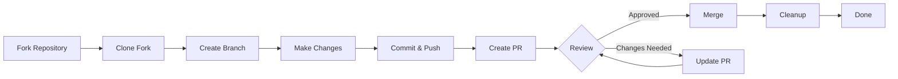

> Bu kılavuz, ilk kurulumdan birleştirilmiş çekme isteğine kadar XOOPS'ye katkıda bulunmanın tüm süreci boyunca size yol gösterir.

---

## Önkoşullar

Katkıda bulunmaya başlamadan önce aşağıdakilere sahip olduğunuzdan emin olun:

- **Git** kuruldu ve yapılandırıldı
- **GitHub hesabı** (ücretsiz)
- **PHP 7,4+** XOOPS geliştirme için
- Bağımlılık yönetimi için **Composer**
- Git iş akışları hakkında temel bilgi
- Davranış Kurallarına aşinalık

---

## Adım 1: Depoyu çatallayın

### GitHub Web Arayüzünde

1. Depoya gidin (ör. `XOOPS/XoopsCore27`)
2. Sağ üst köşedeki **Çatal** düğmesini tıklayın
3. Nerede çatallanacağını seçin (kişisel hesabınız)
4. Çatalın tamamlanmasını bekleyin

### Neden Çatal?

- Üzerinde çalışabileceğiniz kendi kopyanız olsun
- Bakımcıların çok sayıda şubeyi yönetmesine gerek yok
- Çatalınızın tam kontrolü sizde
- Çekme İstekleri çatalınıza ve yukarı akış deposuna referans verir

---

## Adım 2: Çatalınızı Yerel Olarak Klonlayın
```bash
# Clone your fork (replace YOUR_USERNAME)
git clone https://github.com/YOUR_USERNAME/XoopsCore27.git
cd XoopsCore27

# Add upstream remote to track original repository
git remote add upstream https://github.com/XOOPS/XoopsCore27.git

# Verify remotes are set correctly
git remote -v
# origin    https://github.com/YOUR_USERNAME/XoopsCore27.git (fetch)
# origin    https://github.com/YOUR_USERNAME/XoopsCore27.git (push)
# upstream  https://github.com/XOOPS/XoopsCore27.git (fetch)
# upstream  https://github.com/XOOPS/XoopsCore27.git (nofetch)
```
---

## Adım 3: Geliştirme Ortamını Kurun

### Bağımlılıkları Yükle
```bash
# Install Composer dependencies
composer install

# Install development dependencies
composer install --dev

# For module development
cd modules/mymodule
composer install
```
### Git'i yapılandır
```bash
# Set your Git identity
git config user.name "Your Name"
git config user.email "your.email@example.com"

# Optional: Set global Git config
git config --global user.name "Your Name"
git config --global user.email "your.email@example.com"
```
### Testleri Çalıştır
```bash
# Make sure tests pass in clean state
./vendor/bin/phpunit

# Run specific test suite
./vendor/bin/phpunit --testsuite unit
```
---

## Adım 4: Özellik Dalı Oluşturun

### Şube Adlandırma Kuralı

Şu modeli izleyin: `<type>/<description>`

**Türler:**
- `feature/` - Yeni özellik
- `fix/` - Hata düzeltmesi
- `docs/` - Yalnızca belgeler
- `refactor/` - Kodu yeniden düzenleme
- `test/` - Test eklemeleri
- `chore/` - Bakım, takımlama

**Örnekler:**
```bash
# Feature branch
git checkout -b feature/add-two-factor-auth

# Bug fix branch
git checkout -b fix/prevent-xss-in-forms

# Documentation branch
git checkout -b docs/update-api-guide

# Always branch from upstream/main (or develop)
git checkout -b feature/my-feature upstream/main
```
### Şubeyi Güncel Tutun
```bash
# Before you start work, sync with upstream
git fetch upstream
git merge upstream/main

# Later, if upstream has changed
git fetch upstream
git rebase upstream/main
```
---

## Adım 5: Değişikliklerinizi Yapın

### Geliştirme Uygulamaları

1. **PH000000¤ Standartlarına uygun olarak **kodu yazın**
2. Yeni işlevler için **testler yazın**
3. **Gerekirse belgeleri güncelleyin**
4. **Linter'ları çalıştırın** ve kod formatlayıcıları

### Kod Kalitesi Kontrolleri
```bash
# Run all tests
./vendor/bin/phpunit

# Run with coverage
./vendor/bin/phpunit --coverage-html coverage/

# Run PHP CS Fixer
./vendor/bin/php-cs-fixer fix --dry-run

# Run PHPStan static analysis
./vendor/bin/phpstan analyse class/ src/
```
### İyi Değişiklikler Yapın
```bash
# Check what you changed
git status
git diff

# Stage specific files
git add class/MyClass.php
git add tests/MyClassTest.php

# Or stage all changes
git add .

# Commit with descriptive message
git commit -m "feat(auth): add two-factor authentication support"
```
---

## Adım 6: Şubeyi Senkronize Tutun

Özelliğiniz üzerinde çalışırken ana dal ilerleyebilir:
```bash
# Fetch latest changes from upstream
git fetch upstream

# Option A: Rebase (preferred for clean history)
git rebase upstream/main

# Option B: Merge (simpler but adds merge commits)
git merge upstream/main

# If conflicts occur, resolve them then:
git add .
git rebase --continue  # or git merge --continue
```
---

## Adım 7: Çatalınıza İtin
```bash
# Push your branch to your fork
git push origin feature/my-feature

# On subsequent pushes
git push

# If you rebased, you might need force push (use carefully!)
git push --force-with-lease origin feature/my-feature
```
---

## Adım 8: Çekme İsteği Oluşturun

### GitHub Web Arayüzünde

1. GitHub'daki çatalınıza gidin
2. Şubenizden PR oluşturmanızı isteyen bir bildirim göreceksiniz
3. **"Karşılaştır ve isteği çek"** seçeneğini tıklayın
4. Veya manuel olarak **"Yeni çekme isteği"** seçeneğine tıklayın ve şubenizi seçin

### Halkla İlişkiler Başlığı ve Açıklaması

**Başlık Formatı:**
```
<type>(<scope>): <subject>
```
Örnekler:
```
feat(auth): add two-factor authentication
fix(forms): prevent XSS in text input
docs: update installation guide
refactor(core): improve performance
```
**Açıklama Şablonu:**
```markdown
## Description
Brief explanation of what this PR does.

## Changes
- Changed X from A to B
- Added feature Y
- Fixed bug Z

## Type of Change
- [ ] New feature (adds new functionality)
- [ ] Bug fix (fixes an issue)
- [ ] Breaking change (API/behavior change)
- [ ] Documentation update

## Testing
- [ ] Added tests for new functionality
- [ ] All existing tests pass
- [ ] Manual testing performed

## Screenshots (if applicable)
Include before/after screenshots for UI changes.

## Related Issues
Closes #123
Related to #456

## Checklist
- [ ] Code follows style guidelines
- [ ] Self-reviewed own code
- [ ] Commented complex code
- [ ] Updated documentation
- [ ] No new warnings generated
- [ ] Tests pass locally
```
### Halkla İlişkiler İnceleme Kontrol Listesi

Göndermeden önce aşağıdakilerden emin olun:

- [ ] Kod PHP Standartlarına uygundur
- [ ] Testler dahildir ve başarılıdır
- [ ] Dokümantasyon güncellendi (gerekiyorsa)
- [ ] Birleştirme çakışması yok
- [ ] Commit mesajları net
- [ ] İlgili konulara atıfta bulunulmuştur
- [ ] PR açıklaması ayrıntılıdır
- [ ] Hata ayıklama kodu veya konsol günlüğü yok

---

## Adım 9: Geri Bildirime Yanıt Verin

### Kod İncelemesi Sırasında

1. **Yorumları dikkatlice okuyun** - Geri bildirimleri anlayın
2. **Soru sorun** - Açık değilse açıklama isteyin
3. **Alternatifleri tartışın** - Yaklaşımları saygıyla tartışın
4. **İstenen değişiklikleri yapın** - Şubenizi güncelleyin
5. **Güncellenen taahhütleri zorla itin** - Geçmişi yeniden yazıyorsanız
```bash
# Make changes
git add .
git commit --amend  # Modify last commit
git push --force-with-lease origin feature/my-feature

# Or add new commits
git commit -m "Address feedback on PR review"
git push origin feature/my-feature
```
### Yinelemeyi Bekleyin

- Çoğu PR birden fazla inceleme turu gerektirir
- Sabırlı ve yapıcı olun
- Geri bildirimi öğrenme fırsatı olarak görün
- Bakımcılar yeniden düzenleme önerebilir

---

## Adım 10: Birleştirme ve Temizleme

### Onaydan Sonra

Bakımcılar onaylayıp birleştirdikten sonra:

1. **GitHub otomatik olarak birleşir** veya bakımcı birleştirmeyi tıklar
2. **Şubeniz silinir** (genellikle otomatiktir)
3. **Değişiklikler yukarı yöndedir**

### Yerel Temizleme
```bash
# Switch to main branch
git checkout main

# Update main with merged changes
git fetch upstream
git merge upstream/main

# Delete local feature branch
git branch -d feature/my-feature

# Delete from your fork (if not auto-deleted)
git push origin --delete feature/my-feature
```
---

## İş Akış Şeması

---

## Ortak Senaryolar

### Başlamadan Önce Senkronizasyon
```bash
# Always start fresh
git fetch upstream
git checkout -b feature/new-thing upstream/main
```
### Daha Fazla İşlem Ekleme
```bash
# Just push again
git add .
git commit -m "feat: additional changes"
git push origin feature/new-thing
```
### Hataları Düzeltmek
```bash
# Last commit has wrong message
git commit --amend -m "Correct message"
git push --force-with-lease

# Revert to previous state (careful!)
git reset --soft HEAD~1  # Keep changes
git reset --hard HEAD~1  # Discard changes
```
### Birleştirme Çakışmalarını Ele Alma
```bash
# Rebase and resolve conflicts
git fetch upstream
git rebase upstream/main

# Edit conflicted files to resolve
# Then continue
git add .
git rebase --continue
git push --force-with-lease
```
---

## En İyi Uygulamalar

### Yap

- Şubelerin tek konulara odaklanmasını sağlayın
- Küçük, mantıklı taahhütler yapın
- Açıklayıcı taahhüt mesajları yazın
- Şubenizi sık sık güncelleyin
- İtmeden önce test edin
- Belge değişiklikleri
- Geri bildirimlere duyarlı olun

### Yapma

- Doğrudan main/master şubesinde çalışın
- İlgisiz değişiklikleri tek bir PR'de karıştırın
- Oluşturulan dosyaları veya node_modules'ı işleyin
- PR herkese açık hale geldikten sonra zorla itme yapın ( --force-with-lease kullanın)
- Kod inceleme geri bildirimlerini dikkate almayın
- Büyük PR'ler oluşturun (daha küçük olanlara bölün)
- Hassas verileri kaydedin (API anahtarlar, şifreler)

---

## Başarı İçin İpuçları

### İletişim kurun

- Çalışmaya başlamadan önce konularda sorular sorun
- Karmaşık değişiklikler konusunda rehberlik isteyin
- PR açıklamasında yaklaşımı tartışın
- Geri bildirimlere anında yanıt verin

### Standartları Takip Edin

- PHP Standartlarını İnceleyin
- Sorun Raporlama yönergelerini kontrol edin
- Katkıda Bulunmaya Genel Bakış'ı okuyun
- Çekme İsteği Yönergelerini izleyin

### Kod Tabanını Öğrenin

- Mevcut kod kalıplarını okuyun
- Benzer uygulamaları inceleyin
- Mimariyi anlayın
- Temel Kavramları Kontrol Edin

---

## İlgili Belgeler

- Davranış Kuralları
- Çekme Talebi Yönergeleri
- Sorun Raporlama
- PHP Kodlama Standartları
- Katkıda Bulunmaya Genel Bakış

---

#xoops #git #github #katkıda bulunma #iş akışı #çekme isteği