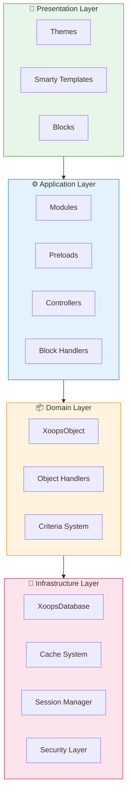
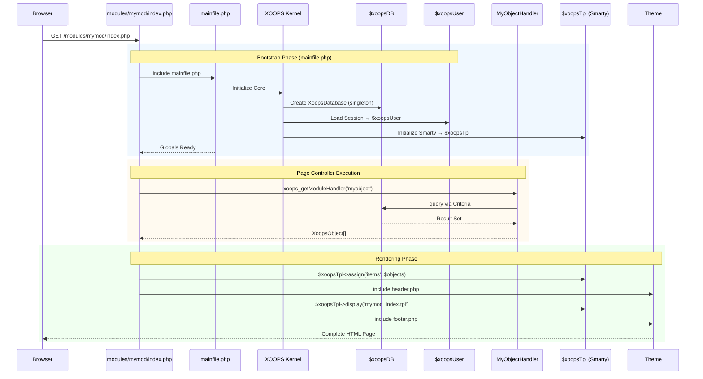

:::not[Bu Belge Hakkında]
Bu sayfada XOOPS'nin hem mevcut (2.5.x) hem de gelecekteki (4.0.x) sürümleri için geçerli olan **kavramsal mimarisini** açıklanmaktadır. Bazı diyagramlar katmanlı tasarım vizyonunu göstermektedir.

**Versiyona özel ayrıntılar için:**
- **XOOPS 2.5.x Bugün:** `mainfile.php`, globaller (`$xoopsDB`, `$xoopsUser`), ön yüklemeler ve işleyici modelini kullanır
- **XOOPS 4.0 Hedef:** PSR-15 ara katman yazılımı, DI kapsayıcısı, yönlendirici - bkz. [Yol Haritası](../../07-XOOPS-4.0/XOOPS-4.0-Roadmap.md)
:::

Bu belge, XOOPS sistem mimarisine kapsamlı bir genel bakış sunarak, esnek ve genişletilebilir bir içerik yönetim sistemi oluşturmak için çeşitli bileşenlerin birlikte nasıl çalıştığını açıklar.

## Genel Bakış

XOOPS, endişeleri farklı katmanlara ayıran modüler bir mimariyi takip eder. Sistem birkaç temel prensip üzerine kurulmuştur:

- **Modülerlik**: İşlevsellik bağımsız, kurulabilir modules halinde düzenlenmiştir
- **Genişletilebilirlik**: Sistem, Core kod değiştirilmeden genişletilebilir
- **Soyutlama**: database ve sunum katmanları iş mantığından soyutlanmıştır
- **Güvenlik**: Yerleşik güvenlik mekanizmaları yaygın güvenlik açıklarına karşı koruma sağlar

## Sistem Katmanları

### 1. Sunum Katmanı

Sunum katmanı, Smarty template motorunu kullanarak user arayüzü oluşturmayı yönetir.

**Temel Bileşenler:**
- **themes**: Görsel stil ve düzen
- **Smarty templates**: Dinamik içerik oluşturma
- **Bloklar**: Yeniden kullanılabilir içerik widget'ları

### 2. Uygulama Katmanı

Uygulama katmanı iş mantığını, denetleyicileri ve module işlevselliğini içerir.

**Temel Bileşenler:**
- **modules**: Bağımsız işlevsellik paketleri
- **İşleyiciler**: Veri işleme sınıfları
- **Ön yüklemeler**: Etkinlik dinleyicileri ve hooks

### 3. Etki Alanı Katmanı

Etki alanı katmanı temel iş nesnelerini ve kurallarını içerir.

**Temel Bileşenler:**
- **XoopsObject**: Tüm etki alanı nesneleri için temel sınıf
- **İşleyiciler**: Etki alanı nesneleri için CRUD işlemleri

### 4. Altyapı Katmanı

Altyapı katmanı, database erişimi ve önbelleğe alma gibi temel hizmetleri sağlar.

## Yaşam Döngüsü İste

İstek yaşam döngüsünü anlamak, etkili XOOPS geliştirme için çok önemlidir.

### XOOPS 2.5.x Sayfa Denetleyici Akışı

Geçerli XOOPS 2.5.x, her PHP dosyasının kendi isteğini işlediği bir **Sayfa Denetleyicisi** modelini kullanır. Globaller (`$xoopsDB`, `$xoopsUser`, `$xoopsTpl`, vb.) önyükleme sırasında başlatılır ve yürütme boyunca kullanılabilir.

### 2.5.x'teki Temel Globaller

| Küresel | Tür | Başlatıldı | Amaç |
|----------|------|------------|-----------|
| `$xoopsDB` | `XoopsDatabase` | Önyükleme | database bağlantısı (tekli) |
| `$xoopsUser` | `XoopsUser\|null` | Oturum yükü | Şu an oturum açmış user |
| `$xoopsTpl` | `XoopsTpl` | template başlangıcı | Smarty template motoru |
| `$xoopsModule` | `XoopsModule` | module yükü | Geçerli module içeriği |
| `$xoopsConfig` | `array` | Yapılandırma yükü | Sistem konfigürasyonu |

:::note[XOOPS 4.0 Karşılaştırması]
XOOPS 4.0'da, Sayfa Denetleyici modeli, **PSR-15 Ara Yazılım Ardışık Düzeni** ve yönlendirici tabanlı dağıtımla değiştirildi. Globaller bağımlılık enjeksiyonu ile değiştirilir. Geçiş sırasındaki uyumluluk garantileri için [Karma Mod Sözleşmesi](../../07-XOOPS-4.0/Specifications/Hybrid-Mode-Contract.md)'ne bakın.
:::

### 1. Önyükleme Aşaması
```php
// mainfile.php is the entry point
include_once XOOPS_ROOT_PATH . '/mainfile.php';

// Core initialization
$xoops = Xoops::getInstance();
$xoops->boot();
```
**Adımlar:**
1. Yapılandırmayı yükleyin (`mainfile.php`)
2. Otomatik yükleyiciyi başlatın
3. Hata işlemeyi ayarlayın
4. database bağlantısı kurun
5. user oturumunu yükleyin
6. Smarty template motorunu başlatın

### 2. Yönlendirme Aşaması
```php
// Request routing to appropriate module
$module = $GLOBALS['xoopsModule'];
$controller = $module->getController();
$controller->dispatch($request);
```
**Adımlar:**
1. Ayrıştırma isteği URL
2. Hedef modülü tanımlayın
3. module konfigürasyonunu yükleyin
4. İzinleri kontrol edin
5. Uygun işleyiciye yönlendirin

### 3. Yürütme Aşaması
```php
// Controller execution
$data = $handler->getObjects($criteria);
$xoopsTpl->assign('items', $data);
```
**Adımlar:**
1. Denetleyici mantığını yürütün
2. Veri katmanıyla etkileşim kurun
3. İş kurallarını işleyin
4. Görünüm verilerini hazırlayın

### 4. Oluşturma Aşaması
```php
// Template rendering
include XOOPS_ROOT_PATH . '/header.php';
$xoopsTpl->display('db:module_template.tpl');
include XOOPS_ROOT_PATH . '/footer.php';
```
**Adımlar:**
1. theme düzenini uygulayın
2. module şablonunu oluşturun
3. Süreç blokları
4. Çıkış yanıtı

## Temel Bileşenler

### XoopsObject

XOOPS'deki tüm veri nesneleri için temel sınıf.
```php
<?php
class MyModuleItem extends XoopsObject
{
    public function __construct()
    {
        $this->initVar('id', XOBJ_DTYPE_INT, null, false);
        $this->initVar('title', XOBJ_DTYPE_TXTBOX, '', true, 255);
        $this->initVar('content', XOBJ_DTYPE_TXTAREA, '', false);
        $this->initVar('created', XOBJ_DTYPE_INT, time(), false);
    }
}
```
**Anahtar Yöntemler:**
- `initVar()` - Nesne özelliklerini tanımlayın
- `getVar()` - Özellik değerlerini al
- `setVar()` - Özellik değerlerini ayarlayın
- `assignVars()` - Diziden toplu atama

### XoopsPersistableObjectHandler

XoopsObject bulut sunucuları için CRUD işlemlerini yönetir.
```php
<?php
class MyModuleItemHandler extends XoopsPersistableObjectHandler
{
    public function __construct(\XoopsDatabase $db)
    {
        parent::__construct($db, 'mymodule_items', 'MyModuleItem', 'id', 'title');
    }

    public function getActiveItems($limit = 10)
    {
        $criteria = new CriteriaCompo();
        $criteria->add(new Criteria('status', 1));
        $criteria->setSort('created');
        $criteria->setOrder('DESC');
        $criteria->setLimit($limit);

        return $this->getObjects($criteria);
    }
}
```
**Anahtar Yöntemler:**
- `create()` - Yeni nesne örneği oluştur
- `get()` - Nesneyi kimliğe göre al
- `insert()` - Nesneyi veritabanına kaydet
- `delete()` - Nesneyi veritabanından kaldır
- `getObjects()` - Birden fazla nesneyi al
- `getCount()` - Eşleşen nesneleri sayın

### module Yapısı

Her XOOPS modülü standart bir dizin yapısını izler:
```
modules/mymodule/
├── class/                  # PHP classes
│   ├── MyModuleItem.php
│   └── MyModuleItemHandler.php
├── include/                # Include files
│   ├── common.php
│   └── functions.php
├── templates/              # Smarty templates
│   ├── mymodule_index.tpl
│   └── mymodule_item.tpl
├── admin/                  # Admin area
│   ├── index.php
│   └── menu.php
├── language/               # Translations
│   └── english/
│       ├── main.php
│       └── modinfo.php
├── sql/                    # Database schema
│   └── mysql.sql
├── xoops_version.php       # Module info
├── index.php               # Module entry
└── header.php              # Module header
```
## Bağımlılık Enjeksiyon Kabı

Modern XOOPS geliştirme, daha iyi test edilebilirlik için bağımlılık enjeksiyonundan yararlanabilir.

### Temel Konteyner Uygulaması
```php
<?php
class XoopsDependencyContainer
{
    private array $services = [];

    public function register(string $name, callable $factory): void
    {
        $this->services[$name] = $factory;
    }

    public function resolve(string $name): mixed
    {
        if (!isset($this->services[$name])) {
            throw new \InvalidArgumentException("Service not found: $name");
        }

        $factory = $this->services[$name];

        if (is_callable($factory)) {
            return $factory($this);
        }

        return $factory;
    }

    public function has(string $name): bool
    {
        return isset($this->services[$name]);
    }
}
```
### PSR-11 Uyumlu Konteyner
```php
<?php
namespace Xmf\Di;

use Psr\Container\ContainerInterface;

class BasicContainer implements ContainerInterface
{
    protected array $definitions = [];

    public function set(string $id, mixed $value): void
    {
        $this->definitions[$id] = $value;
    }

    public function get(string $id): mixed
    {
        if (!$this->has($id)) {
            throw new \InvalidArgumentException("Service not found: $id");
        }

        $entry = $this->definitions[$id];

        if (is_callable($entry)) {
            return $entry($this);
        }

        return $entry;
    }

    public function has(string $id): bool
    {
        return isset($this->definitions[$id]);
    }
}
```
### Kullanım Örneği
```php
<?php
// Service registration
$container = new XoopsDependencyContainer();

$container->register('database', function () {
    return XoopsDatabaseFactory::getDatabaseConnection();
});

$container->register('userHandler', function ($c) {
    return new XoopsUserHandler($c->resolve('database'));
});

// Service resolution
$userHandler = $container->resolve('userHandler');
$user = $userHandler->get($userId);
```
## Uzatma Noktaları

XOOPS çeşitli genişletme mekanizmaları sağlar:

### 1. Ön yüklemeler

Ön yüklemeler, modüllerin temel olaylara bağlanmasına olanak tanır.
```php
<?php
// modules/mymodule/preloads/core.php
class MymoduleCorePreload extends XoopsPreloadItem
{
    public static function eventCoreHeaderEnd($args)
    {
        // Execute when header processing ends
    }

    public static function eventCoreFooterStart($args)
    {
        // Execute when footer processing starts
    }
}
```
### 2. Eklentiler

Eklentiler, modüllerdeki belirli işlevleri genişletir.
```php
<?php
// modules/mymodule/plugins/notify.php
class MymoduleNotifyPlugin
{
    public function onItemCreate($item)
    {
        // Send notification when item is created
    }
}
```
### 3. Filtreler

Filtreler, sistemden geçerken verileri değiştirir.
```php
<?php
// Content filter example
$myts = MyTextSanitizer::getInstance();
$content = $myts->displayTarea($rawContent, 1, 1, 1);
```
## En İyi Uygulamalar

### Kod Organizasyonu

1. Yeni kod için **ad alanlarını kullanın**:   
```php
   namespace XoopsModules\MyModule;

   class Item extends \XoopsObject
   {
       // Implementation
   }
   
```
2. **PSR-4 otomatik yüklemeyi takip edin**:   
```json
   {
       "autoload": {
           "psr-4": {
               "XoopsModules\\MyModule\\": "class/"
           }
       }
   }
   
```
3. **Ayrı endişeler**:
   - `class/`'deki alan adı mantığı
   - `templates/`'de sunum
   - module kökündeki kontrolörler

### Performans

1. Pahalı işlemler için **önbelleğe almayı kullanın**
2. Mümkün olduğunda kaynakları **geç yükleme**
3. **Kriter gruplandırmayı kullanarak **database sorgularını en aza indirin**
4. **Karmaşık mantıktan kaçınarak **şablonları optimize edin**

### Güvenlik

1. **Tüm girişleri doğrulayın** `Xmf\Request`'yi kullanarak
2. Şablonlarda **çıkış çıkışı**
3. database sorguları için **hazırlanmış ifadeleri kullanın**
4. Hassas işlemlerden önce **izinleri kontrol edin**

## İlgili Belgeler

- [Tasarım-Desenleri](Design-Patterns.md) - XOOPS'de kullanılan tasarım desenleri
- [database Katmanı](../Database/Database-Layer.md) - database soyutlama ayrıntıları
- [Smarty Temel Bilgiler](../Templates/Smarty-Basics.md) - template sistem dokümantasyonu
- [En İyi Güvenlik Uygulamaları](../Security/Security-Best-Practices.md) - Güvenlik yönergeleri

---

#xoops #mimari #temel #tasarım #sistem tasarımı