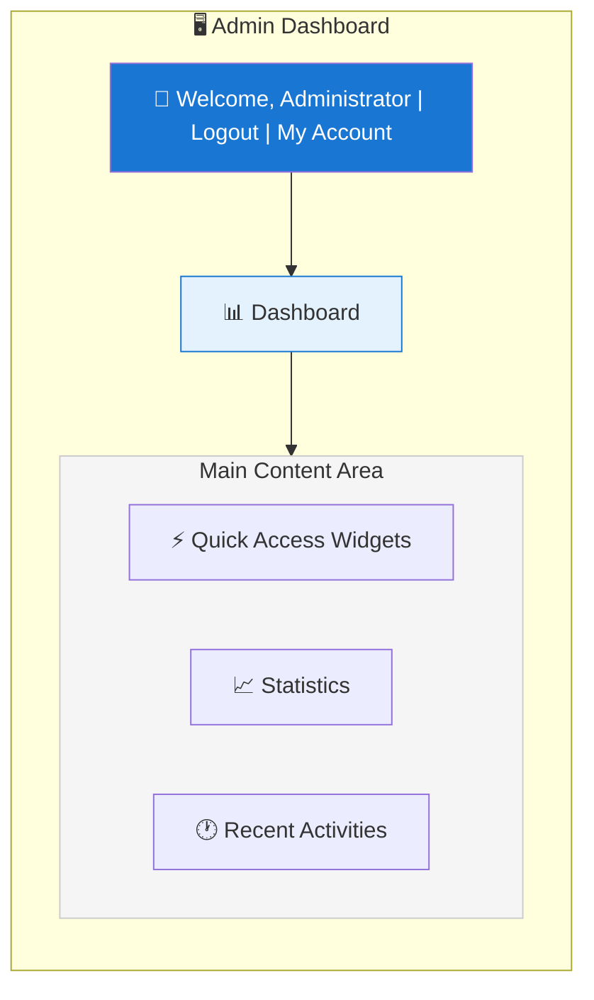
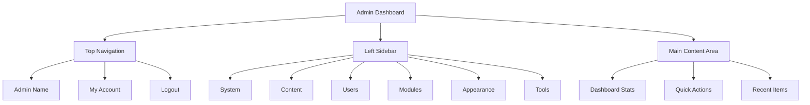

# XOOPS Yönetici Paneline Genel Bakış

XOOPS yönetici kontrol panelinde gezinmeye ve kullanmaya ilişkin eksiksiz kılavuz.

## Yönetici Paneline Erişim

### Yönetici Girişi

Tarayıcınızı açın ve şuraya gidin:
```
http://your-domain.com/xoops/admin/
```
Veya XOOPS kökteyse:
```
http://your-domain.com/admin/
```
Yönetici kimlik bilgilerinizi girin:
```
Username: [Your admin username]
Password: [Your admin password]
```
### Giriş Yaptıktan Sonra

Ana yönetici kontrol panelini göreceksiniz:

## Yönetici Paneli Düzeni

## Kontrol Paneli Bileşenleri

### Üst Çubuk

Üst çubuk temel kontrolleri içerir:

| Eleman | Amaç |
|---|---|
| **Yönetici Logosu** | Kontrol paneline dönmek için tıklayın |
| **Hoş Geldiniz Mesajı** | Oturum açmış yönetici adını gösterir |
| **Hesabım** | Yönetici profilini ve şifresini düzenleyin |
| **Yardım** | Belgelere erişim |
| **Çıkış** | Yönetici panelinden çıkış yapın |

### Sol Gezinme Kenar Çubuğu

Fonksiyona göre düzenlenmiş ana menü:
```
├── System
│   ├── Dashboard
│   ├── Preferences
│   ├── Admin Users
│   ├── Groups
│   ├── Permissions
│   ├── Modules
│   └── Tools
├── Content
│   ├── Pages
│   ├── Categories
│   ├── Comments
│   └── Media Manager
├── Users
│   ├── Users
│   ├── User Requests
│   ├── Online Users
│   └── User Groups
├── Modules
│   ├── Modules
│   ├── Module Settings
│   └── Module Updates
├── Appearance
│   ├── Themes
│   ├── Templates
│   ├── Blocks
│   └── Images
└── Tools
    ├── Maintenance
    ├── Email
    ├── Statistics
    ├── Logs
    └── Backups
```
### Ana İçerik Alanı

Seçilen bölüme ilişkin bilgileri ve kontrolleri görüntüler:

- Yapılandırma formları
- Listeli veri tabloları
- Grafikler ve istatistikler
- Hızlı işlem düğmeleri
- Yardım metni ve ipuçları

### Kontrol Paneli Widget'ları

Önemli bilgilere hızlı erişim:

- **Sistem Bilgileri:** PHP sürümü, MySQL sürümü, XOOPS sürümü
- **Hızlı İstatistikler:** user sayısı, toplam gönderiler, yüklü modules
- **Son Etkinlik:** En son girişler, içerik değişiklikleri, hatalar
- **Sunucu Durumu:** CPU, bellek, disk kullanımı
- **Bildirimler:** Sistem uyarıları, bekleyen güncellemeler

## Temel Yönetici İşlevleri

### Sistem Yönetimi

**Konum:** Sistem > [Çeşitli Seçenekler]

#### Tercihler

Temel sistem ayarlarını yapılandırın:
```
System > Preferences > [Settings Category]
```
Kategoriler:
- Genel Ayarlar (site adı, saat dilimi)
- user Ayarları (kayıt, profiller)
- E-posta Ayarları (SMTP yapılandırması)
- cache Ayarları (önbellekleme seçenekleri)
- URL Ayarlar (dostça URLs)
- Meta Etiketler (SEO ayarları)

Bkz. Temel Yapılandırma ve Sistem Ayarları.

#### Yönetici users

Yönetici hesaplarını yönetin:
```
System > Admin Users
```
İşlevler:
- Yeni yöneticiler ekleyin
- Yönetici profillerini düzenleyin
- Yönetici şifrelerini değiştirin
- Yönetici hesaplarını silin
- Yönetici izinlerini ayarlayın

### İçerik Yönetimi

**Konum:** İçerik > [Çeşitli Seçenekler]

#### Pages/Articles

Site içeriğini yönetin:
```
Content > Pages (or your module)
```
İşlevler:
- Yeni sayfalar oluşturun
- Mevcut içeriği düzenleyin
- Sayfaları sil
- Publish/unpublish
- Kategorileri ayarla
- Revizyonları yönet

#### Kategoriler

İçeriği düzenleyin:
```
Content > Categories
```
İşlevler:
- Kategori hiyerarşisi oluşturun
- Kategorileri düzenle
- Kategorileri sil
- Sayfalara ata

#### Yorumlar

user yorumlarını denetleyin:
```
Content > Comments
```
İşlevler:
- Tüm yorumları görüntüle
- Yorumları onayla
- Yorumları düzenleyin
- Spam'ı sil
- Yorum yapanları engelle

### user Yönetimi

**Konum:** users > [Çeşitli Seçenekler]

#### users

user hesaplarını yönetin:
```
Users > Users
```
İşlevler:
- Tüm kullanıcıları görüntüle
- Yeni users oluşturun
- user profillerini düzenleyin
- Hesapları sil
- Şifreleri sıfırla
- user durumunu değiştir
- Gruplara atayın

#### Çevrimiçi users

Aktif kullanıcıları izleyin:
```
Users > Online Users
```
Gösterir:
- Şu anda çevrimiçi users
- Son aktivite zamanı
- IP adresi
- user konumu (yapılandırılmışsa)

#### user Grupları

user rollerini ve izinlerini yönetin:
```
Users > Groups
```
İşlevler:
- Özel gruplar oluşturun
- Grup izinlerini ayarlayın
- Kullanıcıları gruplara atayın
- Grupları sil

### module Yönetimi

**Konum:** modules > [Çeşitli Seçenekler]

#### modules

Modülleri kurun ve yapılandırın:
```
Modules > Modules
```
İşlevler:
- Kurulu modülleri görüntüle
- Enable/disable modülleri
- Modülleri güncelle
- module ayarlarını yapılandırın
- Yeni modules yükleyin
- module ayrıntılarını görüntüleyin

#### Güncellemeleri Kontrol Et
```
Modules > Modules > Check for Updates
```
Ekranlar:
- Mevcut module güncellemeleri
- Değişiklik günlüğü
- İndirme ve yükleme seçenekleri

### Görünüm Yönetimi

**Konum:** Görünüm > [Çeşitli Seçenekler]

#### themes

Site temalarını yönetin:
```
Appearance > Themes
```
İşlevler:
- Yüklü temaları görüntüle
- Varsayılan temayı ayarla
- Yeni themes yükleyin
- Temaları sil
- theme önizlemesi
- theme yapılandırması

#### Bloklar

İçerik bloklarını yönetin:
```
Appearance > Blocks
```
İşlevler:
- Özel bloklar oluşturun
- Blok içeriğini düzenleyin
- Sayfadaki blokları düzenleyin
- Blok görünürlüğünü ayarlayın
- Blokları sil
- Blok önbelleğe almayı yapılandırın

#### templates

Şablonları yönet (gelişmiş):
```
Appearance > Templates
```
İleri düzey users ve geliştiriciler için.

### Sistem Araçları

**Konum:** Sistem > Araçlar

#### Bakım Modu

Bakım sırasında user erişimini engelleyin:
```
System > Maintenance Mode
```
Yapılandır:
- Enable/disable bakımı
- Özel bakım mesajı
- İzin verilen IP adresleri (test için)

#### database Yönetimi
```
System > Database
```
İşlevler:
- database tutarlılığını kontrol edin
- database güncellemelerini çalıştırın
- Tamir masaları
- Veritabanını optimize edin
- database yapısını dışa aktar

#### Etkinlik Günlükleri
```
System > Logs
```
Monitör:
- user etkinliği
- İdari işlemler
- Sistem olayları
- Hata günlükleri

## Hızlı Eylemler

Kontrol panelinden erişilebilen ortak görevler:
```
Quick Links:
├── Create New Page
├── Add New User
├── Create Content Block
├── Upload Image
├── Send Mass Email
├── Update All Modules
└── Clear Cache
```
## Yönetici Paneli Klavye Kısayolları

Hızlı gezinme:

| Kısayol | Eylem |
|---|---|
| `Ctrl+H` | Yardıma git |
| `Ctrl+D` | Kontrol paneline git |
| `Ctrl+Q` | Hızlı arama |
| `Ctrl+L` | Oturumu kapat |

## user Hesabı Yönetimi

### Hesabım

Yönetici profilinize erişin:

1. Sağ üstteki "Hesabım"a tıklayın
2. Profil bilgilerini düzenleyin:
   - E-posta adresi
   - Gerçek isim
   - user bilgileri
   -Avatar

### Şifreyi Değiştir

Yönetici şifrenizi değiştirin:

1. **Hesabım**'a gidin
2. "Şifreyi Değiştir"e tıklayın
3. Mevcut şifreyi girin
4. Yeni şifreyi girin (iki kez)
5. "Kaydet"e tıklayın

**Güvenlik İpuçları:**
- Güçlü şifreler kullanın (16+ karakter)
- Büyük harf, küçük harf, sayılar ve semboller ekleyin
- Her 90 günde bir şifreyi değiştirin
- Yönetici kimlik bilgilerini asla paylaşmayın

### Oturumu kapat

Yönetici panelinden çıkış yapın:

1. Sağ üstteki "Oturumu Kapat"a tıklayın
2. Giriş sayfasına yönlendirileceksiniz

## Yönetici Paneli İstatistikleri

### Kontrol Paneli İstatistikleri

Site ölçümlerine hızlı genel bakış:

| Metrik | Değer |
|----------|----------|
| Çevrimiçi users | 12 |
| Toplam user | 256 |
| Toplam Gönderiler | 1.234 |
| Toplam Yorumlar | 5,678 |
| Toplam modules | 8 |

### Sistem Durumu

Sunucu ve performans bilgileri:

| Bileşen | Version/Value |
|-----------|---------------|
| XOOPS Versiyon | 2.5.11 |
| PHP Sürüm | 8.2.x |
| MySQL Versiyon | 8.0.x |
| Sunucu Yükü | 0,45, 0,42 |
| Çalışma Süresi | 45 gün |

### Son Etkinlik

Son olayların zaman çizelgesi:
```
12:45 - Admin login
12:30 - New user registered
12:15 - Page published
12:00 - Comment posted
11:45 - Module updated
```
## Bildirim Sistemi

### Yönetici Uyarıları

Şunun için bildirim alın:

- Yeni user kayıtları
- Denetlenmeyi bekleyen yorumlar
- Başarısız giriş denemeleri
- Sistem hataları
- module güncellemeleri mevcut
- database sorunları
- Disk alanı uyarıları

Uyarıları yapılandırın:

**Sistem > Tercihler > E-posta Ayarları**
```
Notify Admin on Registration: Yes
Notify Admin on Comments: Yes
Notify Admin on Errors: Yes
Alert Email: admin@your-domain.com
```
## Ortak Yönetici Görevleri

### Yeni Bir Sayfa Oluştur

1. **İçerik > Sayfalar**'a (veya ilgili modüle) gidin
2. "Yeni Sayfa Ekle"ye tıklayın
3. Doldurun:
   - Başlık
   - İçerik
   - Açıklama
   - Kategori
   - Meta veriler
4. "Yayınla"ya tıklayın

### Kullanıcıları Yönet

1. **users > users**'a gidin
2. user listesini şununla görüntüleyin:
   - user adı
   - E-posta
   - Kayıt tarihi
   - Son giriş
   - Durum

3. Aşağıdakileri yapmak için user adına tıklayın:
   - Profili düzenle
   - Şifreyi değiştir
   - Grupları düzenle
   - Block/unblock kullanıcısı

### Modülü Yapılandır

1. **modules > modules**'e gidin
2. Listede modülü bulun
3. module adına tıklayın
4. "Tercihler" veya "Ayarlar"a tıklayın
5. module seçeneklerini yapılandırın
6. Değişiklikleri kaydedin

### Yeni Bir Blok Oluştur

1. **Görünüm > Bloklar**'a gidin
2. "Yeni Blok Ekle"ye tıklayın
3. Girin:
   - Blok başlığı
   - İçeriği engelle (HTML izin verilir)
   - Sayfadaki konum
   - Görünürlük (tüm sayfalar veya belirli)
   - module (varsa)
4. "Gönder"e tıklayın

## Yönetici Paneli Yardımı

### Yerleşik Belgeler

Yönetici panelinden yardıma erişin:

1. Üst çubuktaki "Yardım" düğmesine tıklayın
2. Geçerli sayfa için bağlama duyarlı yardım
3. Belgelere bağlantılar
4. Sık sorulan sorular

### Dış Kaynaklar

- XOOPS Resmi Site: https://xoops.org/
- Topluluk Forumu: https://xoops.org/modules/newbb/
- module Deposu: https://xoops.org/modules/repository/
- Bugs/Issues: https://github.com/XOOPS/XoopsCore/issues

## Yönetici Panelini Özelleştirme

### Yönetici Teması

Yönetici arayüzü temasını seçin:

**Sistem > Tercihler > Genel Ayarlar**
```
Admin Theme: [Select theme]
```
Mevcut themes:
- Varsayılan (ışık)
- Karanlık mod
- Özel themes

### Kontrol Paneli Özelleştirmesi

Hangi widget'ların görüneceğini seçin:

**Kontrol Paneli > Özelleştir**

Seçin:
- Sistem bilgisi
- İstatistikler
- Son etkinlik
- Hızlı bağlantılar
- Özel widget'lar

## Yönetici Paneli İzinleri

Farklı yönetici düzeylerinin farklı izinleri vardır:

| Rol | Yetenekler |
|---|---|
| **Web yöneticisi** | Tüm yönetici işlevlerine tam erişim |
| **Yönetici** | Sınırlı yönetici işlevleri |
| **Moderatör** | Yalnızca içerik denetimi |
| **Editör** | İçerik oluşturma ve düzenleme |

İzinleri yönetin:

**Sistem > permissions**

## Yönetici Paneli için En İyi Güvenlik Uygulamaları

1. **Güçlü Şifre:** 16+ karakterli şifre kullanın
2. **Düzenli Değişiklikler:** Şifreyi 90 günde bir değiştirin
3. **Erişimi İzleyin:** "Yönetici users" günlüklerini düzenli olarak kontrol edin
4. **Erişimi Sınırla:** Ek güvenlik için yönetici klasörünü yeniden adlandırın
5. **HTTPS kullanın:** Yöneticiye her zaman HTTPS aracılığıyla erişin
6. **IP Beyaz Listesi:** Yönetici erişimini belirli IP'lere kısıtlayın
7. **Düzenli Oturum Kapatma:** İşiniz bittiğinde oturumu kapatın
8. **Tarayıcı Güvenliği:** Tarayıcı önbelleğini düzenli olarak temizleyin

Bkz. Güvenlik Yapılandırması.

## Yönetici Paneli Sorunlarını Giderme

### Yönetici Paneline Erişilemiyor

**Çözüm:**
1. Oturum açma kimlik bilgilerini doğrulayın
2. Tarayıcı önbelleğini ve çerezleri temizleyin
3. Farklı tarayıcıyı deneyin
4. Yönetici klasörü yolunun doğru olup olmadığını kontrol edin
5. Yönetici klasöründeki dosya izinlerini doğrulayın
6. mainfile.php dosyasındaki database bağlantısını kontrol edin

### Boş Yönetici Sayfası

**Çözüm:**
```bash
# Check PHP errors
tail -f /var/log/apache2/error.log

# Enable debug mode temporarily
sed -i "s/define('XOOPS_DEBUG', 0)/define('XOOPS_DEBUG', 1)/" /var/www/html/xoops/mainfile.php

# Check file permissions
ls -la /var/www/html/xoops/admin/
```
### Yavaş Yönetici Paneli

**Çözüm:**
1. Önbelleği temizleyin: **Sistem > Araçlar > Önbelleği Temizle**
2. Veritabanını optimize edin: **Sistem > database > Optimize Et**
3. Sunucu kaynaklarını kontrol edin: `htop`
4. MySQL'daki yavaş sorguları inceleyin

### module Görünmüyor

**Çözüm:**
1. Modülün kurulduğunu doğrulayın: **modules > modules**
2. Modülün etkin olup olmadığını kontrol edin
3. Atanan izinleri doğrulayın
4. module dosyalarının mevcut olup olmadığını kontrol edin
5. Hata günlüklerini inceleyin

## Sonraki Adımlar

Yönetici panelini tanıdıktan sonra:

1. İlk sayfanızı oluşturun
2. user gruplarını ayarlayın
3. Ek modülleri yükleyin
4. Temel ayarları yapılandırın
5. Güvenliği uygulayın

---

**Etiketler:** #yönetici paneli #kontrol paneli #gezinme #başlarken

**İlgili Makaleler:**
- ../Configuration/Basic-Configuration
- ../Configuration/System-Settings
- İlk Sayfanızı Oluşturma
- Kullanıcıları Yönetme
- Modüllerin Kurulumu