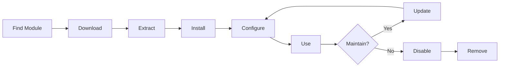

# XOOPS Modüllerini Kurma ve Yönetme

Modülleri yükleyip yapılandırarak XOOPS işlevselliğini nasıl genişleteceğinizi öğrenin.

## XOOPS Modüllerini Anlamak

### modules nedir?

modules, XOOPS'ye işlevsellik ekleyen uzantılardır:

| Tür | Amaç | Örnekler |
|---|---|---|
| **İçerik** | Belirli içerik türlerini yönetin | Haberler, Blog, Biletler |
| **Topluluk** | user etkileşimi | Forum, Yorumlar, İncelemeler |
| **e-Ticaret** | Ürün satışı | Mağaza, Sepet, Ödemeler |
| **Medya** | Kolu files/images | Galeri, İndirilenler, Videolar |
| **Yardımcı Program** | Araçlar ve yardımcılar | E-posta, Yedekleme, Analiz |

### Core ve İsteğe Bağlı modules

| module | Tür | Dahil | Çıkarılabilir |
|---|---|---|---|
| **Sistem** | Core | Evet | Hayır |
| **user** | Core | Evet | Hayır |
| **Profil** | Önerilen | Evet | Evet |
| **ÖM (Özel Mesaj)** | Önerilen | Evet | Evet |
| **WF Kanalı** | İsteğe bağlı | Sıklıkla | Evet |
| **Haberler** | İsteğe bağlı | Hayır | Evet |
| **Forum** | İsteğe bağlı | Hayır | Evet |

## module Yaşam Döngüsü

## module Bulma

### XOOPS module Havuzu

Resmi XOOPS module deposu:

**Ziyaret edin:** https://xoops.org/modules/repository/
```
Directory > Modules > [Browse Categories]
```
Kategoriye göre göz atın:
- İçerik Yönetimi
- Topluluk
- e-Ticaret
- Multimedya
- Geliştirme
- Site Yönetimi

### Değerlendirme Modülleri

Kurulumdan önce şunları kontrol edin:

| Kriterler | Nelere Bakılmalı |
|---|---|
| **Uyumluluk** | XOOPS sürümünüzle çalışır |
| **Derecelendirme** | İyi user yorumları ve derecelendirmeleri |
| **Güncellemeler** | Yakın zamanda bakımı |
| **İndirilenler** | Popüler ve yaygın olarak kullanılan |
| **Gereksinimler** | Sunucunuzla uyumlu |
| **Lisans** | GPL veya benzeri açık kaynak |
| **Destek** | Aktif geliştirici ve topluluk |

### module Bilgilerini Okuyun

Her module listesi şunları gösterir:
```
Module Name: [Name]
Version: [X.X.X]
Requires: XOOPS [Version]
Author: [Name]
Last Update: [Date]
Downloads: [Number]
Rating: [Stars]
Description: [Brief description]
Compatibility: PHP [Version], MySQL [Version]
```
## Modülleri Yükleme

### Yöntem 1: Yönetici Paneli Kurulumu

**1. Adım: modules Bölümüne Erişim**

1. Yönetici paneline giriş yapın
2. **modules > modules**'e gidin
3. **"Yeni module Yükle"** veya **"Modüllere Gözat"** seçeneğini tıklayın

**2. Adım: Modülü Yükleyin**

Seçenek A - Doğrudan Yükleme:
1. **"Dosya Seç"**'e tıklayın
2. Bilgisayardan module .zip dosyasını seçin
3. **"Yükle"**'ye tıklayın

Seçenek B - URL Yükle:
1. Modülü yapıştırın URL
2. **"İndir ve Yükle"** seçeneğine tıklayın

**3. Adım: module Bilgilerini İnceleyin**
```
Module Name: [Name shown]
Version: [Version]
Author: [Author info]
Description: [Full description]
Requirements: [PHP/MySQL versions]
```
**"Kuruluma Devam Et"** seçeneğini inceleyin ve tıklayın

**4. Adım: Yükleme Türünü Seçin**
```
☐ Fresh Install (New installation)
☐ Update (Upgrade existing)
☐ Delete Then Install (Replace existing)
```
Uygun seçeneği seçin.

**5. Adım: Kurulumu Onaylayın**

Son onayı inceleyin:
```
Module will be installed to: /modules/modulename/
Database: xoops_db
Proceed? [Yes] [No]
```
Onaylamak için **"Evet"** seçeneğini tıklayın.

**6. Adım: Kurulum Tamamlandı**
```
Installation successful!

Module: [Module Name]
Version: [Version]
Tables created: [Number]
Files installed: [Number]

[Go to Module Settings]  [Return to Modules]
```
### Yöntem 2: Manuel Kurulum (Gelişmiş)

Manuel kurulum veya sorun giderme için:

**1. Adım: Modülü İndirin**

1. .zip modülünü depodan indirin
2. `/var/www/html/xoops/modules/modulename/`'ye çıkartın
```bash
# Extract module
unzip module_name.zip
cp -r module_name /var/www/html/xoops/modules/

# Set permissions
chmod -R 755 /var/www/html/xoops/modules/module_name
```
**2. Adım: Kurulum Komut Dosyasını Çalıştırın**
```
Visit: http://your-domain.com/xoops/modules/module_name/admin/index.php?op=install
```
Veya yönetici paneli aracılığıyla (Sistem > modules > Veritabanını Güncelle).

**3. Adım: Kurulumu Doğrulayın**

1. Admin'de **modules > modules**'e gidin
2. Listede modülünüzü arayın
3. "Etkin" olarak göründüğünü doğrulayın

## module Yapılandırması

### Erişim Modülü Ayarları

1. **modules > modules**'e gidin
2. Modülünüzü bulun
3. module adına tıklayın
4. **"Tercihler"** veya **"Ayarlar"**'a tıklayın

### Ortak module Ayarları

Çoğu module şunları sunar:
```
Module Status: [Enabled/Disabled]
Display in Menu: [Yes/No]
Module Weight: [1-999] (display order)
Visible To Groups: [Checkboxes for user groups]
```
### Modüle Özel Seçenekler

Her modülün kendine özgü ayarları vardır. Örnekler:

**Haber Modülü:**
```
Items Per Page: 10
Show Author: Yes
Allow Comments: Yes
Moderation Required: Yes
```
**Forum Modülü:**
```
Topics Per Page: 20
Posts Per Page: 15
Maximum Attachment Size: 5MB
Enable Signatures: Yes
```
**Galeri Modülü:**
```
Images Per Page: 12
Thumbnail Size: 150x150
Maximum Upload: 10MB
Watermark: Yes/No
```
Belirli seçenekler için module belgelerinizi inceleyin.

### Yapılandırmayı Kaydet

Ayarları yaptıktan sonra:

1. **"Gönder"** veya **"Kaydet"**'i tıklayın
2. Onay göreceksiniz:   
```
   Settings saved successfully!
   
```
## module Bloklarını Yönetme

Birçok module, widget benzeri içerik alanları olan "bloklar" oluşturur.

### module Bloklarını Görüntüle

1. **Görünüm > Bloklar**'a gidin
2. Modülünüzdeki blokları arayın
3. Çoğu modülde "[module Adı] - [Blok Açıklaması]" gösterilir

### Blokları Yapılandır

1. Blok adına tıklayın
2. Ayarlayın:
   - Blok başlığı
   - Görünürlük (tüm sayfalar veya belirli)
   - Sayfadaki konum (sol, orta, sağ)
   - Görebilen user grupları
3. **"Gönder"**'i tıklayın

### Ana Sayfada Bloğu Görüntüle

1. **Görünüm > Bloklar**'a gidin
2. İstediğiniz bloğu bulun
3. **"Düzenle"yi tıklayın**
4. Ayarlayın:
   - **Şunlara görünür:** Grupları seçin
   - **Konum:** Sütun seçin (left/center/right)
   - **Sayfalar:** Ana sayfa veya tüm sayfalar
5. **"Gönder"**'i tıklayın

## Belirli module Örneklerini Yükleme

### Haber Modülünü Yükleme

**Şunlar için idealdir:** Blog gönderileri, duyurular

1. Haber modülünü depodan indirin
2. **modules > modules > Kur** yoluyla yükleyin
3. **modules > Haberler > Tercihler** bölümünde yapılandırın:
   - Sayfa başına hikayeler: 10
   - Yorumlara izin ver: Evet
   - Yayınlamadan önce onayla: Evet
4. En son haberler için bloklar oluşturun
5. Hikaye yayınlamaya başlayın!

### Forum Modülünü Yükleme

**Şunlar için mükemmel:** Topluluk tartışması

1. Forum modülünü indirin
2. Yönetici paneli aracılığıyla yükleyin
3. Modülde forum kategorileri oluşturun
4. Ayarları yapılandırın:
   - Topics/page: 20
   - Posts/page: 15
   - Denetimi etkinleştir: Evet
5. user gruplarına izinleri atayın
6. En güncel konular için bloklar oluşturun

### Galeri Modülünü Yükleme

**Şunlar için mükemmel:** Resim vitrini

1. Galeri modülünü indirin
2. Kurun ve yapılandırın
3. Fotoğraf albümleri oluşturun
4. Resimleri yükleyin
5. viewing/uploading için izinleri ayarlayın
6. Galeriyi web sitesinde görüntüleyin

## Modülleri Güncelleme

### Güncellemeleri Kontrol Et
```
Admin Panel > Modules > Modules > Check for Updates
```
Bu şunları gösterir:
- Mevcut module güncellemeleri
- Mevcut ve yeni sürüm
- Changelog/release notları

### Bir Modülü Güncelleyin

1. **modules > modules**'e gidin
2. Mevcut güncellemenin bulunduğu modüle tıklayın
3. **"Güncelle"** düğmesine tıklayın
4. Kurulum Türünden**"Güncelleme"yi seçin**
5. Kurulum sihirbazını takip edin
6. module güncellendi!

### Önemli Güncelleme Notları

Güncellemeden önce:

- [ ] Veritabanını yedekle
- [ ] module dosyalarının yedeklenmesi
- [ ] Değişiklik günlüğünü inceleyin
- [ ] Önce hazırlama sunucusunda test edin
- [ ] Özel değişiklikleri not edin

Güncellemeden sonra:
- [ ] İşlevselliği doğrulayın
- [ ] module ayarlarını kontrol edin
- [ ] warnings/errors için inceleme
- [ ] Önbelleği temizle

## module İzinleri

### user Grubu Erişimini Ata

Hangi user gruplarının modüllere erişebileceğini kontrol edin:

**Konum:** Sistem > permissions

Her module için şunları yapılandırın:
```
Module: [Module Name]

Admin Access: [Select groups]
User Access: [Select groups]
Read Permission: [Groups allowed to view]
Write Permission: [Groups allowed to post]
Delete Permission: [Administrators only]
```
### Ortak İzin Düzeyleri
```
Public Content (News, Pages):
├── Admin Access: Webmaster
├── User Access: All logged-in users
└── Read Permission: Everyone

Community Features (Forum, Comments):
├── Admin Access: Webmaster, Moderators
├── User Access: All logged-in users
└── Write Permission: All logged-in users

Admin Tools:
├── Admin Access: Webmaster only
└── User Access: Disabled
```
## Modülleri Devre Dışı Bırakma ve Kaldırma

### Modülü Devre Dışı Bırak (Dosyaları Sakla)

Modülü sakla ancak siteden gizle:

1. **modules > modules**'e gidin
2. Modülü bulun
3. module adına tıklayın
4. **"Devre Dışı Bırak"** seçeneğine tıklayın veya durumu Etkin Değil olarak ayarlayın
5. module gizlendi ancak veriler korundu

İstediğiniz zaman yeniden etkinleştirin:
1. Modüle tıklayın
2. **"Etkinleştir"**'e tıklayın

### Modülü Tamamen Kaldır

Modülü ve verilerini silin:

1. **modules > modules**'e gidin
2. Modülü bulun
3. **"Kaldır"** veya **"Sil"** seçeneğini tıklayın
4. Onaylayın: "module ve tüm veriler silinsin mi?"
5. Onaylamak için **"Evet"**'e tıklayın

**Uyarı:** Kaldırma işlemi tüm module verilerini siler!

### Kaldırdıktan Sonra Yeniden Yükleyin

Bir modülü kaldırırsanız:
- module dosyaları silindi
- database tabloları silindi
- Tüm veriler kayboldu
- Tekrar kullanmak için yeniden yüklemeniz gerekir
- Yedekten geri yükleyebilir

## module Kurulumunda Sorun Giderme

### module Kurulumdan Sonra Görünmüyor

**Belirti:** module listeleniyor ancak sitede görünmüyor

**Çözüm:**
```
1. Check module is "Active" (Modules > Modules)
2. Enable module blocks (Appearance > Blocks)
3. Verify user permissions (System > Permissions)
4. Clear cache (System > Tools > Clear Cache)
5. Check .htaccess doesn't block module
```
### Kurulum Hatası: "Tablo Zaten Mevcut"

**Belirti:** module kurulumu sırasında hata

**Çözüm:**
```
1. Module partially installed before
2. Try "Delete then Install" option
3. Or uninstall first, then install fresh
4. Check database for existing tables:
   mysql> SHOW TABLES LIKE 'xoops_module%';
```
### module Eksik Bağımlılıklar

**Belirti:** module yüklenmiyor - başka bir module gerektiriyor

**Çözüm:**
```
1. Note required modules from error message
2. Install required modules first
3. Then install the module
4. Install in correct order
```
### Modüle Erişirken Boş Sayfa

**Belirti:** module yükleniyor ancak hiçbir şey görünmüyor

**Çözüm:**
```
1. Enable debug mode in mainfile.php:
   define('XOOPS_DEBUG', 1);

2. Check PHP error log:
   tail -f /var/log/php_errors.log

3. Verify file permissions:
   chmod -R 755 /var/www/html/xoops/modules/modulename

4. Check database connection in module config

5. Disable module and reinstall
```
### module Sonu Sitesi

**Belirti:** Modülün yüklenmesi web sitesini bozuyor

**Çözüm:**
```
1. Disable the problematic module immediately:
   Admin > Modules > [Module] > Disable

2. Clear cache:
   rm -rf /var/www/html/xoops/cache/*
   rm -rf /var/www/html/xoops/templates_c/*

3. Restore from backup if needed

4. Check error logs for root cause

5. Contact module developer
```
## module Güvenliğiyle İlgili Hususlar

### Yalnızca Güvenilir Kaynaklardan Yükleme
```
✓ Official XOOPS Repository
✓ GitHub official XOOPS modules
✓ Trusted module developers
✗ Unknown websites
✗ Unverified sources
```
### module İzinlerini Kontrol Edin

Kurulumdan sonra:

1. Şüpheli etkinlik açısından module kodunu inceleyin
2. database tablolarında anormallikler olup olmadığını kontrol edin
3. Dosya değişikliklerini izleyin
4. Modülleri güncel tutun
5. Kullanılmayan modülleri çıkarın

### İzinlerle İlgili En İyi Uygulama
```
Module directory: 755 (readable, not writable by web server)
Module files: 644 (readable only)
Module data: Protected by database
```
## module Geliştirme Kaynakları

### module Geliştirmeyi Öğrenin

- Resmi Belgeler: https://xoops.org/
- GitHub Deposu: https://github.com/XOOPS/
- Topluluk Forumu: https://xoops.org/modules/newbb/
- Geliştirici Kılavuzu: Dokümanlar klasöründe mevcuttur

## modules için En İyi Uygulamalar

1. **Birer Birer Yükleyin:** Çakışmaları izleyin
2. **Yüklemeden Sonra Test Et:** İşlevselliği doğrulayın
3. **Belge Özel Yapılandırması:** Ayarlarınızı not edin
4. **Güncel Tutun:** module güncellemelerini hemen yükleyin
5. **Kullanılmayanları Kaldır:** Gerekli olmayan modülleri silin
6. **Önce Yedekle:** Yüklemeden önce daima yedekleyin
7. **Belgeleri Okuyun:** module talimatlarını kontrol edin
8. **Topluluğa Katılın:** Gerekirse yardım isteyin

## module Kurulumu Kontrol Listesi

Her module kurulumu için:

- [ ] Araştırma yapın ve yorumları okuyun
- [ ] XOOPS sürüm uyumluluğunu doğrulayın
- [ ] Veritabanını ve dosyaları yedekle
- [ ] En son sürümü indirin
- [ ] Yönetici paneli aracılığıyla kurulum
- [ ] Ayarları yapılandırın
- [ ] Create/position bloklar
- [ ] user izinlerini ayarlayın
- [ ] Test işlevselliği
- [ ] Belge yapılandırması
- [ ] Güncelleme takvimi

## Sonraki Adımlar

Modülleri kurduktan sonra:

1. modules için içerik oluşturun
2. user gruplarını ayarlayın
3. Yönetici özelliklerini keşfedin
4. Performansı optimize edin
5. Gerektiğinde ek modules kurun

---

**Etiketler:** #modules #kurulum #uzantı #yönetim

**İlgili Makaleler:**
- Yönetici Paneline Genel Bakış
- Kullanıcıları Yönetme
- İlk Sayfanızı Oluşturma
- ../Configuration/System-Settings