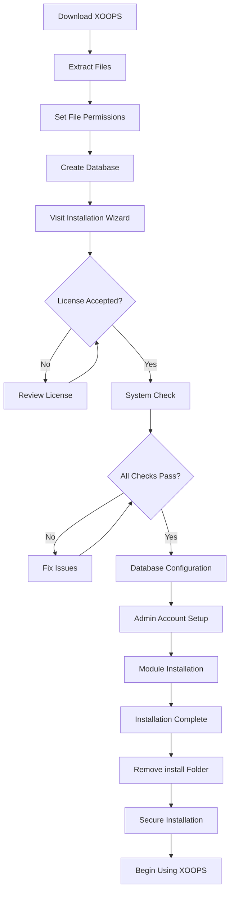

# XOOPS Kurulum Kılavuzunu tamamlayın

Bu kılavuz, kurulum sihirbazını kullanarak XOOPS'yi sıfırdan kurmak için kapsamlı bir yol göstermektedir.

## Önkoşullar

Kuruluma başlamadan önce aşağıdakilere sahip olduğunuzdan emin olun:

- FTP veya SSH aracılığıyla web sunucunuza erişim
- database sunucunuza yönetici erişimi
- Kayıtlı bir alan adı
- Sunucu gereksinimleri doğrulandı
- Yedekleme araçları mevcut

## Kurulum Süreci

## Adım Adım Kurulum

### Adım 1: XOOPS'yi indirin

En son sürümü şu adresten indirin: [https://xoops.org/](https://xoops.org/):
```bash
# Using wget
wget https://xoops.org/download/xoops-2.5.8.zip

# Using curl
curl -O https://xoops.org/download/xoops-2.5.8.zip
```
### Adım 2: Dosyaları Çıkarın

XOOPS arşivini web kökünüze çıkarın:
```bash
# Navigate to web root
cd /var/www/html

# Extract XOOPS
unzip xoops-2.5.8.zip

# Rename folder (optional, but recommended)
mv xoops-2.5.8 xoops
cd xoops
```
### 3. Adım: Dosya İzinlerini Ayarlayın

XOOPS dizinleri için uygun izinleri ayarlayın:
```bash
# Make directories writable (755 for dirs, 644 for files)
find . -type d -exec chmod 755 {} \;
find . -type f -exec chmod 644 {} \;

# Make specific directories writable by web server
chmod 777 uploads/
chmod 777 templates_c/
chmod 777 var/
chmod 777 cache/

# Secure mainfile.php after installation
chmod 644 mainfile.php
```
### Adım 4: database Oluşturun

MySQL kullanarak XOOPS için yeni bir database oluşturun:
```sql
-- Create database
CREATE DATABASE xoops_db CHARACTER SET utf8mb4 COLLATE utf8mb4_unicode_ci;

-- Create user
CREATE USER 'xoops_user'@'localhost' IDENTIFIED BY 'secure_password_here';

-- Grant privileges
GRANT ALL PRIVILEGES ON xoops_db.* TO 'xoops_user'@'localhost';
FLUSH PRIVILEGES;
```
Veya phpMyAdmin'i kullanarak:

1. phpMyAdmin'de oturum açın
2. "Veritabanları" sekmesine tıklayın
3. database adını girin: `xoops_db`
4. "utf8mb4_unicode_ci" harmanlamasını seçin
5. "Oluştur"a tıklayın
6. Veritabanıyla aynı adı taşıyan bir user oluşturun
7. Tüm ayrıcalıkları verin

### Adım 5: Kurulum Sihirbazını Çalıştırın

Tarayıcınızı açın ve şuraya gidin:
```
http://your-domain.com/xoops/install/
```
#### Sistem Kontrol Aşaması

Sihirbaz sunucu yapılandırmanızı kontrol eder:

- PHP sürüm >= 5.6.0
- MySQL/MariaDB mevcut
- Gerekli PHP uzantıları (GD, PDO vb.)
- Dizin izinleri
- database bağlantısı

**Kontroller başarısız olursa:**

Çözümler için #Ortak Kurulum Sorunları bölümüne bakın.

#### database Yapılandırması

database kimlik bilgilerinizi girin:
```
Database Host: localhost
Database Name: xoops_db
Database User: xoops_user
Database Password: [your_secure_password]
Table Prefix: xoops_
```
**Önemli Notlar:**
- database ana makineniz yerel ana bilgisayardan farklıysa (örneğin uzak sunucu), doğru ana bilgisayar adını girin
- Tablo öneki, bir veritabanında birden fazla XOOPS örneğinin çalıştırılması durumunda yardımcı olur
- Büyük/küçük harf, rakam ve simgelerden oluşan güçlü bir şifre kullanın

#### Yönetici Hesabı Kurulumu

Yönetici hesabınızı oluşturun:
```
Admin Username: admin (or choose custom)
Admin Email: admin@your-domain.com
Admin Password: [strong_unique_password]
Confirm Password: [repeat_password]
```
**En İyi Uygulamalar:**
- "Yönetici" değil, benzersiz bir user adı kullanın
- 16+ karakterden oluşan bir şifre kullanın
- Kimlik bilgilerini güvenli bir şifre yöneticisinde saklayın
- Yönetici kimlik bilgilerini asla paylaşmayın

#### module Kurulumu

Yüklenecek varsayılan modülleri seçin:

- **Sistem Modülü** (gerekli) - Temel XOOPS işlevselliği
- **user Modülü** (gerekli) - user yönetimi
- **Profil Modülü** (önerilen) - user profilleri
- **PM (Özel Mesaj) Modülü** (önerilir) - Dahili mesajlaşma
- **WF Kanalı Modülü** (isteğe bağlı) - İçerik yönetimi

Tam bir kurulum için önerilen tüm modülleri seçin.

### Adım 6: Kurulumu Tamamlayın

Tüm adımlardan sonra bir onay ekranı göreceksiniz:
```
Installation Complete!

Your XOOPS installation is ready to use.
Admin Panel: http://your-domain.com/xoops/admin/
User Panel: http://your-domain.com/xoops/
```
### Adım 7: Kurulumunuzu Güvenceye Alın

#### Kurulum Klasörünü Kaldır
```bash
# Remove the install directory (CRITICAL for security)
rm -rf /var/www/html/xoops/install/

# Or rename it
mv /var/www/html/xoops/install/ /var/www/html/xoops/install.bak
```
**WARNING:** Kurulum klasörünü asla üretimde erişilebilir bırakmayın!

#### Secure mainfile.php
```bash
# Make mainfile.php read-only
chmod 644 /var/www/html/xoops/mainfile.php

# Set ownership
chown www-data:www-data /var/www/html/xoops/mainfile.php
```
#### Uygun Dosya İzinlerini Ayarlayın
```bash
# Recommended production permissions
find . -type f -name "*.php" -exec chmod 644 {} \;
find . -type d -exec chmod 755 {} \;

# Writable directories for web server
chmod 777 uploads/ var/ cache/ templates_c/
```
#### Etkinleştir HTTPS/SSL

Web sunucunuzda (nginx veya Apache) SSL'yi yapılandırın.

**Apache için:**
```apache
<VirtualHost *:443>
    ServerName your-domain.com
    DocumentRoot /var/www/html/xoops

    SSLEngine on
    SSLCertificateFile /etc/ssl/certs/your-cert.crt
    SSLCertificateKeyFile /etc/ssl/private/your-key.key

    # Force HTTPS redirect
    <IfModule mod_rewrite.c>
        RewriteEngine On
        RewriteCond %{HTTPS} off
        RewriteRule ^(.*)$ https://%{HTTP_HOST}%{REQUEST_URI} [L,R=301]
    </IfModule>
</VirtualHost>
```
## Kurulum Sonrası Yapılandırma

### 1. Yönetici Paneline Erişim

Şuraya gidin:
```
http://your-domain.com/xoops/admin/
```
Yönetici kimlik bilgilerinizle giriş yapın.

### 2. Temel Ayarları Yapılandırın

Aşağıdakileri yapılandırın:

- Site adı ve açıklaması
- Yönetici e-posta adresi
- Saat dilimi ve tarih formatı
- Arama motoru optimizasyonu

### 3. Kurulumu Test Edin

- [ ] Ana sayfayı ziyaret edin
- [ ] module yükünü kontrol edin
- [ ] user kaydının çalıştığını doğrulayın
- [ ] Yönetici paneli işlevlerini test edin
- [ ] SSL/HTTPS'nin çalıştığını onaylayın

### 4. Yedeklemeleri Planlayın

Otomatik yedeklemeleri ayarlayın:
```bash
# Create backup script (backup.sh)
#!/bin/bash
DATE=$(date +%Y%m%d_%H%M%S)
BACKUP_DIR="/backups/xoops"
XOOPS_DIR="/var/www/html/xoops"

# Backup database
mysqldump -u xoops_user -p[password] xoops_db > $BACKUP_DIR/db_$DATE.sql

# Backup files
tar -czf $BACKUP_DIR/files_$DATE.tar.gz $XOOPS_DIR

echo "Backup completed: $DATE"
```
Cron ile zamanlama:
```bash
# Daily backup at 2 AM
0 2 * * * /usr/local/bin/backup.sh
```
## Yaygın Kurulum Sorunları

### Sorun: İzin Reddedildi Hataları

**Belirti:** Dosyaları yüklerken veya oluştururken "İzin reddedildi"

**Çözüm:**
```bash
# Check web server user
ps aux | grep apache  # For Apache
ps aux | grep nginx   # For Nginx

# Fix permissions (replace www-data with your web server user)
chown -R www-data:www-data /var/www/html/xoops
chmod -R 755 /var/www/html/xoops
chmod 777 uploads/ var/ cache/ templates_c/
```
### Sorun: database Bağlantısı Başarısız

**Belirti:** "database sunucusuna bağlanılamıyor"

**Çözüm:**
1. Kurulum sihirbazında database kimlik bilgilerini doğrulayın
2. MySQL/MariaDB'nin çalışıp çalışmadığını kontrol edin:   
```bash
   service mysql status  # or mariadb
   
```
3. Veritabanının mevcut olduğunu doğrulayın:   
```sql
   SHOW DATABASES;
   
```
4. Bağlantıyı komut satırından test edin:   
```bash
   mysql -h localhost -u xoops_user -p xoops_db
   
```
### Sorun: Boş Beyaz Ekran

**Belirti:** XOOPS adresini ziyaret ettiğinizde boş sayfa gösteriliyor

**Çözüm:**
1. PHP hata günlüklerini kontrol edin:   
```bash
   tail -f /var/log/apache2/error.log
   
```
2. Mainfile.php'de hata ayıklama modunu etkinleştirin:   
```php
   define('XOOPS_DEBUG', 1);
   
```
3. mainfile.php ve config dosyalarındaki dosya izinlerini kontrol edin
4. PHP-MySQL uzantısının kurulu olduğunu doğrulayın

### Sorun: Yükleme Dizinine Yazılamıyor

**Belirti:** Yükleme özelliği başarısız oluyor, "Yüklemelere yazılamıyor/"

**Çözüm:**
```bash
# Check current permissions
ls -la uploads/

# Fix permissions
chmod 777 uploads/
chown www-data:www-data uploads/

# For specific files
chmod 644 uploads/*
```
### Sayı: PHP Uzantılar Eksik

**Belirti:** Eksik uzantılar nedeniyle sistem kontrolü başarısız oluyor (GD, MySQL vb.)

**Çözüm (Ubuntu/Debian):**)
```bash
# Install PHP GD library
apt-get install php-gd

# Install PHP MySQL support
apt-get install php-mysql

# Restart web server
systemctl restart apache2  # or nginx
```
**Çözüm (CentOS/RHEL):**)
```bash
# Install PHP GD library
yum install php-gd

# Install PHP MySQL support
yum install php-mysql

# Restart web server
systemctl restart httpd
```
### Sorun: Yavaş Kurulum Süreci

**Belirti:** Yükleme sihirbazı zaman aşımına uğruyor veya çok yavaş çalışıyor

**Çözüm:**
1. php.ini'de PHP zaman aşımını artırın:   
```ini
   max_execution_time = 300  # 5 minutes
   
```
2. MySQL max_allowed_packet'i artırın:   
```sql
   SET GLOBAL max_allowed_packet = 256M;
   
```
3. Sunucu kaynaklarını kontrol edin:   
```bash
   free -h  # Check RAM
   df -h    # Check disk space
   
```
### Sorun: Yönetici Paneline Erişilemiyor

**Belirti:** Kurulumdan sonra yönetici paneline erişilemiyor

**Çözüm:**
1. Veritabanında yönetici kullanıcısının bulunduğunu doğrulayın:   
```sql
   SELECT * FROM xoops_users WHERE uid = 1;
   
```
2. Tarayıcı önbelleğini ve çerezleri temizleyin
3. Oturumlar klasörünün yazılabilir olup olmadığını kontrol edin:   
```bash
   chmod 777 var/
   
```
4. Htaccess kurallarının yönetici erişimini engellemediğini doğrulayın

## Doğrulama Kontrol Listesi

Kurulumdan sonra şunları doğrulayın:

- [x] XOOPS ana sayfası doğru şekilde yükleniyor
- [x] Yönetici paneline /xoops/admin/ adresinden erişilebilir
- [x] SSL/HTTPS çalışıyor
- [x] Kurulum klasörü kaldırıldı veya erişilemiyor
- [x] Dosya izinleri güvenlidir (dosyalar için 644, dizinler için 755)
- [x] database yedeklemeleri planlandı
- [x] modules hatasız yükleniyor
- [x] user kayıt sistemi çalışıyor
- [x] Dosya yükleme işlevi çalışıyor
- [x] E-posta bildirimleri düzgün şekilde gönderiliyor

## Sonraki Adımlar

Kurulum tamamlandıktan sonra:

1. Temel Yapılandırma kılavuzunu okuyun
2. Kurulumunuzu güvence altına alın
3. Yönetici panelini keşfedin
4. Ek modülleri yükleyin
5. user gruplarını ve izinlerini ayarlayın

---

**Etiketler:** #kurulum #kurulum #başlarken #sorun giderme

**İlgili Makaleler:**
- Sunucu Gereksinimleri
- Yükseltiliyor-XOOPS
- ../Configuration/Security-Configuration