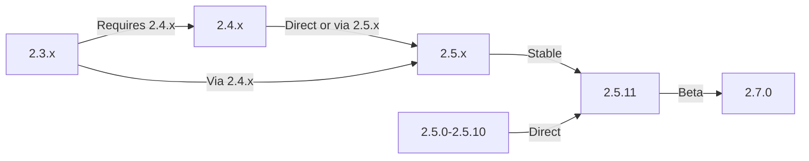

Bu kılavuz, verilerinizi ve özelleştirmelerinizi korurken XOOPS'yi eski sürümlerden en son sürüme yükseltmeyi kapsar.

> **Sürüm Bilgileri**
> - **Kararlı:** XOOPS 2.5.11
> - **Beta:** XOOPS 2.7.0 (test ediliyor)
> - **Gelecek:** XOOPS 4.0 (geliştirilme aşamasında - bkz. Yol Haritası)

## Yükseltme Öncesi Kontrol Listesi

Yükseltmeye başlamadan önce şunları doğrulayın:

- [ ] Geçerli XOOPS sürümü belgelendi
- [ ] Hedef XOOPS sürümü belirlendi
- [ ] Tam sistem yedeklemesi tamamlandı
- [ ] database yedeklemesi doğrulandı
- [ ] Kurulu modüllerin listesi kaydedildi
- [ ] Özel değişiklikler belgelendi
- [ ] Test ortamı mevcut
- [ ] Yükseltme yolu kontrol edildi (bazı sürümler ara sürümleri atlıyor)
- [ ] Sunucu kaynakları doğrulandı (yeterli disk alanı, bellek)
- [ ] Bakım modu etkin

## Yükseltme Yolu Kılavuzu

Mevcut sürüme bağlı olarak farklı yükseltme yolları:

**Önemli:** Ana sürümleri asla atlamayın. 2.3.x'ten yükseltme yapıyorsanız, önce 2.4.x'e, ardından 2.5.x'e yükseltin.

## Adım 1: Sistem Yedeklemesini Tamamlayın

### database Yedekleme

Veritabanını yedeklemek için mysqldump'ı kullanın:
```bash
# Full database backup
mysqldump -u xoops_user -p xoops_db > /backups/xoops_db_backup_$(date +%Y%m%d_%H%M%S).sql

# Compressed backup
mysqldump -u xoops_user -p xoops_db | gzip > /backups/xoops_db_backup_$(date +%Y%m%d_%H%M%S).sql.gz
```
Veya phpMyAdmin'i kullanarak:

1. XOOPS veritabanınızı seçin
2. "Dışa Aktar" sekmesine tıklayın
3. "SQL" formatını seçin
4. "Dosya olarak kaydet"i seçin
5. "Git"e tıklayın

Yedekleme dosyasını doğrulayın:
```bash
# Check backup size
ls -lh /backups/xoops_db_backup*.sql

# Verify backup integrity (uncompressed)
head -20 /backups/xoops_db_backup_*.sql

# Verify compressed backup
zcat /backups/xoops_db_backup_*.sql.gz | head -20
```
### Dosya Sistemi Yedekleme

Tüm XOOPS dosyalarını yedekleyin:
```bash
# Compressed file backup
tar -czf /backups/xoops_files_$(date +%Y%m%d_%H%M%S).tar.gz /var/www/html/xoops

# Uncompressed (faster, requires more disk space)
tar -cf /backups/xoops_files_$(date +%Y%m%d_%H%M%S).tar /var/www/html/xoops

# Show backup progress
tar -czf /backups/xoops_files_$(date +%Y%m%d_%H%M%S).tar.gz --verbose /var/www/html/xoops | tail
```
Yedeklemeleri güvenli bir şekilde saklayın:
```bash
# Secure backup storage
chmod 600 /backups/xoops_*
ls -lah /backups/

# Optional: Copy to remote storage
scp /backups/xoops_* user@backup-server:/secure/backups/
```
### Yedekleme Geri Yüklemesini Test Edin

**CRITICAL:** Yedekleme çalışmalarınızı her zaman test edin:
```bash
# Verify tar archive contents
tar -tzf /backups/xoops_files_*.tar.gz | head -20

# Extract to test location
mkdir /tmp/restore_test
cd /tmp/restore_test
tar -xzf /backups/xoops_files_*.tar.gz

# Verify key files exist
ls -la xoops/mainfile.php
ls -la xoops/install/
```
## Adım 2: Bakım Modunu Etkinleştirin

Yükseltme sırasında kullanıcıların siteye erişmesini engelleyin:

### Seçenek 1: XOOPS Yönetici Paneli

1. Yönetici paneline giriş yapın
2. Sistem > Bakım'a gidin
3. "Site Bakım Modu"nu etkinleştirin
4. Bakım mesajını ayarlayın
5. Kaydet

### Seçenek 2: Manuel Bakım Modu

Web kökünde bir bakım dosyası oluşturun:
```html
<!-- /var/www/html/maintenance.html -->
<!DOCTYPE html>
<html>
<head>
    <title>Under Maintenance</title>
    <style>
        body { font-family: Arial; text-align: center; padding: 50px; }
        h1 { color: #333; }
        p { color: #666; margin: 20px 0; }
    </style>
</head>
<body>
    <h1>Site Under Maintenance</h1>
    <p>We're currently upgrading our site.</p>
    <p>Expected time: approximately 30 minutes.</p>
    <p>Thank you for your patience!</p>
</body>
</html>
```
Apache'yi bakım sayfasını gösterecek şekilde yapılandırın:
```apache
# In .htaccess or vhost config
ErrorDocument 503 /maintenance.html

# Redirect all traffic to maintenance page
<IfModule mod_rewrite.c>
    RewriteEngine On
    RewriteCond %{REMOTE_ADDR} !^192\.168\.1\.100$  # Your IP
    RewriteRule ^(.*)$ - [R=503,L]
</IfModule>
```
## Adım 3: Yeni Sürümü İndirin

XOOPS’yi resmi siteden indirin:
```bash
# Download latest version
cd /tmp
wget https://xoops.org/download/xoops-2.5.8.zip

# Verify checksum (if provided)
sha256sum xoops-2.5.8.zip
# Compare with official SHA256 hash

# Extract to temporary location
unzip xoops-2.5.8.zip
cd xoops-2.5.8
```
## Adım 4: Yükseltme Öncesi Dosya Hazırlığı

### Özel Değişiklikleri Tanımlayın

Özelleştirilmiş Core dosyaları kontrol edin:
```bash
# Look for modified files (files with newer mtime)
find /var/www/html/xoops -type f -newer /var/www/html/xoops/install.php

# Check for custom themes
ls /var/www/html/xoops/themes/
# Note any custom themes

# Check for custom modules
ls /var/www/html/xoops/modules/
# Note any custom modules created by you
```
### Mevcut Durumu Belgeleyin

Yükseltme raporu oluşturun:
```bash
cat > /tmp/upgrade_report.txt << EOF
=== XOOPS Upgrade Report ===
Date: $(date)
Current Version: 2.5.6
Target Version: 2.5.8

=== Installed Modules ===
$(ls /var/www/html/xoops/modules/)

=== Custom Modifications ===
[Document any custom theme or module modifications]

=== Themes ===
$(ls /var/www/html/xoops/themes/)

=== Plugin Status ===
[List any custom code modifications]

EOF
```
## Adım 5: Yeni Dosyaları Mevcut Kurulumla Birleştirin

### Strateji: Özel Dosyaları Koruyun

XOOPS Core dosyalarını değiştirin ancak şunları koruyun:
- `mainfile.php` (database yapılandırmanız)
- `themes/`'deki özel themes
- `modules/`'deki özel modules
- `uploads/`'ye user yüklemeleri
- `var/`'deki site verileri

### Manuel Birleştirme İşlemi
```bash
# Set variables
XOOPS_OLD="/var/www/html/xoops"
XOOPS_NEW="/tmp/xoops-2.5.8"
BACKUP="/backups/pre-upgrade"

# Create pre-upgrade backup in place
mkdir -p $BACKUP
cp -r $XOOPS_OLD/* $BACKUP/

# Copy new files (but preserve sensitive files)
# Copy everything except protected directories
rsync -av --exclude='mainfile.php' \
    --exclude='modules/custom*' \
    --exclude='themes/custom*' \
    --exclude='uploads' \
    --exclude='var' \
    --exclude='cache' \
    --exclude='templates_c' \
    $XOOPS_NEW/ $XOOPS_OLD/

# Verify critical files preserved
ls -la $XOOPS_OLD/mainfile.php
```
### update.php'yi kullanma (Varsa)

Bazı XOOPS sürümleri otomatik yükseltme komut dosyası içerir:
```bash
# Copy new files with installer
cp -r /tmp/xoops-2.5.8/* /var/www/html/xoops/

# Run upgrade wizard
# Visit: http://your-domain.com/xoops/upgrade/
```
### Birleştirmeden Sonra Dosya İzinleri

Uygun izinleri geri yükleyin:
```bash
# Set ownership
chown -R www-data:www-data /var/www/html/xoops

# Set directory permissions
find /var/www/html/xoops -type d -exec chmod 755 {} \;

# Set file permissions
find /var/www/html/xoops -type f -exec chmod 644 {} \;

# Make writable directories
chmod 777 /var/www/html/xoops/cache
chmod 777 /var/www/html/xoops/templates_c
chmod 777 /var/www/html/xoops/uploads
chmod 777 /var/www/html/xoops/var

# Secure mainfile.php
chmod 644 /var/www/html/xoops/mainfile.php
```
## Adım 6: database Taşıma

### database Değişikliklerini İnceleyin

database yapısı değişiklikleri için XOOPS sürüm notlarını kontrol edin:
```bash
# Extract and review SQL migration files
find /tmp/xoops-2.5.8 -name "*.sql" -type f
# Document all .sql files found
```
### database Güncellemelerini Çalıştır

### Seçenek 1: Otomatik Güncelleme (varsa)

Yönetici panelini kullanın:

1. Yönetici olarak oturum açın
2. **Sistem > database**'na gidin
3. "Güncellemeleri Kontrol Et"e tıklayın
4. Bekleyen değişiklikleri inceleyin
5. "Güncellemeleri Uygula"ya tıklayın

### Seçenek 2: Manuel database Güncellemeleri

SQL dosyalarını taşımayı yürütün:
```bash
# Connect to database
mysql -u xoops_user -p xoops_db

# View pending changes (varies by version)
SELECT * FROM xoops_config WHERE conf_name LIKE '%version%';

# Run migration scripts manually if needed
SOURCE /tmp/xoops-2.5.8/migrate_2.5.6_to_2.5.8.sql;
```
### database Doğrulaması

Güncellemeden sonra database bütünlüğünü doğrulayın:
```sql
-- Check database consistency
REPAIR TABLE xoops_users;
OPTIMIZE TABLE xoops_users;

-- Verify key tables exist
SHOW TABLES LIKE 'xoops_%';

-- Check row counts (should increase or stay same)
SELECT COUNT(*) FROM xoops_users;
SELECT COUNT(*) FROM xoops_posts;
```
## Adım 7: Yükseltmeyi Doğrulayın

### Ana Sayfayı Kontrol Et

XOOPS ana sayfanızı ziyaret edin:
```
http://your-domain.com/xoops/
```
Beklenen: Sayfa hatasız yükleniyor, doğru şekilde görüntüleniyor

### Yönetici Paneli Kontrolü

Yöneticiye erişim:
```
http://your-domain.com/xoops/admin/
```
Doğrulayın:
- [ ] Yönetici paneli yükleniyor
- [ ] Navigasyon çalışıyor
- [ ] Kontrol Paneli düzgün görüntüleniyor
- [ ] Günlüklerde database hatası yok

### module Doğrulaması

Kurulu modülleri kontrol edin:

1. Admin'de **modules > modules**'e gidin
2. Hala kurulu olan tüm modülleri doğrulayın
3. Herhangi bir hata mesajı olup olmadığını kontrol edin
4. Devre dışı bırakılan tüm modülleri etkinleştirin

### Günlük Dosyası Kontrolü

Hatalar için sistem günlüklerini inceleyin:
```bash
# Check web server error log
tail -50 /var/log/apache2/error.log

# Check PHP error log
tail -50 /var/log/php_errors.log

# Check XOOPS system log (if available)
# In admin panel: System > Logs
```
### Temel İşlevleri Test Edin

- [ ] user login/logout çalışıyor
- [ ] user kayıt çalışmaları
- [ ] Dosya yükleme işlevleri
- [ ] E-posta bildirimleri gönder
- [ ] Arama işlevi çalışıyor
- [ ] Yönetici işlevleri çalışır durumda
- [ ] module işlevselliği bozulmamış

## Adım 8: Yükseltme Sonrası Temizleme

### Geçici Dosyaları Kaldır
```bash
# Remove extraction directory
rm -rf /tmp/xoops-2.5.8

# Clear template cache (safe to delete)
rm -rf /var/www/html/xoops/templates_c/*

# Clear site cache
rm -rf /var/www/html/xoops/cache/*
```
### Bakım Modunu Kaldır

Normal site erişimini yeniden etkinleştirin:
```apache
# Remove maintenance mode redirect from .htaccess
# Or delete maintenance.html file
rm /var/www/html/maintenance.html
```
### Belgeleri Güncelle

Yükseltme notlarınızı güncelleyin:
```bash
# Document successful upgrade
cat >> /tmp/upgrade_report.txt << EOF

=== Upgrade Results ===
Status: SUCCESS
Upgrade Date: $(date)
New Version: 2.5.8
Duration: [time in minutes]

Post-Upgrade Tests:
- [x] Homepage loads
- [x] Admin panel accessible
- [x] Modules functional
- [x] User registration works
- [x] Database optimized

EOF
```
## Yükseltme Sorunlarını Giderme

### Sorun: Yükseltme Sonrası Boş Beyaz Ekran

**Belirti:** Ana sayfada hiçbir şey görünmüyor

**Çözüm:**
```bash
# Check PHP errors
tail -f /var/log/apache2/error.log

# Enable debug mode temporarily
echo "define('XOOPS_DEBUG', 1);" >> /var/www/html/xoops/mainfile.php

# Check file permissions
ls -la /var/www/html/xoops/mainfile.php

# Restore from backup if needed
cp /backups/xoops_files_*.tar.gz /tmp/
cd /tmp && tar -xzf xoops_files_*.tar.gz
```
### Sorun: database Bağlantı Hatası

**Belirti:** "Veritabanına bağlanılamıyor" mesajı

**Çözüm:**
```bash
# Verify database credentials in mainfile.php
grep -i "database\|host\|user" /var/www/html/xoops/mainfile.php

# Test connection
mysql -h localhost -u xoops_user -p xoops_db -e "SELECT 1"

# Check MySQL status
systemctl status mysql

# Verify database still exists
mysql -u xoops_user -p -e "SHOW DATABASES" | grep xoops
```
### Sorun: Yönetici Paneline Erişilemiyor

**Belirti:** /xoops/admin/'ye erişilemiyor

**Çözüm:**
```bash
# Check .htaccess rules
cat /var/www/html/xoops/.htaccess

# Verify admin files exist
ls -la /var/www/html/xoops/admin/

# Check mod_rewrite enabled
apache2ctl -M | grep rewrite

# Restart web server
systemctl restart apache2
```
### Sorun: modules Yüklenmiyor

**Belirti:** modules hatalar gösteriyor veya devre dışı bırakılmış

**Çözüm:**
```bash
# Verify module files exist
ls /var/www/html/xoops/modules/

# Check module permissions
ls -la /var/www/html/xoops/modules/*/

# Check module configuration in database
mysql -u xoops_user -p xoops_db -e "SELECT * FROM xoops_modules WHERE module_status = 0"

# Reactivate modules in admin panel
# System > Modules > Click module > Update Status
```
### Sorun: İzin Reddedildi Hataları

**Belirti:** Yükleme veya kaydetme sırasında "İzin reddedildi"

**Çözüm:**
```bash
# Check file ownership
ls -la /var/www/html/xoops/ | head -20

# Fix ownership
chown -R www-data:www-data /var/www/html/xoops

# Fix directory permissions
find /var/www/html/xoops -type d -exec chmod 755 {} \;

# Make cache/uploads writable
chmod 777 /var/www/html/xoops/cache
chmod 777 /var/www/html/xoops/templates_c
chmod 777 /var/www/html/xoops/uploads
chmod 777 /var/www/html/xoops/var
```
### Sorun: Sayfanın Yavaş Yüklenmesi

**Belirti:** Yükseltme sonrasında sayfalar çok yavaş yükleniyor

**Çözüm:**
```bash
# Clear all caches
rm -rf /var/www/html/xoops/cache/*
rm -rf /var/www/html/xoops/templates_c/*

# Optimize database
mysql -u xoops_user -p xoops_db << EOF
OPTIMIZE TABLE xoops_users;
OPTIMIZE TABLE xoops_posts;
OPTIMIZE TABLE xoops_config;
ANALYZE TABLE xoops_users;
EOF

# Check PHP error log for warnings
grep -i "deprecated\|warning" /var/log/php_errors.log | tail -20

# Increase PHP memory/execution time temporarily
# Edit php.ini:
memory_limit = 256M
max_execution_time = 300
```
## Geri Alma Prosedürü

Yükseltme kritik bir şekilde başarısız olursa yedekten geri yükleyin:

### Veritabanını Geri Yükle
```bash
# Restore from backup
mysql -u xoops_user -p xoops_db < /backups/xoops_db_backup_YYYYMMDD_HHMMSS.sql

# Or from compressed backup
gunzip < /backups/xoops_db_backup_YYYYMMDD_HHMMSS.sql.gz | mysql -u xoops_user -p xoops_db

# Verify restoration
mysql -u xoops_user -p xoops_db -e "SELECT COUNT(*) FROM xoops_users"
```
### Dosya Sistemini Geri Yükle
```bash
# Stop web server
systemctl stop apache2

# Remove current installation
rm -rf /var/www/html/xoops/*

# Extract backup
cd /var/www/html
tar -xzf /backups/xoops_files_YYYYMMDD_HHMMSS.tar.gz

# Fix permissions
chown -R www-data:www-data xoops/
find xoops -type d -exec chmod 755 {} \;
find xoops -type f -exec chmod 644 {} \;
chmod 777 xoops/cache xoops/templates_c xoops/uploads xoops/var

# Start web server
systemctl start apache2

# Verify restoration
# Visit http://your-domain.com/xoops/
```
## Doğrulama Kontrol Listesini Yükseltme

Yükseltme tamamlandıktan sonra şunları doğrulayın:

- [ ] XOOPS sürümü güncellendi (yönetici > Sistem bilgilerini kontrol edin)
- [ ] Ana sayfa hatasız yükleniyor
- [ ] Tüm modules işlevsel
- [ ] user girişi çalışır
- [ ] Yönetici paneline erişilebilir
- [ ] Dosya yükleme işlemi çalışıyor
- [ ] E-posta bildirimleri işlevsel
- [ ] database bütünlüğü doğrulandı
- [ ] Dosya izinleri doğru
- [ ] Bakım modu kaldırıldı
- [ ] Yedeklemelerin güvenliği sağlandı ve test edildi
- [ ] Performans kabul edilebilir
- [ ] SSL/HTTPS çalışıyor
- [ ] Günlüklerde hata mesajı yok

## Sonraki Adımlar

Başarılı yükseltmeden sonra:

1. Özel modülleri en son sürümlere güncelleyin
2. Kullanımdan kaldırılan özellikler için sürüm notlarını inceleyin
3. Performansı optimize etmeyi düşünün
4. Güvenlik ayarlarını güncelleyin
5. Tüm işlevleri iyice test edin
6. Yedekleme dosyalarını güvende tutun

---

**Etiketler:** #yükseltme #bakım #yedekleme #database taşıma

**İlgili Makaleler:**
- ../../06-Publisher-Module/User-Guide/Installation
- Sunucu Gereksinimleri
- ../Configuration/Basic-Configuration
- ../Configuration/Security-Configuration