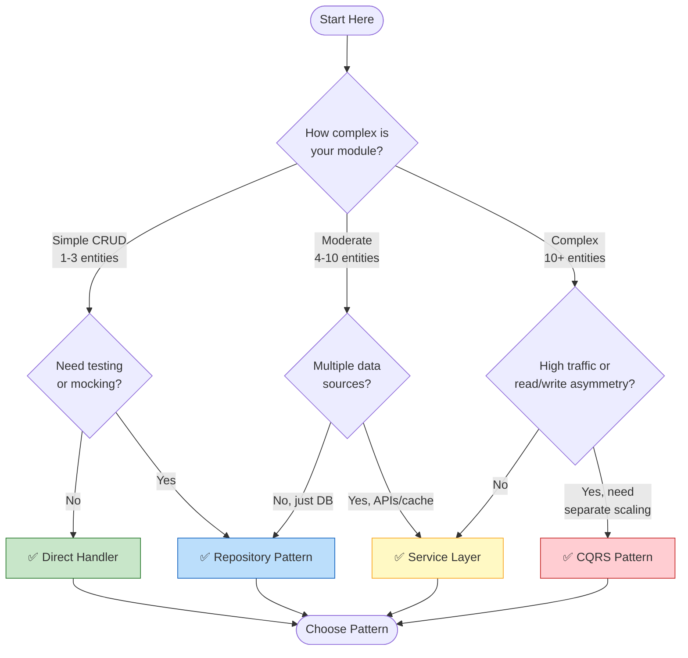
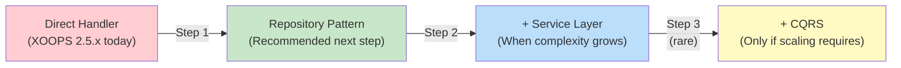

<span class="version-badge version-25x">2.5.x ✅</span> <span class="version-badge version-40x">4.0.x ✅</span>

> **Hangi modeli kullanmalıyım?** Bu karar ağacı, doğrudan işleyiciler, Depo Modeli, Hizmet Katmanı ve CQRS arasında seçim yapmanıza yardımcı olur.

---

## Hızlı Karar Ağacı

---

## Desen Karşılaştırması

| Kriterler | Doğrudan İşleyici | Depo | Hizmet Katmanı | CQRS |
|----------|---------------|---------------|---------------|------|
| **Karmaşıklık** | ⭐ | ⭐⭐ | ⭐⭐⭐ | ⭐⭐⭐⭐⭐ |
| **Test edilebilirlik** | ❌ Sert | ✅ İyi | ✅ Harika | ✅ Harika |
| **Esneklik** | ❌ Düşük | ✅ Orta | ✅ Yüksek | ✅ Çok Yüksek |
| **XOOPS 2.5.x** | ✅ Yerli | ✅ Çalışmalar | ✅ Çalışmalar | ⚠️ Kompleks |
| **XOOPS 4.0** | ⚠️ Kullanımdan kaldırıldı | ✅ Önerilen | ✅ Önerilen | ✅ Ölçek için |
| **Takım Boyutu** | 1 dev | 1-3 geliştirici | 2-5 geliştirici | 5+ geliştirici |
| **Bakım** | ❌ Daha yüksek | ✅ Orta | ✅ Aşağı | ⚠️Uzmanlık gerektirir |

---

## Her Bir Desen Ne Zaman Kullanılmalı

### ✅ Doğrudan İşleyici (`XoopsPersistableObjectHandler`)

**En iyisi:** Basit modules, hızlı prototipler, öğrenme XOOPS
```php
// Simple and direct - good for small modules
$handler = xoops_getModuleHandler('article', 'news');
$articles = $handler->getObjects(new Criteria('status', 1));
```
**Bunu şu durumlarda seçin:**
- 1-3 database tablosu içeren basit bir module oluşturmak
- Hızlı bir prototip oluşturma
- Tek geliştirici sizsiniz ve testlere ihtiyacınız yok
- module önemli ölçüde büyümeyecek

**Sınırlamalar:**
- Birim testi zor (küresel bağımlılık)
- XOOPS database katmanına sıkı bağlantı
- İş mantığı denetleyicilere sızma eğilimindedir

---

### ✅ Depo Modeli

**En iyisi:** Çoğu module, test edilebilirlik isteyen ekipler
```php
// Abstraction allows mocking for tests
interface ArticleRepositoryInterface {
    public function findPublished(): array;
    public function save(Article $article): void;
}

class XoopsArticleRepository implements ArticleRepositoryInterface {
    private $handler;

    public function __construct() {
        $this->handler = xoops_getModuleHandler('article', 'news');
    }

    public function findPublished(): array {
        return $this->handler->getObjects(new Criteria('status', 1));
    }
}
```
**Bunu şu durumlarda seçin:**
- Birim testleri yazmak istiyorsunuz
- Veri kaynaklarını daha sonra değiştirebilirsiniz (DB → API)
- 2'den fazla geliştiriciyle çalışma
- Dağıtım için module oluşturma

**Yükseltme yolu:** Bu, XOOPS 4.0 hazırlığı için önerilen modeldir.

---

### ✅ Hizmet Katmanı

**En iyisi:** Karmaşık iş mantığına sahip modules
```php
// Service coordinates multiple repositories and contains business rules
class ArticlePublicationService {
    public function __construct(
        private ArticleRepositoryInterface $articles,
        private NotificationServiceInterface $notifications,
        private CacheInterface $cache
    ) {}

    public function publish(int $articleId): void {
        $article = $this->articles->find($articleId);
        $article->setStatus('published');
        $article->setPublishedAt(new DateTime());

        $this->articles->save($article);
        $this->notifications->notifySubscribers($article);
        $this->cache->invalidate("article:{$articleId}");
    }
}
```
**Bunu şu durumlarda seçin:**
- Operasyonlar birden fazla veri kaynağını kapsar
- İş kuralları karmaşıktır
- İşlem yönetimine ihtiyacınız var
- Uygulamanın birden fazla kısmı aynı şeyi yapıyor

**Yükseltme yolu:** Sağlam bir mimari için Repository ile birleştirin.

---

### ⚠️ CQRS (Komut Sorgusu Sorumluluk Ayrımı)

**En iyisi:** read/write asimetrisine sahip yüksek ölçekli modules
```php
// Commands modify state
class PublishArticleCommand {
    public function __construct(
        public readonly int $articleId,
        public readonly int $publisherId
    ) {}
}

// Queries read state (can use denormalized read models)
class GetPublishedArticlesQuery {
    public function __construct(
        public readonly int $limit = 10
    ) {}
}
```
**Bunu şu durumlarda seçin:**
- Okuma sayısı yazma sayısından çok daha fazladır (100:1 veya daha fazla)
- Okuma ve yazma işlemleri için farklı ölçeklendirmelere ihtiyacınız var
- Karmaşık reporting/analytics gereksinimleri
- Etkinlik kaynağı kullanımı alan adınıza fayda sağlar

**Uyarı:** CQRS önemli ölçüde karmaşıklık katar. Çoğu XOOPS modülünün buna ihtiyacı yoktur.

---

## Önerilen Yükseltme Yolu

### Adım 1: İşleyicileri Depolara Sarma (2-4 saat)

1. Veri erişim ihtiyaçlarınız için bir arayüz oluşturun
2. Mevcut işleyiciyi kullanarak uygulayın
3. Doğrudan `xoops_getModuleHandler()`'yi aramak yerine depoyu enjekte edin

### Adım 2: Gerektiğinde Hizmet Katmanı Ekleyin (1-2 gün)

1. Denetleyicilerde iş mantığı göründüğünde, bir Hizmete çıkartın
2. Hizmet doğrudan işleyicileri değil depoları kullanır
3. Kontrolörler zayıflıyor (rota → servis → yanıt)

### 3. Adım: CQRS Yalnızca (nadir) olması durumunda düşünün

1. Günde milyonlarca okumanız var
2. Okuma ve yazma modelleri önemli ölçüde farklıdır
3. Denetim izleri için olay kaynağına ihtiyacınız var
4. CQRS konusunda deneyimli bir ekibiniz var

---

## Hızlı Referans Kartı

| Soru | Yanıt |
|----------|-----------|
| **"Sadece save/load verisine ihtiyacım var"** | Doğrudan İşleyici |
| **"Test yazmak istiyorum"** | Depo Modeli |
| **"Karmaşık iş kurallarım var"** | Hizmet Katmanı |
| **"Okumaları ayrı ayrı ölçeklendirmem gerekiyor"** | CQRS |
| **"PH000011¤ 4.0'a hazırlanıyorum"** | Depo + Hizmet Katmanı |

---

## İlgili Belgeler

- [Depo Deseni Kılavuzu](Patterns/Repository-Pattern.md)
- [Hizmet Katmanı Desen Kılavuzu](Patterns/Service-Layer-Pattern.md)
- [CQRS Desen Kılavuzu](../07-XOOPS-4.0/Implementation-Guides/CQRS-Pattern-Guide.md) *(gelişmiş)*
- [Karma Mod Sözleşmesi](../07-XOOPS-4.0/Specifications/Hybrid-Mode-Contract.md)

---

#örüntüler #veri erişimi #karar ağacı #en iyi uygulamalar #xoops