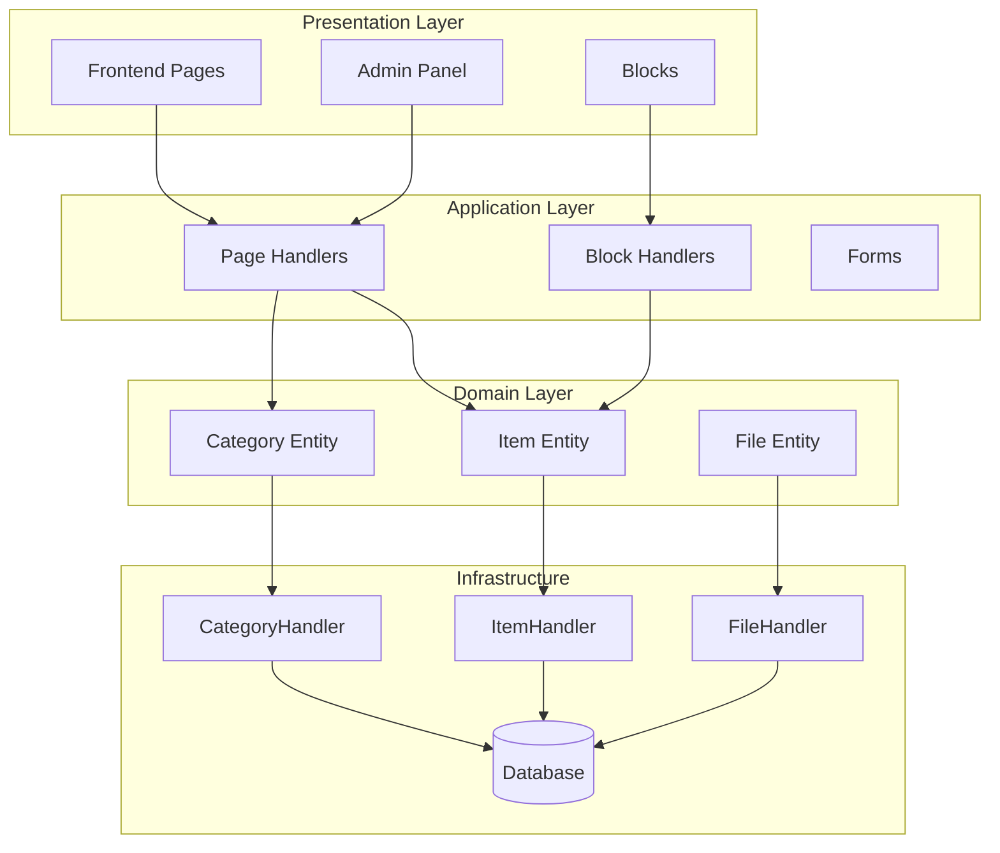
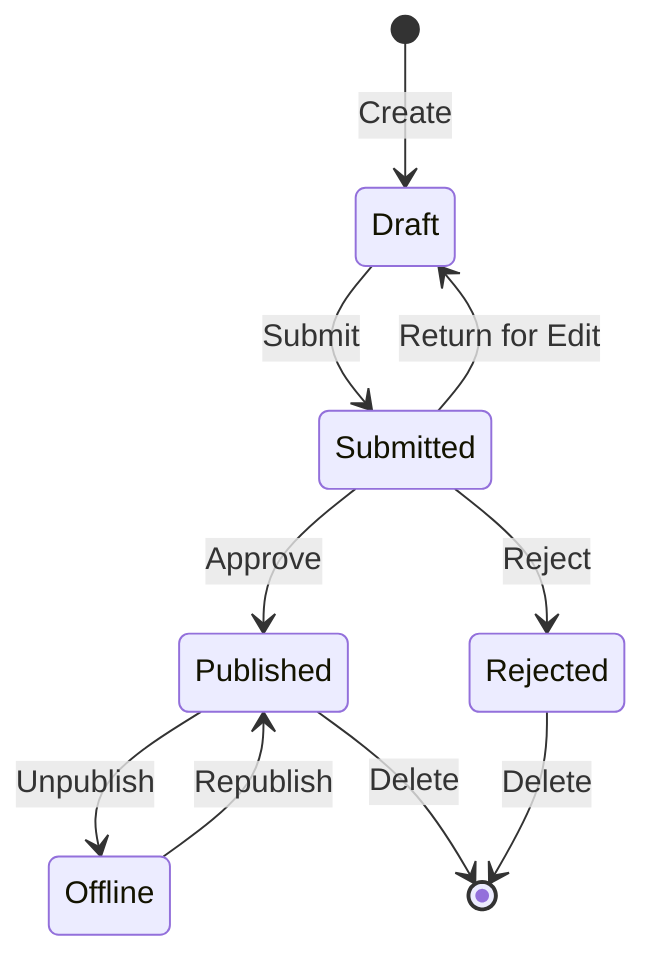

## Genel Bakış

Bu belge, Publisher modülü mimarisinin, kalıplarının ve uygulama ayrıntılarının teknik analizini sağlar. Üretim kalitesinde bir XOOPS modülünün nasıl yapılandırıldığını anlamak için bunu referans olarak kullanın.

## Mimariye Genel Bakış

## Dizin Yapısı
```
publisher/
├── admin/
│   ├── index.php           # Admin dashboard
│   ├── item.php            # Article management
│   ├── category.php        # Category management
│   ├── permission.php      # Permissions
│   ├── file.php            # File manager
│   └── menu.php            # Admin menu
├── assets/
│   ├── css/
│   ├── js/
│   └── images/
├── class/
│   ├── Category.php        # Category entity
│   ├── CategoryHandler.php # Category data access
│   ├── Item.php            # Article entity
│   ├── ItemHandler.php     # Article data access
│   ├── File.php            # File attachment
│   ├── FileHandler.php     # File data access
│   ├── Form/               # Form classes
│   ├── Common/             # Utilities
│   └── Helper.php          # Module helper
├── include/
│   ├── common.php          # Initialization
│   ├── functions.php       # Utility functions
│   ├── oninstall.php       # Install hooks
│   ├── onupdate.php        # Update hooks
│   └── search.php          # Search integration
├── language/
├── templates/
├── sql/
└── xoops_version.php
```
## Varlık Analizi

### Öğe (Makale) Varlık
```php
class Item extends \XoopsObject
{
    // Fields
    public function initVar(): void
    {
        $this->initVar('itemid', XOBJ_DTYPE_INT, null, false);
        $this->initVar('categoryid', XOBJ_DTYPE_INT, 0, false);
        $this->initVar('title', XOBJ_DTYPE_TXTBOX, '', true);
        $this->initVar('subtitle', XOBJ_DTYPE_TXTBOX, '');
        $this->initVar('summary', XOBJ_DTYPE_TXTAREA, '');
        $this->initVar('body', XOBJ_DTYPE_TXTAREA, '', true);
        $this->initVar('uid', XOBJ_DTYPE_INT, 0);
        $this->initVar('status', XOBJ_DTYPE_INT, 0);
        $this->initVar('datesub', XOBJ_DTYPE_INT, time());
        // ... more fields
    }

    // Business methods
    public function isPublished(): bool
    {
        return $this->getVar('status') == _PUBLISHER_STATUS_PUBLISHED;
    }

    public function canEdit(int $userId): bool
    {
        return $this->getVar('uid') == $userId
            || $this->isAdmin($userId);
    }
}
```
### İşleyici Kalıbı
```php
class ItemHandler extends \XoopsPersistableObjectHandler
{
    public function __construct(\XoopsDatabase $db)
    {
        parent::__construct(
            $db,
            'publisher_items',
            Item::class,
            'itemid',
            'title'
        );
    }

    public function getPublishedItems(int $limit = 10): array
    {
        $criteria = new \CriteriaCompo();
        $criteria->add(new \Criteria('status', _PUBLISHER_STATUS_PUBLISHED));
        $criteria->setSort('datesub');
        $criteria->setOrder('DESC');
        $criteria->setLimit($limit);

        return $this->getObjects($criteria);
    }
}
```
## İzin Sistemi

### İzin Türleri

| İzin | Açıklama |
|---------------|---------------|
| `publisher_view` | Görüntüle category/articles |
| `publisher_submit` | Yeni makaleler gönderin |
| `publisher_approve` | Gönderimleri otomatik olarak onayla |
| `publisher_moderate` | Bekleyen makaleleri inceleyin |
| `publisher_global` | Genel module izinleri |

### İzin Kontrolü
```php
class PermissionHandler
{
    public function isGranted(string $permission, int $categoryId): bool
    {
        $userId = $GLOBALS['xoopsUser']?->uid() ?? 0;
        $groups = $this->getUserGroups($userId);

        return $this->grouppermHandler->checkRight(
            $permission,
            $categoryId,
            $groups,
            $this->helper->getModule()->mid()
        );
    }
}
```
## İş Akışı Durumları

## template Yapısı

### Ön Uç Şablonları

| template | Amaç |
|----------|-----------|
| `publisher_index.tpl` | module ana sayfası |
| `publisher_item.tpl` | Tek makale |
| `publisher_category.tpl` | Kategori listeleme |
| `publisher_submit.tpl` | Başvuru formu |
| `publisher_search.tpl` | Arama sonuçları |

### Blok Şablonları

| template | Amaç |
|----------|-----------|
| `publisher_block_latest.tpl` | Son makaleler |
| `publisher_block_spotlight.tpl` | Öne çıkan makale |
| `publisher_block_category.tpl` | Kategori menüsü |

## Kullanılan Anahtar Desenler

1. **İşleyici Kalıbı** - Veri erişimi kapsülleme
2. **Değer Nesnesi** - Durum sabitleri
3. **template Yöntemi** - Form oluşturma
4. **Strateji** - Farklı görüntüleme modları
5. **Gözlemci** - Etkinliklerle ilgili bildirimler

## module Geliştirmeye Yönelik Dersler

1. CRUD için XoopsPersistableObjectHandler kullanın
2. Parçalı izinleri uygulayın
3. Sunumu mantıktan ayırın
4. Sorgular için Kriterleri kullanın
5. Birden fazla içerik durumunu destekleyin
6. XOOPS bildirim sistemiyle entegrasyon

## İlgili Belgeler

- Makale Oluşturma - Makale yönetimi
- Kategorileri Yönetme - Kategori sistemi
- permissions-Kurulum - İzin yapılandırması
- Developer-Guide/Hooks-and-Events - Uzatma noktaları