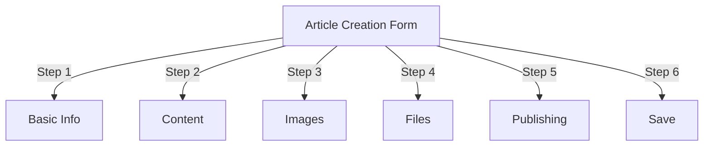
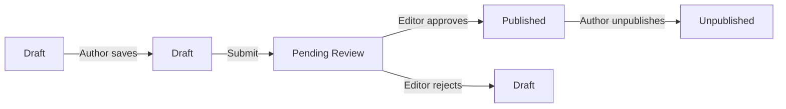
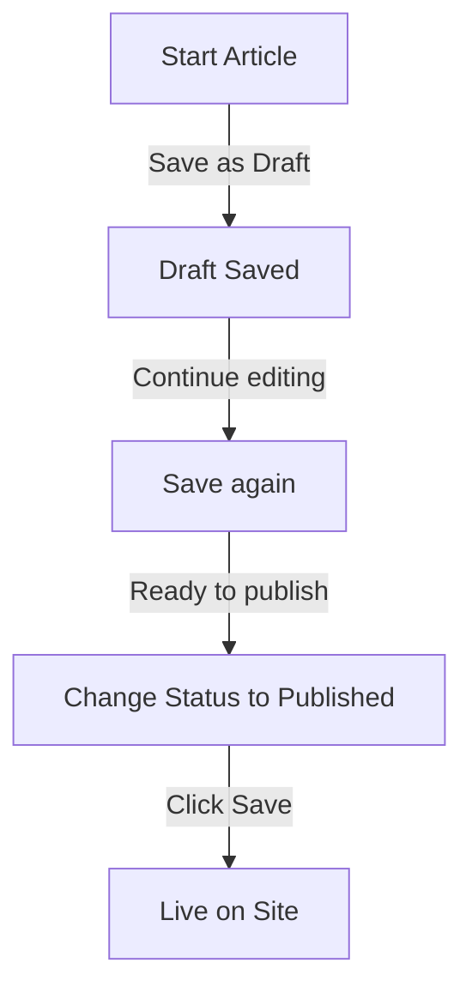

# Publisher'da Makale Oluşturma

> Publisher modülünde makaleler oluşturmaya, düzenlemeye, biçimlendirmeye ve yayınlamaya yönelik adım adım kılavuz.

---

## Makale Yönetimine Erişim

### Yönetici Panelinde Gezinme
```
Admin Panel
└── Modules
    └── Publisher
        └── Articles
            ├── Create New
            ├── Edit
            ├── Delete
            └── Publish
```
### En Hızlı Yol

1. **Yönetici** olarak oturum açın
2. Yönetici çubuğunda **modules**'e tıklayın
3. **Publisher**'yı bulun
4. **Yönetici** bağlantısını tıklayın
5. Soldaki menüden **Makaleler**'e tıklayın
6. **Makale Ekle** düğmesini tıklayın

---

## Makale Oluşturma Formu

### Temel Bilgiler

Yeni bir makale oluştururken aşağıdaki bölümleri doldurun:

---

## Adım 1: Temel Bilgiler

### Zorunlu Alanlar

#### Makale Başlığı
```
Field: Title
Type: Text input (required)
Max length: 255 characters
Example: "Top 5 Tips for Better Photography"
```
**Yönergeler:**
- Açıklayıcı ve spesifik
- SEO için anahtar kelimeler ekleyin
- Kaçının ALL CAPS
- En iyi görüntü için 60 karakterin altında tutun

#### Kategori Seçin
```
Field: Category
Type: Dropdown (required)
Options: List of created categories
Example: Photography > Tutorials
```
**İpuçları:**
- Ana ve alt kategoriler mevcut
- En alakalı kategoriyi seçin
- Makale başına yalnızca bir kategori
- Daha sonra değiştirilebilir

#### Makale Alt Başlığı (İsteğe Bağlı)
```
Field: Subtitle
Type: Text input (optional)
Max length: 255 characters
Example: "Learn photography fundamentals in 5 easy steps"
```
**Kullanım amacı:**
- Özet başlığı
- Tanıtım metni
- Genişletilmiş başlık

### Makale Açıklaması

#### Kısa Açıklama
```
Field: Short Description
Type: Textarea (optional)
Max length: 500 characters
```
**Amaç:**
- Makale önizleme metni
- Kategori listesinde görüntülenir
- Arama sonuçlarında kullanılır
- SEO için meta açıklama

**Örnek:**
```
"Discover essential photography techniques that will transform your photos
from ordinary to extraordinary. This comprehensive guide covers composition,
lighting, and exposure settings."
```
#### Tam İçerik
```
Field: Article Body
Type: WYSIWYG Editor (required)
Max length: Unlimited
Format: HTML
```
Zengin metin düzenlemeye sahip ana makale içerik alanı.

---

## Adım 2: İçeriği Biçimlendirme

### WYSIWYG Düzenleyiciyi Kullanma

#### Metin Biçimlendirmesi
```
Bold:           Ctrl+B or click [B] button
Italic:         Ctrl+I or click [I] button
Underline:      Ctrl+U or click [U] button
Strikethrough:  Alt+Shift+D or click [S] button
Subscript:      Ctrl+, (comma)
Superscript:    Ctrl+. (period)
```
#### Başlık Yapısı

Uygun belge hiyerarşisini oluşturun:
```html
<h1>Article Title</h1>      <!-- Use once at top -->
<h2>Main Section</h2>        <!-- For major sections -->
<h3>Subsection</h3>          <!-- For subtopics -->
<h4>Sub-subsection</h4>      <!-- For details -->
```
**Editörde:**
- **Biçim** açılır menüsüne tıklayın
- Başlık seviyesini seçin (H1-H6)
- Başlığınızı yazın

#### Listeler

**Sırasız Liste (Madde İşaretleri):**
```markdown
• Point one
• Point two
• Point three
```
Editördeki adımlar:
1. [≡] Madde işaretli liste düğmesine tıklayın
2. Her noktayı yazın
3. Sonraki öğe için Enter'a basın
4. Listeyi sonlandırmak için Geri tuşuna iki kez basın

**Sıralı Liste (Numaralandırılmış):**
```markdown
1. First step
2. Second step
3. Third step
```
Editördeki adımlar:
1. [1.] Numaralı liste düğmesine tıklayın
2. Her öğeyi yazın
3. Sonraki adım için Enter'a basın
4. Bitirmek için Geri tuşuna iki kez basın

**İç İçe Listeler:**
```markdown
1. Main point
   a. Sub-point
   b. Sub-point
2. Next point
```
Adımlar:
1. İlk listeyi oluşturun
2. Girinti yapmak için Sekme tuşuna basın
3. İç içe geçmiş öğeler oluşturun
4. Çıkıntıyı artırmak için Shift+Sekme tuşlarına basın

#### Bağlantılar

**Köprü Ekle:**

1. Bağlanacak metni seçin
2. **[🔗] Bağlantı** düğmesini tıklayın
3. URL girin: `https://example.com`
4. İsteğe bağlı: title/target ekleyin
5. **Bağlantı Ekle**'yi tıklayın

**Bağlantıyı Kaldır:**

1. Bağlantılı metnin içine tıklayın
2. **[🔗] Bağlantıyı Kaldır** düğmesini tıklayın

#### Kod ve Alıntılar

**Blok alıntı:**
```
"This is an important quote from an expert"
- Attribution
```
Adımlar:
1. Alıntı metnini yazın
2. **[❝] Blok alıntı** düğmesine tıklayın
3. Metin girintili ve stillendirilmiştir

**Kod Bloğu:**
```python
def hello_world():
    print("Hello, World!")
```
Adımlar:
1. **Biçim → Kod**'a tıklayın
2. Kodu yapıştırın
3. Dili seçin (isteğe bağlı)
4. Sözdizimi vurgulamasıyla kod görüntülenir

---

## 3. Adım: Resim Ekleme

### Öne Çıkan Resim (Kahraman Resim)
```
Field: Featured Image / Main Image
Type: Image upload
Format: JPG, PNG, GIF, WebP
Max size: 5 MB
Recommended: 600x400 px
```
**Yüklemek için:**

1. **Resim Yükle** düğmesini tıklayın
2. Bilgisayardan resim seçin
3. Crop/resize gerekirse
4. **Bu Resmi Kullan**'a tıklayın

**Resim Yerleştirme:**
- Makalenin başında görüntülenir
- Kategori listelerinde kullanılır
- Arşivde gösteriliyor
- Sosyal paylaşım için kullanılır

### Satır İçi Görseller

Makale metnine resim ekleyin:

1. İmleci editörde görselin gitmesi gereken yere konumlandırın
2. Araç çubuğunda **[🖼️] Resim** düğmesini tıklayın
3. Yükleme seçeneğini seçin:
   - Yeni resim yükle
   - Galeriden seç
   - Resmi girin URL
4. Yapılandırın:   
```
   Image Size:
   - Width: 300-600 px
   - Height: Auto (maintains ratio)
   - Alignment: Left/Center/Right
   
```
5. **Resim Ekle**'ye tıklayın

**Metni Resmin Çevresine Sar:**

Ekledikten sonra editörde:
```html
<!-- Image floats left, text wraps around -->

```
### Resim Galerisi

Çoklu resim galerisi oluşturun:

1. **Galeri** düğmesini tıklayın (varsa)
2. Birden fazla görsel yükleyin:
   - Tek tıklama: Bir tane ekleyin
   - Sürükle ve bırak: Birden fazla ekle
3. Sürükleyerek sıralamayı düzenleyin
4. Her görüntü için altyazı ayarlayın
5. **Galeri Oluştur**'a tıklayın

---

## Adım 4: Dosya Ekleme

### Dosya Ekleri Ekle
```
Field: File Attachments
Type: File upload (multiple allowed)
Supported: PDF, DOC, XLS, ZIP, etc.
Max per file: 10 MB
Max per article: 5 files
```
**Eklemek için:**

1. **Dosya Ekle** düğmesini tıklayın
2. Bilgisayardan dosya seçin
3. İsteğe bağlı: Dosya açıklamasını ekleyin
4. **Dosya Ekle**'yi tıklayın
5. Birden fazla dosya için tekrarlayın

**Dosya Örnekleri:**
- PDF kılavuzları
- Excel elektronik tabloları
- Word belgeleri
- ZIP arşivleri
- Kaynak kodu

### Ekli Dosyaları Yönet

**Dosyayı Düzenle:**

1. Dosya adına tıklayın
2. Açıklamayı düzenleyin
3. **Kaydet**'i tıklayın

**Dosyayı Sil:**

1. Listedeki dosyayı bulun
2. **[×] Sil** simgesine tıklayın
3. Silme işlemini onaylayın

---

## Adım 5: Yayınlama ve Durum

### Makale Durumu
```
Field: Status
Type: Dropdown
Options:
  - Draft: Not published, only author sees
  - Pending: Waiting for approval
  - Published: Live on site
  - Archived: Old content
  - Unpublished: Was published, now hidden
```
**Durum İş Akışı:**

### Yayınlama Seçenekleri

#### Hemen Yayınla
```
Status: Published
Start Date: Today (auto-filled)
End Date: (leave blank for no expiration)
```
#### Sonrası İçin Programla
```
Status: Scheduled
Start Date: Future date/time
Example: February 15, 2024 at 9:00 AM
```
Makale belirtilen zamanda otomatik olarak yayınlanacaktır.

#### Sona Erme Tarihini Ayarla
```
Enable Expiration: Yes
Expiration Date: Future date
Action: Archive/Hide/Delete
Example: April 1, 2024 (article auto-archives)
```
### Görünürlük Seçenekleri
```yaml
Show Article:
  - Display on front page: Yes/No
  - Show in category: Yes/No
  - Include in search: Yes/No
  - Include in recent articles: Yes/No

Featured Article:
  - Mark as featured: Yes/No
  - Featured section position: (number)
```
---

## Adım 6: SEO ve Meta Veriler

### SEO Ayarlar
```
Field: SEO Settings (Expand section)
```
#### Meta Açıklaması
```
Field: Meta Description
Type: Text (160 characters recommended)
Used by: Search engines, social media

Example:
"Learn photography fundamentals in 5 easy steps.
Discover composition, lighting, and exposure techniques."
```
#### Meta Anahtar Kelimeler
```
Field: Meta Keywords
Type: Comma-separated list
Max: 5-10 keywords

Example: Photography, Tutorial, Composition, Lighting, Exposure
```
#### URL Sümüklüböcek
```
Field: URL Slug (auto-generated from title)
Type: Text
Format: lowercase, hyphens, no spaces

Auto: "top-5-tips-for-better-photography"
Edit: Change before publishing
```
#### Grafik Etiketlerini Aç

Makale bilgilerinden otomatik olarak oluşturulmuştur:
- Başlık
- Açıklama
- Öne çıkan görsel
- Makale URL
- Yayınlanma tarihi

Facebook, LinkedIn, WhatsApp vb. tarafından kullanılır.

---

## Adım 7: Yorumlar ve Etkileşim

### Yorum Ayarları
```yaml
Allow Comments:
  - Enable: Yes/No
  - Default: Inherit from preferences
  - Override: Specific to this article

Moderate Comments:
  - Require approval: Yes/No
  - Default: Inherit from preferences
```
### Derecelendirme Ayarları
```yaml
Allow Ratings:
  - Enable: Yes/No
  - Scale: 5 stars (default)
  - Show average: Yes/No
  - Show count: Yes/No
```
---

## Adım 8: Gelişmiş Seçenekler

### Yazar ve Yazar
```
Field: Author
Type: Dropdown
Default: Current user
Options: All users with author permission

Display:
  - Show author name: Yes/No
  - Show author bio: Yes/No
  - Show author avatar: Yes/No
```
### Kilidi Düzenle
```
Field: Edit Lock
Purpose: Prevent accidental changes

Lock Article:
  - Locked: Yes/No
  - Lock reason: "Final version"
  - Unlock date: (optional)
```
### Revizyon Geçmişi

Makalenin otomatik olarak kaydedilen sürümleri:
```
View Revisions:
  - Click "Revision History"
  - Shows all saved versions
  - Compare versions
  - Restore previous version
```
---

## Kaydetme ve Yayınlama

### İş Akışını Kaydet

### Makaleyi Kaydet

**Otomatik kaydetme:**
- Her 60 saniyede bir tetiklenir
- Otomatik olarak taslak olarak kaydeder
- "Son kaydedilen: 2 dakika önce" ifadesini gösterir

**Manuel Kaydetme:**
- Düzenlemeye devam etmek için **Kaydet ve Devam Et**'i tıklayın
- Yayınlanan sürümü görmek için **Kaydet ve Görüntüle**'yi tıklayın
- Kaydetmek ve kapatmak için **Kaydet**'i tıklayın

### Makaleyi Yayınla

1. **Durum**'u ayarlayın: Yayınlandı
2. **Başlangıç Tarihi**'ni ayarlayın: Şimdi (veya gelecekteki tarih)
3. **Kaydet** veya **Yayınla**'yı tıklayın
4. Onay mesajı belirir
5. Makale yayında (veya planlanmış)

---

## Mevcut Makaleleri Düzenleme

### Makale Düzenleyiciye Erişim

1. **Yönetici → Publisher → Makaleler**'e gidin
2. Listedeki makaleyi bulun
3. **Düzenle**'ye tıklayın icon/button
4. Değişiklik yapın
5. **Kaydet**'i tıklayın

### Toplu Düzenleme

Birden fazla makaleyi aynı anda düzenleyin:
```
1. Go to Articles list
2. Select articles (checkboxes)
3. Choose "Bulk Edit" from dropdown
4. Change selected field
5. Click "Update All"

Available for:
  - Status
  - Category
  - Featured (Yes/No)
  - Author
```
### Makaleyi Önizle

Yayınlamadan önce:

1. **Önizleme** düğmesini tıklayın
2. Okuyucuların göreceği şekilde görüntüleyin
3. Biçimlendirmeyi kontrol edin
4. Bağlantıları test edin
5. Ayarlamak için düzenleyiciye dönün

---

## Makale Yönetimi

### Tüm Makaleleri Görüntüle

**Makale Listesi Görünümü:**
```
Admin → Publisher → Articles

Columns:
  - Title
  - Category
  - Author
  - Status
  - Created date
  - Modified date
  - Actions (Edit, Delete, Preview)

Sorting:
  - By title (A-Z)
  - By date (newest/oldest)
  - By status (Published/Draft)
  - By category
```
### Makaleleri Filtrele
```
Filter Options:
  - By category
  - By status
  - By author
  - By date range
  - Search by title

Example: Show all "Draft" articles by "John" in "News" category
```
### Makaleyi Sil

**Gecikmeli Silme (Önerilen):**

1. **Durum**'u değiştirin: Yayınlanmadı
2. **Kaydet**'i tıklayın
3. Makale gizlendi ancak silinmedi
4. Daha sonra geri yüklenebilir

**Kalıcı Silme:**

1. Listeden makaleyi seçin
2. **Sil** düğmesini tıklayın
3. Silme işlemini onaylayın
4. Makale kalıcı olarak kaldırıldı

---

## İçerik İçin En İyi Uygulamalar

### Kaliteli Makaleler Yazmak
```
Structure:
  ✓ Compelling title
  ✓ Clear subtitle/description
  ✓ Engaging opening paragraph
  ✓ Logical sections with headers
  ✓ Supporting visuals
  ✓ Conclusion/summary
  ✓ Call-to-action

Length:
  - Blog posts: 500-2000 words
  - News: 300-800 words
  - Guides: 2000-5000 words
  - Minimum: 300 words
```
### SEO Optimizasyon
```
Title Optimization:
  ✓ Include primary keyword
  ✓ Keep under 60 characters
  ✓ Put keyword near beginning
  ✓ Be descriptive and specific

Content Optimization:
  ✓ Use headings (H1, H2, H3)
  ✓ Include keyword in heading
  ✓ Use bold for important terms
  ✓ Add descriptive links
  ✓ Include images with alt text

Meta Description:
  ✓ Include primary keyword
  ✓ 155-160 characters
  ✓ Action-oriented
  ✓ Unique per article
```
### Biçimlendirme İpuçları
```
Readability:
  ✓ Short paragraphs (2-4 sentences)
  ✓ Bullet points for lists
  ✓ Subheadings every 300 words
  ✓ Generous whitespace
  ✓ Line breaks between sections

Visual Appeal:
  ✓ Featured image at top
  ✓ Inline images in content
  ✓ Alt text on all images
  ✓ Code blocks for technical
  ✓ Blockquotes for emphasis
```
---

## Klavye Kısayolları

### Düzenleyici Kısayolları
```
Bold:               Ctrl+B
Italic:             Ctrl+I
Underline:          Ctrl+U
Link:               Ctrl+K
Save Draft:         Ctrl+S
```
### Metin Kısayolları
```
-- →  (dash to em dash)
... → … (three dots to ellipsis)
(c) → © (copyright)
(r) → ® (registered)
(tm) → ™ (trademark)
```
---

## Ortak Görevler

### Makaleyi Kopyala

1. Makaleyi açın
2. **Çoğalt** veya **Klonla** düğmesini tıklayın
3. Makale taslak olarak kopyalandı
4. Başlığı ve içeriği düzenleyin
5. Yayınla

### Makaleyi Planla

1. Makale oluşturun
2. **Başlangıç Tarihi**'ni ayarlayın: Gelecek date/time
3. **Durum**'u ayarlayın: Yayınlandı
4. **Kaydet**'i tıklayın
5. Makale otomatik olarak yayınlanır

### Toplu Yayınlama

1. Makaleleri taslak olarak oluşturun
2. Yayınlanma tarihlerini belirleyin
3. Makaleler planlanan zamanlarda otomatik olarak yayınlanır
4. "Zamanlanmış" görünümden izleyin

### Kategoriler Arasında Geçiş

1. Makaleyi düzenleyin
2. **Kategori** açılır menüsünü değiştirin
3. **Kaydet**'i tıklayın
4. Makale yeni kategoride görünüyor

---

## Sorun Giderme

### Sorun: Makale kaydedilemiyor

**Çözüm:**
```
1. Check form for required fields
2. Verify category is selected
3. Check PHP memory limit
4. Try saving as draft first
5. Clear browser cache
```
### Sorun: Resimler görüntülenmiyor

**Çözüm:**
```
1. Verify image upload succeeded
2. Check image file format (JPG, PNG)
3. Verify image path in database
4. Check upload directory permissions
5. Try re-uploading image
```
### Sorun: Düzenleyici araç çubuğu görünmüyor

**Çözüm:**
```
1. Clear browser cache
2. Try different browser
3. Disable browser extensions
4. Check JavaScript console for errors
5. Verify editor plugin installed
```
### Sorun: Makale yayınlanmıyor

**Çözüm:**
```
1. Verify Status = "Published"
2. Check Start Date is today or earlier
3. Verify permissions allow publishing
4. Check category is published
5. Clear module cache
```
---

## İlgili Kılavuzlar

- Yapılandırma Kılavuzu
- Kategori Yönetimi
- İzin Kurulumu
- Özel templates

---

## Sonraki Adımlar

- İlk Makalenizi oluşturun
- Kategorileri Ayarla
- İzinleri Yapılandır
- template Özelleştirmesini İnceleyin

---

#Publisher #makaleler #içerik #oluşturma #biçimlendirme #düzenleme #xoops