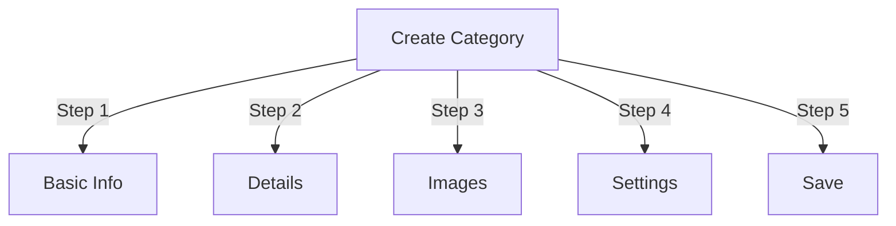

# Publisher'da Kategorileri Yönetme

> Yayımcı modülünde hiyerarşileri oluşturmaya, düzenlemeye ve kategorileri yönetmeye yönelik eksiksiz kılavuz.

---

## Kategori Temelleri

### Kategoriler Nelerdir?

Kategoriler makaleleri mantıksal gruplar halinde düzenler:
```
Example Structure:

  News (Main Category)
    ├── Technology
    ├── Sports
    └── Entertainment

  Tutorials (Main Category)
    ├── Photography
    │   ├── Basics
    │   └── Advanced
    └── Writing
        └── Blogging
```
### İyi Kategori Yapısının Faydaları
```
✓ Better user navigation
✓ Organized content
✓ Improved SEO
✓ Easier content management
✓ Better editorial workflow
```
---

## Kategori Yönetimine Erişim

### Yönetici Panelinde Gezinme
```
Admin Panel
└── Modules
    └── Publisher
        └── Categories
            ├── Create New
            ├── Edit
            ├── Delete
            ├── Permissions
            └── Organize
```
### Hızlı Erişim

1. **Yönetici** olarak oturum açın
2. **Yönetici → modules**'e gidin
3. **Publisher → Yönetici**'ye tıklayın
4. Soldaki menüden **Kategoriler**'e tıklayın

---

## Kategori Oluşturma

### Kategori Oluşturma Formu

### Adım 1: Temel Bilgiler

#### Kategori Adı
```
Field: Category Name
Type: Text input (required)
Max length: 100 characters
Uniqueness: Should be unique
Example: "Photography"
```
**Yönergeler:**
- Açıklayıcı ve tutarlı bir şekilde tekil veya çoğul
- Düzgün bir şekilde büyük harfle yazıldı
- Özel karakterlerden kaçının
- Makul derecede kısa tutun

#### Kategori Açıklama
```
Field: Description
Type: Textarea (optional)
Max length: 500 characters
Used in: Category listing pages, category blocks
```
**Amaç:**
- Kategori içeriğini açıklar
- Kategori makalelerinin üzerinde görünür
- Kullanıcıların kapsamı anlamasına yardımcı olur
- SEO meta açıklaması için kullanılır

**Örnek:**
```
"Photography tips, tutorials, and inspiration for
all skill levels. From composition basics to advanced
lighting techniques, master your craft."
```
### Adım 2: Ana Kategori

#### Hiyerarşi Oluştur
```
Field: Parent Category
Type: Dropdown
Options: None (root), or existing categories
```
**Hiyerarşi Örnekleri:**
```
Flat Structure:
  News
  Tutorials
  Reviews

Nested Structure:
  News
    Technology
    Business
    Sports
  Tutorials
    Photography
      Basics
      Advanced
    Writing
```
**Alt Kategori Oluştur:**

1. **Ebeveyn Kategorisi** açılır menüsüne tıklayın
2. Ebeveyni seçin (ör. "Haberler")
3. Kategori adını girin
4. Kaydet
5. Yeni kategori alt öğe olarak görünür

### Adım 3: Kategori Resmi

#### Kategori Resmini Yükle
```
Field: Category Image
Type: Image upload (optional)
Format: JPG, PNG, GIF, WebP
Max size: 5 MB
Recommended: 300x200 px (or your theme size)
```
**Yüklemek için:**

1. **Resim Yükle** düğmesini tıklayın
2. Bilgisayardan resim seçin
3. Crop/resize gerekirse
4. **Bu Resmi Kullan**'a tıklayın

**Kullanıldığı Yer:**
- Kategori listeleme sayfası
- Kategori bloğu başlığı
- Ekmek kırıntısı (bazı themes)
- Sosyal medya paylaşımı

### Adım 4: Kategori Ayarları

#### Ekran Ayarları
```yaml
Status:
  - Enabled: Yes/No
  - Hidden: Yes/No (hidden from menus, still accessible)

Display Options:
  - Show description: Yes/No
  - Show image: Yes/No
  - Show article count: Yes/No
  - Show subcategories: Yes/No

Layout:
  - Items per page: 10-50
  - Display order: Date/Title/Author
  - Display direction: Ascending/Descending
```
#### Kategori İzinleri
```yaml
Who Can View:
  - Anonymous: Yes/No
  - Registered: Yes/No
  - Specific groups: Configure per group

Who Can Submit:
  - Registered: Yes/No
  - Specific groups: Configure per group
  - Author must have: "submit articles" permission
```
### Adım 5: SEO Ayarlar

#### Meta Etiketleri
```
Field: Meta Description
Type: Text (160 characters)
Purpose: Search engine description

Field: Meta Keywords
Type: Comma-separated list
Example: photography, tutorials, tips, techniques
```
#### URL Yapılandırma
```
Field: URL Slug
Type: Text
Auto-generated from category name
Example: "photography" from "Photography"
Can be customized before saving
```
### Kategoriyi Kaydet

1. Gerekli tüm alanları doldurun:
   - Kategori Adı ✓
   - Açıklama (önerilen)
2. İsteğe bağlı: Görüntüyü yükleyin, SEO'yi ayarlayın
3. **Kategoriyi Kaydet**'i tıklayın
4. Onay mesajı belirir
5. Kategori artık mevcut

---

## Kategori Hiyerarşisi

### İç İçe Yapı Oluştur
```
Step-by-step example: Create News → Technology subcategory

1. Go to Categories admin
2. Click "Add Category"
3. Name: "News"
4. Parent: (leave blank - this is root)
5. Save
6. Click "Add Category" again
7. Name: "Technology"
8. Parent: "News" (select from dropdown)
9. Save
```
### Hiyerarşi Ağacını Görüntüle
```
Categories view shows tree structure:

📁 News
  📄 Technology
  📄 Sports
  📄 Entertainment
📁 Tutorials
  📄 Photography
    📄 Basics
    📄 Advanced
  📄 Writing
```
Okları show/hide alt kategorilerine genişletin.

### Kategorileri Yeniden Düzenleyin

#### Kategoriyi Taşı

1. Kategoriler listesine gidin
2. Kategoride **Düzenle**'yi tıklayın
3. **Üst Kategoriyi** değiştirin
4. **Kaydet**'i tıklayın
5. Kategori yeni konuma taşındı

#### Kategorileri Yeniden Sırala

Varsa sürükle ve bırak yöntemini kullanın:

1. Kategoriler listesine gidin
2. Kategoriye tıklayın ve sürükleyin
3. Yeni konuma bırakın
4. Sipariş otomatik olarak kaydedilir

#### Kategoriyi Sil

**Seçenek 1: Geçici Silme (Gizle)**

1. Kategoriyi düzenleyin
2. **Durum**'u ayarlayın: Devre Dışı
3. **Kaydet**'i tıklayın
4. Kategori gizlendi ancak silinmedi

**Seçenek 2: Kalıcı Silme**

1. Kategoriler listesine gidin
2. Kategoride **Sil**'e tıklayın
3. Makaleler için eylemi seçin:   
```
   ☐ Move articles to parent category
   ☐ Move articles to root (News)
   ☐ Delete all articles in category
   
```
4. Silme işlemini onaylayın

---

## Kategori İşlemleri

### Kategoriyi Düzenle

1. **Yönetici → Publisher → Kategoriler**'e gidin
2. Kategoride **Düzenle**'yi tıklayın
3. Alanları değiştirin:
   - İsim
   - Açıklama
   - Ana kategori
   - Resim
   - Ayarlar
4. **Kaydet**'i tıklayın

### Kategori İzinlerini Düzenle

1. Kategorilere Git
2. Kategoride **permissions**'i tıklayın (veya kategoriyi ve ardından permissions'i tıklayın)
3. Grupları yapılandırın:
```
For each group:
  ☐ View articles in this category
  ☐ Submit articles to this category
  ☐ Edit own articles
  ☐ Edit all articles
  ☐ Approve/Moderate articles
  ☐ Manage category
```
4. **İzinleri Kaydet**'i tıklayın

### Kategori Resmini Ayarla

**Yeni resim yükle:**

1. Kategoriyi düzenleyin
2. **Resmi Değiştir**'e tıklayın
3. Resmi yükleyin veya seçin
4. Crop/resize
5. **Resmi Kullan**'a tıklayın
6. **Kategoriyi Kaydet**'i tıklayın

**Resmi kaldır:**

1. Kategoriyi düzenleyin
2. **Resmi Kaldır**'ı tıklayın (varsa)
3. **Kategoriyi Kaydet**'i tıklayın

---

## Kategori İzinleri

### İzin Matrisi
```
                 Anonymous  Registered  Editor  Admin
View category        ✓         ✓         ✓       ✓
Submit article       ✗         ✓         ✓       ✓
Edit own article     ✗         ✓         ✓       ✓
Edit all articles    ✗         ✗         ✓       ✓
Moderate articles    ✗         ✗         ✓       ✓
Manage category      ✗         ✗         ✗       ✓
```
### Kategori Düzeyinde İzinleri Ayarlayın

#### Kategori Başına Erişim Kontrolü

1. **Kategoriler** listesine gidin
2. Bir kategori seçin
3. **permissions**'i tıklayın
4. Her grup için izinleri seçin:
```
Example: News category
  Anonymous:   View only
  Registered:  Submit articles
  Editors:     Approve articles
  Admins:      Full control
```
5. **Kaydet**'i tıklayın

#### Alan Düzeyinde permissions

Kullanıcıların hangi form alanlarını kullanabileceğini kontrol edin see/edit:
```
Example: Limit field visibility for Registered users

Registered users can see/edit:
  ✓ Title
  ✓ Description
  ✓ Content
  ✗ Author (auto-set to current user)
  ✗ Scheduled date (only editors)
  ✗ Featured (only admins)
```
**Yapılandırma:**
- Kategori İzinleri
- "Alan Görünürlüğü" bölümünü arayın

---

## Kategoriler için En İyi Uygulamalar

### Kategori Yapısı
```
✓ Keep hierarchy 2-3 levels deep
✗ Don't create too many top-level categories
✗ Don't create categories with one article

✓ Use consistent naming (plural or singular)
✗ Don't use vague names ("Stuff", "Other")

✓ Create categories for articles that exist
✗ Don't create empty categories in advance
```
### Adlandırma Yönergeleri
```
Good names:
  "Photography"
  "Web Development"
  "Travel Tips"
  "Business News"

Avoid:
  "Articles" (too vague)
  "Content" (redundant)
  "News&Updates" (inconsistent)
  "PHOTOGRAPHY STUFF" (formatting)
```
### Organizasyon İpuçları
```
By Topic:
  News
    Technology
    Sports
    Entertainment

By Type:
  Tutorials
    Video
    Text
    Interactive

By Audience:
  For Beginners
  For Experts
  Case Studies

Geographic:
  North America
    United States
    Canada
  Europe
```
---

## Kategori Blokları

### Publisher Kategori Bloğu

Kategori listelerini sitenizde görüntüleyin:

1. **Yönetici → Bloklar**'a gidin
2. **Publisher - Kategoriler**'i bulun
3. **Düzenle**'yi tıklayın
4. Yapılandırın:
```
Block Title: "News Categories"
Show subcategories: Yes/No
Show article count: Yes/No
Height: (pixels or auto)
```
5. **Kaydet**'i tıklayın

### Kategori Makaleleri Bloğu

Belirli bir kategorideki en son makaleleri göster:

1. **Yönetici → Bloklar**'a gidin
2. **Publisher - Kategori Makaleleri**'ni bulun
3. **Düzenle**'yi tıklayın
4. Seçin:
```
Category: News (or specific category)
Number of articles: 5
Show images: Yes/No
Show description: Yes/No
```
5. **Kaydet**'i tıklayın

---

## Kategori Analizi

### Kategori İstatistiklerini Görüntüle

Kategoriler yöneticisinden:
```
Each category shows:
  - Total articles: 45
  - Published: 42
  - Draft: 2
  - Pending approval: 1
  - Total views: 5,234
  - Latest article: 2 hours ago
```
### Kategori Trafiğini Görüntüle

Analitik etkinse:

1. Kategori adına tıklayın
2. **İstatistikler** sekmesini tıklayın
3. Görünüm:
   - Sayfa görüntülemeleri
   - Popüler makaleler
   - Trafik eğilimleri
   - Kullanılan arama terimleri

---

## Kategori Şablonları

### Kategori Görünümünü Özelleştir

Özel templates kullanılıyorsa her kategori şunları geçersiz kılabilir:
```
publisher_category.tpl
  ├── Category header
  ├── Category description
  ├── Category image
  ├── Article listing
  └── Pagination
```
**Özelleştirmek için:**

1. template dosyasını kopyalayın
2. HTML/CSS'yi değiştirin
3. Admin'de kategoriye atayın
4. Kategori özel template kullanır

---

## Ortak Görevler

### Haber Hiyerarşisi Oluşturun
```
Admin → Publisher → Categories
1. Create "News" (parent)
2. Create "Technology" (parent: News)
3. Create "Sports" (parent: News)
4. Create "Entertainment" (parent: News)
```
### Makaleleri Kategoriler Arasında Taşıma

1. **Makaleler** yöneticisine gidin
2. Makaleleri seçin (onay kutuları)
3. Toplu işlemler açılır menüsünden **"Kategoriyi Değiştir"** seçeneğini seçin
4. Yeni kategori seçin
5. **Tümünü Güncelle**'ye tıklayın

### Kategoriyi Silmeden Gizle

1. Kategoriyi düzenleyin
2. **Durum**'u ayarlayın: Disabled/Hidden
3. Kaydet
4. Kategori menülerde gösterilmiyor (yine de URL aracılığıyla erişilebilir)

### Taslaklar için Kategori Oluştur
```
Best Practice:

Create "In Review" category
  ├── Purpose: Articles awaiting approval
  ├── Permissions: Hidden from public
  ├── Only admins/editors can see
  ├── Move articles here until approved
  └── Move to "News" when published
```
---

## Import/Export Kategoriler

### Dışa Aktarma Kategorileri

Varsa:

1. **Kategoriler** yöneticisine gidin
2. **Dışa Aktar**'a tıklayın
3. Formatı seçin: CSV/JSON/XML
4. Dosyayı indirin
5. Yedekleme kaydedildi

### İçe Aktarma Kategorileri

Varsa:

1. Dosyayı kategorilerle hazırlayın
2. **Kategoriler** yöneticisine gidin
3. **İçe Aktar**'a tıklayın
4. Dosyayı yükleyin
5. Güncelleme stratejisini seçin:
   - Yalnızca yeni oluştur
   - Mevcut olanı güncelle
   - Hepsini değiştir
6. **İçe Aktar**'a tıklayın

---

## Sorun Giderme Kategorileri

### Sorun: Alt kategoriler gösterilmiyor

**Çözüm:**
```
1. Verify parent category status is "Enabled"
2. Check permissions allow viewing
3. Verify subcategories have status "Enabled"
4. Clear cache: Admin → Tools → Clear Cache
5. Check theme shows subcategories
```
### Sorun: Kategori silinemiyor

**Çözüm:**
```
1. Category must have no articles
2. Move or delete articles first:
   Admin → Articles
   Select articles in category
   Change category to another
3. Then delete empty category
4. Or choose "move articles" option when deleting
```
### Sorun: Kategori resmi gösterilmiyor

**Çözüm:**
```
1. Verify image uploaded successfully
2. Check image file format (JPG, PNG)
3. Verify upload directory permissions
4. Check theme displays category images
5. Try re-uploading image
6. Clear browser cache
```
### Sorun: permissions geçerli olmuyor

**Çözüm:**
```
1. Check group permissions in Category
2. Check global Publisher permissions
3. Check user belongs to configured group
4. Clear session cache
5. Log out and log back in
6. Check permission modules installed
```
---

## Kategori En İyi Uygulamalar Kontrol Listesi

Kategorileri dağıtmadan önce:

- [ ] Hiyerarşi 2-3 seviye derinliğindedir
- [ ] Her kategoride 5+ makale bulunur
- [ ] Kategori adları tutarlı
- [ ] permissions uygun
- [ ] Kategori görselleri optimize edildi
- [ ] Açıklamalar tamamlandı
- [ ] SEO meta verileri doldurulmuş
- [ ] URLs dost canlısıdır
- [ ] Ön uçta test edilen kategoriler
- [ ] Belgeler güncellendi

---

## İlgili Kılavuzlar

- Makale Oluşturma
- İzin Yönetimi
- module Yapılandırması
- Kurulum Kılavuzu

---

## Sonraki Adımlar

- Kategorilerde Makaleler oluşturun
- İzinleri Yapılandır
- Özel Şablonlarla Kişiselleştirin

---

#Publisher #kategoriler #organizasyon #hiyerarşi #yönetim #xoops