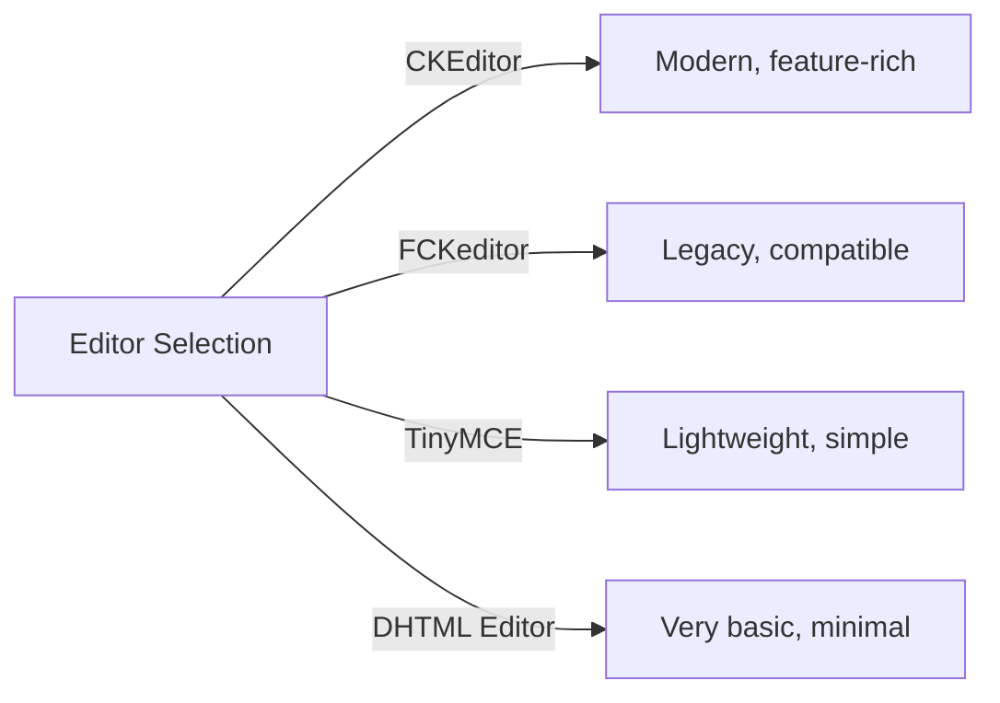
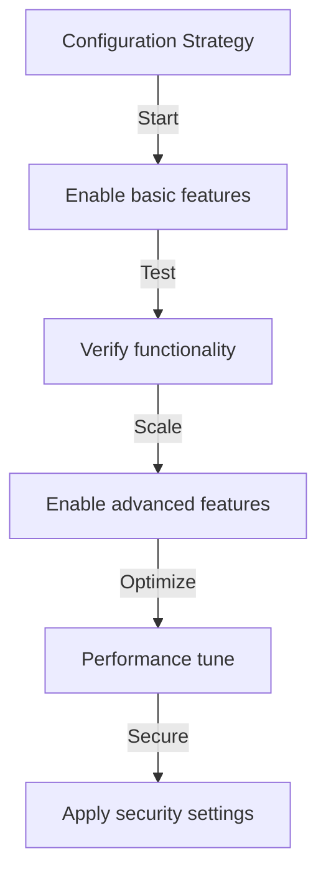

# Yayımcı Temel Yapılandırması

> XOOPS kurulumunuz için Publisher modülü ayarlarını, tercihlerini ve genel seçeneklerini yapılandırın.

---

## Yapılandırmaya Erişim

### Yönetici Panelinde Gezinme
```
XOOPS Admin Panel
└── Modules
    └── Publisher
        ├── Preferences
        ├── Settings
        └── Configuration
```
1. **Yönetici** olarak oturum açın
2. **Yönetici Paneli → modules**'e gidin
3. **Publisher** modülünü bulun
4. **Tercihler** veya **Yönetici** bağlantısını tıklayın

---

## Genel Ayarlar

### Erişim Yapılandırması
```
Admin Panel → Modules → Publisher
```
Bu seçenekler için **dişli simgesini** veya **Ayarlar**'ı tıklayın:

#### Görüntüleme Seçenekleri

| Ayar | Seçenekler | Varsayılan | Açıklama |
|-----------|------------|------------|------------|
| **Sayfa başına öğe sayısı** | 5-50 | 10 | Listelerde gösterilen makaleler |
| **Kırıntıyı göster** | Yes/No | Evet | Navigasyon izi ekranı |
| **Disk belleği kullan** | Yes/No | Evet | Uzun listeleri sayfalara ayırın |
| **Tarihi göster** | Yes/No | Evet | Makale tarihini görüntüle |
| **Kategoriyi göster** | Yes/No | Evet | Makale kategorisini göster |
| **Yazarı göster** | Yes/No | Evet | Makale yazarını göster |
| **Görünümleri göster** | Yes/No | Evet | Makale görüntüleme sayısını göster |

**Örnek Yapılandırma:**
```yaml
Items Per Page: 15
Show Breadcrumb: Yes
Use Paging: Yes
Show Date: Yes
Show Category: Yes
Show Author: Yes
Show Views: Yes
```
#### Yazar Seçenekleri

| Ayar | Varsayılan | Açıklama |
|-----------|-----------|-------------|
| **Yazar adını göster** | Evet | Gerçek adı veya user adını görüntüle |
| **user adını kullan** | Hayır | İsim yerine user adını göster |
| **Yazar e-postasını göster** | Hayır | Yazar iletişim e-postasını görüntüle |
| **Yazar avatarını göster** | Evet | user avatarını görüntüle |

---

## Düzenleyici Yapılandırması

### WYSIWYG Editör'ü seçin

Publisher birden fazla düzenleyiciyi destekler:

#### Mevcut Düzenleyiciler

### CKEditor (Önerilen)

**En iyisi:** Çoğu user, modern tarayıcılar, tüm özellikler

1. **Tercihler**'e gidin
2. **Editör**'ü ayarlayın: CKEditor
3. Seçenekleri yapılandırın:
```
Editor: CKEditor 4.x
Toolbar: Full
Height: 400px
Width: 100%
Remove plugins: []
Add plugins: [mathjax, codesnippet]
```
### FCKeditör

**En iyisi:** Uyumluluk, eski sistemler
```
Editor: FCKeditor
Toolbar: Default
Custom config: (optional)
```
### TinyMCE

**En iyisi:** Minimum yer kaplayan, temel düzenleme
```
Editor: TinyMCE
Plugins: [paste, table, link, image]
Toolbar: minimal
```
---

## Dosya ve Yükleme Ayarları

### Yükleme Dizinlerini Yapılandırın
```
Admin → Publisher → Preferences → Upload Settings
```
#### Dosya Türü Ayarları
```yaml
Allowed File Types:
  Images:
    - jpg
    - jpeg
    - gif
    - png
    - webp
  Documents:
    - pdf
    - doc
    - docx
    - xls
    - xlsx
    - ppt
    - pptx
  Archives:
    - zip
    - rar
    - 7z
  Media:
    - mp3
    - mp4
    - webm
    - mov
```
#### Dosya Boyutu Sınırları

| Dosya Türü | Maksimum Boyut | Notlar |
|-----------|----------|----------|
| **Resimler** | 5 MB | Resim dosyası başına |
| **Belgeler** | 10 MB | PDF, Ofis dosyaları |
| **Medya** | 50 MB | Video/audio dosyalar |
| **Tüm dosyalar** | 100MB | Yükleme başına toplam |

**Yapılandırma:**
```
Max Image Upload Size: 5 MB
Max Document Upload Size: 10 MB
Max Media Upload Size: 50 MB
Total Upload Size: 100 MB
Max Files per Article: 5
```
### Görüntüyü Yeniden Boyutlandırma

Yayımcı tutarlılık sağlamak için görselleri otomatik olarak yeniden boyutlandırır:
```yaml
Thumbnail Size:
  Width: 150
  Height: 150
  Mode: Crop/Resize

Category Image Size:
  Width: 300
  Height: 200
  Mode: Resize

Article Featured Image:
  Width: 600
  Height: 400
  Mode: Resize
```
---

## Yorum ve Etkileşim Ayarları

### Açıklama Yapılandırması
```
Preferences → Comments Section
```
#### Yorum Seçenekleri
```yaml
Allow Comments:
  - Enabled: Yes/No
  - Default: Yes
  - Per-article override: Yes

Comment Moderation:
  - Moderate comments: Yes/No
  - Moderate guest comments only: Yes/No
  - Spam filter: Enabled
  - Max comments per day: (unlimited)

Comment Display:
  - Display format: Threaded/Flat
  - Comments per page: 10
  - Date format: Full date/Time ago
  - Show comment count: Yes/No
```
### Derecelendirme Yapılandırması
```yaml
Allow Ratings:
  - Enabled: Yes/No
  - Default: Yes
  - Per-article override: Yes

Rating Options:
  - Rating scale: 5 stars (default)
  - Allow user to rate own: No
  - Show average rating: Yes
  - Show rating count: Yes
```
---

## SEO & URL Ayarlar

### Arama Motoru Optimizasyonu
```
Preferences → SEO Settings
```
#### URL Yapılandırma
```yaml
SEO URLs:
  - Enabled: No (set to Yes for SEO URLs)
  - URL rewriting: None/Apache mod_rewrite/IIS rewrite

URL Format:
  - Category: /category/news
  - Article: /article/welcome-to-site
  - Archive: /archive/2024/01

Meta Description:
  - Auto-generate: Yes
  - Max length: 160 characters

Meta Keywords:
  - Auto-generate: Yes
  - From: Article tags, title
```
### Etkinleştir SEO URLs (Gelişmiş)

**Önkoşullar:**
- `mod_rewrite` etkinleştirilmiş Apache
- `.htaccess` desteği etkin

**Yapılandırma Adımları:**

1. **Tercihler → SEO Ayarlar**'a gidin
2. **SEO URLs**'i ayarlayın: Evet
3. **URL Yeniden Yazma**'yı ayarlayın: Apache mod_rewrite
4. Yayımcı klasöründe `.htaccess` dosyasının mevcut olduğunu doğrulayın

**.htaccess Yapılandırması:**
```apache
<IfModule mod_rewrite.c>
    RewriteEngine On
    RewriteBase /modules/publisher/

    # Category rewrites
    RewriteRule ^category/([0-9]+)-(.*)\.html$ index.php?op=showcategory&categoryid=$1 [L,QSA]

    # Article rewrites
    RewriteRule ^article/([0-9]+)-(.*)\.html$ index.php?op=showitem&itemid=$1 [L,QSA]

    # Archive rewrites
    RewriteRule ^archive/([0-9]+)/([0-9]+)/$ index.php?op=archive&year=$1&month=$2 [L,QSA]
</IfModule>
```
---

## cache ve Performans

### Önbelleğe Alma Yapılandırması
```
Preferences → Cache Settings
```

```yaml
Enable Caching:
  - Enabled: Yes
  - Cache type: File (or Memcache)

Cache Lifetime:
  - Category lists: 3600 seconds (1 hour)
  - Article lists: 1800 seconds (30 minutes)
  - Single article: 7200 seconds (2 hours)
  - Recent articles block: 900 seconds (15 minutes)

Cache Clear:
  - Manual clear: Available in admin
  - Auto-clear on article save: Yes
  - Clear on category change: Yes
```
### Önbelleği Temizle

**Manuel cache Temizleme:**

1. **Yönetici → Yayımcı → Araçlar**'a gidin
2. **Önbelleği Temizle**'yi tıklayın
3. Temizlenecek cache türlerini seçin:
   - [ ] Kategori önbelleği
   - [ ] Makale önbelleği
   - [ ] Önbelleği engelle
   - [ ] Tüm cache
4. **Seçilenleri Temizle**'ye tıklayın

**Komut Satırı:**
```bash
# Clear all Publisher cache
php /path/to/xoops/admin/cache_manage.php publisher

# Or directly delete cache files
rm -rf /path/to/xoops/var/cache/publisher/*
```
---

## Bildirim ve İş Akışı

### E-posta Bildirimleri
```
Preferences → Notifications
```

```yaml
Notify Admin on New Article:
  - Enabled: Yes
  - Recipient: Admin email
  - Include summary: Yes

Notify Moderators:
  - Enabled: Yes
  - On new submission: Yes
  - On pending articles: Yes

Notify Author:
  - On approval: Yes
  - On rejection: Yes
  - On comment: No (optional)
```
### Gönderim İş Akışı
```yaml
Require Approval:
  - Enabled: Yes
  - Editor approval: Yes
  - Admin approval: No

Draft Save:
  - Auto-save interval: 60 seconds
  - Save local versions: Yes
  - Revision history: Last 5 versions
```
---

## İçerik Ayarları

### Yayınlama Varsayılanları
```
Preferences → Content Settings
```

```yaml
Default Article Status:
  - Draft/Published: Draft
  - Featured by default: No
  - Auto-publish time: None

Default Visibility:
  - Public/Private: Public
  - Show on front page: Yes
  - Show in categories: Yes

Scheduled Publishing:
  - Enabled: Yes
  - Allow per-article: Yes

Content Expiration:
  - Enabled: No
  - Auto-archive old: No
  - Archive after days: (unlimited)
```
### WYSIWYG İçerik Seçenekleri
```yaml
Allow HTML:
  - In articles: Yes
  - In comments: No

Allow Embedded Media:
  - Videos (iframe): Yes
  - Images: Yes
  - Plugins: No

Content Filtering:
  - Strip tags: No
  - XSS filter: Yes (recommended)
```
---

## Arama Motoru Ayarları

### Arama Entegrasyonunu Yapılandırma
```
Preferences → Search Settings
```

```yaml
Enable Article Indexing:
  - Include in site search: Yes
  - Index type: Full text/Title only

Search Options:
  - Search in titles: Yes
  - Search in content: Yes
  - Search in comments: Yes

Meta Tags:
  - Auto generate: Yes
  - OG tags (social): Yes
  - Twitter cards: Yes
```
---

## Gelişmiş Ayarlar

### Hata Ayıklama Modu (Yalnızca Geliştirme)
```
Preferences → Advanced
```

```yaml
Debug Mode:
  - Enabled: No (only for development!)

Development Features:
  - Show SQL queries: No
  - Log errors: Yes
  - Error email: admin@example.com
```
### database Optimizasyonu
```
Admin → Tools → Optimize Database
```

```bash
# Manual optimization
mysql> OPTIMIZE TABLE publisher_items;
mysql> OPTIMIZE TABLE publisher_categories;
mysql> OPTIMIZE TABLE publisher_comments;
```
---

## module Özelleştirme

### theme Şablonları
```
Preferences → Display → Templates
```
template kümesini seçin:
- Varsayılan
- Klasik
-Modern
- Karanlık
- Özel

Her template şunları kontrol eder:
- Makale düzeni
- Kategori listeleme
- Arşiv ekranı
- Yorum ekranı

---

## Yapılandırma İpuçları

### En İyi Uygulamalar

1. **Basit Başlangıç** - Önce temel özellikleri etkinleştirin
2. **Her Değişikliği Test Edin** - Devam etmeden önce doğrulayın
3. **Önbelleğe almayı etkinleştirin** - Performansı artırır
4. **Önce Yedekle** - Büyük değişikliklerden önce ayarları dışa aktarın
5. **Günlükleri İzleyin** - Hata günlüklerini düzenli olarak kontrol edin

### Performans Optimizasyonu
```yaml
For Better Performance:
  - Enable caching: Yes
  - Cache lifetime: 3600 seconds
  - Limit items per page: 10-15
  - Compress images: Yes
  - Minify CSS/JS: Yes (if available)
```
### Güvenliği Güçlendirme
```yaml
For Better Security:
  - Moderate comments: Yes
  - Disable HTML in comments: Yes
  - XSS filtering: Yes
  - File type whitelist: Strict
  - Max upload size: Reasonable limit
```
---

## Export/Import Ayarlar

### Yedekleme Yapılandırması
```
Admin → Tools → Export Settings
```
**Mevcut yapılandırmayı yedeklemek için:**

1. **Yapılandırmayı Dışa Aktar**'a tıklayın
2. İndirilen `.cfg` dosyasını kaydedin
3. Güvenli bir yerde saklayın

**Geri yüklemek için:**

1. **Yapılandırmayı İçe Aktar**'a tıklayın
2. `.cfg` dosyasını seçin
3. **Geri Yükle**'ye tıklayın

---

## İlgili Yapılandırma Kılavuzları

- Kategori Yönetimi
- Makale Oluşturma
- İzin Yapılandırması
- Kurulum Kılavuzu

---

## Yapılandırma Sorunlarını Giderme

### Ayarlar Kaydedilmiyor

**Çözüm:**
1. `/var/config/` üzerindeki dizin izinlerini kontrol edin
2. PHP yazma erişimini doğrulayın
3. Sorunlar için PHP hata günlüğünü kontrol edin
4. Tarayıcı önbelleğini temizleyip tekrar deneyin

### Düzenleyici Görünmüyor

**Çözüm:**
1. Düzenleyici eklentisinin yüklü olduğunu doğrulayın
2. XOOPS düzenleyici yapılandırmasını kontrol edin
3. Farklı düzenleyici seçeneğini deneyin
4. Tarayıcı konsolunu JavaScript hataları açısından kontrol edin

### Performans Sorunları

**Çözüm:**
1. Önbelleğe almayı etkinleştirin
2. Sayfa başına düşen öğeleri azaltın
3. Görüntüleri sıkıştırın
4. database optimizasyonunu kontrol edin
5. Yavaş sorgu günlüğünü inceleyin

---

## Sonraki Adımlar

- Grup İzinlerini Yapılandırma
- İlk Makalenizi oluşturun
- Kategorileri Ayarla
- Özel Şablonları İnceleyin

---

#Publisher #yapılandırma #tercihler #ayarlar #xoops