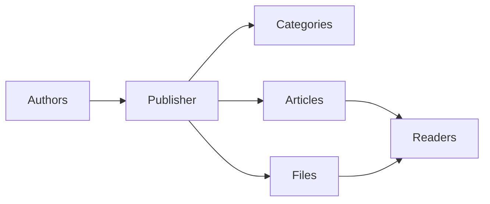
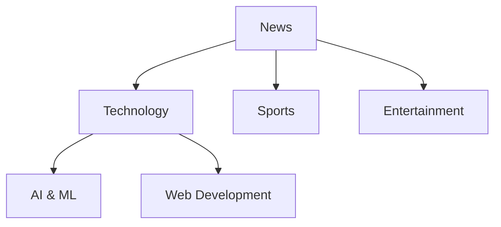
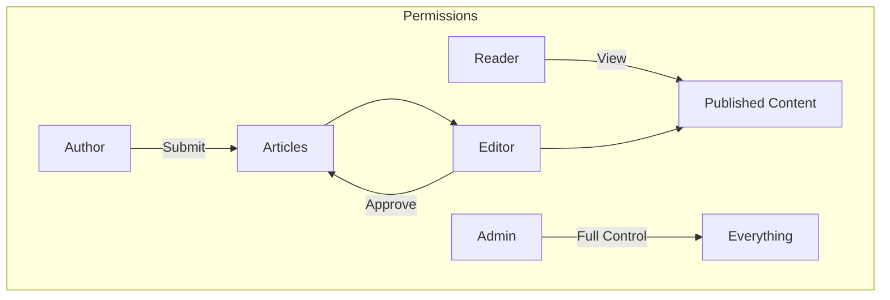
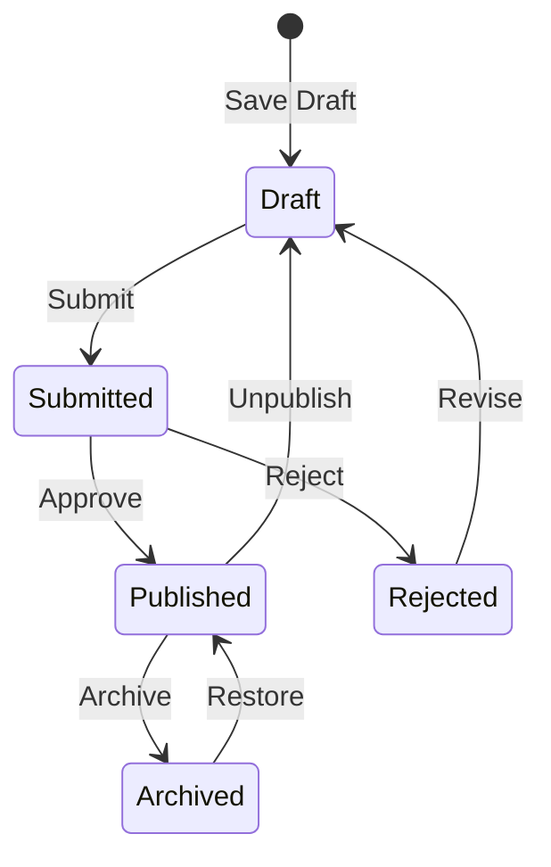

# Publisher'a Başlarken

> Publisher news/blog modülünü kurmak ve kullanmak için adım adım kılavuz.

---

## Publisher Nedir?

Publisher, XOOPS için aşağıdakiler için tasarlanmış önde gelen içerik yönetimi modülüdür:

- **Haber Siteleri** - Kategorilere sahip makaleler yayınlayın
- **Bloglar** - Kişisel veya çok yazarlı blog yazma``
- **Belgeler** - Düzenlenmiş bilgi tabanları
- **İçerik Portalları** - Karma medya içeriği

---

## Hızlı Kurulum

### 1. Adım: Publisher'ı yükleyin

1. [GitHub](https://github.com/XoopsModules25x/publisher) adresinden indirin
2. `modules/publisher/`'ye yükleyin
3. Yönetici → modules → Yükle'ye gidin

### Adım 2: Kategoriler Oluşturun

1. Yönetici → Publisher → Kategoriler
2. "Kategori Ekle"ye tıklayın
3. Doldurun:
   - **Ad**: Kategori adı
   - **Açıklama**: Bu kategorinin içeriği
   - **Resim**: İsteğe bağlı kategori resmi
4. İzinleri ayarlayın (kimler submit/view) yapabilir)
5. Kaydet

### 3. Adım: Ayarları Yapılandırın

1. Yönetici → Publisher → Tercihler
2. Yapılandırılacak temel ayarlar:

| Ayar | Önerilen | Açıklama |
|-----------|---------------|------------|
| Sayfa başına öğe | 10-20 | Dizindeki makaleler |
| Editör | TinyMCE/CKEditor | Zengin metin düzenleyici |
| Derecelendirmelere izin ver | Evet | Okuyucu geribildirimi |
| Yorumlara izin ver | Evet | Tartışmalar |
| Otomatik onayla | Hayır | Editör kontrolü |

### Adım 4: İlk Makalenizi Oluşturun

1. Ana menü → Publisher → Makale Gönder
2. Formu doldurun:
   - **Başlık**: Makale başlığı
   - **Kategori**: Ait olduğu yer
   - **Özet**: Kısa açıklama
   - **Gövde**: Tam makale içeriği
3. İsteğe bağlı öğeler ekleyin:
   - Öne çıkan görsel
   - Dosya ekleri
   - SEO ayarlar
4. İncelenmek üzere gönderin veya yayınlayın

---

## user Rolleri

### Okuyucu
- Yayınlanan makaleleri görüntüle
- Oy verin ve yorum yapın
- İçerik arayın

### Yazar
- Yeni makaleler gönderin
- Kendi makalelerini düzenle
- Dosyaları ekleyin

### Editör
- Approve/reject gönderimleri
- Herhangi bir makaleyi düzenleyin
- Kategorileri yönet

### Yönetici
- Tam module kontrolü
- Ayarları yapılandırın
- İzinleri yönet

---

## Makale Yazma

### Makale Editörü
```
┌─────────────────────────────────────────────────────┐
│ Title: [Your Article Title                        ] │
├─────────────────────────────────────────────────────┤
│ Category: [Select Category          ▼]              │
├─────────────────────────────────────────────────────┤
│ Summary:                                            │
│ ┌─────────────────────────────────────────────────┐ │
│ │ Brief description shown in listings...          │ │
│ └─────────────────────────────────────────────────┘ │
├─────────────────────────────────────────────────────┤
│ Body:                                               │
│ ┌─────────────────────────────────────────────────┐ │
│ │ [B] [I] [U] [Link] [Image] [Code]               │ │
│ ├─────────────────────────────────────────────────┤ │
│ │                                                  │ │
│ │ Full article content goes here...               │ │
│ │                                                  │ │
│ └─────────────────────────────────────────────────┘ │
├─────────────────────────────────────────────────────┤
│ [Submit] [Preview] [Save Draft]                     │
└─────────────────────────────────────────────────────┘
```
### En İyi Uygulamalar

1. **İlgi çekici başlıklar** - Açık, ilgi çekici başlıklar
2. **İyi özetler** - Okuyucuları tıklamaya ikna edin
3. **Yapılandırılmış içerik** - Başlıkları, listeleri ve resimleri kullanın
4. **Doğru sınıflandırma** - Okuyucuların içeriği bulmasına yardımcı olun
5. **SEO optimizasyon** - Başlık ve içerikteki anahtar kelimeler

---

## İçeriği Yönetme

### Makale Durumu Akışı

### Durum Açıklamaları

| Durum | Açıklama |
|----------|----------------|
| Taslak | Çalışma devam ediyor |
| Gönderildi | İnceleme bekleniyor |
| Yayınlandı | Sitede canlı |
| Süresi Doldu | Geçmiş son kullanma tarihi |
| Reddedildi | Revizyon gerekiyor |
| Arşivlendi | Listelerden kaldırıldı |

---

## Navigasyon

### Publisher'a Erişim

- **Ana Menü** → Publisher
- **Doğrudan URL**: `yoursite.com/modules/publisher/`

### Önemli Sayfalar

| Sayfa | URL | Amaç |
|------|-----|-----------|
| Dizin | `/modules/publisher/` | Makale listeleri |
| Kategori | `/modules/publisher/category.php?id=X` | Kategori makaleleri |
| Makale | `/modules/publisher/item.php?itemid=X` | Tek makale |
| Gönder | `/modules/publisher/submit.php` | Yeni makale |
| Ara | `/modules/publisher/search.php` | Makaleleri bul |

---

## Bloklar

Publisher siteniz için çeşitli bloklar sağlar:

### Son Makaleler
En son yayınlanan makaleleri görüntüler

### Kategori Menüsü
Kategoriye göre gezinme

### Popüler Makaleler
En çok görüntülenen içerik

### Rastgele Makale
Rastgele içerik sergileyin

### Gündem
Öne çıkan makaleler

---

## İlgili Belgeler

- Makale Oluşturma ve Düzenleme
- Kategorileri Yönetme
- Yayıncıyı Genişletme

---

#xoops #Publisher #user kılavuzu #başlarken #cms