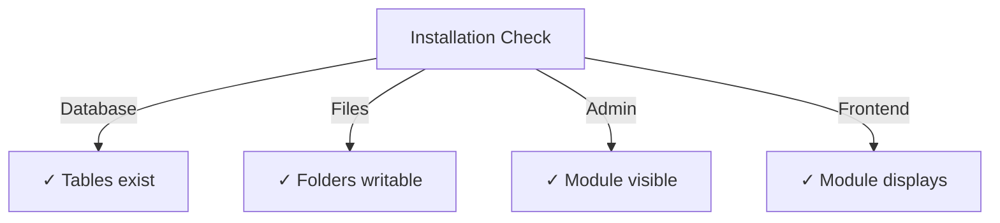

# Publisher Kurulum Kılavuzu

> XOOPS CMS için Publisher modülünü yükleme ve yapılandırma talimatlarını tamamlayın.

---

## Sistem Gereksinimleri

### Minimum Gereksinimler

| Gereksinim | Sürüm | Notlar |
|------------|-----------|-------|
| XOOPS | 2.5.10+ | Core CMS platformu |
| PHP | 7.1+ | PHP 8.x önerilir |
| MySQL | 5.7+ | database sunucusu |
| Web Sunucusu | Apache/Nginx | Yeniden yazma desteğiyle |

### PHP Uzantılar
```
- PDO (PHP Data Objects)
- pdo_mysql or mysqli
- mb_string (multibyte strings)
- curl (for external content)
- json
- gd (image processing)
```
### Disk Alanı

- **module dosyaları**: ~5 MB
- **cache dizini**: 50+ MB önerilir
- **Yükleme dizini**: İçerik için gerektiği gibi

---

## Kurulum Öncesi Kontrol Listesi

Publisher'ı yüklemeden önce şunları doğrulayın:

- [ ] XOOPS çekirdeği kurulu ve çalışıyor
- [ ] Yönetici hesabının module yönetim izinleri var
- [ ] database yedeği oluşturuldu
- [ ] Dosya izinleri `/modules/` dizinine yazma erişimine izin verir
- [ ] PHP hafıza sınırı en az 128 MB
- [ ] Dosya yükleme boyutu sınırları uygundur (en az 10 MB)

---

## Kurulum Adımları

### 1. Adım: Yayımlayıcıyı İndirin

#### Seçenek A: GitHub'dan (Önerilir)
```bash
# Navigate to modules directory
cd /path/to/xoops/htdocs/modules/

# Clone the repository
git clone https://github.com/XoopsModules25x/publisher.git

# Verify download
ls -la publisher/
```
#### Seçenek B: Manuel İndirme

1. [GitHub Publisher Sürümleri](https://github.com/XoopsModules25x/publisher/releases) adresini ziyaret edin
2. En son `.zip` dosyasını indirin
3. `modules/publisher/`'ye çıkartın

### Adım 2: Dosya İzinlerini Ayarlayın
```bash
# Set proper ownership
chown -R www-data:www-data /path/to/xoops/htdocs/modules/publisher

# Set directory permissions (755)
find publisher -type d -exec chmod 755 {} \;

# Set file permissions (644)
find publisher -type f -exec chmod 644 {} \;

# Make scripts executable
chmod 755 publisher/admin/index.php
chmod 755 publisher/index.php
```
### Adım 3: XOOPS Yönetici aracılığıyla yükleyin

1. **XOOPS Yönetici Paneli**'nde yönetici olarak oturum açın
2. **Sistem → modules**'e gidin
3. **Modülü Yükle**'ye tıklayın
4. Listede **Publisher**'yı bulun
5. **Yükle** düğmesini tıklayın
6. Kurulumun tamamlanmasını bekleyin (oluşturulan database tablolarını gösterir)
```
Installation Progress:
✓ Tables created
✓ Configuration initialized
✓ Permissions set
✓ Cache cleared
Installation Complete!
```
---

## İlk Kurulum

### 1. Adım: Publisher Yöneticisine Erişim

1. **Yönetici Paneli → modules**'e gidin
2. **Publisher** modülünü bulun
3. **Yönetici** bağlantısını tıklayın
4. Artık Publisher Yönetimi'ndesiniz

### Adım 2: module Tercihlerini Yapılandırın

1. Soldaki menüde **Tercihler**'e tıklayın
2. Temel ayarları yapılandırın:
```
General Settings:
- Editor: Select your WYSIWYG editor
- Items per page: 10
- Show breadcrumb: Yes
- Allow comments: Yes
- Allow ratings: Yes

SEO Settings:
- SEO URLs: No (enable later if needed)
- URL rewriting: None

Upload Settings:
- Max upload size: 5 MB
- Allowed file types: jpg, png, gif, pdf, doc, docx
```
3. **Ayarları Kaydet**'i tıklayın

### Adım 3: İlk Kategoriyi Oluşturun

1. Soldaki menüden **Kategoriler**'e tıklayın
2. **Kategori Ekle**'yi tıklayın
3. Formu doldurun:
```
Category Name: News
Description: Latest news and updates
Image: (optional) Upload category image
Parent Category: (leave blank for top-level)
Status: Enabled
```
4. **Kategoriyi Kaydet**'i tıklayın

### Adım 4: Kurulumu Doğrulayın

Şu göstergeleri kontrol edin:

#### database Kontrolü
```bash
mysql -u xoops_user -p xoops_database
mysql> SHOW TABLES LIKE 'publisher%';

# Should show tables:
# - publisher_categories
# - publisher_items
# - publisher_comments
# - publisher_files
```
#### Ön Uç Kontrolü

1. XOOPS ana sayfanızı ziyaret edin
2. **Publisher** veya **Haberler** bloğunu arayın
3. En son makaleleri göstermeli

---

## Kurulumdan Sonra Yapılandırma

### Editör Seçimi

Publisher birden fazla WYSIWYG düzenleyiciyi destekler:

| Editör | Artıları | Eksileri |
|----------|----------|------|
| FCKeditörü | Zengin özellikli | Daha eski, daha büyük |
| CKE Editörü | Modern standart | Yapılandırma karmaşıklığı |
| TinyMCE | Hafif | Sınırlı özellikler |
| DHTML Editör | Temel | Çok basit |

**Düzenleyiciyi değiştirmek için:**

1. **Tercihler**'e gidin
2. **Düzenleyici** ayarına gidin
3. Açılır menüden seçin
4. Kaydet ve test et

### Dizin Kurulumunu Yükle
```bash
# Create upload directories
mkdir -p /path/to/xoops/uploads/publisher/
mkdir -p /path/to/xoops/uploads/publisher/categories/
mkdir -p /path/to/xoops/uploads/publisher/images/
mkdir -p /path/to/xoops/uploads/publisher/files/

# Set permissions
chmod 755 /path/to/xoops/uploads/publisher/
chmod 755 /path/to/xoops/uploads/publisher/*
```
### Görüntü Boyutlarını Yapılandırın

Tercihler'de küçük resim boyutlarını ayarlayın:
```
Category image size: 300 x 200 px
Article image size: 600 x 400 px
Thumbnail size: 150 x 100 px
```
---

## Kurulum Sonrası Adımlar

### 1. Grup İzinlerini Ayarlayın

1. Yönetici menüsünde **permissions**'e gidin
2. Gruplar için erişimi yapılandırın:
   - Anonim: Yalnızca görüntüleme
   - Kayıtlı users: Makaleleri gönderin
   - Editörler: Approve/edit makaleler
   - Yöneticiler: Tam erişim

### 2. module Görünürlüğünü Yapılandırma

1. XOOPS admin'de **Bloklar**'a gidin
2. Publisher bloklarını bulun:
   - Publisher - Son Makaleler
   - Publisher - Kategoriler
   - Publisher - Arşivler
3. Sayfa başına blok görünürlüğünü yapılandırın

### 3. Test İçeriğini İçe Aktarın (İsteğe Bağlı)

Test için örnek makaleleri içe aktarın:

1. **Publisher Yöneticisi → İçe Aktar**'a gidin
2. **Örnek İçerik**'i seçin
3. **İçe Aktar**'a tıklayın

### 4. SEO URLs'yi etkinleştirin (İsteğe bağlı)

Arama dostu URLs için:

1. **Tercihler**'e gidin
2. **SEO URLs**'yi ayarlayın: Evet
3. **.htaccess** yeniden yazmayı etkinleştirin
4. Yayımcı klasöründe `.htaccess` dosyasının mevcut olduğunu doğrulayın
```apache
# .htaccess example
<IfModule mod_rewrite.c>
    RewriteEngine On
    RewriteBase /modules/publisher/
    RewriteRule ^category/([0-9]+)-(.*)\.html$ index.php?op=showcategory&categoryid=$1 [L]
    RewriteRule ^article/([0-9]+)-(.*)\.html$ index.php?op=showitem&itemid=$1 [L]
</IfModule>
```
---

## Kurulum Sorunlarını Giderme

### Sorun: module yöneticide görünmüyor

**Çözüm:**
```bash
# Check file permissions
ls -la /path/to/xoops/modules/publisher/

# Check xoops_version.php exists
ls /path/to/xoops/modules/publisher/xoops_version.php

# Verify PHP syntax
php -l /path/to/xoops/modules/publisher/xoops_version.php
```
### Sorun: database tabloları oluşturulmuyor

**Çözüm:**
1. MySQL kullanıcısının CREATE TABLE ayrıcalığına sahip olduğunu kontrol edin
2. database hata günlüğünü kontrol edin:   
```bash
   mysql> SHOW WARNINGS;
   
```
3. SQL'yi manuel olarak içe aktarın:   
```bash
   mysql -u user -p database < modules/publisher/sql/mysql.sql
   
```
### Sorun: Dosya yükleme işlemi başarısız oluyor

**Çözüm:**
```bash
# Check directory exists and is writable
stat /path/to/xoops/uploads/publisher/

# Fix permissions
chmod 777 /path/to/xoops/uploads/publisher/

# Verify PHP settings
php -i | grep upload_max_filesize
```
### Sorun: "Sayfa bulunamadı" hataları

**Çözüm:**
1. `.htaccess` dosyasının mevcut olup olmadığını kontrol edin
2. Apache `mod_rewrite`'nin etkin olduğunu doğrulayın:   
```bash
   a2enmod rewrite
   systemctl restart apache2
   
```
3. Apache yapılandırmasında `AllowOverride All`'yi kontrol edin

---

## Önceki Sürümlerden Yükseltme

### Yayımcı 1.x'ten 2.x'e

1. **Geçerli kurulumu yedekleyin:**   
```bash
   cp -r modules/publisher/ modules/publisher-backup/
   mysqldump -u user -p database > publisher-backup.sql
   
```
2. **Publisher 2.x'i indirin**

3. **Dosyaların üzerine yaz:**   
```bash
   rm -rf modules/publisher/
   unzip publisher-2.0.zip -d modules/
   
```
4. **Güncellemeyi çalıştırın:**
   - **Yönetici → Publisher → Güncelle**'ye gidin
   - **Veritabanını Güncelle**'ye tıklayın
   - Tamamlanmasını bekleyin

5. **Doğrulayın:**
   - Tüm makalelerin doğru şekilde görüntülendiğini kontrol edin
   - İzinlerin sağlam olduğunu doğrulayın
   - Test file uploads

---

## Güvenlik Hususları

### Dosya İzinleri
```
- Core files: 644 (readable by web server)
- Directories: 755 (browseable by web server)
- Upload directories: 755 or 777
- Config files: 600 (not readable by web)
```
### Hassas Dosyalara Doğrudan Erişimi Devre Dışı Bırakın

Yükleme dizinlerinde `.htaccess` oluşturun:
```apache
<FilesMatch "\.(php|phtml|php3|php4|php5|phtml)$">
    Deny from all
</FilesMatch>
```
### database Güvenliği
```bash
# Use strong password
ALTER USER 'publisher_user'@'localhost' IDENTIFIED BY 'strong_password_here';

# Grant minimal permissions
GRANT SELECT, INSERT, UPDATE, DELETE ON publisher_db.* TO 'publisher_user'@'localhost';
FLUSH PRIVILEGES;
```
---

## Doğrulama Kontrol Listesi

Kurulumdan sonra şunları doğrulayın:

- [ ] module yönetici modülleri listesinde görünür
- [ ] Publisher yöneticisi bölümüne erişebilir
- [ ] Kategoriler oluşturabilir
- [ ] Makaleler oluşturabilir
- [ ] Makaleler ön uçta görüntüleniyor
- [ ] Dosya yükleme işlemi çalışıyor
- [ ] Görüntüler doğru şekilde görüntüleniyor
- [ ] permissions doğru şekilde uygulandı
- [ ] database tabloları oluşturuldu
- [ ] cache dizini yazılabilir

---

## Sonraki Adımlar

Başarılı kurulumdan sonra:

1. Temel Yapılandırma Kılavuzunu Okuyun
2. İlk Makalenizi oluşturun
3. Grup İzinlerini Ayarlayın
4. Kategori Yönetimini Gözden Geçirin

---

## Destek ve Kaynaklar

- **GitHub Sorunları**: [Publisher Sorunları](https://github.com/XoopsModules25x/publisher/issues)
- **XOOPS Forum**: [Topluluk Desteği](https://www.xoops.org/modules/newbb/)
- **GitHub Wiki**: [Kurulum Yardımı](https://github.com/XoopsModules25x/publisher/wiki)

---

#Publisher #kurulum #kurulum #xoops #module #yapılandırma