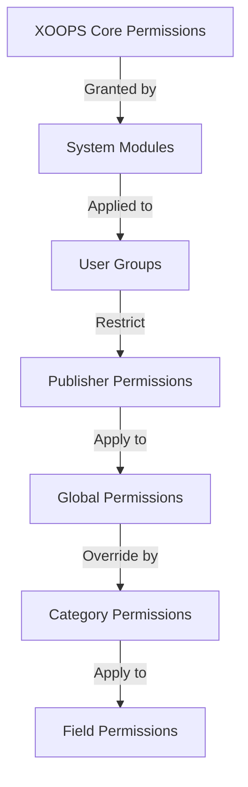

# Publisher İzinleri Kurulumu

> Publisher'da grup izinlerini yapılandırmaya, erişim kontrolüne ve user erişimini yönetmeye yönelik eksiksiz kılavuz.

---

## İzin Temelleri

### permissions Nelerdir?

permissions, farklı user gruplarının Publisher'da neler yapabileceğini denetler:
```
Who can:
  - View articles
  - Submit articles
  - Edit articles
  - Approve articles
  - Manage categories
  - Configure settings
```
### İzin Düzeyleri
```
Anonymous
  └── View published articles only

Registered Users
  ├── View articles
  ├── Submit articles (pending approval)
  └── Edit own articles

Editors/Moderators
  ├── All registered permissions
  ├── Approve articles
  ├── Edit all articles
  └── Manage some categories

Administrators
  └── Full access to everything
```
---

## Erişim İzni Yönetimi

### İzinlere Git
```
Admin Panel
└── Modules
    └── Publisher
        ├── Permissions
        ├── Category Permissions
        └── Group Management
```
### Hızlı Erişim

1. **Yönetici** olarak oturum açın
2. **Yönetici → modules**'e gidin
3. **Publisher → Yönetici**'ye tıklayın
4. Soldaki menüde **permissions**'e tıklayın

---

## Genel permissions

### module Düzeyinde permissions

Publisher modülüne ve özelliklerine erişimi kontrol edin:
```
Permissions configuration view:
┌─────────────────────────────────────┐
│ Permission             │ Anon │ Reg │ Editor │ Admin │
├────────────────────────┼──────┼─────┼────────┼───────┤
│ View articles          │  ✓   │  ✓  │   ✓    │  ✓   │
│ Submit articles        │  ✗   │  ✓  │   ✓    │  ✓   │
│ Edit own articles      │  ✗   │  ✓  │   ✓    │  ✓   │
│ Edit all articles      │  ✗   │  ✗  │   ✓    │  ✓   │
│ Approve articles       │  ✗   │  ✗  │   ✓    │  ✓   │
│ Manage categories      │  ✗   │  ✗  │   ✗    │  ✓   │
│ Access admin panel     │  ✗   │  ✗  │   ✓    │  ✓   │
└─────────────────────────────────────┘
```
### İzin Açıklamaları

| İzin | users | Efekt |
|------------|----------|--------|
| **Makaleleri görüntüle** | Tüm gruplar | Ön uçta yayınlanmış makaleleri görebilir |
| **Makaleleri gönderin** | Kayıtlı+ | Yeni makaleler oluşturabilir (onay bekleniyor) |
| **Kendi makalelerini düzenle** | Kayıtlı+ | Can edit/delete kendi makaleleri |
| **Tüm makaleleri düzenle** | Editörler+ | Herhangi bir kullanıcının makalesini düzenleyebilir |
| **Kendi makalelerini sil** | Kayıtlı+ | Kendi yayınlanmamış makalelerini silebilir |
| **Tüm makaleleri sil** | Editörler+ | Herhangi bir makaleyi silebilir |
| **Makaleleri onaylayın** | Editörler+ | Bekleyen makaleleri yayınlayabilir |
| **Kategorileri yönet** | Yöneticiler | Kategori oluşturun, düzenleyin, silin |
| **Yönetici erişimi** | Editörler+ | Yönetici arayüzüne erişim |

---

## Genel İzinleri Yapılandırın

### 1. Adım: İzin Ayarlarına Erişim

1. **Yönetici → modules**'e gidin
2. **Publisher**'yı bulun
3. **permissions**'i tıklayın (veya Yönetici bağlantısını, ardından permissions'i) tıklayın.
4. İzin matrisini görüyorsunuz

### Adım 2: Grup İzinlerini Ayarlayın

Her grup için yapabileceklerini yapılandırın:

#### Anonim users
```yaml
Anonymous Group Permissions:
  View articles: ✓ YES
  Submit articles: ✗ NO
  Edit articles: ✗ NO
  Delete articles: ✗ NO
  Approve articles: ✗ NO
  Manage categories: ✗ NO
  Admin access: ✗ NO

Result: Anonymous users can only view published content
```
#### Kayıtlı users
```yaml
Registered Group Permissions:
  View articles: ✓ YES
  Submit articles: ✓ YES (with approval required)
  Edit own articles: ✓ YES
  Edit all articles: ✗ NO
  Delete own articles: ✓ YES (drafts only)
  Delete all articles: ✗ NO
  Approve articles: ✗ NO
  Manage categories: ✗ NO
  Admin access: ✗ NO

Result: Registered users can contribute content after approval
```
#### Editörler Grubu
```yaml
Editors Group Permissions:
  View articles: ✓ YES
  Submit articles: ✓ YES
  Edit own articles: ✓ YES
  Edit all articles: ✓ YES
  Delete own articles: ✓ YES
  Delete all articles: ✓ YES
  Approve articles: ✓ YES
  Manage categories: ✓ LIMITED
  Admin access: ✓ YES
  Configure settings: ✗ NO

Result: Editors manage content but not settings
```
#### Yöneticiler
```yaml
Admins Group Permissions:
  ✓ FULL ACCESS to all features

  - All editor permissions
  - Manage all categories
  - Configure all settings
  - Manage permissions
  - Install/uninstall
```
### 3. Adım: İzinleri Kaydet

1. Her grubun izinlerini yapılandırın
2. İzin verilen eylemlere ilişkin kutuları işaretleyin
3. Reddedilen eylemlere ilişkin kutuların işaretini kaldırın
4. **İzinleri Kaydet**'i tıklayın
5. Onay mesajı belirir

---

## Kategori Düzeyinde permissions

### Set Category Access

Belirli kategorilere kimin view/submit yapabileceğini kontrol edin:
```
Admin → Publisher → Categories
→ Select category → Permissions
```
### Kategori İzin Matrisi
```
                 Anonymous  Registered  Editor  Admin
View category        ✓         ✓         ✓       ✓
Submit to category   ✗         ✓         ✓       ✓
Edit own in category ✗         ✓         ✓       ✓
Edit all in category ✗         ✗         ✓       ✓
Approve in category  ✗         ✗         ✓       ✓
Manage category      ✗         ✗         ✗       ✓
```
### Kategori İzinlerini Yapılandırın

1. **Kategoriler** yöneticisine gidin
2. Kategoriyi bulun
3. **permissions** düğmesini tıklayın
4. Her grup için şunu seçin:
   - [ ] Bu kategoriyi görüntüle
   - [ ] Makaleleri gönder
   - [ ] Kendi makalelerinizi düzenleyin
   - [ ] Tüm makaleleri düzenle
   - [ ] Makaleleri onayla
   - [ ] Kategoriyi yönet
5. **Kaydet**'i tıklayın

### Kategori İzin Örnekleri

#### Public News Category
```
Anonymous: View only
Registered: View + Submit (pending approval)
Editors: Approve + Edit
Admins: Full control
```
#### Dahili Güncellemeler Kategorisi
```
Anonymous: No access
Registered: View only
Editors: Submit + Approve
Admins: Full control
```
#### Misafir Blogu Kategorisi
```
Anonymous: View only
Registered: Submit (pending approval)
Editors: Approve
Admins: Full control
```
---

## Alan Düzeyinde permissions

### Kontrol Formu Alanı Görünürlüğü

Kullanıcıların hangi form alanlarını kullanabileceğini kısıtlayın see/edit:
```
Admin → Publisher → Permissions → Fields
```
### Alan Seçenekleri
```yaml
Visible Fields for Registered Users:
  ✓ Title
  ✓ Description
  ✓ Content (body)
  ✓ Featured image
  ✓ Category
  ✓ Tags
  ✗ Author (auto-set)
  ✗ Publication date (editors only)
  ✗ Scheduled date (editors only)
  ✗ Featured flag (editors only)
  ✗ Permissions (admins only)
```
### Örnekler

#### Kayıtlı Kişiler İçin Sınırlı Gönderim

Kayıtlı users daha az seçenek görür:
```
Available fields:
  - Title ✓
  - Description ✓
  - Content ✓
  - Featured image ✓
  - Category ✓

Hidden fields:
  - Author (auto-current user)
  - Publication date (editors decide)
  - Scheduled date (admins only)
  - Featured status (editors choose)
```
#### Editörler için Tam Form

Editörler tüm seçenekleri görür:
```
Available fields:
  - All basic fields
  - All metadata
  - Author selection ✓
  - Publication date/time ✓
  - Scheduled date ✓
  - Featured status ✓
  - Expiration date ✓
  - Permissions ✓
```
---

## user Grubu Yapılandırması

### Özel Grup Oluştur

1. **Yönetici → users → Gruplar**'a gidin
2. **Grup Oluştur**'a tıklayın
3. Grup ayrıntılarını girin:
```
Group Name: "Community Bloggers"
Group Description: "Users who contribute blog content"
Type: Regular group
```
4. **Grubu Kaydet**'e tıklayın
5. Publisher izinlerine geri dönün
6. Yeni grup için izinleri ayarlayın

### Grup Örnekleri
```
Suggested Groups for Publisher:

Group: Contributors
  - Regular members who submit articles
  - Can edit own articles
  - Cannot approve articles

Group: Reviewers
  - Can see submitted articles
  - Can approve/reject articles
  - Cannot delete others' articles

Group: Editors
  - Can edit any article
  - Can approve articles
  - Can moderate comments
  - Can manage some categories

Group: Publishers
  - Can edit any article
  - Can publish directly (no approval)
  - Can manage all categories
  - Can configure settings
```
---

## İzin Hiyerarşileri

### İzin Akışı

### İzin Devri
```
Base: Global module permissions
  ↓
Category: Overrides for specific categories
  ↓
Field: Further restricts available fields
  ↓
User: Has permission if ALL levels allow
```
**Örnek:**
```
User wants to edit article:
1. User group must have "edit articles" permission (global)
2. Category must allow editing (category level)
3. Field restrictions must allow (if applicable)
4. User must be author OR editor (for own vs all)

If ANY level denies → Permission denied
```
---

## Onay İş Akışı İzinleri

### Gönderim Onayını Yapılandır

Makalelerin onaya ihtiyacı olup olmadığını kontrol edin:
```
Admin → Publisher → Preferences → Workflow
```
#### Onay Seçenekleri
```yaml
Submission Workflow:
  Require Approval: Yes

  For Registered Users:
    - New articles: Draft (pending approval)
    - Editors must approve
    - User can edit while pending
    - After approval: User can still edit

  For Editors:
    - New articles: Publish directly (optional)
    - Skip approval queue
    - Or always require approval
```
#### Grup Başına Yapılandırma

1. Tercihler'e gidin
2. "Gönderim İş Akışı"nı bulun
3. Her grup için şunu ayarlayın:
```
Group: Registered Users
  Require approval: ✓ YES
  Default status: Draft
  Can modify while pending: ✓ YES

Group: Editors
  Require approval: ✗ NO
  Default status: Published
  Can modify published: ✓ YES
```
4. **Kaydet**'i tıklayın

---

## Orta Düzey Makaleler

### Bekleyen Makaleleri Onayla

"Makaleleri onaylama" iznine sahip users için:

1. **Yönetici → Publisher → Makaleler**'e gidin
2. **Durum**'a göre filtrele: Beklemede
3. İncelemek için makaleye tıklayın
4. İçerik kalitesini kontrol edin
5. **Durum**'u ayarlayın: Yayınlandı
6. İsteğe bağlı: Editoryal notlar ekleyin
7. **Kaydet**'i tıklayın

### Makaleleri Reddet

Makale standartları karşılamıyorsa:

1. Makaleyi açın
2. **Durum**'u ayarlayın: Taslak
3. Reddetme nedenini ekleyin (yorumda veya e-postada)
4. **Kaydet**'i tıklayın
5. Yazara reddedildiğini açıklayan bir mesaj gönderin

### Yorumları Denetle

Yorumları denetliyorsanız:

1. **Yönetici → Publisher → Yorumlar**'a gidin
2. **Durum**'a göre filtrele: Beklemede
3. Yorumu inceleyin
4. Seçenekler:
   - Onayla: **Onayla**'yı tıklayın
   - Reddet: **Sil**'i tıklayın
   - Düzenleme: **Düzenle**'yi tıklayın, düzeltin, kaydedin
5. **Kaydet**'i tıklayın

---

## user Erişimini Yönet

### user Gruplarını Görüntüle

Hangi kullanıcıların gruplara ait olduğunu görün:
```
Admin → Users → User Groups

For each user:
  - Primary group (one)
  - Secondary groups (multiple)

Permissions apply from all groups (union)
```
### Kullanıcıyı Gruba Ekle

1. **Yönetici → users**'a gidin
2. Kullanıcıyı bulun
3. **Düzenle**'yi tıklayın
4. **Gruplar** altında eklenecek grupları işaretleyin
5. **Kaydet**'i tıklayın

### user İzinlerini Değiştir

Bireysel users için (destekleniyorsa):

1. user yöneticisine gidin
2. Kullanıcıyı bulun
3. **Düzenle**'yi tıklayın
4. Bireysel izinlerin geçersiz kılınmasını arayın
5. Gerektiği gibi yapılandırın
6. **Kaydet**'i tıklayın

---

## Ortak İzin Senaryoları

### Senaryo 1: Blogu Aç

Herkesin göndermesine izin ver:
```
Anonymous: View
Registered: Submit, edit own, delete own
Editors: Approve, edit all, delete all
Admins: Full control

Result: Open community blog
```
### Senaryo 2: Denetlenen Haber Sitesi

Sıkı onay süreci:
```
Anonymous: View only
Registered: Cannot submit
Editors: Submit, approve others
Admins: Full control

Result: Only approved professionals publish
```
### Senaryo 3: Personel Blogu

Çalışanlar aşağıdakilere katkıda bulunabilir:
```
Create group: "Staff"
Anonymous: View
Registered: View only (non-staff)
Staff: Submit, edit own, publish directly
Admins: Full control

Result: Staff-authored blog
```
### Senaryo 4: Farklı Düzenleyicilerle Çoklu Kategori

Farklı kategoriler için farklı editörler:
```
News category:
  Editors group A: Full control

Reviews category:
  Editors group B: Full control

Tutorials category:
  Editors group C: Full control

Result: Decentralized editorial control
```
---

## İzin Testi

### İzinlerin Çalıştığını Doğrulayın

1. Her grupta test kullanıcısı oluşturun
2. Her test kullanıcısı olarak oturum açın
3. Aşağıdakileri deneyin:
   - Makaleleri görüntüle
   - Makaleyi gönderin (izin veriliyorsa taslak oluşturulmalıdır)
   - Makaleyi düzenleyin (kendi ve diğerleri)
   - Makaleyi sil
   - Yönetici paneline erişim
   - Kategorilere erişin

4. Sonuçların beklenen izinlerle eşleştiğini doğrulayın

### Ortak Test Durumları
```
Test Case 1: Anonymous user
  [ ] Can view published articles: ✓
  [ ] Cannot submit articles: ✓
  [ ] Cannot access admin: ✓

Test Case 2: Registered user
  [ ] Can submit articles: ✓
  [ ] Articles go to Draft: ✓
  [ ] Can edit own article: ✓
  [ ] Cannot edit others: ✓
  [ ] Cannot access admin: ✓

Test Case 3: Editor
  [ ] Can approve articles: ✓
  [ ] Can edit any article: ✓
  [ ] Can access admin: ✓
  [ ] Cannot delete all: ✓ (or ✓ if allowed)

Test Case 4: Admin
  [ ] Can do everything: ✓
```
---

## İzin Sorunlarını Giderme

### Sorun: user makale gönderemiyor

**Kontrol edin:**
```
1. User group has "submit articles" permission
   Admin → Publisher → Permissions

2. User belongs to allowed group
   Admin → Users → Edit user → Groups

3. Category allows submission from user's group
   Admin → Publisher → Categories → Permissions

4. User is registered (not anonymous)
```
**Çözüm:**
```bash
1. Verify registered user group has submission permission
2. Add user to appropriate group
3. Check category permissions
4. Clear user session cache
```
### Sorun: Editör makaleleri onaylayamıyor

**Kontrol edin:**
```
1. Editor group has "approve articles" permission
2. Articles exist with "Pending" status
3. Editor is in correct group
4. Category allows approval from editor's group
```
**Çözüm:**
```bash
1. Go to Permissions, check "approve articles" is checked for editor group
2. Create test article, set to Draft
3. Try to approve as editor
4. Check error messages in system log
```
### Sorun: Makaleleri görebiliyor ancak kategoriye erişemiyorum

**Kontrol edin:**
```
1. Category is not disabled/hidden
2. Category permissions allow viewing
3. User's group is permitted to view category
4. Category is published
```
**Çözüm:**
```bash
1. Go to Categories, check category status is "Enabled"
2. Check category permissions are set
3. Add user's group to category view permission
```
### Sorun: permissions değişti ancak etkili olmuyor

**Çözüm:**
```bash
1. Clear cache: Admin → Tools → Clear Cache
2. Clear session: Logout and login again
3. Check system log for errors
4. Verify permissions actually saved
5. Try different browser/incognito window
```
---

## İzin Yedekleme ve Dışa Aktarma

### Dışa Aktarma İzinleri

Bazı sistemler dışa aktarmaya izin verir:

1. **Yönetici → Yayımcı → Araçlar**'a gidin
2. **İzinleri Dışa Aktar**'a tıklayın
3. `.xml` veya `.json` dosyasını kaydedin
4. Yedek olarak saklayın

### İçe Aktarma İzinleri

Yedekten geri yükleme:

1. **Yönetici → Yayımcı → Araçlar**'a gidin
2. **İzinleri İçe Aktar**'a tıklayın
3. Yedekleme dosyasını seçin
4. Değişiklikleri gözden geçirin
5. **İçe Aktar**'a tıklayın

---

## En İyi Uygulamalar

### İzin Yapılandırma Kontrol Listesi

- [ ] user gruplarına karar verin
- [ ] Gruplara anlaşılır adlar atayın
- [ ] Her grup için temel izinleri ayarlayın
- [ ] Her izin düzeyini test edin
- [ ] Belge izin yapısı
- [ ] Onay iş akışı oluştur
- [ ] Editörlere denetim konusunda eğitim verin
- [ ] İzin kullanımını izleyin
- [ ] İzinleri üç ayda bir gözden geçirin
- [ ] Yedekleme izni ayarları

### En İyi Güvenlik Uygulamaları
```
✓ Principle of Least Privilege
  - Grant minimum necessary permissions

✓ Role-Based Access
  - Use groups for roles (editor, moderator, etc)

✓ Audit Permissions
  - Review who has what access

✓ Separate Duties
  - Submitter, approver, publisher are different

✓ Regular Review
  - Check permissions quarterly
  - Remove access when users leave
  - Update for new requirements
```
---

## İlgili Kılavuzlar

- Makale Oluşturma
- Kategorileri Yönetme
- Temel Yapılandırma
- Kurulum

---

## Sonraki Adımlar

- İş akışınız için İzinleri ayarlayın
- Uygun izinlere sahip Makaleler oluşturun
- Kategorileri izinlerle yapılandırın
- Kullanıcıları makale oluşturma konusunda eğitin

---

#Publisher #permissions #gruplar #erişim kontrolü #güvenlik #denetleme #xoops