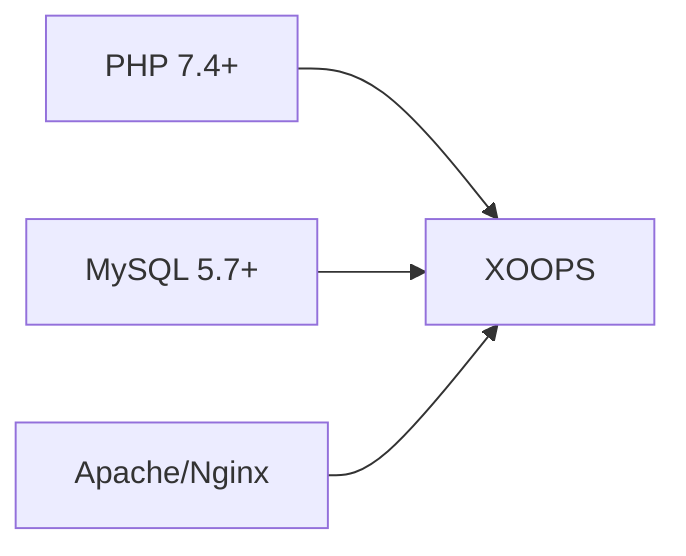
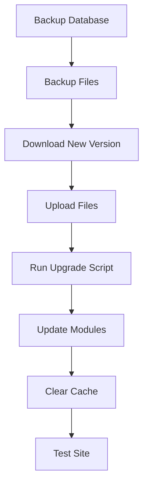

> XOOPS kurulumuyla ilgili sık sorulan sorular ve yanıtlar.

---

## Ön Kurulum

### S: Minimum sunucu gereksinimleri nelerdir?

**A:** XOOPS 2.5.x şunları gerektirir:
- PHP 7,4 veya üstü (PHP 8.x önerilir)
- MySQL 5,7+ veya MariaDB 10,3+
- mod_rewrite veya Nginx ile Apache
- En az 64MB PHP hafıza sınırı (128MB+ önerilir)

### S: XOOPS'yi paylaşımlı barındırma sistemine kurabilir miyim?

**C:** Evet, XOOPS gereksinimleri karşılayan çoğu paylaşılan barındırmada iyi çalışır. Barındırıcınızın aşağıdakileri sağlayıp sağlamadığını kontrol edin:
- PHP gerekli uzantılarla (mysqli, gd, curl, json, mbstring)
- MySQL database erişimi
- Dosya yükleme özelliği
- .htaccess desteği (Apache için)

### S: Hangi PHP uzantıları gereklidir?

**C:** Gerekli uzantılar:
- `mysqli` - database bağlantısı
- `gd` - Görüntü işleme
- `json` - JSON kullanımı
- `mbstring` - Çok baytlı dize desteği

Önerilen:
- `curl` - Harici API çağrılar
- `zip` - module kurulumu
- `intl` - Uluslararasılaşma

---

## Kurulum Süreci

### S: Kurulum sihirbazı boş bir sayfa gösteriyor

**C:** Bu genellikle bir PHP hatasıdır. Şunu deneyin:

1. Hata görüntülemeyi geçici olarak etkinleştirin:
```php
// Add to htdocs/install/index.php at the top
error_reporting(E_ALL);
ini_set('display_errors', 1);
```
2. PHP hata günlüğünü kontrol edin
3. PHP sürüm uyumluluğunu doğrulayın
4. Gerekli tüm uzantıların yüklendiğinden emin olun

### S: "Anafile.php dosyasına yazılamıyor" mesajı alıyorum

**C:** Yüklemeden önce yazma izinlerini ayarlayın:
```bash
chmod 666 mainfile.php
# After installation, secure it:
chmod 444 mainfile.php
```
### S: database tabloları oluşturulmuyor

**C:** Kontrol edin:

1. MySQL kullanıcısı CREATE TABLE ayrıcalıklarına sahiptir:
```sql
GRANT ALL PRIVILEGES ON xoopsdb.* TO 'xoopsuser'@'localhost';
FLUSH PRIVILEGES;
```
2. database mevcut:
```sql
CREATE DATABASE xoopsdb CHARACTER SET utf8mb4 COLLATE utf8mb4_unicode_ci;
```
3. Sihirbaz eşleşme database ayarlarındaki kimlik bilgileri

### S: Yükleme tamamlandı ancak sitede hatalar görünüyor

**C:** Kurulum sonrası yaygın görülen düzeltmeler:

1. Kurulum dizinini kaldırın veya yeniden adlandırın:
```bash
mv htdocs/install htdocs/install.bak
```
2. Uygun izinleri ayarlayın:
```bash
chmod -R 755 htdocs/
chmod -R 777 xoops_data/
chmod 444 mainfile.php
```
3. Önbelleği temizleyin:
```bash
rm -rf xoops_data/caches/smarty_cache/*
rm -rf xoops_data/caches/smarty_compile/*
```
---

## Yapılandırma

### S: Yapılandırma dosyası nerede?

**A:** Ana yapılandırma, XOOPS kökündeki `mainfile.php` konumundadır. Anahtar ayarlar:
```php
define('XOOPS_ROOT_PATH', '/path/to/htdocs');
define('XOOPS_VAR_PATH', '/path/to/xoops_data');
define('XOOPS_URL', 'https://yoursite.com');
define('XOOPS_DB_HOST', 'localhost');
define('XOOPS_DB_USER', 'username');
define('XOOPS_DB_PASS', 'password');
define('XOOPS_DB_NAME', 'database');
define('XOOPS_DB_PREFIX', 'xoops');
```
### S: URL sitesini nasıl değiştiririm?

**A:** Düzenle `mainfile.php`:
```php
define('XOOPS_URL', 'https://newdomain.com');
```
Daha sonra önbelleği temizleyin ve veritabanındaki herhangi bir sabit kodlu URLs'yi güncelleyin.

### S: XOOPS'yi farklı bir dizine nasıl taşıyabilirim?

**C:**

1. Dosyaları yeni konuma taşıyın
2. `mainfile.php`'deki yolları güncelleyin:
```php
define('XOOPS_ROOT_PATH', '/new/path/to/htdocs');
define('XOOPS_VAR_PATH', '/new/path/to/xoops_data');
```
3. Gerekirse veritabanını güncelleyin
4. Tüm önbellekleri temizleyin

---

## Yükseltmeler

### S: XOOPS'yi nasıl yükseltebilirim?

**A:**

1. **Her şeyi yedekleyin** (database + dosyalar)
2. Yeni XOOPS sürümünü indirin
3. Dosyaları yükleyin (`mainfile.php` üzerine yazmayın)
4. Sağlanmışsa `htdocs/upgrade/` komutunu çalıştırın
5. Modülleri yönetici paneli aracılığıyla güncelleyin
6. Tüm önbellekleri temizleyin
7. İyice test edin

### S: Yükseltme sırasında sürümleri atlayabilir miyim?

**C:** Genellikle hayır. database geçişlerinin doğru şekilde çalıştığından emin olmak için ana sürümler arasında sırayla yükseltme yapın. Özel rehberlik için sürüm notlarına bakın.

### S: Yükseltme sonrasında modüllerim çalışmayı durdurdu

**C:**

1. Yeni XOOPS sürümüyle module uyumluluğunu kontrol edin
2. Modülleri en son sürümlere güncelleyin
3. Şablonları yeniden oluşturun: Yönetici → Sistem → Bakım → templates
4. Tüm önbellekleri temizleyin
5. Belirli hatalar için PHP hata günlüklerini kontrol edin

---

## Sorun Giderme

### S: Yönetici şifresini unuttum

**C:** database aracılığıyla sıfırlama:
```sql
-- Generate new password hash
UPDATE xoops_users
SET pass = MD5('newpassword')
WHERE uname = 'admin';
```
Veya e-posta yapılandırılmışsa şifre sıfırlama özelliğini kullanın.

### S: Site kurulumdan sonra çok yavaşlıyor

**C:**

1. Yönetici → Sistem → Tercihler'de önbelleğe almayı etkinleştirin
2. Veritabanını optimize edin:
```sql
OPTIMIZE TABLE xoops_session;
OPTIMIZE TABLE xoops_online;
```
3. Hata ayıklama modunda yavaş sorguları kontrol edin
4. PHP OpCache'i etkinleştirin

### S: Images/CSS yüklenmiyor

**C:**

1. Dosya izinlerini kontrol edin (dosyalar için 644, dizinler için 755)
2. `mainfile.php`'de `XOOPS_URL`'nin doğru olduğunu doğrulayın
3. Yeniden yazma çakışmaları için .htaccess'i kontrol edin
4. Tarayıcı konsolunu 404 hataları açısından inceleyin

---

## İlgili Belgeler

- Kurulum Kılavuzu
- Temel Yapılandırma
- Ölümün Beyaz Ekranı

---

#xoops #sss #kurulum #sorun giderme